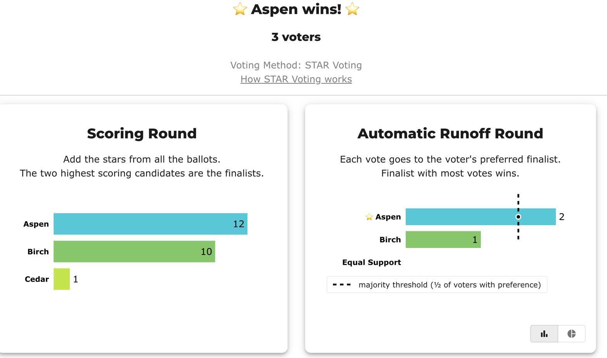
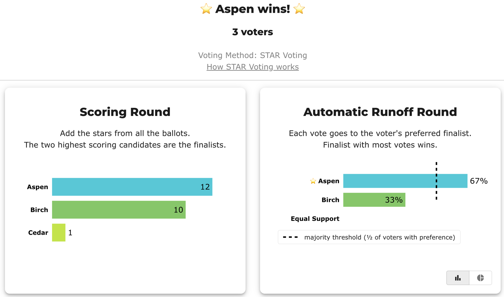
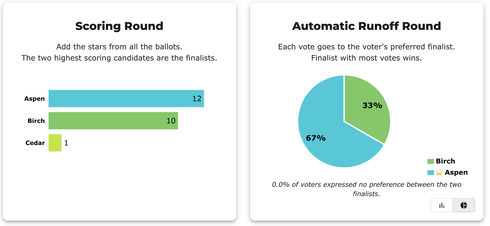
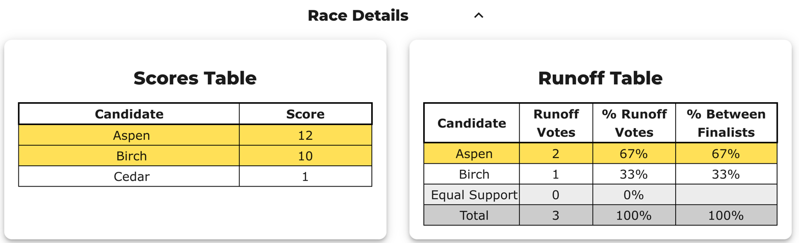

# Runoff 01 — Runoff confirms the leader (control)

**Level 101 · the baseline.** Before showing a reversal, show the ordinary case: the Scoring-Round leader is *also* the candidate more voters prefer, so the Automatic Runoff **confirms** the leader. This proves the runoff isn't rigged against whoever has the most stars — it only *checks* them. (Winner is also the Condorcet winner.)

Two views of the **same election** (BV id [`r2pvc9`](https://bettervoting.com/r2pvc9/results)): BetterVoting's display and the LH engine's text report. Same ballots, same result.

→ The reversal that contrasts with this: [the atom — the smallest reversal](../runoff_overturns_leader/teaching_runoff_reversal.md) · concept: [The Automatic Runoff Round](../../00_start_here/STAR_Voting/the_count/STAR_Automatic_Runoff.md) · teaching guide: [Teaching Runoff Reversal — a step-by-step guide](../runoff_overturns_leader/teaching_runoff_reversal.md).

---

## The ballots (3 voters)

```
Aspen, Birch, Cedar
5, 2, 1
2, 5, 0
5, 3, 0
```

Source: [`Runoff_01_confirms_leader_r2pvc9.yaml`](cases/Runoff_01_confirms_leader_r2pvc9.yaml) · frozen export: [`Runoff_01_confirms_leader_r2pvc9_bv_export.json`](cases/Runoff_01_confirms_leader_r2pvc9_bv_export.json).

## View 1 — BetterVoting

Aspen leads the Scoring Round (12) and wins the Automatic Runoff 2–1; the dashed line is the majority threshold (½ of the voters with a preference), which Aspen clears. Source: <https://bettervoting.com/r2pvc9/results>.

**Result — Scoring Round + Automatic Runoff (raw votes):**



**The same runoff, two other views (percentage bars, and pie):**





**Race Details — Scores Table + Runoff Table:**


## View 2 — the LH engine

Same ballots, the full text report (the saved [`_tabulated`](cases/cases_tabulated/Runoff_01_confirms_leader_r2pvc9_tabulated.txt) mirror adds the funnel):

```
--- Runoff (Preference) Matrix ---
Legend: For - Equal Support - Against        * indicates Top 2 Finalist
               |  * Aspen   | * Birch   |
     * Aspen > |    ---     |2 - 0 - 1  |
     * Birch > | 1 - 0 - 2  |   ---     |

[Condorcet Winner]
  Condorcet Winner: Aspen — matches the STAR winner

Scoring Round
   Aspen         -- 12 -- First place
   Birch         -- 10 -- Second place
   Cedar         --  1
 Aspen and Birch advance.

Automatic Runoff Round
   Aspen         -- 2 -- First place
   Birch         -- 1
   Equal Support -- 0
 Aspen wins.
   Voters with a preference: 3 of 3 (no Equal Support).
   Aspen 2 (67%) vs Birch 1 (33%); majority = 2.
```

> **BV ↔ LH wording.** The line `Aspen 2 (67%) vs Birch 1 (33%)` is BetterVoting's *Runoff Votes* (2 / 1) and *% Between Finalists* (67% / 33%) folded into one line — LH names its denominator (`Voters with a preference`) instead of using table columns. [Why the words differ →](../../00_start_here/STAR_reporting/reporting_diff_BV_LH.md#same-numbers-different-words)

## The point

Aspen leads on stars **and** is preferred head-to-head (2 of 3 voters score Aspen above Birch), so the runoff confirms Aspen. The runoff didn't change the answer — but it *asked the question*, and that's the safeguard. A reversal only happens when raw stars and majority preference point at **different** candidates (next: [the atom — the smallest reversal →](../runoff_overturns_leader/teaching_runoff_reversal.md)). The two reports agree exactly — BetterVoting and the LH engine are two views of one count.
