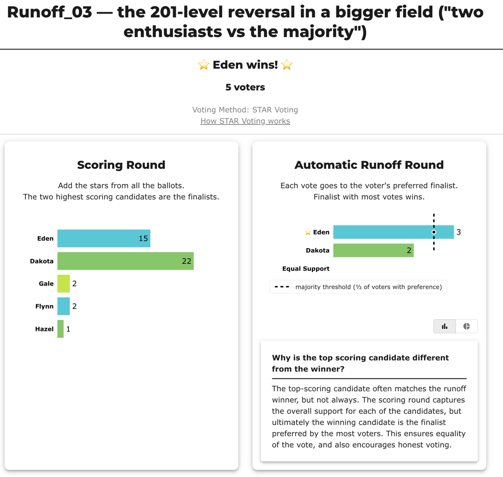
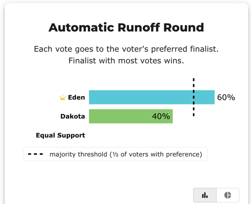
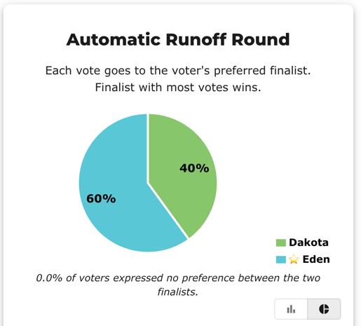
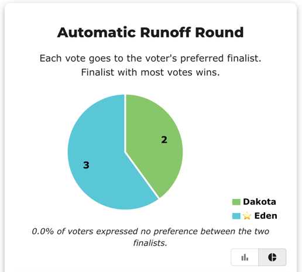
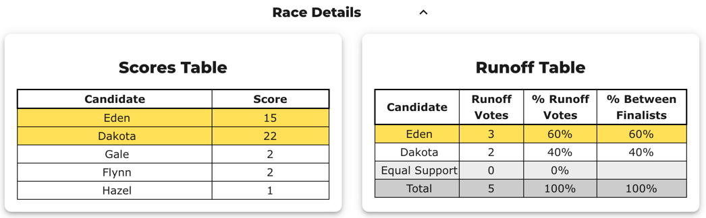

# Runoff 03 — two enthusiasts vs the majority

**Level 201 · a reversal in a bigger field (the "narrow-but-deep" pattern).** Five candidates, five voters. Two voters are **Dakota enthusiasts** — their 5s push Dakota to the top of the Scoring Round (22 stars). But the other three prefer **Eden**, so Eden wins the Automatic Runoff 3–2. Dakota leads on *how much*; Eden wins on *how many*. (Eden is also the Condorcet winner — a calm case.)

Where [Runoff 02](Runoff_02_atom_reversal_yx9447.md) had a *broadly-liked* leader, this one has an *intense-minority* leader — the other face of the same reversal. → teaching guide: [Teaching Runoff Reversal — a step-by-step guide](../runoff_overturns_leader/teaching_runoff_reversal.md) · concept: [The Automatic Runoff Round](../../00_start_here/STAR_Voting/the_count/STAR_Automatic_Runoff.md) · [`Runoff Reversal`](../../00_start_here/GLOSSARY.md).

---

## The ballots (5 voters)

```
Dakota, Eden, Flynn, Gale, Hazel
5, 0, 1, 0, 0
5, 0, 0, 1, 0
4, 5, 0, 0, 1
4, 5, 1, 0, 0
4, 5, 0, 1, 0
```

Source: [`Runoff_03_enthusiasts_vs_majority_rkgtpk.yaml`](Runoff_03_enthusiasts_vs_majority_rkgtpk.yaml) · frozen export: [`Runoff_03_enthusiasts_vs_majority_rkgtpk_bv_export.json`](Runoff_03_enthusiasts_vs_majority_rkgtpk_bv_export.json).

## View 1 — BetterVoting

Dakota leads the Scoring Round (22) but **loses** the Automatic Runoff 2–3. Source: <https://bettervoting.com/rkgtpk/results>. **Result — Scoring Round + Automatic Runoff (with BetterVoting's popover):**



**Why Dakota loses, from these ballots.** Two voters **love** Dakota (a 5 each), and that intensity is most of Dakota's 22 stars — but it's only **two** people. The other **three** scored **Eden 5 and Dakota 4**: they like Dakota, but prefer Eden. The scoring round adds up *how much* support there is, so two big 5s can lead; the runoff counts *how many* voters prefer each finalist, and **3 beats 2**. A passionate minority can top the score chart, but it can't outvote the majority in the runoff.

**The same runoff, other views (percentage bars, and pie):**







**Race Details — Scores Table + Runoff Table:**



## View 2 — the LH engine

Same ballots, the full text report (the saved [`_tabulated`](runoff_reversal_bv_cases_tabulated/Runoff_03_enthusiasts_vs_majority_rkgtpk_tabulated.txt) mirror adds the funnel):

```
[Condorcet Winner]
  Condorcet Winner: Eden — matches the STAR winner

[Runoff Reversal]
 - Score Round Winner(s) = (Dakota)
 - Runoff Round Winner   = (Eden)
  Candidate Dakota earned the highest total score, but
  Candidate Eden won the automatic runoff — not a malfunction,
  STAR working as designed: the runoff elects the finalist preferred
  by the majority (of voters with a preference).

Scoring Round
   Dakota        -- 22 -- First place
   Eden          -- 15 -- Second place
   Flynn         --  2
   Gale          --  2
   Hazel         --  1
 Dakota and Eden advance.

Automatic Runoff Round
   Eden          -- 3 -- First place
   Dakota        -- 2
   Equal Support -- 0
 Eden wins.
   Voters with a preference: 5 of 5 (no Equal Support).
   Eden 3 (60%) vs Dakota 2 (40%); majority = 3.
```

> **BV ↔ LH wording.** The line `Eden 3 (60%) vs Dakota 2 (40%)` is BetterVoting's *Runoff Votes* (3 / 2) and *% Between Finalists* (60% / 40%) folded into one line — LH names its denominator (`Voters with a preference`) instead of using table columns. [Why the words differ →](../../00_start_here/STAR_reporting/reporting_diff_BV_LH.md#same-numbers-different-words)

## The takeaway

Same lesson as the atom, bigger field and the opposite flavor of leader: here the score leader is an **intense minority's** favorite, not a broadly-liked runner-up — but the runoff still asks *how many*, and the majority's three votes beat the enthusiasts' two. BetterVoting and the LH engine agree on every number.
