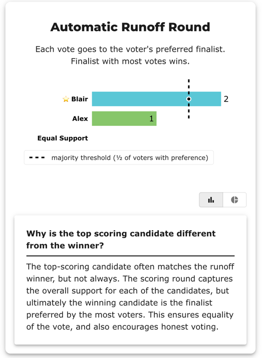
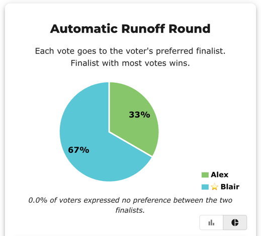
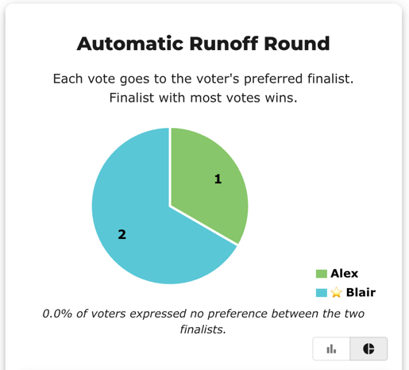
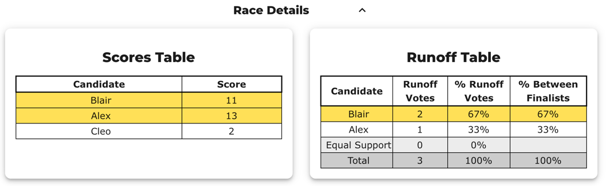

# Runoff 07 (WIP) — a flat ballot exposes the BetterVoting abstention bug

> ⚠️ **Work in progress — illustration pending a BetterVoting fix.** This is the **one case in the set where the two reports do *not* fully agree.** They agree on the *winner* (Blair), but BetterVoting mis-files a flat ballot as an *abstention*, so the abstention count, the Equal-Support count, and the score totals differ. Tracked as **[Equal-Vote/bettervoting#1407](https://github.com/Equal-Vote/bettervoting/issues/1407)**; kept here as a teaching illustration until it's fixed.

A reversal (Alex leads the scoring round, **Blair** wins the runoff) that *also* contains a **flat ballot** (`3,3,3` — every candidate equal). That one ballot is where the two engines part ways.

→ the bug, in full: [When "no preference" gets called an "abstention"](../pet_real_bv_election/small_case_abstention_lesson.md) · why "Equal Support" ≠ "abstention": [`GLOSSARY`](../../00_start_here/GLOSSARY.md) · where the reports differ: [reporting_diff_BV_LH](../../00_start_here/STAR_reporting/reporting_diff_BV_LH.md) · concept: [The Automatic Runoff Round](../../00_start_here/STAR_Voting/STAR_Automatic_Runoff.md).

---

## The ballots (4 voters)

```
Alex, Blair, Cleo
5, 1, 2      prefers Alex
4, 5, 0      prefers Blair
4, 5, 0      prefers Blair
3, 3, 3      flat — every candidate equal
```

Source: [`Runoff_07_flat_ballot_bv_bug_tf73v9.yaml`](Runoff_07_flat_ballot_bv_bug_tf73v9.yaml) · frozen export: [`Runoff_07_flat_ballot_bv_bug_tf73v9_bv_export.json`](Runoff_07_flat_ballot_bv_bug_tf73v9_bv_export.json).

## Where the two reports diverge (the whole point)

Same ballots, same winner — different bookkeeping, all caused by the one `3,3,3` ballot:

| | LH engine | BetterVoting |
|---|---:|---:|
| Ballots tallied | **4** | **3** |
| Abstentions | 0 | **1** (the `3,3,3`) |
| Equal Support in runoff | **1** | 0 |
| Score totals | Alex 16, Blair 14 | Alex **13**, Blair **11** (each −3) |
| Automatic Runoff | Blair 2, Alex 1 | Blair 2, Alex 1 |
| **Winner** | **Blair** | **Blair** |

The `3,3,3` voter rated every candidate — a cast vote with no preference, i.e. **Equal Support**. BetterVoting treats "every candidate equal" as an **abstention**, drops the ballot from the tally, and removes its 3 stars from each candidate's total. The winner is unaffected here, but the counts and percentages no longer match a hand count of the four ballots. (Confirmed in the export: `nAbstentions: 1, nTallyVotes: 3`.)

## View 1 — BetterVoting

Alex leads the Scoring Round but **loses** the runoff to Blair — and BetterVoting marks the `3,3,3` as an abstention. Source: <https://bettervoting.com/tf73v9/results>.

**Result — Scoring Round + Automatic Runoff (the bug, in one image):**


Read the header: BetterVoting says **"3 voters"**, and every score total is **3 lower** than LH's (Blair 11, Alex 13 vs LH's 14, 16) — the dropped `3,3,3` ballot.

**The same runoff, other views (raw votes, and pie):**







**Race Details — Scores Table + Runoff Table:**



The Runoff Table seals it: **Total 3** (not 4) and **Equal Support 0** — the `3,3,3` became an abstention instead of the Equal-Support vote it is.

## View 2 — the LH engine

All four ballots counted; the `3,3,3` is Equal Support, not an abstention (the saved [`_tabulated`](runoff_reversal_bv_cases_tabulated/Runoff_07_flat_ballot_bv_bug_tf73v9_tabulated.txt) mirror adds the funnel):

```
[Score Distribution] (number of ballots giving each score)
       5  4  3  2  1  0  | Total   Avg
Alex   1  2  1  0  0  0  |    16   4.0
Blair  2  0  1  0  1  0  |    14   3.5
Cleo   0  0  1  1  0  2  |     5   1.2

Scoring Round
   Alex          -- 16 -- First place
   Blair         -- 14 -- Second place
   Cleo          --  5
 Alex and Blair advance.

Automatic Runoff Round
   Blair         -- 2 -- First place
   Alex          -- 1
   Equal Support -- 1
 Blair wins.
   Voters with a preference: 3 of 4 (1 Equal Support).
   Blair 2 (67%) vs Alex 1 (33%); majority = 2.
```

Note the **`3` column** in the Score Distribution: every candidate has one — that's the flat ballot, counted. BetterVoting drops exactly those three stars.

## The takeaway

The reversal itself is ordinary (Alex's stars, Blair's majority — *how much* vs *how many*, as in Runoff_02). What makes this one **WIP** is the `3,3,3`: a cast, fully-rated ballot that BetterVoting mislabels as an abstention. The winner survives, but the counts don't reconcile — which is why it's filed under [#1407](https://github.com/Equal-Vote/bettervoting/issues/1407) and kept here only as an illustration until BetterVoting counts flat ballots as the Equal-Support votes they are.
