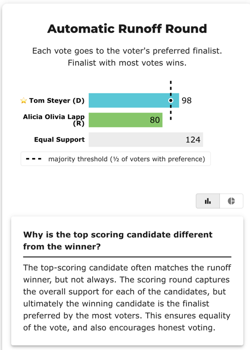

# Runoff 08 — CA Governor, a real STAR field of 61 (BV2181, `gvdy42`)

**▶ Live on BetterVoting:** [vote](https://bettervoting.com/gvdy42) · **[results ↗](https://bettervoting.com/gvdy42/results)** (election `gvdy42`).

> 🗳️ **A real, crowded STAR election that teaches three things at once.** The "2026 California Governor Election" — **61 candidates, 319 ballots** (302 tallied, 17 abstentions). It's the largest field in the Runoff-Reversal set, and it happens to also be the live example behind a BetterVoting reporting bug.

**Level 201/301.** Winner: **Tom Steyer (D)** — confirmed identically by the LH engine and BetterVoting.

## Three lessons in one election

### 1. Runoff reversal — highest score ≠ winner
Alicia Olivia Lapp (R) **tops the score round** (395 stars) ahead of Steyer (390) in a 61-way field. But the automatic runoff asks *whom do more voters prefer between the two finalists* — and Steyer wins that **98–80**. STAR elects the majority-preferred finalist, not the highest scorer. (Plain Choose-One plurality would elect Lapp — the divergence STAR is designed to catch.)

### 2. LH ↔ BV "Equal Support" reconciliation — 141 = 124 + 17
The runoff's neutral bucket differs between the engines, and the gap is exactly the abstentions:

| | LH engine | BetterVoting |
|---|---|---|
| Steyer (runoff) | 98 | 98 ✓ |
| Lapp (runoff) | 80 | 80 ✓ |
| **Equal Support** | **141** | **124** |
| denominator | 178 of **319** | 178 of **302** |

`141 − 124 = 17` = the 17 fully-blank **abstention** ballots. LH counts a blank ballot as Equal Support in the runoff; BetterVoting sets abstentions aside. Same winner, same 98/80 — only the neutral bucket's bookkeeping differs. This is the exact rule in **[reporting_diff_BV_LH.md](../../00_start_here/STAR_reporting/reporting_diff_BV_LH.md)**, here on a 319-ballot real election.

### 3. The #1390 reporting bug — the graph that showed 5 of 124
On this election, BetterVoting's **"Distribution of Equal Support" graph** (Stats for Nerds) displayed a single bar built from only **5** ballots, though the runoff correctly reported **124** equal-support. Cause: the widget compared raw scores, so 117 ballots that skipped **both** finalists hit `null == null` (a phantom bucket) and 2 more failed `null == 0` — all silently dropped. Fixed in **[PR #1431](https://github.com/Equal-Vote/bettervoting/pull/1431)** by coercing skipped scores to `0` (`?? 0`) to match the tabulator. Tracked in **[#1390](https://github.com/Equal-Vote/bettervoting/issues/1390)**. It's the same **blank-vs-zero** rule the rest of this repo turns on — the tabulator was always right; only the chart was wrong.

## View 1 — BetterVoting (`gvdy42`)

BetterVoting's official results, with the **runoff reversal on full display**: the scoring bars put Lapp (R) on top (395), yet the winner banner reads **Tom Steyer (D)** — and BV's own UI even prints a *"Why is the top scoring candidate different from the winner?"* explainer.

![BetterVoting OFFICIAL RESULTS for the 2026 California Governor Election (STAR Voting), 302 voters, "⭐ Tom Steyer (D) wins! ⭐". Scoring Round bars: Alicia Olivia Lapp (R) 395, Tom Steyer (D) 390, Tom Woodard (L) 366, Duane Terrence Loynes Jr. (NPP) 364, Matt Mahan (D) 352, Lukasz Adam Filinski (NPP) 351, Katie Porter (D) 348, Lewis Herms (NPP) 348, "+52 more". Automatic Runoff Round bars in percent mode: Tom Steyer (D) 32%, Alicia Olivia Lapp (R) 26%, Equal Support 41%, with a dashed "majority threshold (½ of voters with preference)" line that only Steyer crosses.](img/gvdy42_official_results.png)

The runoff bars toggled to **raw counts** — **Steyer 98 vs Lapp 80** (Equal Support 124) — matching the LH report exactly:



Note BV's **Equal Support bar — 41%** (124 / 302 = 41.1%) — the tallied denominator that *excludes* the 17 abstentions (which is why LH's Equal Support reads 141, not 124; see lesson 2). And mind BV's percent view: it divides every bar by all **302** voters (Steyer 32%, Lapp 26%), so neither finalist shows a bare "majority" — the actual STAR runoff is **98 : 80 of the 178 decided voters (55% : 45%)**, which is what the dashed majority line marks.

> 📷 _Still wanted for lesson 3: a screenshot of the buggy "Distribution of Equal Support" graph (Stats for Nerds) showing 5 vs 124 — save as `img/gvdy42_equal_support_graph_bug.png`._

## View 2 — the LH engine (reference)

```
[Divergence from STAR]
  STAR                   = Tom Steyer (D)
  Choose-One (Plurality) = Alicia Olivia Lapp (R)   (differs from STAR)

[Runoff Reversal]
 - Score Round Winner(s) = (Alicia Olivia Lapp (R))
 - Runoff Round Winner   = (Tom Steyer (D))

 Tabulating 319 ballots. Note: 17 of 319 ballots are marked as abstentions.

[STAR Voting: Scoring Round]  (top of a 61-candidate field)
   Alicia Olivia Lapp (R)  -- 395 -- First place
   Tom Steyer (D)          -- 390 -- Second place
 → Lapp and Steyer advance.

[STAR Voting: Automatic Runoff Round]
   Tom Steyer (D)          -- 98 -- First place
   Alicia Olivia Lapp (R)  -- 80
   Equal Support           -- 141
 Tom Steyer (D) wins.

 Runoff math:
   178  voters with a preference  (majority = 90)
         Tom Steyer (D) 98 (55%)  ·  Alicia Olivia Lapp (R) 80 (45%)
```

Full audit copy: [`_tabulated`](cases/cases_tabulated/Runoff_08_ca_governor_reversal_gvdy42_tabulated.txt) · frozen BV data: [`_bv_export.json`](cases/Runoff_08_ca_governor_reversal_gvdy42_bv_export.json).

## BV vs LH

Both elect **Tom Steyer (D)**, with identical finalists and identical runoff preference counts (98/80). The only reporting difference is the Equal Support total — LH 141 vs BV 124 — reconciled by the 17 abstentions LH folds in. `tieBreakType: none` (no tie), so the result is fully deterministic and freezable.

## See also

- [The Runoff-Reversal set (README)](README.md) — every case where the score leader and runoff winner diverge (or don't)
- [Where the two reports differ — abstentions vs Equal Support](../../00_start_here/STAR_reporting/reporting_diff_BV_LH.md)
- [STAR reporting hub](../../00_start_here/STAR_reporting/README.md) · [#1390](https://github.com/Equal-Vote/bettervoting/issues/1390) · [PR #1431](https://github.com/Equal-Vote/bettervoting/pull/1431)
