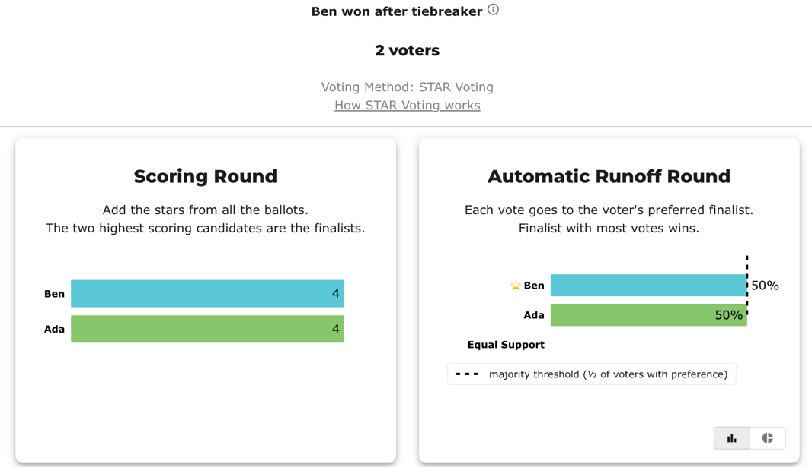
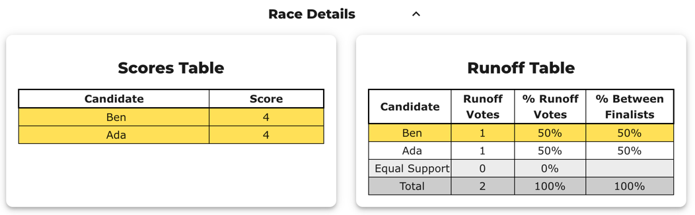

# A lot-decided STAR tie in BetterVoting (`jfk7pd`) — and why the tie-break must be deterministic

> **Filed upstream as [Equal-Vote/bettervoting#1417](https://github.com/Equal-Vote/bettervoting/issues/1417).** The ready-to-paste text is [`jfk7pd_bv_github_issue.md`](jfk7pd_bv_github_issue.md); a fuller UI-transparency spec (overlaps #1417 rec 3 / #1379) is in [`bv_github_issue_ui_tiebreak_transparency.md`](bv_github_issue_ui_tiebreak_transparency.md).

This is a small, fully-worked real election on bettervoting.com whose winner was chosen by a **random** tie-break. Re-running the same ballots could elect the *other* candidate. Below is exactly what happened, why, a side-by-side reproduction with an independent engine, and a concrete ask. It's meant to be a friendly, precise bug/feature writeup — the tabulation is correct STAR; the issue is **reproducibility and auditability** of the final tie-break.

**TL;DR.** Election `jfk7pd`: 2 candidates, 2 ballots, a perfect tie at *every* STAR rung (including a "dead" five-star rung — nobody scored a 5). BetterVoting broke the tie with `tieBreakType: "random"` and elected **Ben**. With a deterministic **published lot order** the same ballots elect **Ada**. Same votes, different winner, decided entirely by the tie-break. This is the case for BV issue [#1063](https://github.com/Equal-Vote/bettervoting/issues/1063) (deterministic, pre-published lot numbers).

---

## 1. The election

- **BV election id:** `jfk7pd` — "The BV recipe (the crazy scenario)", STAR, 1 winner.
- **Candidates:** Ada (`c-63w`), Ben (`c-h28`).
- **Ballots (2):**

| Voter | Ada | Ben |
|-------|:---:|:---:|
| 1 | 4 | 0 |
| 2 | 0 | 4 |

Both candidates: **total score 4**, **fiveStarCount 0** (nobody used a 5). The election is perfectly symmetric — nothing on the ballots distinguishes Ada from Ben.

The frozen export is alongside this file: `lot_random_vs_published_jfk7pd_bv_export.json`.

---

## 2. What BetterVoting did (from its own result export)

BV's `roundResults[0].logs` walk the STAR tie-break ladder and then stop at a **random** draw:

```
advance_to_runoff_same_score   Ben, Ada     (both advance, score 4)
runoff_tied                    Ben, Ada     (head-to-head 1–1)
runoff_score_tie               Ben, Ada     (score tiebreak: 4–4)
runoff_five_star_tie           Ben, Ada     (five-star tiebreak: 0–0)   ← dead rung
runoff_random                  winner: Ben                              ← coin flip
runoff_tiebreak                winner: Ben
```

And the result header:

```json
"tieBreakType": "random",
"perm": ["c-h28", "c-63w"],          // the order this run drew: Ben, then Ada
"elected": [{ "name": "Ben", "score": 4, "fiveStarCount": 0, ... }]
```

So BV's engine correctly found the tie at each deterministic rung (pairwise → score → five-star), hit the **five-star rung with 0–0** (the "dead rung": five-star counts votes equal to the scale max, and here nobody scored a 5), and then resolved the remainder **at random**, drawing Ben ahead of Ada.

Credit where due: BV now **exports the drawn order** (`perm` / per-candidate `tieBreakOrder`), which is what makes the run reconstructable after the fact (issue [#1371](https://github.com/Equal-Vote/bettervoting/issues/1371), closed). That's exactly what lets us reproduce this result below.

---

## 3. The problem: `random` means non-reproducible

Because the final rung is a random draw, **the same ballots can produce a different winner on a re-count.** In this election the draw favored Ben; an equally-valid draw favors Ada. An auditor re-running the official ballots has a 50% chance of disagreeing with the certified result — not because anything is wrong, but because the tie-break isn't a function of the ballots. For a public election that's a serious auditability gap: "re-run the ballots and you get the same winner" should always hold.

The fix isn't to hide the tie — it's to make the tie-break **deterministic and disclosed**: a **lot order drawn and published *before* counting**, so the resolution is fixed in advance and any auditor reproduces it exactly. (This is issue [#1063](https://github.com/Equal-Vote/bettervoting/issues/1063).)

---

## 4. Reproduction with an independent engine (STAR, published-lot)

We tabulated the *identical* `jfk7pd` ballots with a second STAR engine (the Larry-Hastings `starvote` fork used in this repo), which resolves final ties by a **published lot order** rather than a random draw. Feeding it BV's drawn order reproduces BV's winner; feeding it a deterministic published order flips it.

**(a) Following BV's drawn order** `lot_numbers: [Ben, Ada]` → **Ben** (matches BV):

```
Automatic Runoff Round
   Ada  -- 1 -- Tied for first place
   Ben  -- 1 -- Tied for first place        (head-to-head 1–1)
Automatic Runoff Round: First tiebreaker  (highest score)
   Ada  -- 4 ;  Ben  -- 4                    (score 4–4)
Automatic Runoff Round: Second tiebreaker (most votes of score 5)
   Ada  -- 0 ;  Ben  -- 0                    ← DEAD RUNG (0–0)
[Tiebreaker: Lot Number Priority]
  Tie among: ['Ada', 'Ben']  →  Resolved: ['Ben']   (by lot order [Ben, Ada])

[Lot-decided tie — rare]
  ⚠ The ballots did not break this tie: pairwise, score, and five-star all came
    back equal, so the LOT order chose the winner — not the votes.
Winner: Ben
```

**(b) Following a deterministic published order** `lot_numbers: [Ada, Ben]` → **Ada**:

```
[Tiebreaker: Lot Number Priority]
  Tie among: ['Ada', 'Ben']  →  Resolved: ['Ada']   (by lot order [Ada, Ben])
Winner: Ada
```

Same two ballots. `[Ben, Ada]` → **Ben**; `[Ada, Ben]` → **Ada**. The winner is a pure function of the tie-break order — which, under `tieBreakType: random`, is a coin flip.

The two tabulatable files are alongside this page: `…_bv_order.yaml` (elects Ben) and `…_published_order.yaml` (elects Ada).

---

## 5. What we're asking for

1. **Deterministic, pre-published lot numbers ([#1063](https://github.com/Equal-Vote/bettervoting/issues/1063)).** Draw the candidate lot order *before* counting and publish it; resolve every remaining tie by that fixed order instead of `random`. Then a re-count of the same ballots always yields the same winner, and anyone can verify it.
2. **Keep exporting the sequence ([#1371](https://github.com/Equal-Vote/bettervoting/issues/1371), done).** The `perm` / `tieBreakOrder` fields already let an outside engine reproduce a given result — please keep them. (That's how section 4(a) reconstructs BV's Ben.)
3. **Say so in the UI (relates to [#1379](https://github.com/Equal-Vote/bettervoting/issues/1379)).** When a result is decided by the lot rather than the ballots, show a plain- language note ("tie resolved by lot order: Ben over Ada") and, ideally, which rung fell through. A silent tie-break is what makes results look arbitrary.

Reporting-side siblings we've hit on the same family of tie elections, for reference: "no ballots have been cast" on multi-step ties ([#1052](https://github.com/Equal-Vote/bettervoting/issues/1052)) and `NaN` on equal ties/preferences ([#1035](https://github.com/Equal-Vote/bettervoting/issues/1035)).

---

## 6. Reproduce it yourself

With this repo (the export is the frozen one in this folder):

```bash
# Two-way import: BV's drawn order vs a deterministic published order
python STARVote_LH_tabulation_engine/tools_adam/two_way_import.py \
  01_STAR/tie_break_dead_rung/lot_random_vs_published_jfk7pd/lot_random_vs_published_jfk7pd_bv_export.json

# => BV / old approach   lot [Ben, Ada]  -> Ben   [lot-decided]
#    published / new     lot [Ada, Ben]  -> Ada   [lot-decided]
#    ⚠ DIFFERENT WINNERS — same ballots, decided only by the lot order.
```

Or tabulate either YAML directly:

```bash
python STARVote_LH_tabulation_engine/starvote_larry_hastings.py \
  01_STAR/tie_break_dead_rung/lot_random_vs_published_jfk7pd/lot_random_vs_published_jfk7pd_bv_order.yaml
```

---

## View 1 — BetterVoting screenshots

BetterVoting's result page: the scoring round is 4–4 and the runoff is 50%–50%, so the header reads **"Ben won after tiebreaker"** — a random draw, with nothing on the page saying the winner was decided by lot rather than by the ballots.



The Race Details tables confirm the exact tie: both candidates score 4, and each gets 1 runoff vote (50% / 50%).



## View 2 — the LH report (inline)

The same ballots through the independent engine, following BV's drawn order `[Ben, Ada]`. Note how it *shows its work* — every rung comes back tied, then the lot decides and it says so explicitly (the `[Lot-decided tie]` callout):

```
--- STAR Voting Method (single winner) ---
 Tabulating 2 ballots.
Ada,Ben
  4,  0
  0,  4

Scoring Round
   Ada  -- 4 -- First place
   Ben  -- 4 -- Second place
 Ada and Ben advance.

Automatic Runoff Round            (head-to-head preferred wins)
   Ada  -- 1 -- Tied for first place
   Ben  -- 1 -- Tied for first place
   Equal Support -- 0             ← 1–1, tied

Automatic Runoff Round: First tiebreaker   (highest score)
   Ada  -- 4 ;  Ben  -- 4         ← 4–4, still tied

Automatic Runoff Round: Second tiebreaker  (most votes of score 5)
   Ada  -- 0 ;  Ben  -- 0         ← 0–0, DEAD RUNG

[Tiebreaker: Lot Number Priority]
  Tie among: ['Ada', 'Ben']  →  Resolved: ['Ben']   (by lot order [Ben, Ada])

[Lot-decided tie — rare]
  ⚠ The ballots did not break this tie: pairwise, score, and five-star all came
    back equal, so the LOT order chose the winner — not the votes.

Winner — STAR Voting Method (single winner)
 Ben
```

The complete audit copy is regenerated into `lot_random_vs_published_jfk7pd_tabulated/` — [BV order](lot_random_vs_published_jfk7pd_tabulated/lot_random_vs_published_jfk7pd_bv_order_tabulated.txt) · [published order](lot_random_vs_published_jfk7pd_tabulated/lot_random_vs_published_jfk7pd_published_order_tabulated.txt).

---

## Background (concepts)

- STAR's tie-break ladder and the **dead rung** (why five-star counts only 5s, never steps down to 4s): [The "dead rung"](../README.md) · [STAR Tie-Breaking — The Full Chain](../../../00_start_here/STAR_Voting/Tie_Breaking_STAR/tie_breaking.md).
- Generate more of these scenarios: [`generate_dead_rung_scenarios.py`](../../../STARVote_LH_tabulation_engine/tools_adam/generate_dead_rung_scenarios.md).

*This is a real, frozen BetterVoting election; the ballots, `perm`, and elected winner are exactly as exported (`…_bv_export.json`). The independent tabulations are reproducible from the two YAML files in this folder.*
