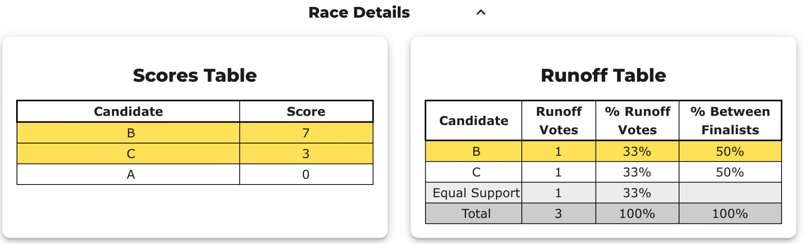
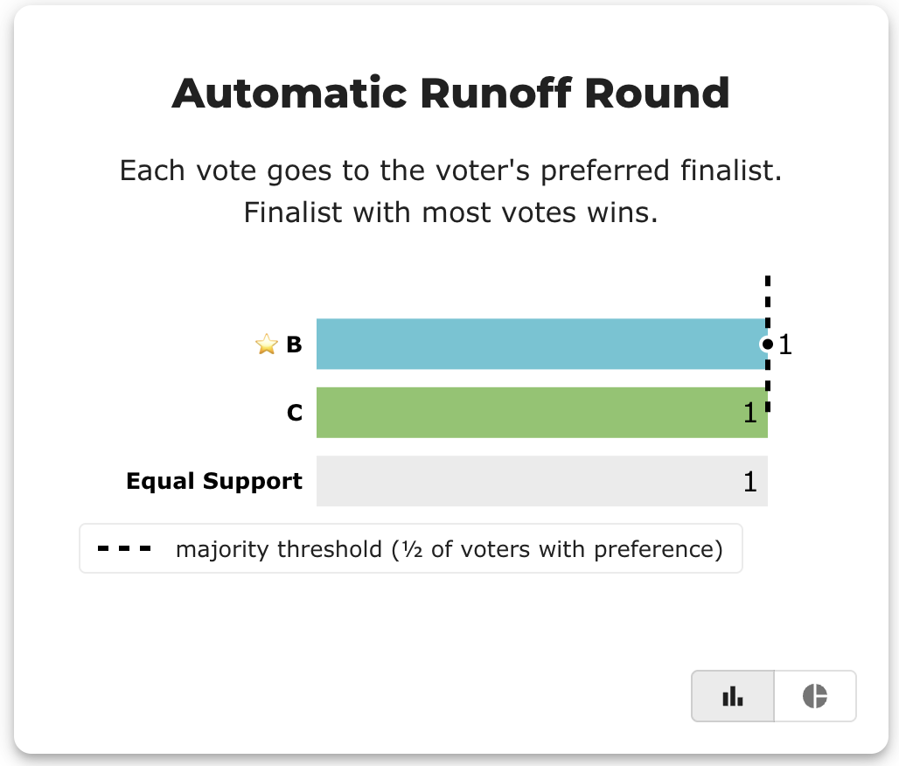
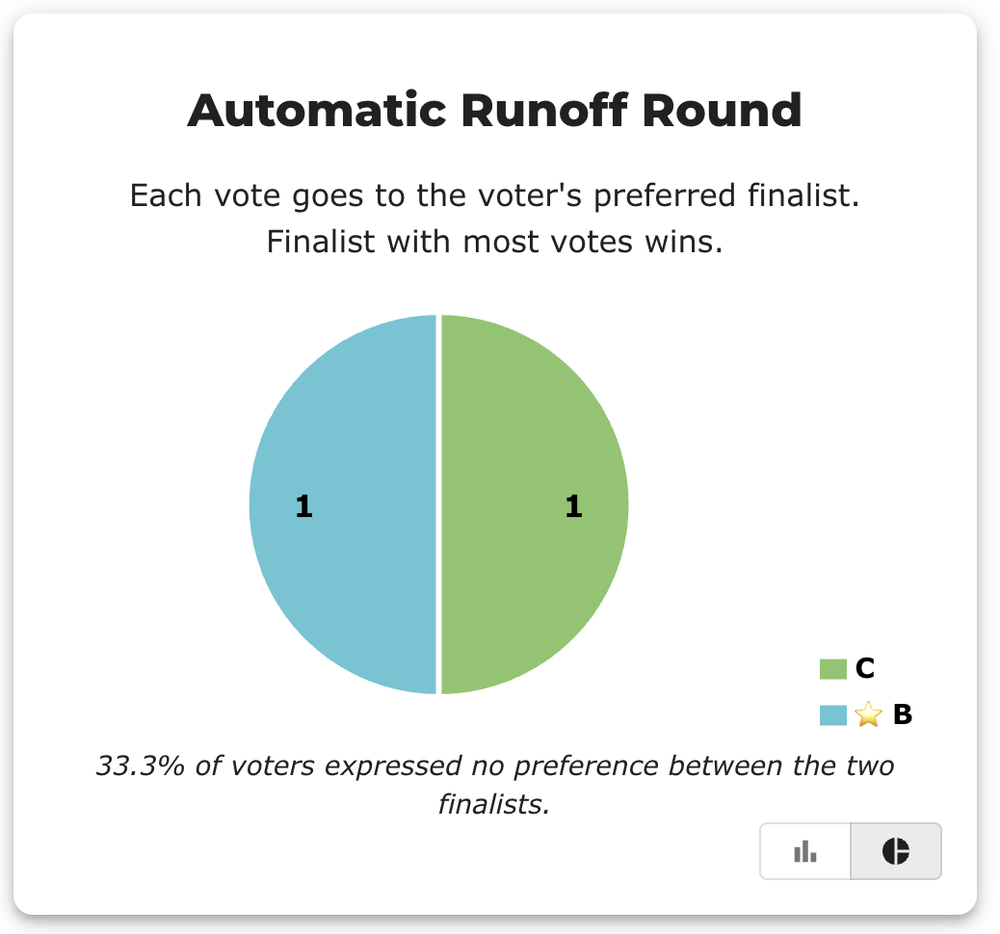
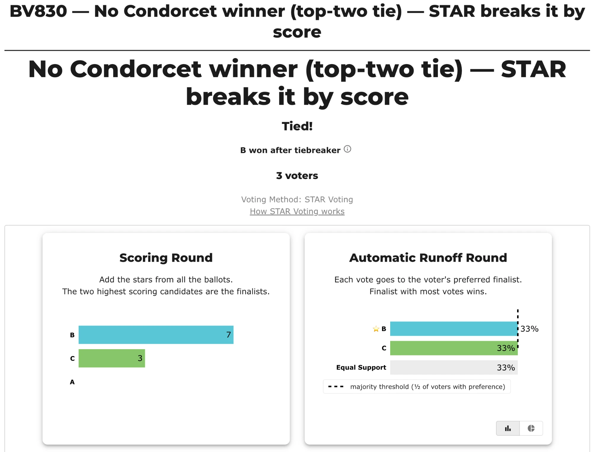

# No Condorcet winner (top-two tie) — STAR breaks it by score (BV830, `vb3xv2`)

**▶ Live on BetterVoting:** [vote](https://bettervoting.com/vb3xv2) · **[results ↗](https://bettervoting.com/vb3xv2/results)** (election `vb3xv2`).

> ⚖️ **Where head-to-head runs out of data, score finishes the job.** The two finalists, B and C, **tie 1-1-1 head-to-head**, so there is **no strict Condorcet winner**. But the ballots left more on the table — B pulled **7 points to C's 3** — and STAR reads it, electing **B**. As Kellyn Standley put it: *within a Condorcet tie the head-to-head method doesn't have enough data to name the preferred candidate when there clearly is one — and there, STAR's score intensity is the stronger standard.* (Scoped to Condorcet **non-decisions**; when a strict Condorcet winner exists, STAR-vs-Condorcet is a real debate — see [STAR's honest limits](../../00_start_here/STAR_Voting/properties_and_limits/STAR_honest_limits.md).)

**Level 201/301.** Three voters, three candidates. Winner: **B**. This is a **happy-path** tie: it settles at a **deterministic** rung (the runoff score total), never reaching the lot — so LH and BetterVoting agree.

## The ballots (3 voters)

```
A, B, C
0, 0, 1
0, 2, 2
0, 5, 0
```

Deliberately abstract (bare `A, B, C`) — the mechanism is the whole lesson. Source: [`bv830_vb3xv2_no_condorcet_tie_score.yaml`](bv830_vb3xv2_no_condorcet_tie_score.yaml).

## A tie, not a cycle

"No Condorcet winner" gets reported two very different ways, and this case is the *simpler* one:

- **A cycle** — rock-paper-scissors, A > B > C > A — nobody is unbeaten.
- **A top-two tie** (this case) — B and C each beat A, but **B vs C is a dead heat** (1 for B, 1 for C, 1 equal). Neither can claim to beat *everyone*, so neither is a strict Condorcet winner — yet it's a plain tie, not a loop.

The original `larryhastings/starvote` prints a blunt `No Condorcet Winner (cycle detected)` here, which overstates it. This repo's fork says it precisely:

```
[Condorcet Winner]
  No strict Condorcet winner; unbeaten candidates: B, C (pairwise ties)
```

## How the winner is found

| Step | What happens | Rung that decides |
|---|---|---|
| Scoring round | **B 7**, **C 3**, A 0 → B and C advance | — |
| Runoff | B **1** vs C **1** head-to-head (1 voter each, 1 equal) → tied | — (tie) |
| Runoff tiebreak 1 | total score: **B 7** > C 3 → wins | **score** ✓ |

The runoff tie breaks at the **first** deterministic rung — the score total — so five-star and the lot are never consulted. That is what makes this case **reproducible and BV-backable**: no random shuffle is reached, so BetterVoting must agree.

## View 1 — BetterVoting (`vb3xv2`)

BetterVoting runs the same STAR protocol and, because no random rung is reached, elects **B** too. Its frozen [`_bv_export.json`](bv830_vb3xv2_no_condorcet_tie_score_bv_export.json) Results record B as elected with `score: 7` over C's `score: 3`, and `winsAgainst` shows B and C each **false** against the other — the same head-to-head tie, broken by the same score total.

**The tally, honestly.** The Race Details tables carry the whole result: B and C tie the runoff 1-1 (each "50% Between Finalists"), and B wins on the score total, 7 to 3.



**The runoff is a dead heat.** The count view and the pie both show the 1-1-1 split — one voter for B, one for C, one Equal Support — so neither finalist has a majority; the tie is what the score rung then breaks.





**One caveat on BetterVoting's summary bar view.** In the headline summary the runoff is drawn as a percentage of *all three* ballots (33% each) while the dashed "majority threshold" is ½ of the *two decided* voters — the mismatched denominators put B's bar right on the threshold line, which can read as "B reached a majority." It didn't: this is a 1-1 tie, and B wins only on the score tiebreak. The count/pie/table views above are the unambiguous ones.



## View 2 — the LH engine (reference)

```
--- Runoff (Preference) Matrix ---
Head-to-head / pairwise comparison
Legend: For - Equal Support - Against
        * indicates Top 2 Finalist
               |      A     |   * B     |   * C     |
-----------------------------------------------------
           A > |    ---     |0 - 1 - 2  |0 - 1 - 2  |
         * B > | 2 - 1 - 0  |   ---     |1 - 1 - 1  |
         * C > | 2 - 1 - 0  |1 - 1 - 1  |   ---     |

[Condorcet Winner]
  No strict Condorcet winner; unbeaten candidates: B, C (pairwise ties)

--- STAR Voting Method (single winner) ---
 Tabulating 3 ballots.

Scoring Round
 The two highest-scoring candidates advance to the next round.
   B             -- 7 -- First place
   C             -- 3 -- Second place
   A             -- 0
 B and C advance.

Automatic Runoff Round
 The candidate preferred in the most head-to-head matchups wins.
   B             -- 1 -- Tied for first place
   C             -- 1 -- Tied for first place
   Equal Support -- 1
 There's a two-way tie for first.

Automatic Runoff Round: First tiebreaker
 The highest-scoring candidate wins.
   B             -- 7 -- First place
   C             -- 3
 B wins.

Winner — STAR Voting Method (single winner)
 B
```

Note the B > C row of the matrix: `1 - 1 - 1` — one For, one Against, one Equal Support. That single Equal Support ballot (voter 2, who scored B and C both 2) is *why* the head-to-head can't break the deadlock, and why the score rung has to. Full audit copy: [`_tabulated`](tie_break_ladder_tabulated/bv830_vb3xv2_no_condorcet_tie_score_tabulated.txt).

## BV vs LH

Both engines elect **B**, confirmed against BetterVoting's frozen export. B and C tie head-to-head under both, and both break the tie by the higher score total (B 7 vs C 3) — the deterministic score rung, no random floor reached. This is what makes the case **freezable / BV-backable** (unlike a Copeland/Ranked-Robin version of the same ballots, which would tie B=C and be resolved *randomly* by BV — hence this case is STAR-only).

## See also

- [Why STAR Voting](../../00_start_here/topics/Why_STAR_Voting.md) — the STAR-vs-Condorcet tradeoff, argued both ways (point 6)
- [The STAR tie-breaking ladder (full chain)](../../00_start_here/STAR_Voting/Tie_Breaking_STAR/tie_breaking.md) — the deterministic rungs, in order
- [Ice cream ladder (BV2180, `fp62p2`)](bv2180_fp62p2_ice_cream_ladder.md) — the folder's other happy-path case (ties in *both* rounds, settled without the lot)
- [Condorcet winner (topic hub)](../../00_start_here/topics/condorcet/) · [STAR's honest limits](../../00_start_here/STAR_Voting/properties_and_limits/STAR_honest_limits.md)
