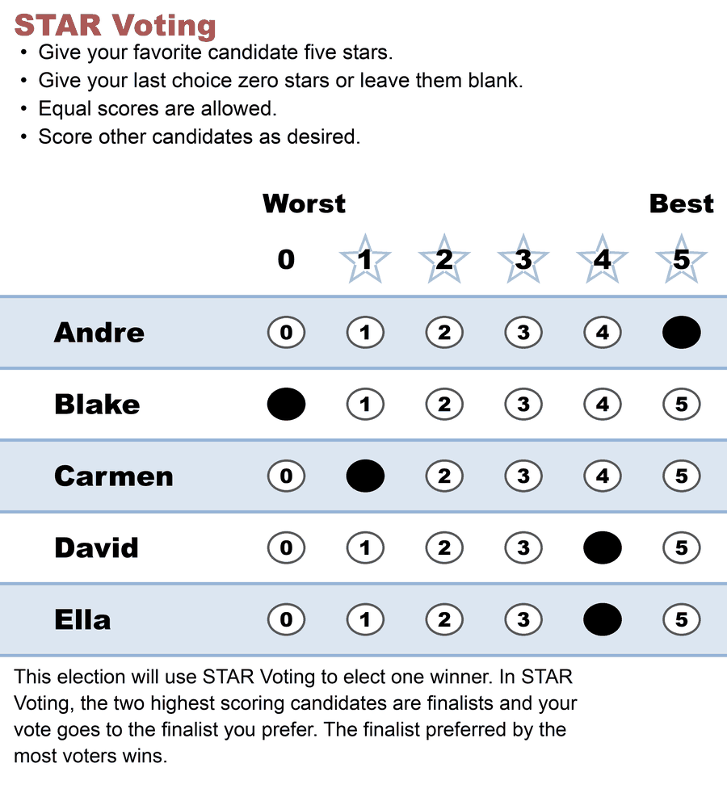
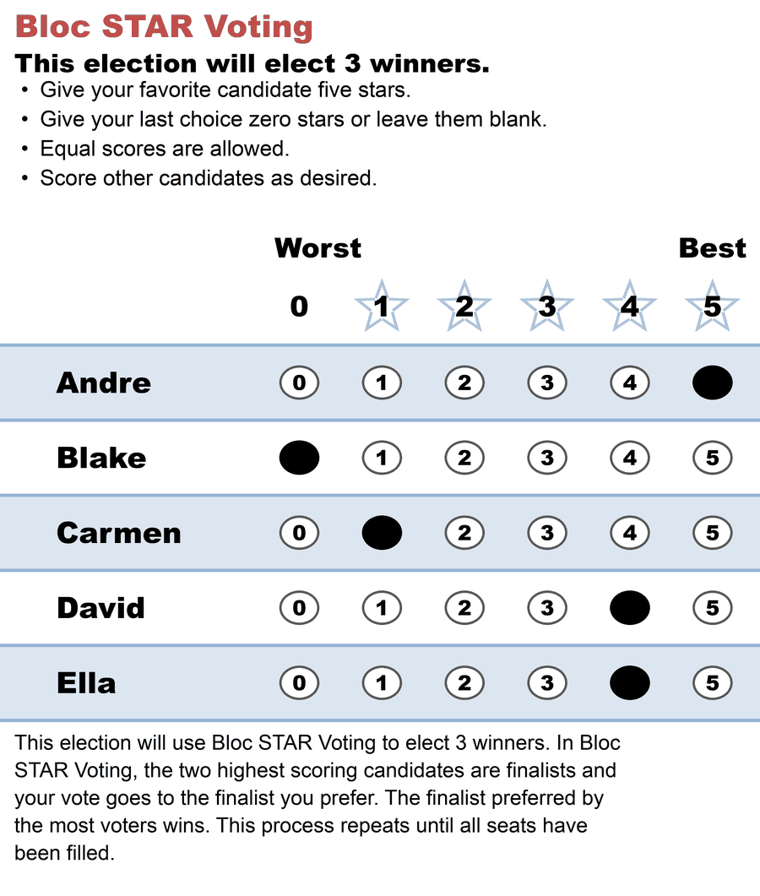

# The Bloc STAR ballot

**One line:** here is what a Bloc STAR ballot actually looks like — and the useful surprise is how little of it is new, because filling three seats changes exactly three lines of text and nothing at all about how you mark it.

→ the count these instructions describe: [Bloc STAR](bloc_star.md) · which official wording has standing, sentence by sentence: [the ballot and the official definitions](bloc_ballot_language.md) · every legal way to fill the same grid in: [The STAR ballot](../../01_STAR/01_Learn/voting_styles/README.md)

**Level: 101 → 201 · for voters**

---

## The ballot

Three seats, five candidates, one voter's finished ballot:

Three seats are up, and this voter marked **one score per candidate** — no "pick up to three", no ranking, nothing rationed. That is the whole design: the ballot does not know how many seats there are. Only the count does.

The paper has three parts, and they are worth reading in the order a voter meets them.

### Above the grid: the name, the seat count, the instructions

The heading names the method — **Bloc STAR Voting** — and the line under it states how many seats are up. That line sits *above the race* rather than inside the instructions, which is a deliberate requirement of the [technical specifications](https://www.starvoting.org/technical_specifications) (§3.c) and not a typographic accident. It is there for the voter arriving from a method where the seat count **is** a marking rule: under block plurality or [SNTV](bloc_star_vs_other_bloc_methods.md), three seats means three marks, and a voter trained on that will go looking for the rule. Stating the number plainly, away from the instructions, tells them the number is information rather than an instruction.

The four bullets are §3.b, verbatim — and they are **identical** to the single-winner ballot's. Nothing about scoring changes when more seats are up.

### The grid: unchanged, and that is the point

One row per candidate, 0–5, one mark each. Equal scores allowed, blanks allowed. Every one of the [thirteen ballot styles](../../01_STAR/01_Learn/voting_styles/README.md) that is legal on a single-winner STAR ballot is legal here and means the same thing.

The one habit that specifically backfires in a multi-seat race is padding your top score out to the number of seats — five stars for three candidates because three seats are up. That does not buy you three votes; it forfeits your say in *which* of the three wins and in what order the seats fill, because your ballot registers [Equal Support](../../01_STAR/01_Learn/the_count/STAR_Automatic_Runoff.md) in every runoff among them. [Filling it out well](bloc_ballot_language.md#filling-it-out-well) has the longer version.

### Below the grid: how the count works

The closing paragraph is §3.d, the method explanation, and §3.a requires it to be printed **on the ballot itself**. Its last sentence is the only part of the entire ballot that is specific to multi-winner:

> This process repeats until all seats have been filled.

Eleven words carrying the whole of the machinery — elect, remove the winner from the field, re-run the same count on the same unchanged ballots. Nothing is spent, reweighted, or transferred; that is [STAR-PR](../../03_STAR_PR/01_Learn/README.md)'s job, and the reason the two methods answer different questions.

The sentence before it is the one most worth reading slowly. *"The finalist preferred by the most voters wins"* — **preferred**, not highest-scoring. Your stars choose the two finalists; after that your ballot is one vote for whichever of the two you scored higher, and a 5-vs-4 preference pushes exactly as hard as 5-vs-0. Points and seats are different currencies, which is how the candidate who leads every scoring round can end up with [no seat at all](score_leader_no_seat.md).

## Single-winner and Bloc, side by side

Same cast, same marks — because the specification's own Figures A and B show them that way, and because it is the fastest way to see what filling several seats does to a voter's job. (Answer: nothing.)

| Single-winner STAR | Bloc STAR — 3 seats |
|---|---|
|  |  |

Everything that differs:

| | Single-winner STAR | Bloc STAR |
|---|---|---|
| **Method name** | STAR Voting | **Bloc** STAR Voting |
| **Above the race** | *(nothing)* | **This election will elect 3 winners.** |
| **Method explanation ends** | "…the finalist preferred by the most voters wins." | "…the finalist preferred by the most voters wins. **This process repeats until all seats have been filled.**" |
| Instructions | four bullets | *identical* |
| The grid | 0–5, one row per candidate | *identical* |
| How you mark it | score everyone honestly | *identical* |

**One naming note, flagged because it is a judgment call rather than a quotation.** The §3.d template prints the bare name "STAR Voting" even in its multi-winner form; the ballot above says **Bloc STAR Voting**. That is a deviation, and §3.e is what licenses it — paraphrase is permitted "as long as [the instructions] are presented with the meaning unchanged," and naming the method more precisely sharpens the meaning rather than changing it. §1.c is where the name comes from, and §1.e is the reason it matters: an unqualified "Multi-Winner STAR Voting" is *defined* to mean Bloc unless a document says otherwise, so a body that wrote "multi-winner STAR" intending proportional representation has, on the published specification, adopted the majoritarian method. If you are printing a real ballot, print the qualified name.

## What BetterVoting actually prints

This is the reason the ballot above is drawn rather than screenshotted. [BetterVoting](https://bettervoting.com) is the reference implementation — it is Equal Vote's own app, it is what these teaching elections run on, and its Bloc ballot is **not** the ballot above. Checked live on 2026-08-06 against two of this library's own elections, one of each kind:

| | BetterVoting, single-winner ([`fp62p2`](https://bettervoting.com/fp62p2/vote)) | BetterVoting, Bloc — 4 seats ([`8h3yrx`](https://bettervoting.com/8h3yrx/vote)) |
|---|---|---|
| **Above the grid** | "This election will use STAR Voting to elect one winner." | "This election will use STAR Voting to elect four winners." |
| **Below the grid** | "The two highest scoring candidates are finalists. Your full vote goes to the finalist you prefer." | "This election uses STAR Voting and will elect 4 winners. In STAR Voting the two highest scoring candidates are finalists and the finalist preferred by more voters wins." |
| **Help link** | "Learn more about STAR Voting" | "Learn more about STAR Voting" |

Two things are wrong with the right-hand column, and they are not the same size.

**The name.** A Bloc race is labelled "STAR Voting" — three times on the ballot, and again on the results page, in the Edit Race modal, and in the stored export. This is the smaller problem, but it is the one with a paper trail: it has been filed since April 2025.

**The missing sentence.** BetterVoting's Bloc footer explains how **one** seat is decided and then stops. There is no "this process repeats until all seats have been filled" — the single sentence that distinguishes a multi-winner explanation from a single-winner one is simply absent, on a ballot that fills four seats. A voter reading it carefully is told the two highest scorers are finalists and one of them wins; they are never told what happens to the other three seats.

Note also that the two footers are **different strings**, not one template with the seat count substituted in. The single-winner footer is not missing anything — it is a correct single-winner explanation. Someone wrote a separate multi-winner sentence and left the multi-winner part out of it.

The seat count is also folded into the instructions rather than placed above the race (§3.c). That one is cosmetic.

### The open tickets

Bloc STAR is BetterVoting's least-maintained method surface, and this is the receipts table for that claim. All five are open as of 2026-08-06:

| Issue | Filed | What |
|---|---|---|
| [#345](https://github.com/Equal-Vote/bettervoting/issues/345) | 2023-07-09 | Bloc reporting: the pie chart doesn't say which round it's for; Detailed Results is cut off; ballot display and CSV export print a blank where a voter scored a **0**. Never triaged — no comments in three years. |
| [#360](https://github.com/Equal-Vote/bettervoting/issues/360) | 2023-08-14 | "Not a Number" on a small Bloc election. Could not be reproduced at the time; deferred to milestone 2.0. |
| [#904](https://github.com/Equal-Vote/bettervoting/issues/904) | 2025-04-11 | The method name — "STAR Voting" where it should read "Bloc STAR Voting". Sized 2026-08-04 as display-only, roughly half a day. |
| [#1086](https://github.com/Equal-Vote/bettervoting/issues/1086) | 2025-11-12 | The same name in the Edit Race modal and on the results page, plus a help link pointing at single-winner STAR. |
| [#1478](https://github.com/Equal-Vote/bettervoting/issues/1478) | 2026-08-04 | A partial ballot whose marks are all equal is dropped from the tally as an abstention — a **count**-level defect, on a Bloc election. |

Two of those rhyme in a way worth noticing. #345's CSV complaint is that a scored **0** and an unmarked row both export as an empty cell, and #1478 is a ballot being discarded because of how its blanks are read. Three years apart, same underlying confusion: BetterVoting does not consistently distinguish *"scored zero"* from *"left blank"*. On the ballot above that distinction is visible — a blank row has no filled bubble — and the engine that counts this library's cases keeps them apart ([abstention vs. zero vs. NOTA](../../01_STAR/01_Learn/properties_and_limits/abstention_vs_zero_vs_nota.md)).

One caveat on #345, because it matters for anyone re-testing it: its screenshots come from `star-vote.herokuapp.com`, the **classic** app, not from bettervoting.com. The reporting complaints may or may not still reproduce on the current site; the naming complaint visibly does.

*(No screenshot of BetterVoting's ballot here on purpose. The defect is textual, the quotations above are verbatim, and the live links stay correct — whereas a screenshot would silently become a lie the day #904 lands.)*

## See also

- [Bloc STAR](bloc_star.md) — the elect–remove–re-run count these instructions describe
- [The ballot and the official definitions](bloc_ballot_language.md) — the two competing official wordings, what each sentence commits to, and the full naming table
- [The score leader can win no seat](score_leader_no_seat.md) — why "preferred" and "highest-scoring" are different currencies, worked on [BV1835](../02_Examples/bv1835_8h3yrx_score_leader_no_seat.md), the 4-seat election quoted above
- [The STAR ballot — and every legal way to fill it out](../../01_STAR/01_Learn/voting_styles/README.md) — the single-winner gallery, all of it legal here
- [Running a paper-ballot demo](../../01_STAR/01_Learn/hands_on/running_a_paper_ballot_demo.md) — printing one and counting it by hand
- [Glossary: Bloc STAR terms](glossary_bloc_star.md)

*(The two ballot images on this page are drawn by `tools_adam/scripts/build_style_ballot_images.py` — slugs `ballot_bloc_star` and `ballot_star_single_winner` — so the wording is edited in one place and redrawn, never retouched by hand.)*
