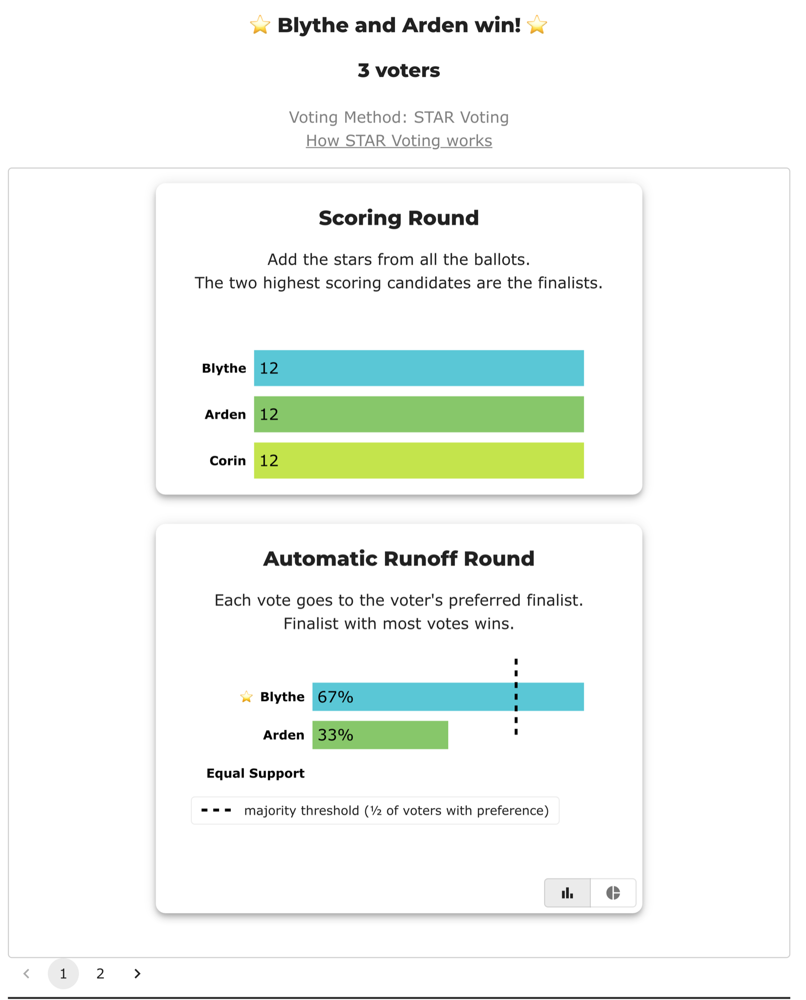

# Bloc STAR — a three-way tie no rung can break (`484mbm`)

<!-- case-meta:start — managed by build_yaml_pages.py; edit the YAML, not these lines -->
**Method:** [Bloc STAR (multi-winner, majoritarian)](../../03_STAR_PR/01_Learn) · **2 seats** · **Expected winners:** Blythe, Arden · [full count →](cases/cases_pages/b484mbm_tie_every_rung.md)
<!-- case-meta:end -->

*Three voters, three candidates, rotating ballots — so scores, pairwise and five-star all come back level and the two seats are filled entirely by tie-break policy. Built to compare what the engines do when the ballots say nothing: BetterVoting skips the pairwise rung and draws lots; Larry Hastings' own CLI, with the tiebreaker switched off, declines to pick anyone at all.*

**▶ Live on BetterVoting:** [vote](https://bettervoting.com/484mbm) · **[results ↗](https://bettervoting.com/484mbm/results)** (election `484mbm`).

Reference files: [`b484mbm_tie_every_rung.yaml`](cases/b484mbm_tie_every_rung.yaml) (`expected_winners: [Blythe, Arden]`) · frozen export [`b484mbm_tie_every_rung_bv_export.json`](cases/b484mbm_tie_every_rung_bv_export.json) (BV `484mbm`) · full generated page [`cases_pages/b484mbm_tie_every_rung.md`](cases/cases_pages/b484mbm_tie_every_rung.md). Companion to the input-format page [The `.starvote` ballot file format](../../07_Concepts/tabulation_engines/LH_starvote/starvote_file_format.md), which runs the same election through upstream's CLI.

!!! warning "Ignore the BV number in this election's title"
    The BetterVoting page is permanently titled "**BV2263** — …", and that number is wrong: BV2263 was minted the same afternoon for the [over-50% control](../../01_STAR/02_Examples/cases/cases_pages/bv2263_xw23m9_over_50_percent.md) (`xw23m9`), and BV titles cannot be edited or deleted. This case is therefore filed under its **bvid**, which is unique by construction. Quote `484mbm`; ignore the BV number printed on the election.

## The election

Bloc STAR, 3 candidates, 2 seats, 3 ballots:

```
Arden,Blythe,Corin
3,4,5
5,3,4
4,5,3
```

Each voter spends the same 3 / 4 / 5 on a different candidate, rotated one step — Arden > Blythe > Corin > Arden, rock-paper-scissors. Every symmetry a tie-break rung can measure therefore holds exactly:

| Rung | Arden | Blythe | Corin | Separates? |
|---|:--:|:--:|:--:|---|
| Total score | 12 | 12 | 12 | no |
| Pairwise ballot-preferences | 3 | 3 | 3 | no |
| Head-to-head wins | 1 | 1 | 1 | no — a Condorcet cycle |
| Five-star votes | 1 | 1 | 1 | no |

Nothing in the ballots distinguishes the three candidates, so **whoever fills the two seats is chosen by the tie-break policy, not by the voters.** That is the point of the case: it zeroes out everything else so the policy is all that is left.

## The case file

The YAML the engine actually runs, embedded at build time — so the parameters on this page can never drift from the file:

```yaml title="cases/b484mbm_tie_every_rung.yaml"
--8<-- "02_STAR_Bloc/02_Examples/cases/b484mbm_tie_every_rung.yaml"
```

## View 1 — BetterVoting

Elected **Blythe and Arden**. The scoring round shows the flat 12/12/12, and the runoff card then shows Blythe 67% vs Arden 33%:



Round 0's logs are where the mechanism actually shows — `score_tied` on all three at 12, then `pairwise_too_many_candidates`, then `five_star_tied` at 1 each, then `random_first: Blythe` and `random_second: Arden` drawn from all three, and finally the 2–1 runoff.

Two things worth naming.

**BetterVoting skips the pairwise rung when more than two candidates are tied.** It does not compute the three-way pairwise comparison at all — it falls straight through to five-star, then to the draw. The LH engine *does* compute it, and reports it tied 3–3–3. Here the shortcut costs nothing because the rung was tied anyway; it is a genuine ladder difference all the same, and on a ballot set where the pairwise rung *would* separate three tied candidates, the two engines would part ways.

**The summary does not say a seat was decided by lot.** Round 0 carries `tieBreakType: "random"` and `perm: [Blythe, Arden, Corin]`, but the top-level `tieBreakType` is `"none"` and top-level `tied` is `[]`. A reader who lands on the public results page sees a flat 12/12/12 followed by a Blythe-vs-Arden runoff with nothing saying those two finalists were drawn rather than earned. That is the same reporting gap already recorded on [BV130-r2](bv130r2_dead_rung_bloc.md), reproduced here in three ballots — and the draw is a **seeded** shuffle, so re-tallying reproduces the same order rather than exposing the randomness.

## View 2 — the LH report

Pinning `lot_numbers` to BV's drawn perm reproduces BetterVoting exactly — **Blythe, Arden** — which is what makes the two views comparable rather than coincidental. The engine prints the pairwise rung BV skipped, and flags the lot itself with a `⚠ Lot-decided tie — rare` warning naming the fallback it used.

The full audit, embedded from the [`_tabulated` mirror](cases/cases_tabulated/b484mbm_tie_every_rung_tabulated.txt) rather than pasted, so it tracks the engine:

```text title="cases/cases_tabulated/b484mbm_tie_every_rung_tabulated.txt"
--8<-- "02_STAR_Bloc/02_Examples/cases/cases_tabulated/b484mbm_tie_every_rung_tabulated.txt"
```

## The third answer: refuse

Upstream's own CLI has an option the repo wrapper does not expose — `tiebreaker = none`, which makes an undecidable tie an error rather than a draw. Run this election through it and it stops at `Unbreakable Tie` without naming a winner.

So the same three ballots produce **four** different outcomes depending only on policy: nobody (`tiebreaker = none`), Arden + Corin (`hashed_ballots`, upstream's default), and Blythe + Arden twice over — once from BV's seeded draw, once from the wrapper's column-order lot fallback. The walk-through, and the `.starvote` file that produces it, are on [The `.starvote` ballot file format](../../07_Concepts/tabulation_engines/LH_starvote/starvote_file_format.md).

## Related

- [BV130-r2 — dead-rung Bloc](bv130r2_dead_rung_bloc.md) — the same reporting gap at 6 candidates / 3 seats, where five-star reads 0–0 because nothing reached a 5.
- [The "dead rung"](../../01_STAR/03_Criteria/tie_break_dead_rung/README.md) — the single-winner cousins.
- [STAR Tie-Breaking — the full chain](../../01_STAR/01_Learn/Tie_Breaking_STAR/tie_breaking.md) · [Bloc STAR tiebreaks](../01_Learn/bloc_tiebreaks.md) — the ladders both engines are descending.
