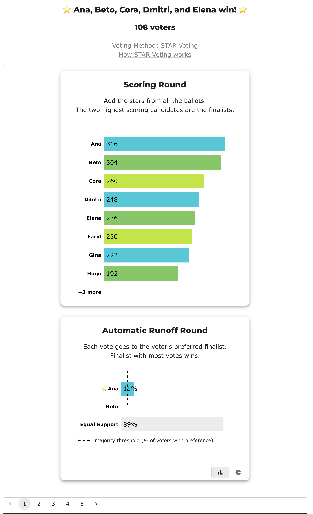

# Shapes of a Bloc STAR election

*Ten elections, from one ballot to fourteen candidates, chosen to cover the ways a bloc count can surprise you — and to check, on every one of them, whether proportional STAR would have seated somebody else.*

**Level: 101 → 301 · deep dive**

→ the method itself: [Bloc STAR](../../README.md) · how it counts: [what Bloc STAR is](../../01_Learn/bloc_star.md) · the majoritarian/proportional boundary: [Bloc STAR vs Proportional STAR](../../../method_comparisons/bloc_vs_pr/README.md)

---

## What Bloc STAR does, in one paragraph

Bloc STAR is single-winner [STAR](../../../01_STAR/01_Learn/README.md) run once per seat. Each round scores every remaining candidate, sends the **top two scorers** to an [automatic runoff](../../../01_STAR/01_Learn/the_count/STAR_Automatic_Runoff.md), elects whoever more voters prefer, removes them, and starts again — with **every ballot still counting at full weight**, every time. That last clause is the whole method. It is why a cohesive group can win every seat, and it is the one thing that separates Bloc STAR from its proportional cousins.

Everything in this folder is that loop, with something different going wrong (or right) inside it.

## Why this folder exists

The existing Bloc STAR cases cluster hard. Before this set, 17 of 35 had exactly **three candidates** and 24 of 35 had exactly **two seats**; none had more than nine candidates, none had more than four seats, and not one used weighted ballots. That is a fine sample of *small* bloc elections and a poor sample of bloc elections.

There is a second reason, upstream. BetterVoting tabulates Bloc STAR through a shared loop, `runBlocTabulator`, wrapped around its single-winner STAR round function. That loop **is** covered by its test suite — `Approval.test.ts`, `Plurality.test.ts` and `RankedRobin.test.ts` each run it with two winners. But all twenty tests in `Star.test.ts` pass `nWinners = 1` or call `singleWinnerStar` directly, so **no BV test exercises STAR with more than one seat**. Bloc STAR is the one bloc path its own suite never runs. Cross-checking a live BV election against this engine is therefore worth more here than almost anywhere else in the repo, which is why the cases below that are BV-backed carry live results links.

## The ten cases

Read top to bottom: the first three are small enough to check in your head, the last three are the shape a real at-large council election actually has.

### Smallest — the mechanism with nothing in the way

| Case | Shape | What it shows |
|---|---|---|
| [One voter fills a two-seat council](cases/cases_pages/bloc_one_voter_council.md) | 3 cand · 2 seats · **1 ballot** | The loop as a definition. One voter's ordering becomes the council, in order. There is no arithmetic to hide behind. |
| [The Condorcet winner never reaches a runoff](cases/cases_pages/bloc_condorcet_winner_no_seat.md) | 4 cand · 2 seats · 5 ballots | Bex beats **every** rival head-to-head and wins nothing — because only the top two *scorers* advance, and Bex scores last. |
| [The score leader is shut out of every seat](cases/cases_pages/bloc_score_leader_shut_out.md) | 4 cand · 3 seats · 5 ballots | Ada leads the scoring round in all three rounds and finishes with no seat. The council is literally everybody else. |
| [Making the first runoff buys you nothing](cases/cases_pages/bloc_finalist_wins_nothing.md) | 3 cand · 2 seats · 7 ballots | Blake is a seat-1 finalist and the #2 scorer, and goes home empty-handed. Reaching a runoff is not a down payment on the next seat. |

Those middle two are **mirror images**, and between them they exhaust the ways Bloc STAR can pass a candidate over: either you get into the runoff and lose it, or you would win it and never get in. Nothing else can happen.

### Middle — where the electorate starts to matter

| Case | Shape | What it shows |
|---|---|---|
| [A divided majority wins nothing](cases/cases_pages/bloc_divided_majority.md) | 5 cand · 2 seats · 12 ballots | 58% of voters split three ways and elect nobody; the united 42% takes both seats. |
| [A seat decided by 11 voters out of 31](cases/cases_pages/bloc_equal_support_seat.md) | 5 cand · 3 seats · 31 ballots | Twenty voters rate both finalists identically, so the seat turns on the eleven who differentiate. [Equal Support](../../../07_Concepts/GLOSSARY.md) is a real answer, not a missing one. |
| [Five seats, six candidates](cases/cases_pages/bloc_all_but_one.md) | 6 cand · **5 seats** · 7 ballots | When you elect almost everyone, every method agrees. Also the folder's one deliberate engine fixture — see below. |

### Largest — the shape a real council race has

| Case | Shape | What it shows |
|---|---|---|
| [Harborview city council](cases/cases_pages/bloc_harborview_council.md) | **12 cand · 5 seats · 108 voters** | A 52% slate takes **all five seats**. [The majority sweep](../../01_Learn/majority_sweep.md) at municipal scale — and the mechanism behind Voting Rights Act litigation over at-large seats. |
| [No faction has a majority](cases/cases_pages/bloc_no_majority_bridge.md) | **10 cand · 4 seats · 101 voters** | Blue 40 / Green 35 / Amber 26. An independent nobody ranks first wins seat 1 on breadth; the **second-largest faction elects nobody** while the smallest gets a seat. |
| [Fourteen candidates, six seats](cases/cases_pages/bloc_widest_field.md) | **14 cand · 6 seats · 175 voters** | A 38% group — not a majority — takes 67% of the council. And the widest field is the only one where the **three proportional methods disagree with each other**. |

## Does proportional STAR elect somebody else?

On seven of the ten, yes. This table is generated from the same ballots run under four methods — only the `voting_method:` line changes.

| Case | Bloc STAR elects | Allocated Score (= BV's `STAR_PR`) elects | Differs? |
|---|---|---|:--:|
| One voter | Ada, Ben | Ada, Ben | — |
| Condorcet winner no seat | Cyrus, **Ada** | **Ada**, Bex | ✔ |
| Score leader shut out | Dev, Bo, Cleo | **Ada**, Cleo, Dev | ✔ |
| Finalist wins nothing | Ada, Cleo | Ada, Cleo | ✔ *(sss/rrv only)* |
| Divided majority | Uma, Ugo | **Maya**, Uma | ✔ |
| Equal Support seat | Croissant, Almond, Brioche | same three | — |
| All but one | Ana, Cleo, Bram, Dov, Esme | same five | — |
| Harborview council | Ana, Beto, Cora, Dmitri, Elena | Ana, Beto, Cora, **Farid, Gina** | ✔ |
| No majority † | Jaya, Ada, Gita, Bram | Ada, **Dov**, Gita, Jaya | ✔ |
| Widest field | Lena, Alma, Mateo, Bruno, Clara, Dex | Alma, Bruno, **Elsie, Frank, Ivan**, Lena | ✔ |

† **Read that one as a seat count, not a list of names.** Nine of the ten cases are tie-free under Allocated Score as well as under Bloc STAR. `bloc_no_majority_bridge` is the exception: once Jaya's quota is spent, Ada and Bram hold *exactly* the same reweighted score (2727⁄16), as do Gita and Hank (303⁄2). Every proportional method gives Blue, Green and Amber one seat each plus the independent — that is the claim the case supports — but which of two tied candidates fills a faction's seat is a coin toss, and LH and BetterVoting toss it differently.

Three things in that table are worth stating plainly.

**The divergence is not random — it is always the same correction.** In every diverging case, proportional STAR seats somebody the bloc count left out *because they were already outvoted somewhere else*: the Condorcet winner, the shut-out score leader, the divided majority's best candidate, the minority slate. That is what reweighting is for. Bloc STAR asks "who do the voters most want?" once per seat; Allocated Score asks "who is **not yet represented**?" Neither is cheating — [they answer different questions](../../../method_comparisons/bloc_vs_pr/README.md), and choosing between them is a decision about what the elected body is *for*.

**Agreement is common too, and the three no-divergence rows are there on purpose.** A folder of nothing but failures would misrepresent how often the choice of method actually changes an outcome. When one voter decides, when nearly every candidate wins, or when the same candidates lead on both breadth and depth, the methods converge — and `bloc_all_but_one` shows the structural reason: as seats approach candidates, proportionality has nothing left to reallocate.

**"Proportional" names a family, not an answer.** Allocated Score, Sequentially Spent Score and Reweighted Range agree with each other on nine of the ten. They part company on [the widest field](cases/cases_pages/bloc_widest_field.md), which is the only case with enough candidates to give them room to disagree.

## Six of them are live on BetterVoting — and its Bloc STAR path agrees

Each of the six BV elections below counts the **same ballots twice**: one race as Bloc STAR (BV's `STAR` with more than one winner, which routes through `runBlocTabulator`) and one as `STAR_PR`. So the majoritarian/proportional divergence is not just an argument in this repo — you can click it.

| Case | Live | Bloc STAR race | STAR-PR race |
|---|---|:--:|:--:|
| [Condorcet winner no seat](cases/cases_pages/bloc_condorcet_winner_no_seat.md) | [BV2287 ↗](https://bettervoting.com/xbk9bq/results) | ✅ matches LH | ✅ matches LH |
| [Score leader shut out](cases/cases_pages/bloc_score_leader_shut_out.md) | [BV2288 ↗](https://bettervoting.com/vxwjc4/results) | ✅ matches LH | ✅ matches LH |
| [Divided majority](cases/cases_pages/bloc_divided_majority.md) | [BV2289 ↗](https://bettervoting.com/xpr4wk/results) | ✅ matches LH | ✅ matches LH |
| [Harborview council](cases/cases_pages/bloc_harborview_council.md) | [BV2290 ↗](https://bettervoting.com/2cdvm6/results) | ✅ matches LH | ✅ matches LH |
| [No majority](cases/cases_pages/bloc_no_majority_bridge.md) | [BV2291 ↗](https://bettervoting.com/vthdwc/results) | ✅ matches LH | ⚠ tie broken differently |
| [Widest field](cases/cases_pages/bloc_widest_field.md) | [BV2292 ↗](https://bettervoting.com/rq2c3g/results) | ✅ matches LH | ✅ matches LH |

**All six Bloc STAR races match this engine exactly**, up to and including fourteen candidates over six seats and 175 ballots, every one reporting `tieBreakType: none`. Given that BV's own suite never runs STAR with more than one seat, that is worth having on record rather than assumed.



That is [BV2290](https://bettervoting.com/2cdvm6/results), seat 1 of the Harborview sweep, and it makes the folder's least obvious point better than prose does. The scoring-round bars are the Harbor slate occupying the top five places. The runoff underneath is Ana against Beto — **two candidates from the same slate** — and the grey bar reports **Equal Support 89%**. Ninety-six of the 108 voters scored both finalists identically and expressed no preference at all; the seat was settled by the twelve who did. That is what the first four rounds of a sweep look like from the inside: not a contest between the factions, but the winning faction sorting out its own running order while everybody else sits out.

The single ⚠ is not a count bug in either engine. It is the [last rung of the tie-break ladder](../../../07_Concepts/tabulation_engines/tiebreak_ladders.md) — LH's published lot against BV's seeded shuffle — landing on different candidates in the one case where Allocated Score produces an exact tie. Both engines agree on every *number* in that race; they disagree only about how to toss a coin. (BV labels every `STAR_PR` race `tieBreakType: "random"` whether or not a tie occurred — that mislabel is [bettervoting#1507](https://github.com/Equal-Vote/bettervoting/issues/1507), and it is why the label alone cannot tell you a tie happened. Here one did.)

## One case is aimed at the engine, not the reader

[`bloc_all_but_one`](cases/cases_pages/bloc_all_but_one.md) has a round-2 runoff tie resolved by a **deterministic** rung — highest score — inside a bloc round. The printed report says so:

```text
Round 2: Automatic Runoff Round: First tiebreaker
 The highest-scoring candidate wins.
```

…while `--json` reports `"tiebreaks": []` at schema 1.2.0. That is not a new bug; it is the blind spot [CLAUDE.md](../../../CLAUDE.md) already names in print — the rungs *below* the lot inside a Bloc/PR round run in starvote's own counting functions and report nothing back, so the [result contract](../../../07_Concepts/tabulation_engines/result_schema.md) cannot see them. Keep this file as the fixture that fails first when someone closes that gap. The tie decides the *order* of two seats, not the winner set, so the answer key is stable either way.

## Run them yourself

Every case is one file, and the only thing you change to get the proportional answer is the method:

```bash
.venv/bin/python STARVote_LH_tabulation_engine/starvote_larry_hastings.py 02_STAR_Bloc/02_Examples/bloc_shapes/cases/bloc_harborview_council.yaml
```

Add `--full` for the everything-on render (preference matrix, score distribution), or `--json` for the machine-readable result.

## Where to go next

- **How the sweep works, and why it is not a bug** — [the majority sweep](../../01_Learn/majority_sweep.md)
- **The smallest possible bloc-vs-proportional divergence** — [two voters, three candidates](../../../method_comparisons/bloc_vs_pr/README.md)
- **What proportionality does and does not promise** — [what "proportional" actually means](../../../03_STAR_PR/01_Learn/what_proportional_means.md)
- **Where bloc voting stops being a design choice and becomes a legal question** — [at-large elections and the VRA](../../01_Learn/at_large_and_the_vra.md)
- **The tie-break ladder these cases mostly avoid** — [Bloc STAR tiebreaks](../../01_Learn/bloc_tiebreaks.md)
