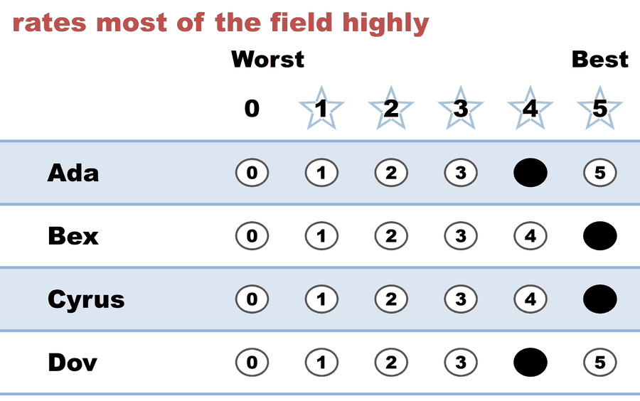
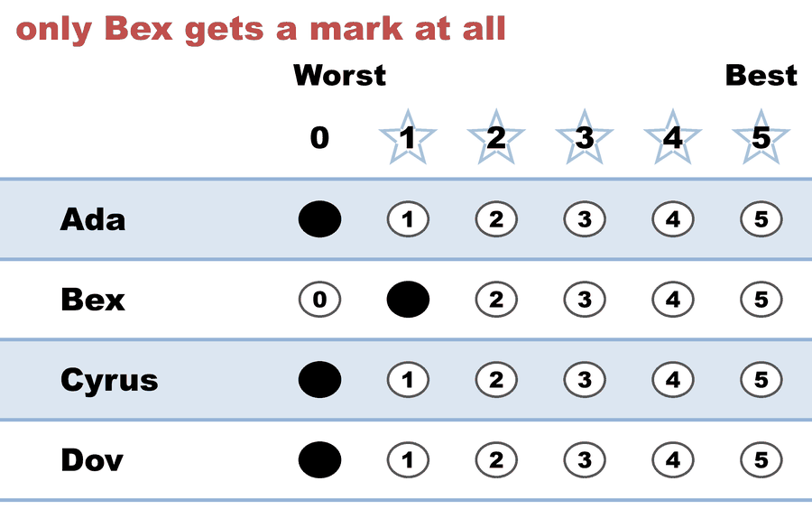
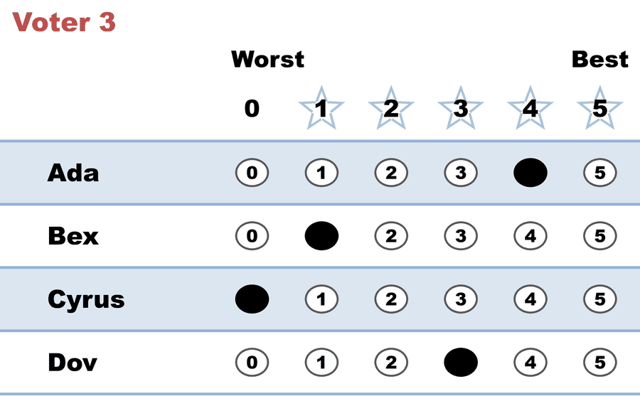
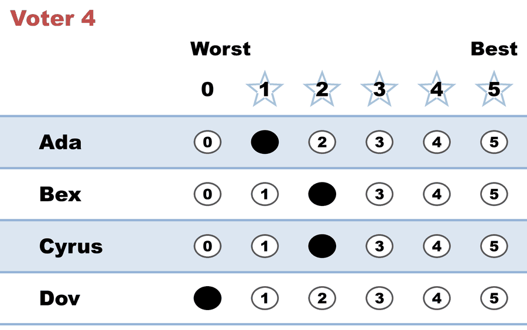
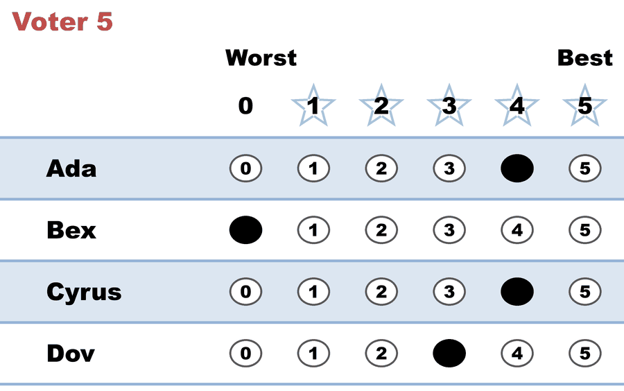

---
search:
  exclude: true
---

# Bloc STAR — the Condorcet winner never reaches a runoff

*Generated from [`bloc_condorcet_winner_no_seat.yaml`](../bloc_condorcet_winner_no_seat.yaml) — do not edit by hand. Regenerate: `python STARVote_LH_tabulation_engine/tools_adam/scripts/build_yaml_pages.py`.*

**Method:** [Bloc STAR (multi-winner, majoritarian)](../../../../01_Learn/README.md) · **2 seats** · **Expected winners:** Cyrus, Ada

**▶ Live on BetterVoting:** [vote](https://bettervoting.com/xbk9bq) · **[results ↗](https://bettervoting.com/xbk9bq/results)** (election `xbk9bq` · test `BV2287`).

## Scenario

Five voters fill two seats from four candidates. Bex beats every other
candidate head-to-head — Bex is the Condorcet winner — and wins no seat.

The reason is not that Bex loses a runoff. It is that Bex never gets INTO one.
Only the top two scorers advance to the automatic runoff, and Bex has the
lowest score of the four (9 points).

  - Seat 1: scores Ada 13, Cyrus 11, Dov 10, Bex 9. Finalists Ada and Cyrus;
    Cyrus wins the runoff 2-1 (two voters express no preference).
  - Seat 2: Cyrus is removed. Ada 13, Dov 10, Bex 9. Finalists Ada and Dov;
    Ada wins 3-0 (two express no preference).

Council: Cyrus and Ada. Bex is still last on score in both rounds and is never
a finalist. No rung of the tie-break ladder is consulted.

Head-to-head, Bex wins every pairing (see the preference matrix on the full
report) — which is exactly what "Condorcet winner" means. A scoring round is
not a head-to-head test, and Bex is the candidate voters mildly like but rarely
rate highly.

This is the MIRROR of bloc_score_leader_shut_out.yaml: there the passed-over
candidate leads on score and loses every runoff; here the passed-over candidate
would win every runoff and never gets into one. Those are the only two ways
Bloc STAR can pass someone over.

Proportional STAR (Allocated Score) elects Ada and Bex on these same ballots —
it seats the Condorcet winner that Bloc STAR misses.

Reproduced on BetterVoting (election xbk9bq), which counts the SAME ballots
twice — once as Bloc STAR, once as STAR-PR. Both races match the LH count
exactly: Bloc STAR elects Cyrus and Ada with tieBreakType 'none'; STAR-PR
elects Ada and Bex. Frozen export:
bloc_condorcet_winner_no_seat_bv_export.json.
Live results: https://bettervoting.com/xbk9bq/results

## Ballots

The ballots as marked — the filled bubble is the score given, and the score is the number in its column:

| # | Ballot as marked | Ada | Bex | Cyrus | Dov |
|:--:|:--|:--:|:--:|:--:|:--:|
| 1 |  | 4 | 5 | 5 | 4 |
| 2 |  | 0 | 1 | 0 | 0 |
| 3 |  | 4 | 1 | 0 | 3 |
| 4 |  | 1 | 2 | 2 | 0 |
| 5 |  | 4 | 0 | 4 | 3 |

The same ballots as the file records them:

Row 1 = candidate names; each later row is one voter's 0–5 scores (a `N ×` prefix = N identical ballots).

```text
Ada,Bex,Cyrus,Dov
4,5,5,4   # rates most of the field highly
0,1,0,0   # only Bex gets a mark at all
4,1,0,3
1,2,2,0
4,0,4,3
```

## What the engine says

The count, step by step — the rounds and how the winner is reached:

<!-- --8<-- [start:report] -->
```text
[Divergence from STAR]
  STAR                   = Cyrus
  Choose-One (Plurality) = Bex   (differs from STAR)
  RCV-IRV                = Bex   (differs from STAR)
  Approval               = Ada   (differs from STAR)
  RCV-RR (Condorcet)     = Bex   (differs from STAR)
  Note: 3 of 5 ballots (60%) had equal non-zero scores, so their ranks were
        decided by candidate priority order. The RCV-IRV result may be an
        artifact of score-to-rank tie-breaking rather than a deep
        difference.
  Note: Ranked Robin (RCV-RR) sides with RCV-IRV, so STAR is the outlier
        here — STAR need not elect the Condorcet candidate.
  Full round-by-round reports (generated for review):
  RCV-IRV rounds: cases_tabulated/bloc_condorcet_winner_no_seat_RCV-IRV_tabulated.txt
  RCV-RR round-robin: cases_tabulated/bloc_condorcet_winner_no_seat_RCV-RR_tabulated.txt

[Runoff Reversal]
 - Score Round Winner(s) = (Ada)
 - Runoff Round Winner   = (Cyrus)
  Candidate Ada earned the highest total score, but
  Candidate Cyrus won the automatic runoff — not a malfunction,
  STAR working as designed: the runoff elects the finalist preferred
  by the majority (of voters with a preference).

--- Bloc STAR Voting Method (2 winners) ---

[Bloc STAR]
 Tabulating 5 ballots to fill 2 seats.
Ada,Bex,Cyrus,Dov
  4,  5,    5,  4
  0,  1,    0,  0
  4,  1,    0,  3
  1,  2,    2,  0
  4,  0,    4,  3

[Bloc STAR: Round 1: Scoring Round]
 The two highest-scoring candidates advance to the next round.
   Ada           -- 13 -- First place
   Cyrus         -- 11 -- Second place
   Dov           -- 10
   Bex           --  9
 Ada and Cyrus advance.

[Bloc STAR: Round 1: Automatic Runoff Round]
 The candidate preferred in the most head-to-head matchups wins.
   Cyrus         -- 2 -- First place
   Ada           -- 1
   Equal Support -- 2
 Cyrus wins.
   Runoff math:
     5  ballots cast
   − 2  Equal Support (no preference between the two finalists)
     ─
     3  voters with a preference  (majority = 2)
           Cyrus 2 (67%)  ·  Ada 1 (33%)

──────────────────────────────────────────────────

[Bloc STAR: Round 2: Scoring Round]
 The two highest-scoring candidates advance to the next round.
   Ada           -- 13 -- First place
   Dov           -- 10 -- Second place
   Bex           --  9
 Ada and Dov advance.

[Bloc STAR: Round 2: Automatic Runoff Round]
 The candidate preferred in the most head-to-head matchups wins.
   Ada           -- 3 -- First place
   Dov           -- 0
   Equal Support -- 2
 Ada wins.
   Runoff math:
     5  ballots cast
   − 2  Equal Support (no preference between the two finalists)
     ─
     3  voters with a preference  (majority = 2)
           Ada 3 (100%)  ·  Dov 0 (0%)

[Bloc STAR: Winners — Bloc STAR Voting Method (2 winners)]
 Cyrus
 Ada
```
<!-- --8<-- [end:report] -->

### Full audit — preference matrix, Condorcet, and score distribution

```text
--- Preference Matrix ---
Head-to-head / pairwise comparison
Legend: For - Equal Support - Against
        Informational only — not part of the 2-winner count below,
        so no Top-2 finalists are marked.
               |     Ada    |    Bex    |   Cyrus   |    Dov    |
-----------------------------------------------------------------
         Ada > |    ---     |2 - 0 - 3  |1 - 2 - 2  |3 - 2 - 0  |
         Bex > | 3 - 0 - 2  |   ---     |2 - 2 - 1  |3 - 0 - 2  |
       Cyrus > | 2 - 2 - 1  |1 - 2 - 2  |   ---     |3 - 1 - 1  |
         Dov > | 0 - 2 - 3  |2 - 0 - 3  |1 - 1 - 3  |   ---     |

[Condorcet Winner]
  Condorcet Winner: Bex — STAR elected Cyrus instead (Bex was eliminated in the scoring round)

[Condorcet Loser]
  Condorcet Loser: Dov — loses every head-to-head matchup

[Score Distribution] (how many ballots gave each star rating)
                Score
Candidate  5  4  3  2  1  0  | Total   Avg
Ada        0  3  0  0  1  1  |    13   2.6
Bex        1  0  0  1  2  1  |     9   1.8
Cyrus      1  1  0  1  0  2  |    11   2.2
Dov        0  1  2  0  0  2  |    10   2.0
```

Everything in one file: the [`_tabulated` mirror](../cases_tabulated/bloc_condorcet_winner_no_seat_tabulated.txt) (regenerated on every run; every analysis forced on).

Run it yourself:

```bash
python STARVote_LH_tabulation_engine/starvote_larry_hastings.py 02_STAR_Bloc/02_Examples/bloc_shapes/cases/bloc_condorcet_winner_no_seat.yaml
```

## See also

- [Condorcet efficiency (topic hub)](../../../../../07_Concepts/topics/condorcet/README.md)
- [Ties & tie-breaking (topic hub)](../../../../../07_Concepts/topics/ties/README.md)
- [The tie-breaking ladder (full chain)](../../../../../01_STAR/01_Learn/Tie_Breaking_STAR/tie_breaking.md)
- [Runoff reversal (worked set)](../../../../../01_STAR/02_Examples/runoff_overturns_leader/README.md)
- [Glossary](../../../../../07_Concepts/GLOSSARY.md) · [all cases by method](../../../../../07_Concepts/YAML_test_case_index/README.md)

More cases in this set: [bloc_all_but_one](bloc_all_but_one.md) · [bloc_divided_majority](bloc_divided_majority.md) · [bloc_equal_support_seat](bloc_equal_support_seat.md) · [bloc_finalist_wins_nothing](bloc_finalist_wins_nothing.md) · [bloc_harborview_council](bloc_harborview_council.md) · [bloc_no_majority_bridge](bloc_no_majority_bridge.md) · [bloc_one_voter_council](bloc_one_voter_council.md) · [bloc_score_leader_shut_out](bloc_score_leader_shut_out.md) · [bloc_widest_field](bloc_widest_field.md)
