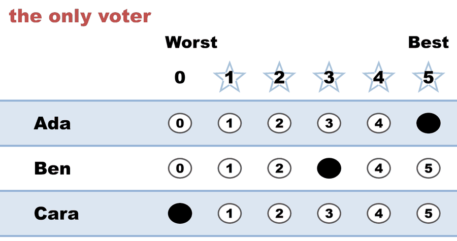

---
search:
  exclude: true
---

# Bloc STAR — one voter fills a two-seat council

*Generated from [`bloc_one_voter_council.yaml`](../bloc_one_voter_council.yaml) — do not edit by hand. Regenerate: `python STARVote_LH_tabulation_engine/tools_adam/scripts/build_yaml_pages.py`.*

**Method:** [Bloc STAR (multi-winner, majoritarian)](../../../../01_Learn/README.md) · **2 seats** · **Expected winners:** Ada, Ben

## Scenario

The smallest Bloc STAR election that can be written down: one ballot, three
candidates, two seats. There is no arithmetic to do, which is the point — it
shows the MECHANISM with nothing else in the way.

Bloc STAR is single-winner STAR run once per seat, with the winner removed
each time and every ballot still counting at full weight.

  - Seat 1: scores Ada 5, Ben 3, Cara 0. Ada and Ben are the finalists; the
    one voter prefers Ada, so Ada wins the runoff 1-0.
  - Seat 2: Ada is removed and the SAME ballot is counted again. Ben 3,
    Cara 0. Ben wins the runoff 1-0.

Council: Ada and Ben. No rung of the tie-break ladder is consulted.

Read it as the definition, not as an election: one voter's ranking becomes the
whole council, in order. Every other case in this folder is this same loop with
more voters disagreeing inside it.

## Ballots

The ballot as marked — the filled bubble is the score given, and the score is the number in its column:

| # | Ballot as marked | Ada | Ben | Cara |
|:--:|:--|:--:|:--:|:--:|
| 1 |  | 5 | 3 | 0 |

The same ballot as the file records it:

Row 1 = candidate names; each later row is one voter's 0–5 scores (a `N ×` prefix = N identical ballots).

```text
Ada,Ben,Cara
5,3,0   # the only voter
```

## What the engine says

The count, step by step — the rounds and how the winner is reached:

<!-- --8<-- [start:report] -->
```text
--- Bloc STAR Voting Method (2 winners) ---

[Bloc STAR]
 Tabulating 1 ballot to fill 2 seats.
Ada,Ben,Cara
  5,  3,   0

[Bloc STAR: Round 1: Scoring Round]
 The two highest-scoring candidates advance to the next round.
   Ada           -- 5 -- First place
   Ben           -- 3 -- Second place
   Cara          -- 0
 Ada and Ben advance.

[Bloc STAR: Round 1: Automatic Runoff Round]
 The candidate preferred in the most head-to-head matchups wins.
   Ada           -- 1 -- First place
   Ben           -- 0
   Equal Support -- 0
 Ada wins.
   Runoff math:
     1  ballots cast
   − 0  Equal Support (no preference between the two finalists)
     ─
     1  voters with a preference  (majority = 1)
           Ada 1 (100%)  ·  Ben 0 (0%)

──────────────────────────────────────────────────

[Bloc STAR: Round 2: Scoring Round]
 The two highest-scoring candidates advance to the next round.
   Ben           -- 3 -- First place
   Cara          -- 0 -- Second place
 Ben and Cara advance.

[Bloc STAR: Round 2: Automatic Runoff Round]
 The candidate preferred in the most head-to-head matchups wins.
   Ben           -- 1 -- First place
   Cara          -- 0
   Equal Support -- 0
 Ben wins.
   Runoff math:
     1  ballots cast
   − 0  Equal Support (no preference between the two finalists)
     ─
     1  voters with a preference  (majority = 1)
           Ben 1 (100%)  ·  Cara 0 (0%)

[Bloc STAR: Winners — Bloc STAR Voting Method (2 winners)]
 Ada
 Ben
```
<!-- --8<-- [end:report] -->

### Full audit — preference matrix, Condorcet, and score distribution

```text
--- Preference Matrix ---
Head-to-head / pairwise comparison
Legend: For - Equal Support - Against
        Informational only — not part of the 2-winner count below,
        so no Top-2 finalists are marked.
               |     Ada    |    Ben    |    Cara   |
-----------------------------------------------------
         Ada > |    ---     |1 - 0 - 0  |1 - 0 - 0  |
         Ben > | 0 - 0 - 1  |   ---     |1 - 0 - 0  |
        Cara > | 0 - 0 - 1  |0 - 0 - 1  |   ---     |

[Condorcet Winner]
  Condorcet Winner: Ada — matches the STAR winner

[Condorcet Loser]
  Condorcet Loser: Cara — loses every head-to-head matchup

[Score Distribution] (how many ballots gave each star rating)
                Score
Candidate  5  4  3  2  1  0  | Total   Avg
Ada        1  0  0  0  0  0  |     5   5.0
Ben        0  0  1  0  0  0  |     3   3.0
Cara       0  0  0  0  0  1  |     0   0.0
```

Everything in one file: the [`_tabulated` mirror](../cases_tabulated/bloc_one_voter_council_tabulated.txt) (regenerated on every run; every analysis forced on).

Run it yourself:

```bash
python STARVote_LH_tabulation_engine/starvote_larry_hastings.py 02_STAR_Bloc/02_Examples/bloc_shapes/cases/bloc_one_voter_council.yaml
```

## See also

- [Ties & tie-breaking (topic hub)](../../../../../07_Concepts/topics/ties/README.md)
- [The tie-breaking ladder (full chain)](../../../../../01_STAR/01_Learn/Tie_Breaking_STAR/tie_breaking.md)
- [Runoff reversal (worked set)](../../../../../01_STAR/02_Examples/runoff_overturns_leader/README.md)
- [Glossary](../../../../../07_Concepts/GLOSSARY.md) · [all cases by method](../../../../../07_Concepts/YAML_test_case_index/README.md)

More cases in this set: [bloc_all_but_one](bloc_all_but_one.md) · [bloc_condorcet_winner_no_seat](bloc_condorcet_winner_no_seat.md) · [bloc_divided_majority](bloc_divided_majority.md) · [bloc_equal_support_seat](bloc_equal_support_seat.md) · [bloc_finalist_wins_nothing](bloc_finalist_wins_nothing.md) · [bloc_harborview_council](bloc_harborview_council.md) · [bloc_no_majority_bridge](bloc_no_majority_bridge.md) · [bloc_score_leader_shut_out](bloc_score_leader_shut_out.md) · [bloc_widest_field](bloc_widest_field.md)
