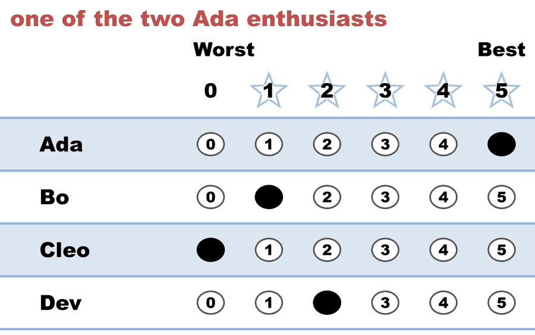
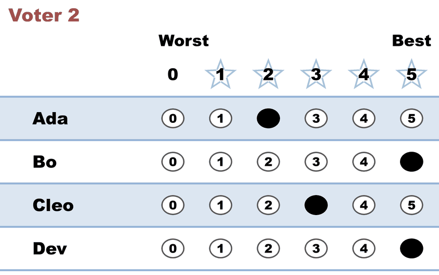
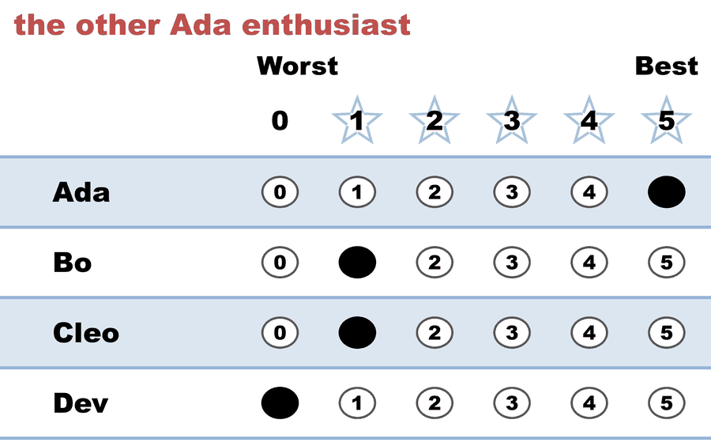
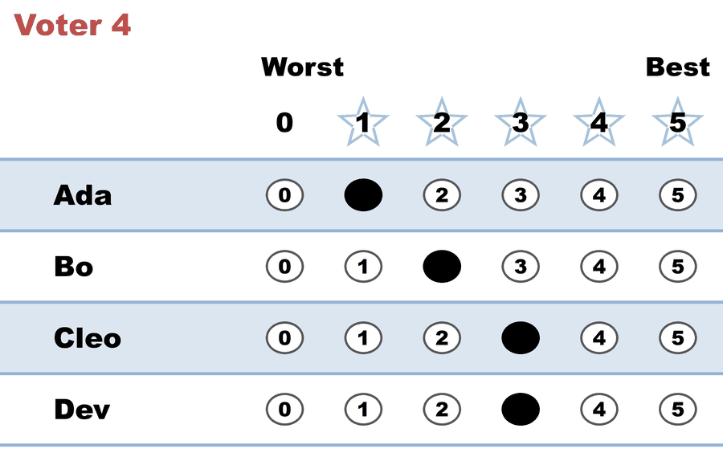
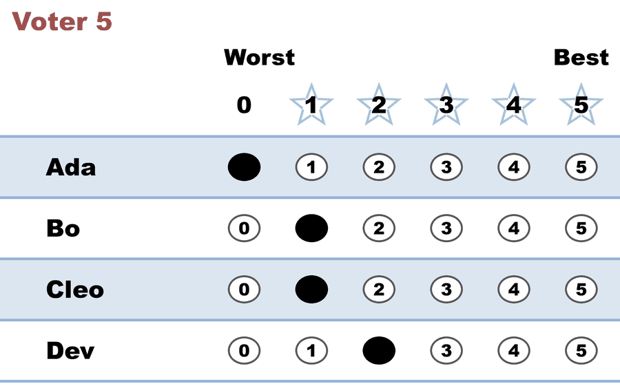

---
search:
  exclude: true
---

# Bloc STAR — the score leader is shut out of every seat

*Generated from [`bloc_score_leader_shut_out.yaml`](../bloc_score_leader_shut_out.yaml) — do not edit by hand. Regenerate: `python STARVote_LH_tabulation_engine/tools_adam/scripts/build_yaml_pages.py`.*

**Method:** [Bloc STAR (multi-winner, majoritarian)](../../../../01_Learn/README.md) · **3 seats** · **Expected winners:** Dev, Bo, Cleo

## Scenario

Five voters fill three seats from four candidates. Ada has the highest score in
the scoring round of ALL THREE rounds — 13 points, ahead of everyone, every
time — and finishes with no seat. The council is literally everybody else.

  - Seat 1: Ada 13, Dev 12, Bo 10, Cleo 8. Finalists Ada and Dev. Dev wins the
    runoff 3-2.
  - Seat 2: Ada 13, Bo 10, Cleo 8. Finalists Ada and Bo. Bo wins 3-2.
  - Seat 3: Ada 13, Cleo 8. Finalists Ada and Cleo. Cleo wins 3-2.

Council: Dev, Bo, Cleo. No rung of the tie-break ladder is consulted.

Every runoff is the same 3-2 split, because it is the same three voters each
time. Two voters score Ada 5; the other three prefer almost anyone to Ada. The
two 5s are enough to put Ada on top of the score board in every round, and
never enough to win a head-to-head against a three-voter majority.

This is the sharpest available demonstration that Bloc STAR is NOT "elect the
top N scorers". The scoring round only picks who gets to be in the runoff; the
runoff decides the seat, and it asks a different question — not "how highly is
this candidate rated?" but "how many voters prefer this candidate to that one?"

Proportional STAR (Allocated Score) elects Ada, Cleo and Dev on these same
ballots — it seats Ada first, precisely the candidate Bloc STAR shuts out.

## Ballots

The ballots as marked — the filled bubble is the score given, and the score is the number in its column:

| # | Ballot as marked | Ada | Bo | Cleo | Dev |
|:--:|:--|:--:|:--:|:--:|:--:|
| 1 |  | 5 | 1 | 0 | 2 |
| 2 |  | 2 | 5 | 3 | 5 |
| 3 |  | 5 | 1 | 1 | 0 |
| 4 |  | 1 | 2 | 3 | 3 |
| 5 |  | 0 | 1 | 1 | 2 |

The same ballots as the file records them:

Row 1 = candidate names; each later row is one voter's 0–5 scores (a `N ×` prefix = N identical ballots).

```text
Ada,Bo,Cleo,Dev
5,1,0,2   # one of the two Ada enthusiasts
2,5,3,5
5,1,1,0   # the other Ada enthusiast
1,2,3,3
0,1,1,2
```

## What the engine says

The count, step by step — the rounds and how the winner is reached:

<!-- --8<-- [start:report] -->
```text
[Divergence from STAR]
  STAR                   = Dev
  Choose-One (Plurality) = Ada   (differs from STAR)
  Approval               = Ada   (differs from STAR)

[Runoff Reversal]
 - Score Round Winner(s) = (Ada)
 - Runoff Round Winner   = (Dev)
  Candidate Ada earned the highest total score, but
  Candidate Dev won the automatic runoff — not a malfunction,
  STAR working as designed: the runoff elects the finalist preferred
  by the majority (of voters with a preference).

--- Bloc STAR Voting Method (3 winners) ---

[Bloc STAR]
 Tabulating 5 ballots to fill 3 seats.
Ada,Bo,Cleo,Dev
  5, 1,   0,  2
  2, 5,   3,  5
  5, 1,   1,  0
  1, 2,   3,  3
  0, 1,   1,  2

[Bloc STAR: Round 1: Scoring Round]
 The two highest-scoring candidates advance to the next round.
   Ada           -- 13 -- First place
   Dev           -- 12 -- Second place
   Bo            -- 10
   Cleo          --  8
 Ada and Dev advance.

[Bloc STAR: Round 1: Automatic Runoff Round]
 The candidate preferred in the most head-to-head matchups wins.
   Dev           -- 3 -- First place
   Ada           -- 2
   Equal Support -- 0
 Dev wins.
   Runoff math:
     5  ballots cast
   − 0  Equal Support (no preference between the two finalists)
     ─
     5  voters with a preference  (majority = 3)
           Dev 3 (60%)  ·  Ada 2 (40%)

──────────────────────────────────────────────────

[Bloc STAR: Round 2: Scoring Round]
 The two highest-scoring candidates advance to the next round.
   Ada           -- 13 -- First place
   Bo            -- 10 -- Second place
   Cleo          --  8
 Ada and Bo advance.

[Bloc STAR: Round 2: Automatic Runoff Round]
 The candidate preferred in the most head-to-head matchups wins.
   Bo            -- 3 -- First place
   Ada           -- 2
   Equal Support -- 0
 Bo wins.
   Runoff math:
     5  ballots cast
   − 0  Equal Support (no preference between the two finalists)
     ─
     5  voters with a preference  (majority = 3)
           Bo 3 (60%)  ·  Ada 2 (40%)

──────────────────────────────────────────────────

[Bloc STAR: Round 3: Scoring Round]
 The two highest-scoring candidates advance to the next round.
   Ada           -- 13 -- First place
   Cleo          --  8 -- Second place
 Ada and Cleo advance.

[Bloc STAR: Round 3: Automatic Runoff Round]
 The candidate preferred in the most head-to-head matchups wins.
   Cleo          -- 3 -- First place
   Ada           -- 2
   Equal Support -- 0
 Cleo wins.
   Runoff math:
     5  ballots cast
   − 0  Equal Support (no preference between the two finalists)
     ─
     5  voters with a preference  (majority = 3)
           Cleo 3 (60%)  ·  Ada 2 (40%)

[Bloc STAR: Winners — Bloc STAR Voting Method (3 winners)]
 Dev
 Bo
 Cleo
```
<!-- --8<-- [end:report] -->

### Full audit — preference matrix, Condorcet, and score distribution

```text
--- Preference Matrix ---
Head-to-head / pairwise comparison
Legend: For - Equal Support - Against
        Informational only — not part of the 3-winner count below,
        so no Top-2 finalists are marked.
               |     Ada    |     Bo    |    Cleo   |    Dev    |
-----------------------------------------------------------------
         Ada > |    ---     |2 - 0 - 3  |2 - 0 - 3  |2 - 0 - 3  |
          Bo > | 3 - 0 - 2  |   ---     |2 - 2 - 1  |1 - 1 - 3  |
        Cleo > | 3 - 0 - 2  |1 - 2 - 2  |   ---     |1 - 1 - 3  |
         Dev > | 3 - 0 - 2  |3 - 1 - 1  |3 - 1 - 1  |   ---     |

[Condorcet Winner]
  Condorcet Winner: Dev — matches the STAR winner

[Condorcet Loser]
  Condorcet Loser: Ada — loses every head-to-head matchup — elected by Choose-One (Plurality), Approval!

[Score Distribution] (how many ballots gave each star rating)
                Score
Candidate  5  4  3  2  1  0  | Total   Avg
Ada        2  0  0  1  1  1  |    13   2.6
Bo         1  0  0  1  3  0  |    10   2.0
Cleo       0  0  2  0  2  1  |     8   1.6
Dev        1  0  1  2  0  1  |    12   2.4
```

Everything in one file: the [`_tabulated` mirror](../cases_tabulated/bloc_score_leader_shut_out_tabulated.txt) (regenerated on every run; every analysis forced on).

Run it yourself:

```bash
python STARVote_LH_tabulation_engine/starvote_larry_hastings.py 02_STAR_Bloc/02_Examples/bloc_shapes/cases/bloc_score_leader_shut_out.yaml
```

## See also

- [Ties & tie-breaking (topic hub)](../../../../../07_Concepts/topics/ties/README.md)
- [The tie-breaking ladder (full chain)](../../../../../01_STAR/01_Learn/Tie_Breaking_STAR/tie_breaking.md)
- [Vote splitting (worked set)](../../../../../method_comparisons/split_voting/README.md)
- [Runoff reversal (worked set)](../../../../../01_STAR/02_Examples/runoff_overturns_leader/README.md)
- [Glossary](../../../../../07_Concepts/GLOSSARY.md) · [all cases by method](../../../../../07_Concepts/YAML_test_case_index/README.md)

More cases in this set: [bloc_all_but_one](bloc_all_but_one.md) · [bloc_condorcet_winner_no_seat](bloc_condorcet_winner_no_seat.md) · [bloc_divided_majority](bloc_divided_majority.md) · [bloc_equal_support_seat](bloc_equal_support_seat.md) · [bloc_finalist_wins_nothing](bloc_finalist_wins_nothing.md) · [bloc_harborview_council](bloc_harborview_council.md) · [bloc_no_majority_bridge](bloc_no_majority_bridge.md) · [bloc_one_voter_council](bloc_one_voter_council.md) · [bloc_widest_field](bloc_widest_field.md)
