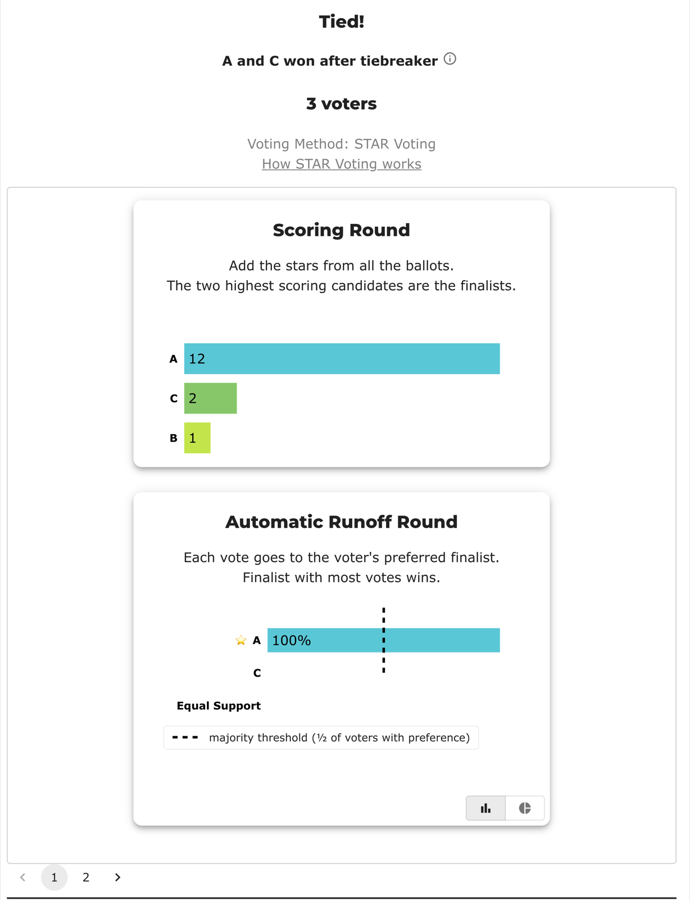

# BV1815 — Bloc STAR, 3 candidates, 2 seats (seat 2 by score tiebreak)

<!-- case-meta:start — managed by build_yaml_pages.py; edit the YAML, not these lines -->
**Method:** [Bloc STAR (multi-winner, majoritarian)](../../03_STAR_PR/01_Learn/README.md) · **2 seats** · **Expected winners:** A, C · [full count →](cases/cases_pages/bv1815_bloc_3c2s_basic.md)
<!-- case-meta:end -->

*A real BetterVoting election (id `fk38pk`, marked **Passed**) labeled "basic / simple" — but it quietly exercises the **score tiebreaker** at the second seat. LH and BetterVoting agree: winners **A, C**.*

Reference files: [`bv1815_bloc_3c2s_basic.yaml`](cases/bv1815_bloc_3c2s_basic.yaml) (`expected_winners: [A, C]`) · frozen export [`bv1815_bloc_3c2s_basic_bv_export.json`](cases/bv1815_bloc_3c2s_basic_bv_export.json) (BV `fk38pk`). Backs sheet row **BV1815**.

## The election

Bloc STAR, 3 candidates, 2 seats, 3 ballots:

```
A,B,C
4,1,0
3,0,2
5,0,0
```

Totals: A = 12, B = 1, C = 2.

## The case file

The YAML the engine actually runs, embedded at build time — so the parameters on this page can never drift from the file:

```yaml title="cases/bv1815_bloc_3c2s_basic.yaml"
--8<-- "02_STAR_Bloc/02_Examples/cases/bv1815_bloc_3c2s_basic.yaml"
```

## What makes it interesting

Seat 1 is a clean win for A. Seat 2 is **not** clean: with A removed, B and C each total near-nothing and **tie 1–1 in the runoff** (one voter prefers B, one prefers C, one is Equal Support). The tie falls to the first runoff rung — **highest total score** — and C (2) beats B (1). BetterVoting resolves it the same way (`tieBreakType: "score"`, elected A, C), which is why this "basic" case is a clean **Pass** and a useful reference that the score tiebreaker works in Bloc.

## View 1 — BetterVoting

Result: **A and C win** (2 seats). `nAbstentions: 0`, `nTallyVotes: 3` (all ballots counted), `tieBreakType: "score"`. *(Aside: the export labels `votingMethod: "STAR"` rather than "Bloc STAR" — [#904](https://github.com/Equal-Vote/bettervoting/issues/904).)*

The results page paginates one card per seat. **Seat 1** — A takes 12 of the 15 available points and wins the runoff 3–0, so the runoff bar reads 100% and the dashed *majority threshold* line falls at 50% of the same axis (with no Equal Support, both are measured against the same 3 voters):



**Seat 2** — the tie. C and B each hold one preference and one ballot rates them equally, so all three bars read **33%** while the *majority threshold* line lands at **1 vote** — the exact height of both candidate bars. Two bars touching a line labelled "majority" in a runoff neither of them won:


The gap between those two readings is the denominator mismatch filed as [#1471](https://github.com/Equal-Vote/bettervoting/issues/1471) — the labels divide by all three bars, the marker by the two finalists only. It changes nothing about the count (both engines elect A and C); it's what the picture says about it. What the three denominators are worth in a Bloc race: [Over 50% — what a landslide actually buys](../01_Learn/over_50_percent.md).

## View 2 — the LH report

The two rungs to watch: **Round 2: Automatic Runoff Round** shows the 1–1 tie (with one Equal Support), and **First tiebreaker** shows the score rung breaking it — C (2) over B (1).

The full audit, embedded from the [`_tabulated` mirror](cases/cases_tabulated/bv1815_bloc_3c2s_basic_tabulated.txt) rather than pasted, so it tracks the engine:

```text title="cases/cases_tabulated/bv1815_bloc_3c2s_basic_tabulated.txt"
--8<-- "02_STAR_Bloc/02_Examples/cases/cases_tabulated/bv1815_bloc_3c2s_basic_tabulated.txt"
```

## Related

- The pure no-tie control: [`00_c3_b3_bloc-baseline-2-seats.yaml`](cases/00_c3_b3_bloc-baseline-2-seats.yaml) (both seats decided by the ballots, no rung consulted).
- The tie-break ladder these seats descend: [STAR Tie-Breaking — The Full Chain](../../01_STAR/01_Learn/Tie_Breaking_STAR/tie_breaking.md).
- [#904](https://github.com/Equal-Vote/bettervoting/issues/904) — the method-name label ("STAR" vs "Bloc STAR").
