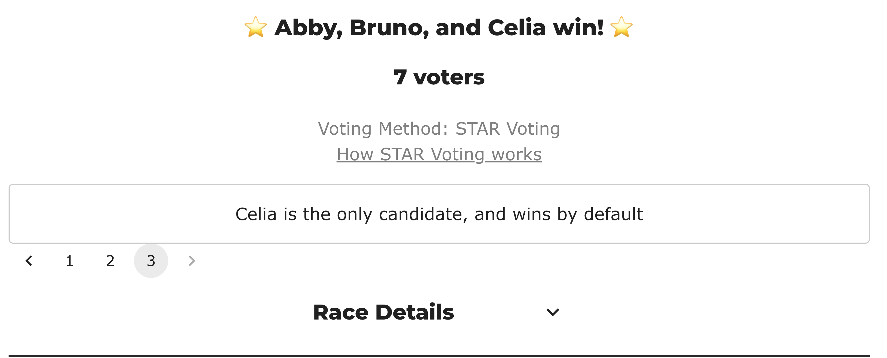

# Three candidates, three seats — a race nobody can lose (`t488h9`)

<!-- case-meta:start — managed by build_yaml_pages.py; edit the YAML, not these lines -->
**Method:** [Bloc STAR (multi-winner, majoritarian)](../../03_STAR_PR/01_Learn) · **3 seats** · [full count →](cases/cases_pages/bv2269_t488h9_race_nobody_can_lose.md)
<!-- case-meta:end -->

*Three candidates stand for three seats, so every one of them is seated no matter how anyone votes. The election exists to ask a question about tabulators rather than to teach a result: what does a counting engine do with a contest that cannot decide anything? Larry Hastings' engine refuses the file. BetterVoting accepts it, counts the two seats that are genuinely contested, and says of the last one, in plain English, that the candidate wins by default.*

**▶ Live on BetterVoting:** BV2269 [vote](https://bettervoting.com/t488h9) · **[results ↗](https://bettervoting.com/t488h9/results)** (election `t488h9`).

→ The method: [Bloc STAR](../01_Learn/bloc_star.md) · what it seats when the race *is* contested: [the honest limits](../01_Learn/bloc_honest_limits.md)

**Level: 201 · for presenters** One election, 3 candidates, 7 voters, 3 seats — and a second file with the same ballots and one seat fewer, as the control.

Reference files: [`bv2269_t488h9_race_nobody_can_lose.yaml`](cases/bv2269_t488h9_race_nobody_can_lose.yaml) (no `expected_winners` — see below) · the control [`race_nobody_can_lose_two_seat_control.yaml`](cases/race_nobody_can_lose_two_seat_control.yaml) · frozen export [`bv2269_t488h9_race_nobody_can_lose_bv_export.json`](cases/bv2269_t488h9_race_nobody_can_lose_bv_export.json) (BV `t488h9`).

---

## The question

A seat count is supposed to be a constraint. Ask for two seats from four candidates and the ballots decide which two. Ask for **three seats from three candidates** and the ballots decide nothing about membership — everyone is in before the polls open. The only thing left for a count to say is the *order* in which they were seated.

That is not a hypothetical shape. An organisation manufactures it every time nominations exactly fill the board, and the person setting up the election is usually the last to notice. So the useful question is not "should anyone do this" but "what happens if they do" — and the two engines in this repo answer it differently.

## The election

Bloc STAR, 3 candidates, 3 seats, 7 ballots, scored 0–5:

| # | Abby | Bruno | Celia |
|---|:--:|:--:|:--:|
| 1 | 5 | 3 | 1 |
| 2 | 5 | 4 | 0 |
| 3 | 4 | 3 | 2 |
| 4 | 5 | 2 | 3 |
| 5 | 3 | 5 | 1 |
| 6 | 2 | 5 | 4 |
| 7 | 4 | 1 | 5 |

Nothing about these ballots is degenerate. They total **Abby 28, Bruno 23, Celia 16**, every head-to-head is decisive, and no rung of any tie-break ladder is ever consulted. The *only* thing wrong with this election is the number in the seat field — which is exactly what makes it a clean probe.

Write-ins were disabled on the BetterVoting election on purpose: one write-in would supply the fourth candidate the premise excludes, and the race would become an ordinary contest.

## View 1 — BetterVoting accepts it

All three seated, in score order:


Seats 1 and 2 are real counts, and they are worth having. Seat 1: Abby and Bruno advance on 28 and 23, and Abby takes the runoff **5–2** with every voter expressing a preference. Seat 2: Bruno and Celia advance on 23 and 16, and Bruno takes it **5–2**. `tieBreakType` is `none` in every round, `nTallyVotes` is 7, `nAbstentions` 0.

The third seat is the interesting one. BetterVoting neither prints a phantom scoring round nor leaves the seat unexplained — it names the situation:



The frozen export agrees: round 2 carries `winners: [Celia]`, an **empty** `runner_up`, and an **empty** `logs` array — no advance step, no runoff, nothing claimed that did not happen.

```json
{ "winners": [ { "name": "Celia", "score": 16, ... } ],
  "runner_up": [],
  "tied": [],
  "tieBreakType": "none",
  "logs": [] }
```

So the answer to the probe is **yes, BetterVoting accepts a race nobody can lose** — and it degrades honestly rather than dressing the result up as a contest. That is better behaviour than the scenario list predicted when it flagged this question; the guess there was that a meaningless runoff would be printed for the last seat.

## View 2 — the LH engine refuses it

Run the same file through Larry Hastings' engine and there is no count at all:

```console
$ .venv/bin/python STARVote_LH_tabulation_engine/starvote_larry_hastings.py \
      02_STAR_Bloc/02_Examples/cases/bv2269_t488h9_race_nobody_can_lose.yaml
Error: cannot fill 3 seats from 3 candidate(s).
  num_winners must be smaller than the number of candidates.
$ echo $?
1
```

This is why the case YAML carries **no `expected_winners`**: the engine never produces winners for it, so there is nothing to expect. It is the one file in this folder that is not meant to tabulate.

## The control — the same ballots, one seat fewer

Remove a seat and the objection disappears entirely. [`race_nobody_can_lose_two_seat_control.yaml`](cases/race_nobody_can_lose_two_seat_control.yaml) is the same seven ballots at **two** seats, and the LH engine counts it without complaint:

--8<-- "02_STAR_Bloc/02_Examples/cases/cases_pages/race_nobody_can_lose_two_seat_control.md:report"

Seat 1 goes to Abby 5–2 over Bruno, seat 2 to Bruno 5–2 over Celia — the same numbers BetterVoting produced for *its* first two seats. The two engines agree completely about the part of this election that is actually a contest.

Celia is the whole story of the pair. At two seats she wins nothing, on the same ballots. At three seats she is a board member — not because seven voters preferred her to anyone, but because the seat field said 3.

## What to take from it

**Neither engine is wrong, and the disagreement is about a premise, not a tally.** LH treats `seats >= candidates` as a spoiled input and refuses to pretend it counted something; BetterVoting treats the seat count as a target and stops when the candidates run out, telling the reader exactly that. Both are defensible, and a presenter asked "which one is right?" should say so rather than pick.

**The seat order is real; the membership is not.** This is the part that catches people. Because seats 1 and 2 ran genuine STAR rounds, the results page looks like an election with winners and losers — Abby at 71%, Bruno beaten, Celia last. None of that changed who is on the board. If an organisation publishes this page as "the result," readers will draw an ordering out of it that the election was never able to refuse.

**The practical rule:** if nominations exactly fill the seats, the honest options are to cancel the count or to run it for order only and say so. Do not let a results page imply a contest that could not have had a loser.

---

*Filed under §2.4 of the Bloc STAR scenario list, which held this probe back deliberately because answering it required creating a permanent public election. Authorised and minted 2026-08-04 as BV2269.*
