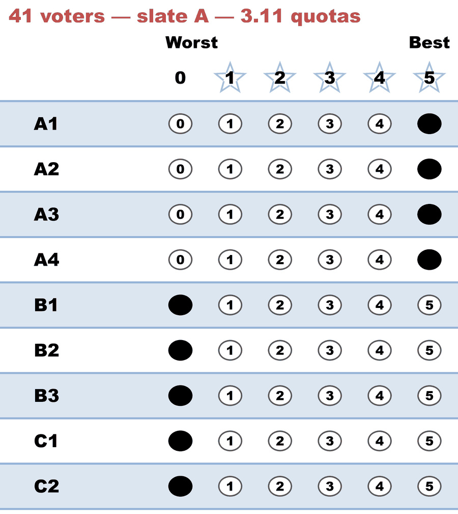
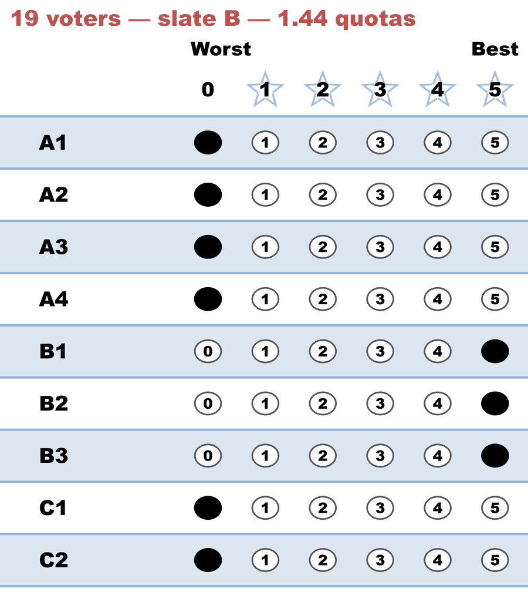
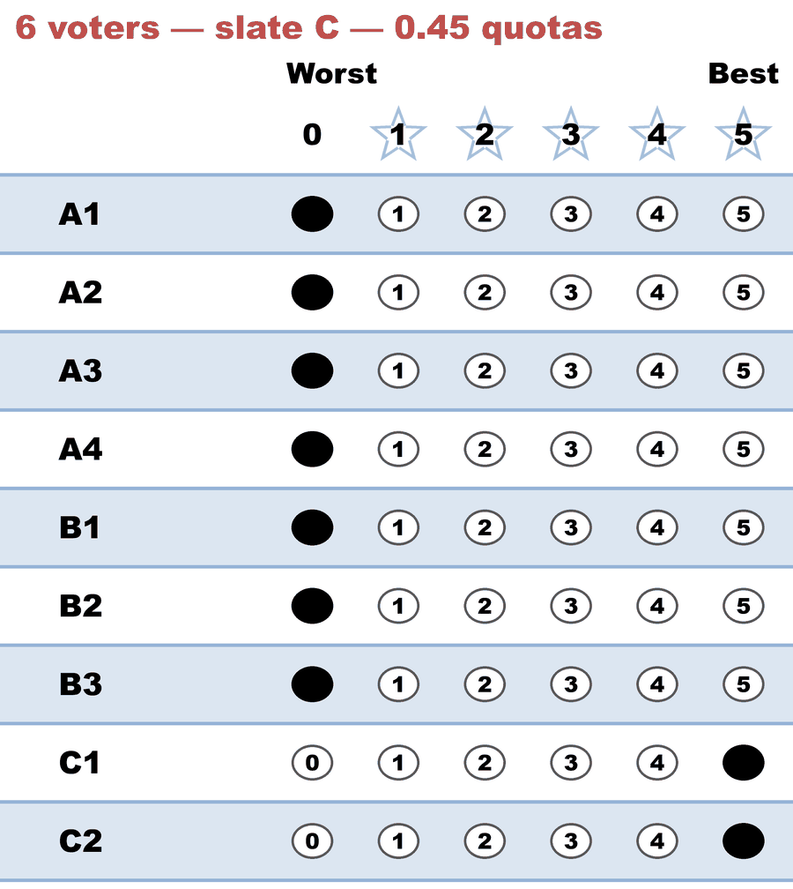

# Two ways to fill a quota — the count-vs-weight engine divergence

*Three party slates, five seats. One engine charges each seat a full quota; the other charges a shrinking fraction. They elect different councils.*

**Level: 301 · deep dive**

→ the method: [STAR-PR](../../01_Learn/STAR_PR/README.md) · the quota's job: [the math behind proportional STAR](../../01_Learn/STAR_PR/the_math_behind_proportional_star.md) · the sibling audit that couldn't see this: [BV fixture crosscheck](../bv_fixture_crosscheck/README.md)

---

**One line:** in Allocated Score's ballot-allocation round, upstream `starvote` measures the Hare quota in ballot **counts**, ignoring the fractional weights ballots carry from earlier rounds, while BetterVoting — and the method's published reference implementation, which `starvote` itself ships — measure it in ballot **weight**; on any profile where one bloc earns three or more seats, the two accountings can seat different councils, and the weight accounting is the correct one.

This page documents the divergence, the fingerprint election that isolates it, and where it bit this library. It was confirmed live against bettervoting.com on 2026-08-09, reported upstream the same day — [starvote#20](https://github.com/larryhastings/starvote/issues/20) (the accounting bug, still open) and [bettervoting#1507](https://github.com/Equal-Vote/bettervoting/issues/1507) (the reporting quirk that kept it hidden — see below) — and **fixed in this library's vendored fork the same day**, so the engine here now agrees with BetterVoting seat-for-seat (fix details at the bottom; the fingerprint case doubles as the regression guard).

## The fingerprint election

Sixty-six voters, nine candidates in three party-line slates, five seats. Every voter gives their slate 5s and everyone else 0s, so there is no cross-slate scoring to blur the arithmetic — the only question is what a seat *costs*.

<!-- ballots:count_vs_weight_slates_c9_b66 -->
The ballots as marked — the filled bubble is the score given, and the score is the number in its column:

| Ballot as marked | Scores (A1, A2, A3, A4, B1, B2, B3, C1, C2) |
|:--|:--:|
|  | `5, 5, 5, 5, 0, 0, 0, 0, 0` |
|  | `0, 0, 0, 0, 5, 5, 5, 0, 0` |
|  | `0, 0, 0, 0, 0, 0, 0, 5, 5` |
<!-- /ballots -->

The Hare quota is 66 ÷ 5 = **13.2 ballots per seat**. Slate A's 41 voters hold 41 ÷ 13.2 = **3.11 quotas**, B holds 1.44, C holds 0.45. Under [largest-remainder (Hamilton) apportionment](https://en.wikipedia.org/wiki/Largest_remainder_method) that's **3 A + 1 B + 1 C**; under [D'Hondt](https://en.wikipedia.org/wiki/D%27Hondt_method), the divisor family that favors large parties, it's **4 A + 1 B + 0 C**. The whole point of Allocated Score's quota mechanism is to deliver the first answer.

| Slate | Voters | Quotas held | Hamilton | D'Hondt | BetterVoting (and this fork, fixed) | unpatched `starvote` |
|---|--:|--:|--:|--:|--:|--:|
| A (A1–A4) | 41 | 3.11 | 3 | 4 | **3** | **4** |
| B (B1–B3) | 19 | 1.44 | 1 | 1 | **1** | **1** |
| C (C1–C2) | 6 | 0.45 | 1 | 0 | **1** | **0** |

(Within a slate the candidates tie every round, so *which* A-candidates take the A seats is decided by the published lot order — but the **seat split between slates is decided by the ballots alone**, on both engines. The tiebreaks don't touch this divergence.)

## What each accounting does

The unpatched engine's own output shows the mechanism (this is upstream `starvote`'s behavior, and this fork's until 2026-08-09). Watch the percentage — it never changes:

```text title="Unpatched starvote — abridged for the lesson, not verbatim engine output"
Round 1   A1 wins (205) → Allocating only 32.20% of these ballots.   ← 13.2 / 41
          41 ballots reweighted from 1 to 139/205
Round 2   A2 wins (139) → Allocating only 32.20% of these ballots.   ← 13.2 / 41 again
          41 ballots reweighted from 139/205 to (139/205)²
Round 3   B1 wins (95)  → Allocating only 69.47% of these ballots.   ← 13.2 / 19
Round 4   A3 wins (94.25) → Allocating only 32.20% of these ballots. ← 13.2 / 41 STILL —
          the A ballots' real remaining weight is 18.85, so a weight-true
          surplus factor would be 13.2 / 18.85 ≈ 70%
Round 5   A4 wins (63.9) — slate A's FOURTH seat; C is frozen out

Winners: A1, A2, A3, A4, B1
```

The surplus factor is `quota ÷ len(supporters)` — the *number of ballot rows*, which stays 41 forever, not their remaining weight, which shrinks every round. So each A seat retires only 32.20% of whatever the slate has left: a geometric decay (× 139/205 per seat) instead of a flat quota per seat. A big slate's seats get cheaper and cheaper — exactly the large-party subsidy that quota methods exist to prevent, and the reason the result lands on D'Hondt's answer.

BetterVoting's production tabulator, run on the same 66 ballots, charges full price every time. Its per-round narration makes the weight accounting visible — the "voters" it counts are weighted voters:

```text title="BetterVoting production log (via /API/Sandbox), 2026-08-09 — abridged"
Round 1  A1 elected (205 stars). The 41 voters who gave A1 5 stars are partially
         represented: 32% spent, 68% preserved.                      ← 13.2 / 41
Round 2  A2 elected (139 stars). The 27.8 voters who gave A2 3.39 stars are
         partially represented: 47% spent, 53% preserved.            ← 13.2 / 27.8
Round 3  B1 elected (95 stars). The 19 voters: 69% spent.            ← 13.2 / 19
Round 4  A3 elected (73 stars). The 14.6 voters: 90% spent.          ← 13.2 / 14.6
Round 5  C1 elected (30 stars).

Winners: A1, A2, B1, A3, C1
```

After three A seats the slate has paid 3 × 13.2 = 39.6 of its 41 ballots and has ~1.4 left — nowhere near another seat. C's 6 untouched ballots take the fifth chair. That is Hamilton's answer, and proportionality doing its job.

## Which one is Allocated Score?

The weight accounting. Three independent confirmations:

- **The published reference implementation.** The method's defining Python code (from the STAR Voting technical specifications' original code appendix, republished on [electowiki](https://electowiki.org/wiki/Allocated_Score) — an advocacy-adjacent wiki, but this is exactly the definitional use it's good for) computes every allocation quantity as a weight sum: `spent_above` and `weight_on_split` are `['weights'].sum()`, and the surplus fraction is `(quota − spent_above) / weight_on_split`.
- **`starvote` ships that code itself** — [`starvote/reference.py`](../../../STARVote_LH_tabulation_engine/starvote/reference.py), importable as `starvote.reference`. Run on this profile it elects **A1, A2, B1, A3, C1**, agreeing with BetterVoting seat-for-seat and disagreeing with `starvote`'s own native `Allocated_Score_Voting`. The package contradicts the reference implementation inside its own wheel — that's the shape of the bug report, [starvote#20](https://github.com/larryhastings/starvote/issues/20).
- **BetterVoting matches the definition and then some.** [`AllocatedScore.ts`](https://github.com/Equal-Vote/bettervoting/blob/main/packages/backend/src/Tabulators/AllocatedScore.ts) is a line-for-line port of the reference (same variable names, exact fractions), and its `findSplitPoint` quietly handles two edge cases where the verbatim pandas code misbehaves: an empty-filter NaN split point when the top ballot alone meets the quota (on that edge the reference spends *nothing*), and a between-groups quota boundary where the reference computes a spent fraction above 1 and its `.clip()` silently under-spends. BetterVoting's crossing rule (`cumsum ≥ quota`) preserves the invariant that makes the method proportional: **one full quota of ballot weight retired per seat**, while ballots remain.

The count accounting matches no published source. In `starvote`'s allocation loop ([`__init__.py` L2029–L2048](https://github.com/larryhastings/starvote/blob/master/starvote/__init__.py#L2029-L2048)): the group size is `len(supporters) − score_start`, the fully-spent branch subtracts that *count* from the quota (a ballot at weight 139/205 retires 1.0 of it), and the surplus branch's factor is `quota ÷ count`. Both branches are weight-blind — and invisible on simple fixtures, because count and weight coincide while every ballot still has weight 1. Divergence needs a *second* allocation event on already-reduced ballots, which is why every one-surplus test agrees and this hid for years.

## Where it bit this library

The repo's twenty allocated-score cases were all re-run against BetterVoting production for this page. Eighteen matched even pre-fix (a single surplus event on full-weight ballots can't tell the accountings apart). The two that didn't were both organic casualties of this bug, not ties — both corrected when the fork was patched:

- **[Co-op board, score half](../../../method_comparisons/proportional_ballots/cases/cases_pages/coop_board_scores_allocated.md)** — the unpatched engine (and, via its clip bug, the pandas reference) left 0.4 of a quota unspent after Ben's seat and elected **Dana** third; weight-true accounting spends it and elects **Amy** (7.8 vs 7.0 stars, no tie in sight), as BetterVoting confirmed live. The fixed engine now agrees, which means the two *score* rules genuinely split their third chair (Amy on allocated, Dana on SSS) — the [proportional-ballots page](../../../method_comparisons/proportional_ballots/README.md) tells that story honestly now.
- **[BV2130, the presidential board](../../02_Examples/cases/cases_pages/bv2130_presidential_board_star_pr.md)** — the long-flagged seat-7 mystery (unpatched: Claudia De La Cruz; BetterVoting: Karina Garcia) was this bug, not a tiebreak. The old note blamed "a near-tie BV broke by chance" because BetterVoting's export said `tieBreakType: "random"` — but that flag is set on **every** STAR-PR result, tie or no tie (the winner always appears in the export's `tied` list by construction). That reporting quirk is now [bettervoting#1507](https://github.com/Equal-Vote/bettervoting/issues/1507). The fixed engine reproduces all seven BetterVoting seats exactly.

Two near-misses worth naming: the [Alabama-paradox pair](../alabama_paradox/README.md) **survives** — BetterVoting production confirms both of its seat sets, so the paradox lesson stands on the correct accounting — and the [BV fixture crosscheck](../bv_fixture_crosscheck/README.md) passes on both accountings *because it structurally cannot see this bug*: its surplus fixture has one allocation event on full-weight ballots, the one situation where count and weight agree. This folder's fingerprint is the missing fixture.

## The fix in this fork

Applied 2026-08-09, following the fork's minimal-edit rule: in the allocation loop the score group's **weight sum** (`allocation_weight`) replaces its row count in exactly three places — the overfill test, the quota subtraction, and the surplus factor (`quota ÷ allocation_weight`). Round-1 output is byte-identical to upstream (weight = count while all weights are 1); later rounds add one line, `These ballots carry a remaining weight of W.`, whenever the two differ. Details: [`BUG_allocated_count_vs_weight.md`](../../../STARVote_LH_tabulation_engine/BUG_allocated_count_vs_weight.md) · ledger row: [`LH_ENGINE_CHANGES.md` §1](../../../STARVote_LH_tabulation_engine/LH_ENGINE_CHANGES.md) · regression guard: [`tests/test_allocated_weight_accounting.py`](../../../STARVote_LH_tabulation_engine/tests/test_allocated_weight_accounting.py) plus this case's `expected_winners`. Upstream [starvote#20](https://github.com/larryhastings/starvote/issues/20) remains open; the patch is offered there.

## Run it

The case file is [`count_vs_weight_slates_c9_b66.yaml`](cases/count_vs_weight_slates_c9_b66.yaml); run it here and the fixed engine elects the proportional 3-1-1 (the full report, all five rounds, tie ladder and all, is on [the generated case page](cases/cases_pages/count_vs_weight_slates_c9_b66.md)). To watch the *bug* happen, run the same profile through upstream `starvote` 2.1.6 (`pip install starvote`) — it elects 4-1-0 with the constant 32.20% surplus factor shown above. The BetterVoting side reproduces with one anonymous request — the sandbox tabulates with live production code and stores nothing:

```bash
curl -sS -X POST https://bettervoting.com/API/Sandbox -H "Content-Type: application/json" -d '{"candidates":["A1","A2","A3","A4","B1","B2","B3","C1","C2"],"cvr":[[5,5,5,5,0,0,0,0,0],[5,5,5,5,0,0,0,0,0]],"num_winners":5,"votingMethod":"STAR_PR"}'
```

(Replace the two-ballot `cvr` stub with the full 66 rows — 41 × A-slate, 19 × B-slate, 6 × C-slate — from the yaml.)
