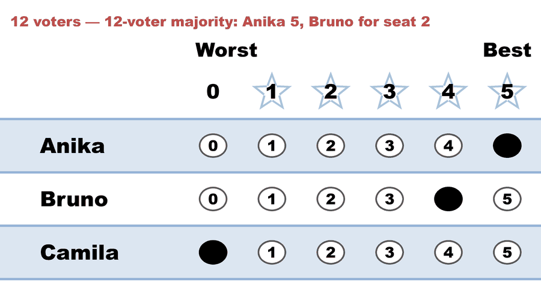
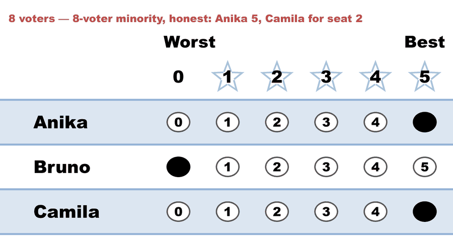

---
search:
  exclude: true
---

# Free riding — honest baseline (Allocated Score)

*Generated from [`free_ride_honest_allocated.yaml`](../free_ride_honest_allocated.yaml) — do not edit by hand. Regenerate: `python STARVote_LH_tabulation_engine/tools_adam/scripts/build_yaml_pages.py`.*

**Method:** [Allocated Score (proportional STAR)](../../../../01_Learn/README.md) · **2 seats** · **Expected winners:** Anika, Bruno

## Scenario

HONEST BASELINE. A neighbourhood association fills two board seats. Anika is the beloved incumbent — every one of the 20 voters scores her 5. The 12-voter majority wants Bruno for the second seat; the 8-voter minority wants Camila. Everyone votes sincerely. Anika takes seat 1 with 100 points, and because ALL 20 ballots sit in her 5-star group, the Hare quota of 10 is charged to every ballot equally: each keeps half its weight. The original 12-to-8 split therefore survives intact into round 2, and Bruno wins the second seat 24 to 20. Compare free_ride_hylland_allocated.yaml, where the minority scores Anika 4 instead of 5 and flips that second seat.

## Ballots

The ballots as marked — the filled bubble is the score given, and the score is the number in its column:

| Ballot as marked | Anika | Bruno | Camila |
|:--|:--:|:--:|:--:|
|  | 5 | 4 | 0 |
|  | 5 | 0 | 5 |

The same ballots as the file records them:

Row 1 = candidate names; each later row is one voter's 0–5 scores (a `N ×` prefix = N identical ballots).

```text
Count:Anika,Bruno,Camila
12:5,4,0   # 12-voter majority: Anika 5, Bruno for seat 2
8:5,0,5    # 8-voter minority, honest: Anika 5, Camila for seat 2
```

## What the engine says

The count, step by step — the rounds and how the winner is reached:

<!-- --8<-- [start:report] -->
```text
--- Allocated Score Voting Method (2 winners) ---

[Allocated Score Voting]
 Tabulating 20 ballots to fill 2 seats.
Count × Anika,Bruno,Camila
   12 ×     5,    4,     0
    8 ×     5,    0,     5

[Allocated Score Voting: Round 1]
 The highest-scoring candidate wins a seat.
   Anika         -- 100 -- First place
   Bruno         --  48
   Camila        --  40
 Anika wins a seat.

[Allocated Score Voting: Round 1: Ballot allocation round]
 Allocating 10 ballots.

[Allocated Score Voting: Round 1: Ballot allocation round: Round 1]
 Allocating 20 ballots at score 5.
 This allocation overfills the quota.  Returning fractional surplus.
 Allocating only 50.00% of these ballots.
 Keeping these ballots, but multiplying their weights by 1/2.
 20 ballots reweighted from 1 to 1/2.

[Allocated Score Voting: Round 2]
 The highest-scoring candidate wins a seat.
   Bruno         -- 24 -- First place
   Camila        -- 20
 Bruno wins a seat.

[Allocated Score Voting: Winners — Allocated Score Voting Method (2 winners)]
 Anika
 Bruno
```
<!-- --8<-- [end:report] -->

### Full audit — preference matrix, Condorcet, and score distribution

```text
--- Preference Matrix ---
Head-to-head / pairwise comparison
Legend: For - Equal Support - Against
        Informational only — not part of the 2-winner count below,
        so no Top-2 finalists are marked.
                 |     Anika    |    Bruno    |    Camila   |
-------------------------------------------------------------
         Anika > |     ---      |20 -  0 -  0 |12 -  8 -  0 |
         Bruno > |  0 -  0 - 20 |    ---      |12 -  0 -  8 |
        Camila > |  0 -  8 - 12 | 8 -  0 - 12 |    ---      |

[Condorcet Winner]
  Condorcet Winner: Anika — matches the STAR winner

[Condorcet Loser]
  Condorcet Loser: Camila — loses every head-to-head matchup

[Score Distribution] (how many ballots gave each star rating)
                   Score
Candidate   5   4   3   2   1   0  | Total   Avg
Anika      20   0   0   0   0   0  |   100   5.0
Bruno       0  12   0   0   0   8  |    48   2.4
Camila      8   0   0   0   0  12  |    40   2.0
 Hare quota is 10.
```

Everything in one file: the [`_tabulated` mirror](../cases_tabulated/free_ride_honest_allocated_tabulated.txt) (regenerated on every run; every analysis forced on).

Run it yourself:

```bash
python STARVote_LH_tabulation_engine/starvote_larry_hastings.py 03_STAR_PR/03_Criteria/free_riding/cases/free_ride_honest_allocated.yaml
```

## See also

- [Vote splitting (worked set)](../../../../../method_comparisons/split_voting/README.md)
- [Glossary](../../../../../07_Concepts/GLOSSARY.md) · [all cases by method](../../../../../07_Concepts/YAML_test_case_index/README.md)

More cases in this set: [free_ride_arms_race_allocated](free_ride_arms_race_allocated.md) · [free_ride_honest_rrv](free_ride_honest_rrv.md) · [free_ride_honest_sss](free_ride_honest_sss.md) · [free_ride_hylland_allocated](free_ride_hylland_allocated.md) · [free_ride_hylland_rrv](free_ride_hylland_rrv.md) · [free_ride_hylland_sss](free_ride_hylland_sss.md) · [misjudged_queue_bury](misjudged_queue_bury.md) · [misjudged_queue_honest](misjudged_queue_honest.md) · [misjudged_queue_hylland](misjudged_queue_hylland.md)
