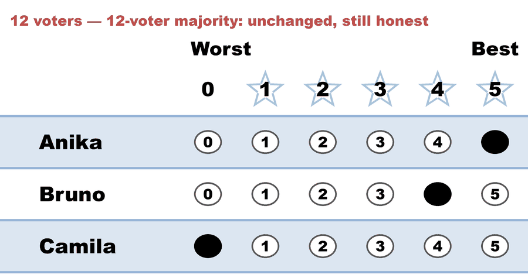
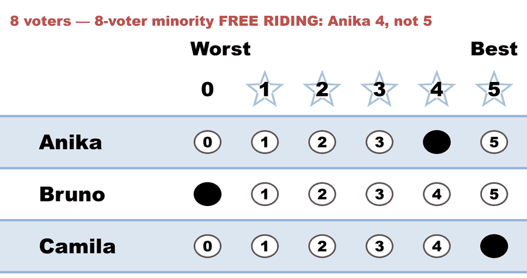

---
search:
  exclude: true
---

# Free riding — the free ride (Allocated Score)

*Generated from [`free_ride_hylland_allocated.yaml`](../free_ride_hylland_allocated.yaml) — do not edit by hand. Regenerate: `python STARVote_LH_tabulation_engine/tools_adam/scripts/build_yaml_pages.py`.*

**Method:** [Allocated Score (proportional STAR)](../../../../01_Learn/README.md) · **2 seats** · **Expected winners:** Anika, Camila

## Scenario

THE FREE RIDE. Identical to free_ride_honest_allocated.yaml except that the 8-voter minority scores Anika 4 instead of 5 — a candidate they genuinely love, and who wins either way. Anika still takes seat 1, 92 to 48. But Allocated Score spends the quota one score group at a time, highest first: the 5-star group now holds only the 12 majority ballots, which alone overfills the quota of 10, so they are charged 83.33% and keep one sixth. The 4-star group is never reached, so the free riders keep 100% of their weight. Camila takes the second seat 40 to 8. One star, withheld from a landslide winner, swung the seat.

## Ballots

The ballots as marked — the filled bubble is the score given, and the score is the number in its column:

| Ballot as marked | Anika | Bruno | Camila |
|:--|:--:|:--:|:--:|
|  | 5 | 4 | 0 |
|  | 4 | 0 | 5 |

The same ballots as the file records them:

Row 1 = candidate names; each later row is one voter's 0–5 scores (a `N ×` prefix = N identical ballots).

```text
Count:Anika,Bruno,Camila
12:5,4,0   # 12-voter majority: unchanged, still honest
8:4,0,5    # 8-voter minority FREE RIDING: Anika 4, not 5
```

## What the engine says

The count, step by step — the rounds and how the winner is reached:

<!-- --8<-- [start:report] -->
```text
--- Allocated Score Voting Method (2 winners) ---

[Allocated Score Voting]
 Tabulating 20 ballots to fill 2 seats.
Count × Anika,Bruno,Camila
   12 ×     5,    4,     0
    8 ×     4,    0,     5

[Allocated Score Voting: Round 1]
 The highest-scoring candidate wins a seat.
   Anika         -- 92 -- First place
   Bruno         -- 48
   Camila        -- 40
 Anika wins a seat.

[Allocated Score Voting: Round 1: Ballot allocation round]
 Allocating 10 ballots.

[Allocated Score Voting: Round 1: Ballot allocation round: Round 1]
 Allocating 12 ballots at score 5.
 This allocation overfills the quota.  Returning fractional surplus.
 Allocating only 83.33% of these ballots.
 Keeping these ballots, but multiplying their weights by 1/6.
 12 ballots reweighted from 1 to 1/6.

[Allocated Score Voting: Round 2]
 The highest-scoring candidate wins a seat.
   Camila        -- 40 -- First place
   Bruno         --  8
 Camila wins a seat.

[Allocated Score Voting: Winners — Allocated Score Voting Method (2 winners)]
 Anika
 Camila
```
<!-- --8<-- [end:report] -->

### Full audit — preference matrix, Condorcet, and score distribution

```text
--- Preference Matrix ---
Head-to-head / pairwise comparison
Legend: For - Equal Support - Against
        Informational only — not part of the 2-winner count below,
        so no Top-2 finalists are marked.
                 |     Anika    |    Bruno    |    Camila   |
-------------------------------------------------------------
         Anika > |     ---      |20 -  0 -  0 |12 -  0 -  8 |
         Bruno > |  0 -  0 - 20 |    ---      |12 -  0 -  8 |
        Camila > |  8 -  0 - 12 | 8 -  0 - 12 |    ---      |

[Condorcet Winner]
  Condorcet Winner: Anika — matches the STAR winner

[Condorcet Loser]
  Condorcet Loser: Camila — loses every head-to-head matchup

[Score Distribution] (how many ballots gave each star rating)
                   Score
Candidate   5   4   3   2   1   0  | Total   Avg
Anika      12   8   0   0   0   0  |    92   4.6
Bruno       0  12   0   0   0   8  |    48   2.4
Camila      8   0   0   0   0  12  |    40   2.0
 Hare quota is 10.
```

Everything in one file: the [`_tabulated` mirror](../cases_tabulated/free_ride_hylland_allocated_tabulated.txt) (regenerated on every run; every analysis forced on).

Run it yourself:

```bash
python STARVote_LH_tabulation_engine/starvote_larry_hastings.py 03_STAR_PR/03_Criteria/free_riding/cases/free_ride_hylland_allocated.yaml
```

## See also

- [Glossary](../../../../../07_Concepts/GLOSSARY.md) · [all cases by method](../../../../../07_Concepts/YAML_test_case_index/README.md)

More cases in this set: [free_ride_arms_race_allocated](free_ride_arms_race_allocated.md) · [free_ride_honest_allocated](free_ride_honest_allocated.md) · [free_ride_honest_rrv](free_ride_honest_rrv.md) · [free_ride_honest_sss](free_ride_honest_sss.md) · [free_ride_hylland_rrv](free_ride_hylland_rrv.md) · [free_ride_hylland_sss](free_ride_hylland_sss.md) · [misjudged_queue_bury](misjudged_queue_bury.md) · [misjudged_queue_honest](misjudged_queue_honest.md) · [misjudged_queue_hylland](misjudged_queue_hylland.md)
