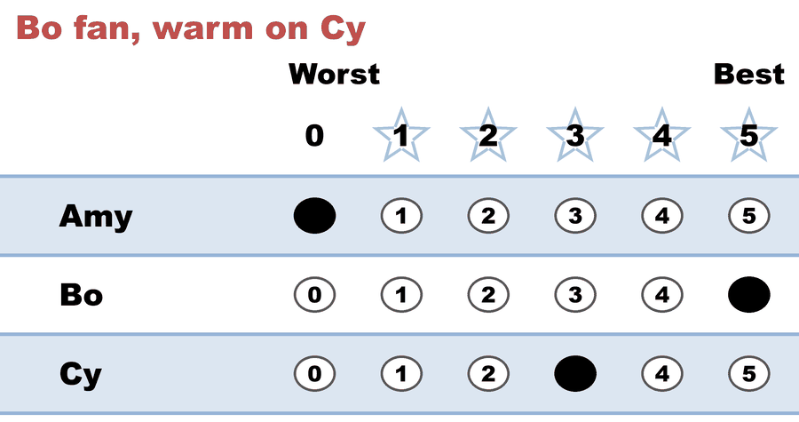
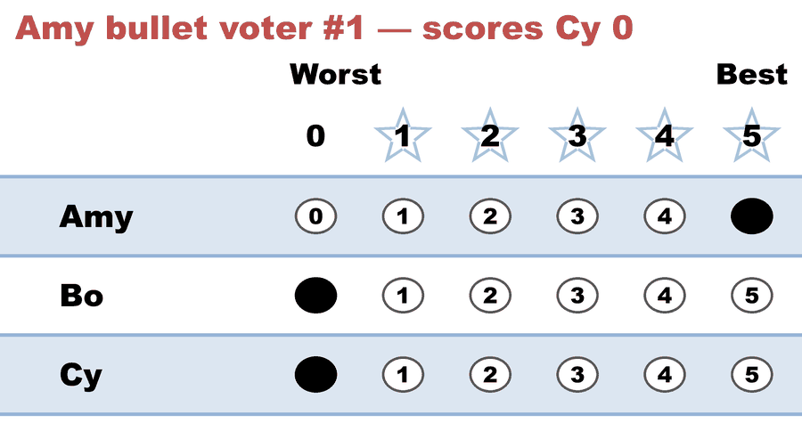
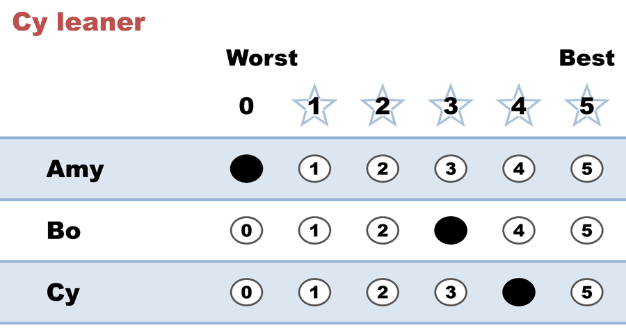
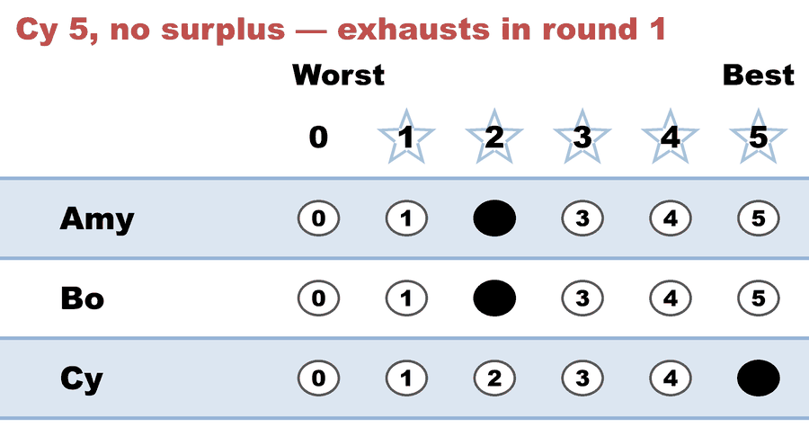
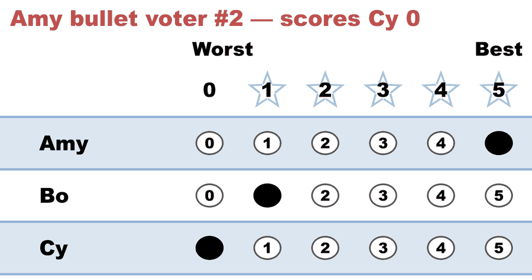
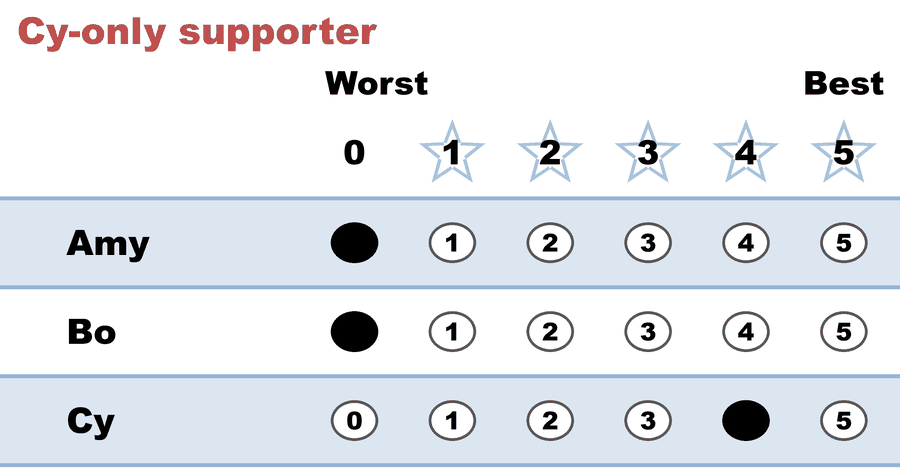
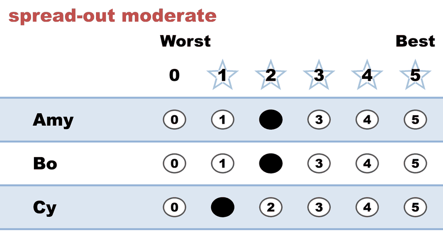

# Vote unitarity — the bullet voters who kept their stars

*Seven voters. Three candidates. Two seats. Two voters spend nothing on the first winner — and vote unitarity says those unspent stars decide the second seat.*

**Level: 301 · deep dive**

→ the method: [Sequentially Spent Score](../../01_Learn/STAR_PR/sequentially_spent_score.md) · its family: [the three STAR-PR methods](../../01_Learn/STAR_PR/README.md) · the single-winner root of the idea: [the equally weighted vote](../../../01_STAR/01_Learn/properties_and_limits/equally_weighted_vote.md)

---

## The idea

**Vote unitarity** (Keith Edmonds; [electowiki](https://electowiki.org/wiki/Vote_unitarity), an advocacy-adjacent source, but this is a mechanics question, where it is the clearest) extends the [equally weighted vote](../../../01_STAR/01_Learn/properties_and_limits/equally_weighted_vote.md) to multi-winner elections: every voter starts with the same budget of influence, and influence is spent **only in exchange for representation gained**. Elect a candidate a voter scored highly, and that voter pays; elect a candidate a voter scored **0**, and that voter pays *nothing* — their full budget carries into the next round.

[Sequentially Spent Score](../../01_Learn/STAR_PR/sequentially_spent_score.md) is the method built on that principle: each voter holds 5 stars, and each seat charges its supporters in proportion to the score they gave. The election below is the smallest known profile where the "pays nothing" half of the principle *changes who wins* — which makes it both a teaching case and, as it turned out, an engine test.

## The election

Seven voters score Amy, Bo and Cy for a two-seat committee (`voting_method: sss`). Two of them are **Amy bullet voters**: 5 stars for Amy, nothing for anyone else.

<!-- ballots:two_bullet_voters_sss -->
The ballots as marked — the filled bubble is the score given, and the score is the number in its column:

| # | Ballot as marked | Amy | Bo | Cy |
|:--:|:--|:--:|:--:|:--:|
| 1 |  | 0 | 5 | 3 |
| 2 |  | 5 | 0 | 0 |
| 3 |  | 0 | 3 | 4 |
| 4 |  | 2 | 2 | 5 |
| 5 |  | 5 | 1 | 0 |
| 6 |  | 0 | 0 | 4 |
| 7 |  | 2 | 2 | 1 |
<!-- /ballots -->

*(The cast breaks this repo's own naming advice — "Cy" is the house example of a name too short to be sturdy — because the profile is frozen: it is printed verbatim in the fork's bug report and in [upstream issue #19](https://github.com/larryhastings/starvote/issues/19), and same cast means same election.)*

## The count, round by round

**Round 1.** Cy leads the scoring, 17 against Amy's 14 and Bo's 13, and takes the first seat. The Hare score quota is 7 × 5 ÷ 2 = **17½** — and Cy's 17 falls *short* of it. No surplus to give back, so every Cy supporter pays their **full** Cy score out of their 5-star budget:

| Ballot (Amy, Bo, Cy) | Paid for Cy | Stars left |
|---|--:|--:|
| 0, 5, 3 | 3 | 2 |
| **5, 0, 0** | **0** | **5 — untouched** |
| 0, 3, 4 | 4 | 1 |
| 2, 2, 5 | 5 | 0 — **exhausted** |
| **5, 1, 0** | **0** | **5 — untouched** |
| 0, 0, 4 | 4 | 1 |
| 2, 2, 1 | 1 | 4 |

The voter who gave Cy all 5 stars is fully spent and drops out. The two bullet voters gave Cy 0, paid 0, and keep everything.

**Round 2.** Each surviving ballot's scores now count at its remaining fraction of a full budget. The two bullet voters still count at full strength, and they are worth 5 points of Amy each:

> **Amy 11⅗ — Bo 5⅕.** Amy takes the second seat. Committee: **Amy and Cy.**

That is vote unitarity doing real work. The bullet voters declined to help elect Cy, so the method did not charge them for Cy — and their preserved budget is exactly what carries Amy past Bo, whose support came mostly from voters already partly spent on the first winner.

<!-- report:two_bullet_voters_sss -->
```text
[Divergence from STAR]
  STAR                   = Cy
  Choose-One (Plurality) = Amy   (differs from STAR)

--- Sequentially Spent Score Voting Method (2 winners) ---

[Sequentially Spent Score]
 Tabulating 7 ballots to fill 2 seats.
Amy,Bo,Cy
  0, 5, 3
  5, 0, 0
  0, 3, 4
  2, 2, 5
  5, 1, 0
  0, 0, 4
  2, 2, 1

[Sequentially Spent Score: Round 1]
 The highest-scoring candidate wins a seat.
   Cy            -- 17 -- First place
   Amy           -- 14
   Bo            -- 13
 Cy wins a seat.

[Sequentially Spent Score: Round 1: Ballot allocation round]
 Total score is 17, Hare score quota is 17+1/2, no surplus to give back.
 Reducing each ballot's stars by their vote.
 Allocated 1 ballot.
 Reweighted 4 ballots:
    2 ballots voted 4, stars reduced from 5 to 1, reweighted to 1/5.
    1 ballot voted 3, stars reduced from 5 to 2, reweighted to 2/5.
    1 ballot voted 1, stars reduced from 5 to 4, reweighted to 4/5.

[Sequentially Spent Score: Round 2]
 The highest-scoring candidate wins a seat.
   Amy           -- 11+3/5 -- First place
   Bo            --  5+1/5
 Amy wins a seat.

[Sequentially Spent Score: Winners — Sequentially Spent Score Voting Method (2 winners)]
 Amy
 Cy
```
<!-- /report -->

## The engine bug this election caught

This profile is not just a classroom example — it is the reproduction case for a real tabulation defect, found in the 2026-08-08 STAR-PR sprint census and documented in [`BUG_sss_zero_score_ballots.md`](../../../STARVote_LH_tabulation_engine/BUG_sss_zero_score_ballots.md) (filed upstream as [larryhastings/starvote#19](https://github.com/larryhastings/starvote/issues/19), fixed in this fork 2026-08-09).

The defect: in any SSS round where at least one supporter exhausts, the engine rebuilt its remaining-ballots list from *supporters only* — so every ballot that scored the winner **0** was silently discarded **with its full unspent budget**. On this profile, the exhausting `2, 2, 5` ballot triggers the rebuild, the two bullet voters vanish, and round 2 becomes Bo 4⅕ against Amy's leftover 1⅗: the buggy committee is **Bo and Cy**. Two voters lose their say for the crime of not supporting a winner — the precise thing vote unitarity forbids. In census sampling the discard flipped the committee in ~1.4% of tie-free random 2-seat profiles: rare, systematic, and biased *against* the blocs SSS exists to protect into later rounds.

The fork now counts this file correctly, and [`tests/test_sss_zero_score_ballots.py`](../../../STARVote_LH_tabulation_engine/tests/test_sss_zero_score_ballots.py) pins the profile at every verbosity so the fix cannot regress. A method's defining principle, stated as a runnable election: if an engine ever elects Bo here, it is not counting SSS.

## Run it yourself

```bash
.venv/bin/python STARVote_LH_tabulation_engine/starvote_larry_hastings.py 03_STAR_PR/03_Criteria/vote_unitarity/cases/two_bullet_voters_sss.yaml
```

| Case | Seats | Elects | File |
|---|--:|---|---|
| Two bullet voters | 2 | **Amy, Cy** | [page](cases/cases_pages/two_bullet_voters_sss.md) · [yaml](cases/two_bullet_voters_sss.yaml) |

## See also

- [Sequentially Spent Score](../../01_Learn/STAR_PR/sequentially_spent_score.md) — the method this criterion motivates, with its honest standing
- [The equally weighted vote](../../../01_STAR/01_Learn/properties_and_limits/equally_weighted_vote.md) — the single-winner principle vote unitarity extends
- [The Alabama paradox in Proportional STAR](../alabama_paradox/README.md) — the *other* structural property of quota methods demonstrated in this folder
- [When the STAR-PR methods disagree](../../02_Examples/method_divergences/README.md) — how SSS's proportional spending separates it from Allocated Score and RRV
- [`BUG_sss_zero_score_ballots.md`](../../../STARVote_LH_tabulation_engine/BUG_sss_zero_score_ballots.md) — the full defect write-up: hand-trace, census rates, upstream interplay
