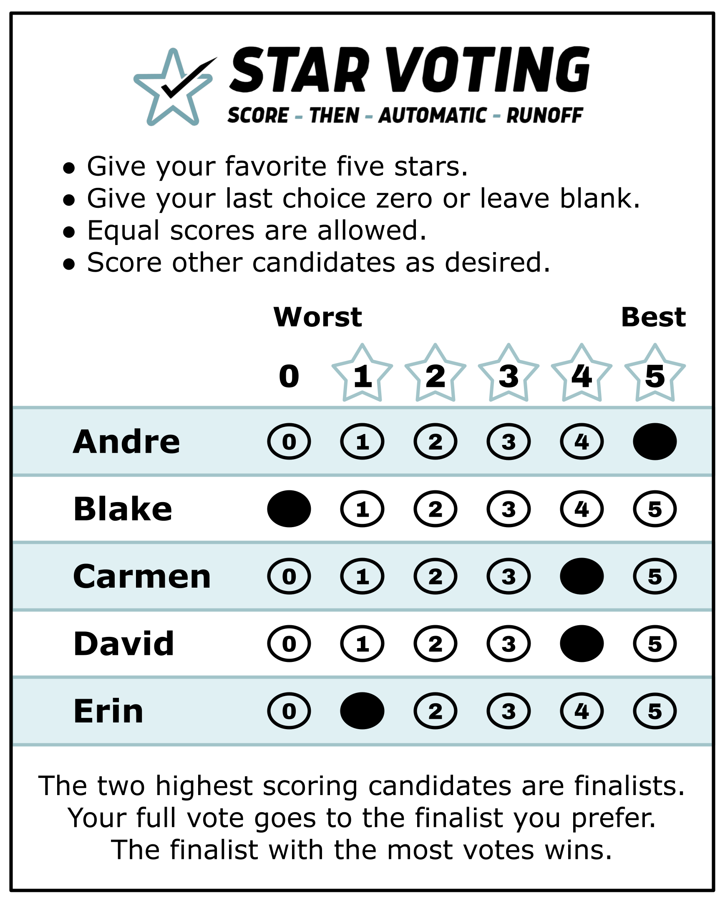

# 03_STAR_PR — proportional STAR (multi-winner)

*The same 0–5 ballot as single-winner STAR. Nothing changes for the voter — only the count changes, so that seats reflect the electorate's proportions.*

*The ballot ([Equal Vote](https://www.equal.vote/star)) — this is the single-winner STAR ballot, reproduced unchanged, because that is exactly the point: proportional STAR asks nothing new of the voter. Everything that makes it proportional happens after the ballots are in. The same paper counted majoritarian instead: [Bloc STAR](../02_STAR_Bloc/README.md).*

The same 0–5 score ballot, counted so that seats reflect the electorate's *proportions* instead of handing every seat to the largest bloc. Three tabulations are represented here, all runnable on the same ballot files by switching `voting_method:`:

**New to multi-winner?** The concept pages for this method live in [`01_Learn/`](01_Learn/README.md) — start with [Proportional Representation](01_Learn/README.md) for the majoritarian-vs-proportional fork, then [the math behind proportional STAR](01_Learn/STAR_PR/the_math_behind_proportional_star.md). Everything below is the **runnable examples**.

| `voting_method` | Counts as |
|---|---|
| `sss` | Sequentially Spent Score — each voter has a budget of "stars" that elected candidates spend |
| `allocated` | Allocated Score — each winner "uses up" a quota of their strongest supporters |
| `rrv` | Reweighted Range Voting — ballots that already elected someone are down-weighted |

Cases live in [`02_Examples/`](02_Examples/README.md) (the `02a/02b/02c` trio counts the SAME 63-ballot election three ways). Majoritarian multi-winner: [Bloc STAR](../02_STAR_Bloc/README.md). STV, the proportional method for *ranked* ballots, lives in [06_Other](../06_Other/README.md).

**Conversation scripts:** the Larry ↔ Adam STAR series is indexed in [Conversation scripts — index](../07_Concepts/about_this_repo/conversation_scripts.md).

# file: README.md
