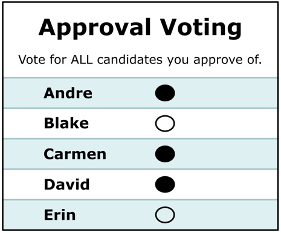
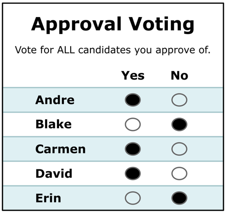

# Approval Voting

*The simplest equal-vote upgrade to Choose-One: mark **every** candidate you approve (**1**) and leave the rest (**0**); the most-approved candidate wins. It's Score voting at **one-bit resolution** — a big jump in expressiveness over "vote for one," for almost no added ballot complexity.*

→ **Run it / examples:** the 101 case in [the Approval examples](../) ([`approval_101_c3_b5.yaml`](../02_Examples/cases/approval_101_c3_b5.yaml)) · the same five voters counted by Approval vs STAR vs RCV-IRV vs Score in [the Black Curtain set](../../method_comparisons/black_curtain/) (Approval flips the winner in election 1). · Companions: [honest limits](approval_honest_limits.md) · [in the theory literature](approval_in_the_literature.md) · [multi-winner Approval](Multiwinner_Approval/approval_multiwinner.md) · [Approval + Top-Two](approval_top_two.md) · Curriculum: [301.4](../../07_Concepts/CURRICULUM.md).

---

**Approval Voting** hands every voter a checklist instead of a single choice. You approve as many candidates as you like — one, three, all of them — and each approval is worth one point. Add up the checkmarks; **whoever has the most wins.** No ranking, no scores, no runoff: a normal ballot with the "vote for only one" restriction removed.

It has no single inventor: Brams and Fishburn credit **five groups who arrived at the idea independently in the 1970s** — which is itself a hint that it's a natural rule to land on. How the academic literature argues about it (and what a checkmark is even taken to *mean*) is a page of its own: [Approval in the theory literature](approval_in_the_literature.md).

## The ballot



A standard Approval ballot (mockups from the [Equal Vote Approval page](https://www.equal.vote/approval)): one bubble per candidate, mark everyone you approve. It can look identical to a traditional ballot — only the "vote for one" instruction changes.



The **Yes / No ("double bubble") variant**: every candidate gets an explicit Yes and No bubble, so a blank is distinguishable from a deliberate "No." This is the ballot-security hardening discussed in [honest limits §6](approval_honest_limits.md) — with single bubbles, filling in *extra* bubbles on someone else's ballot would be undetectable.

That one change fixes Choose-One's core failure. Under Choose-One, approving your sincere favorite (a long shot) *costs* you a vote against the front-runner you'd settle for — the **spoiler / vote-splitting** trap. Under Approval you simply approve **both** your favorite and the acceptable compromise, so supporting a new candidate never splits your own side.

## The one decision Approval asks of you

Because the ballot is binary, Approval forces exactly one genuinely hard call: **where to draw the approval line.** Approve too few and you can't help a compromise; approve too many and you help a rival beat your favorite. That threshold — and the fact that a checkmark can't say *how much* you approve — is Approval's central limitation, explored in [honest limits](approval_honest_limits.md).

## Approval is Score at 1-bit resolution

An Approval ballot is just a **Score (0–5) ballot restricted to the two ends**, `{0, max}`. That's the whole relationship: Approval keeps *who* you'd accept and throws away *how much* and *in what order*. It's also why approval-style `0/1` marks are perfectly legal on a STAR ballot — see [`star_ala_approval.yaml`](../../01_STAR/02_Examples/cases/star_ala_approval.yaml). STAR keeps the full 0–5 scale and adds the automatic runoff precisely to recover the intensity and threshold information Approval discards (the [fidelity ladder](../../07_Concepts/scores_and_ranks/fidelity_ladder.md); [scores vs. ranks](../../07_Concepts/scores_and_ranks/scores_vs_ranks.md)).

## Reading an Approval result

Take the [`approval_101` example](../02_Examples/cases/cases_pages/approval_101_c3_b5.md) — 5 voters, candidates Ann/Bob/Cal. Every ballot, as the voter marked the paper and as the count reads it:

<!-- ballots:approval_101_c3_b5 -->
The ballots as marked — a filled **Yes** is a `1` in that candidate's column, a filled **No** a `0`:

| Ballot as marked | Ann | Bob | Cal |
|:--|:--:|:--:|:--:|
|  | 1 | 1 | 0 |
|  | 0 | 1 | 1 |
|  | 1 | 1 | 0 |
|  | 0 | 1 | 0 |
|  | 1 | 0 | 1 |
<!-- /ballots -->

An approval count is then more than "who got the most marks." Three numbers tell the story:

```text
   Bob -- 4 (80%) -- Elected
   Ann -- 3 (60%)
   Cal -- 2 (40%)

[Approval Distribution] (how many candidates each ballot approved)
   9 approvals across 5 ballots — average 1.8 of 3 (range 1–2).
     approved 1: 1 ballot
     approved 2: 4 ballots

[Co-Approval Matrix]
 Of the voters who approved the ROW candidate, the % who ALSO approved the COLUMN candidate.
        |  Bob   |  Ann   |  Cal   |
   Bob  |   --   |  50%   |  25%   |
   Ann  |  67%   |   --   |  33%   |
   Cal  |  50%   |  50%   |   --   |
```

- **Count and share.** Each candidate's approvals, and that as a **percentage of ballots** (Bob 4/5 = 80%). The share is the honest headline — "80% of voters approve Bob," not a share of some contested denominator.
- **The approval distribution — the strategy signal.** How many candidates *each ballot* approved. If most voters **bullet-voted** (approved exactly one), the electorate is behaving like Choose-One and the "approve as many as you like" freedom went unused; a healthy spread (here, an average of 1.8 of 3) means voters actually expressed acceptance of more than one option. This is the approval analogue of STAR's [score distribution](../../01_STAR/01_Learn/the_count/STAR_Scoring_Round.md).
- **The co-approval matrix — the coalitions.** Of the voters who approved A, what fraction *also* approved B. It exposes structure the totals hide: blocs that move together, and "bridge" candidates approved across camps. (Ann's approvers back Bob 67% of the time; Cal's split evenly.) It's the approval analogue of STAR's [preference matrix](../../01_STAR/01_Learn/the_count/STAR_Automatic_Runoff.md) — coalition shape, not just a winner.

The share and distribution print on every result; the co-approval matrix is opt-in on screen (`options: { show_matrix: true }`) and always in the full [`_tabulated`](../02_Examples/cases/cases_tabulated/approval_101_c3_b5_tabulated.txt) mirror. For a **visual** version of exactly these statistics — bar charts, an approval-distribution histogram, and a co-approval correlation table — the [Center for Election Science's polling tool](https://vote.electionscience.org/) renders them live (an Approval-advocacy site; the numbers are the numbers).

## How it compares

| | **Choose-One** | **Approval** | **STAR** |
|---|---|---|---|
| Ballot | pick **one** | approve **any number** (0/1) | score each **0–5** |
| Approve favorite **and** compromise? | ❌ | ✅ | ✅ |
| Preference **strength**? | ❌ | ❌ | ✅ |
| **Order** among the ones you like? | ❌ | ❌ | ✅ |
| Spoiler / vote-splitting resistant? | ❌ | ✅ largely | ✅ |
| Forces a "where's my line?" decision? | — | ⚠️ **yes** | no (score each on its own) |
| Precinct-**summable**? | ✅ | ✅ | ✅ |

## Where it fits

Approval sits one rung above Choose-One in the equal-vote family, and it passes the [Equal Vote / balance test](../../01_STAR/01_Learn/properties_and_limits/equally_weighted_vote.md) (every ballot has an exact opposite that cancels it). Its virtue is **simplicity** — zero ballot redesign, trivial hand count — which makes it a strong first step for an organization leaving plurality behind. Its ceiling is the binary ballot: where a group wants to express *how strongly* or *in what order* it prefers candidates, **STAR** is the fuller expression of the same idea. The [Black Curtain](../../method_comparisons/black_curtain/) set makes the trade-off concrete: on identical ballots, Approval elects the broadly-approved consensus candidate while STAR's runoff hands the seat to the majority's favorite — same voters, different question.

## Practical strengths (beyond the ballot)

Several of Approval's advantages are logistical rather than mathematical — they're what make it the *cheapest* reform to actually adopt (the [Equal Vote Coalition's Approval page](https://www.equal.vote/approval) makes this case at length):

- **Nothing to spoil.** There is essentially no way to mis-mark an Approval ballot: no overvotes, no invalid rankings, no skipped-rank rules. Every combination of marks is a valid ballot.
- **Works with existing infrastructure.** An Approval ballot can look identical to a traditional one, is tallied the same way (add the votes), and is precinct-summable — so it's highly compatible with existing election codes and equipment. RCV-IRV, by contrast, often requires new equipment, central tabulation, or statutory changes.
- **Campaign incentives.** Because candidates benefit from being *acceptable* to rivals' supporters, Approval rewards consensus-seeking and positive campaigning over base-only polarization.
- **Pairs well with a top-two general.** An Approval primary feeding a top-two general election is a minimal-change package that yields notably representative results — the package St. Louis adopted in 2020, and the direct ancestor of STAR. Full page: [Approval + Top-Two](approval_top_two.md).
- **Scales to multiple seats.** The same ballot handles multi-winner races (bloc counting) and can be adapted for proportional representation — see [multi-winner Approval](Multiwinner_Approval/approval_multiwinner.md).

## Where it has actually been used

Approval's record is longer and stranger than the reform-campaign framing suggests, and it cuts both ways. The history and the adoption list below are as [Wikipedia's Approval voting article](https://en.wikipedia.org/wiki/Approval_voting) records them — the neutral tier, deliberately, since this is where an advocacy source would be weakest.

**Before anyone named it.** Papal conclaves used a form of it from **1294 to 1621**; the Republic of **Venice** built approval rounds into the Doge's famously baroque election from the 13th to the 18th century; **Greece** elected legislators by approval from **1864 to 1923** before switching to party-list PR. The UN Security Council still selects a Secretary-General by approve/disapprove straw polls. So the "five independent groups in the 1970s" above rediscovered a rule several republics had already worn in.

**Modern jurisdictions — and a reversal.** **Fargo, North Dakota** adopted approval by ballot initiative in **2018**, the first US city to do so; **St. Louis** passed Proposition D with **70%** in November 2020, adopting the [Approval + Top-Two](approval_top_two.md) unified primary. Then, in **April 2025**, North Dakota's governor signed a bill banning both ranked-choice and approval voting statewide, **ending the practice in Fargo**. **Latvia's** parliament uses a modified approval within open-list PR, where a voter may cast a positive vote, a negative vote, or neither on any number of candidates.

**Organizations.** The Mathematical Association of America (1986), the American Mathematical Society, the American Statistical Association (1987) and the IEEE (1987–2002) all ran internal elections by approval; so do the Libertarian National Committee, several state Green parties and the Czech and German Pirate parties. Two of these are worth remembering *because* they ended: Dartmouth's Alumni Association dropped approval for traditional runoffs in **2009** by an alumni vote of **82% to 18%**, and the Independent Party of Oregon's **2016** presidential preference primary failed to identify a nominee at all — no candidate cleared **32%** approval. A method's adoption list is only half the evidence; its repeal list is the other half, and [honest limits](approval_honest_limits.md) picks these two up.

## The stepping-stone argument

Equal Vote's case for Approval is worth stating in its own terms: for a jurisdiction on Choose-One (or a Choose-One primary + top-two runoff), there is little reason *not* to switch to Approval immediately — the logistical change is near zero and the improvement is real. In their assessment, with expected voter behavior Approval also outperforms RCV-IRV at electing representative winners, especially in large or competitive fields. And because Approval is transparent about what it does and doesn't offer (no strength, no order — see [honest limits](approval_honest_limits.md)), voters who live with it learn firsthand that vote-splitting isn't a necessary evil — which builds the appetite to upgrade to a fuller method like STAR later. A good stepping stone is easy to reach, stable in its own right, and on the way to the next step. The counterpoint, which Equal Vote also concedes: education-and-adoption work is expensive even for Approval, so in many places going *directly* to STAR is the quicker path. Either way, the urgent step is off Choose-One.

## See also

- [Approval — Honest Limits](approval_honest_limits.md) — the critique companion
- [Approval in the theory literature](approval_in_the_literature.md) — the arguments and criticisms as the academic surveys state them, the three readings of "approve," and *Approval = Borda = Condorcet* on dichotomous preferences
- [Approval + Top-Two](approval_top_two.md) — the two-round package (St. Louis; Oregon's Unified Primary) and why its runoff can't be automatic — the gap STAR closes
- [Approval — Multi-Winner](Multiwinner_Approval/approval_multiwinner.md) — bloc counting, SPAV/PAV
- [the Approval examples](../) — the method's example folder
- [Criteria at a glance](../../07_Concepts/topics/criteria_at_a_glance.md) — Approval's pass/fail row beside STAR, Ranked Robin and RCV-IRV, each ✗ linked to a runnable failure (read its caveat first)
- [Approval voting — Wikipedia](https://en.wikipedia.org/wiki/Approval_voting) — the neutral reference: pre-modern history, the full adoption *and repeal* list, and the criteria table this repo cross-checks against. Cited here rather than a campaign page precisely because adoption records and criteria claims are where an advocacy source is weakest
- [Equal Vote: Approval Voting](https://www.equal.vote/approval) — advantages/disadvantages and the stepping-stone case
- [Divided We Fall — "Can STAR and Approval Voting Fix Our Elections?"](https://dividedwefall.org/star-and-approval-voting/) — a joint STAR + Approval essay (authors lead STAR Voting Action and Utah Approves — advocacy lean disclosed); cites the 2021 St. Louis Approval primary
- [Black Curtain](../../method_comparisons/black_curtain/) — Approval vs STAR vs RCV-IRV vs Score
- [The fidelity ladder](../../07_Concepts/scores_and_ranks/fidelity_ladder.md) · [scores vs. ranks](../../07_Concepts/scores_and_ranks/scores_vs_ranks.md)
- Glossary: **Approval voting** — [Glossary — voting methods & criteria](../../07_Concepts/GLOSSARY.md)

# file: approval_voting.md
