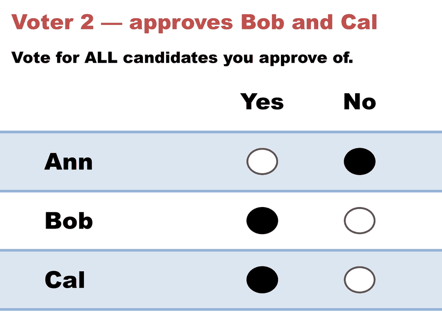
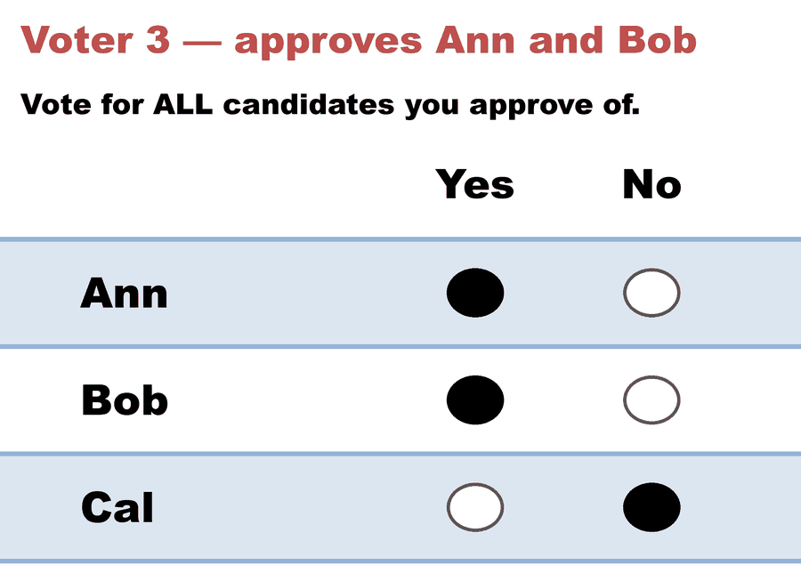
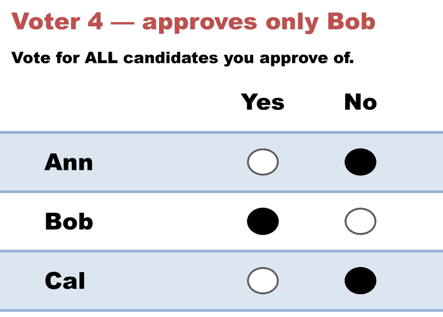
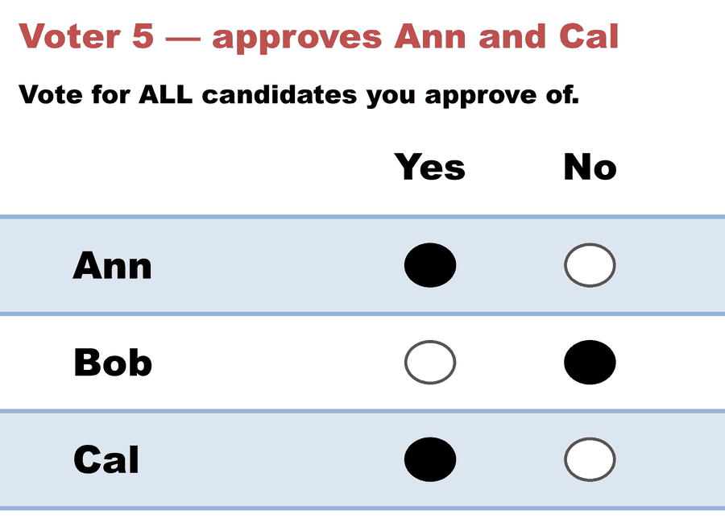

---
search:
  exclude: true
---

# Approval 101 — most approvals wins

*Generated from [`approval_101_c3_b5.yaml`](../approval_101_c3_b5.yaml) — do not edit by hand. Regenerate: `python STARVote_LH_tabulation_engine/tools_adam/scripts/build_yaml_pages.py`.*

**Method:** [Approval Voting](../../../01_Learn/README.md) · **1 seat** · **Expected winner:** Bob

**▶ Live on BetterVoting:** [vote](https://bettervoting.com/ff6mk3) · **[results ↗](https://bettervoting.com/ff6mk3/results)** (election `ff6mk3` · test `BV135`).

## Scenario

The simplest Approval election: each voter marks 1 (approve) or 0 for every
candidate, and the most-approved candidate wins. Five voters, three
candidates. Bob is nobody's only choice, but four of five voters approve
him — the broadest support in the field.
This is BetterVoting test BV135, a REAL election: ff6mk3.
Live results: https://bettervoting.com/ff6mk3/results
BetterVoting agrees exactly — Bob 4, Ann 3, Cal 2, no tie.
Frozen export: approval_101_c3_b5_bv_export.json.

More Approval cases: method_comparisons/BV_Library (a real BetterVoting
approval election) and method_comparisons/black_curtain (the same five
voters counted by Approval vs STAR vs RCV-IRV).

## Ballots

The ballots as marked — a filled **Yes** is a `1` in that candidate's column, a filled **No** a `0`:

| # | Ballot as marked | Ann | Bob | Cal |
|:--:|:--|:--:|:--:|:--:|
| 1 |  | 1 | 1 | 0 |
| 2 |  | 0 | 1 | 1 |
| 3 |  | 1 | 1 | 0 |
| 4 |  | 0 | 1 | 0 |
| 5 |  | 1 | 0 | 1 |

The same ballots as the file records them:

Row 1 = candidate names; each later row is one voter's approvals (`1` = approve, `0`/blank = not approved).

```text
Ann,Bob,Cal
1,1,0   # Voter 1 — approves Ann and Bob
0,1,1   # Voter 2 — approves Bob and Cal
1,1,0   # Voter 3 — approves Ann and Bob
0,1,0   # Voter 4 — approves only Bob
1,0,1   # Voter 5 — approves Ann and Cal
```

## What the engine says

Full report from the [`_tabulated` mirror](../cases_tabulated/approval_101_c3_b5_tabulated.txt) (regenerated on every run; every analysis forced on):

<!-- --8<-- [start:report] -->
```text
--- Approval Voting (single winner) ---
 Tabulating 5 ballots (any non-zero score = approval).

Ballots:
   columns = Ann, Bob, Cal      (1 = approve; 0 = not approved)
     2 × 1,1,0
     1 × 0,1,1
     1 × 0,1,0
     1 × 1,0,1

   Bob -- 4 (80%) -- Elected
   Ann -- 3 (60%)
   Cal -- 2 (40%)

[Approval Distribution] (how many candidates each ballot approved)
   9 approvals across 5 ballots — average 1.8 of 3 (range 1–2).
     approved 1: 1 ballot
     approved 2: 4 ballots

[Co-Approval Matrix]
 Of the voters who approved the ROW candidate, the % who ALSO approved the COLUMN candidate.
        |  Bob   |  Ann   |  Cal   |
   ---------------------------------
   Bob  |   --   |  50%   |  25%   |
   Ann  |  67%   |   --   |  33%   |
   Cal  |  50%   |  50%   |   --   |

Winner — Approval Voting (single winner)
  Bob
```
<!-- --8<-- [end:report] -->

Run it yourself:

```bash
python STARVote_LH_tabulation_engine/starvote_larry_hastings.py 04_Approval/02_Examples/cases/approval_101_c3_b5.yaml
```

## See also

- [Ties & tie-breaking (topic hub)](../../../../07_Concepts/topics/ties/README.md)
- [The Black Curtain (worked set)](../../../../method_comparisons/black_curtain/README.md)
- [Glossary](../../../../07_Concepts/GLOSSARY.md) · [all cases by method](../../../../07_Concepts/YAML_test_case_index/README.md)
