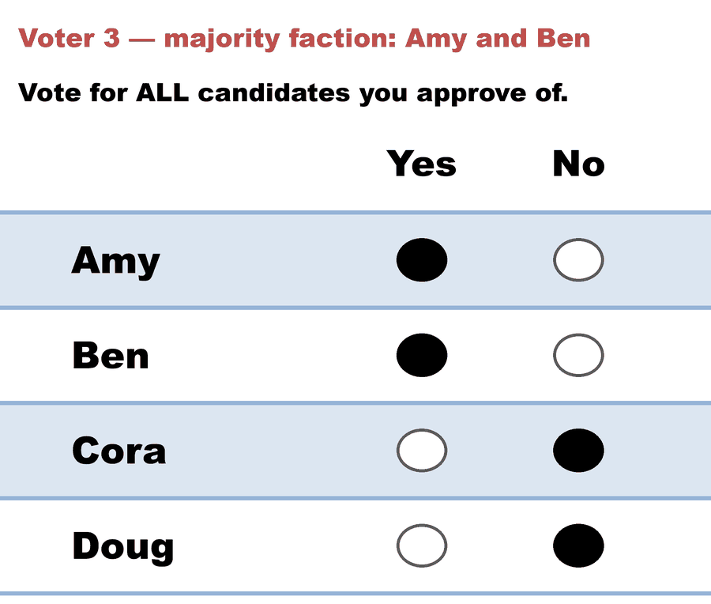
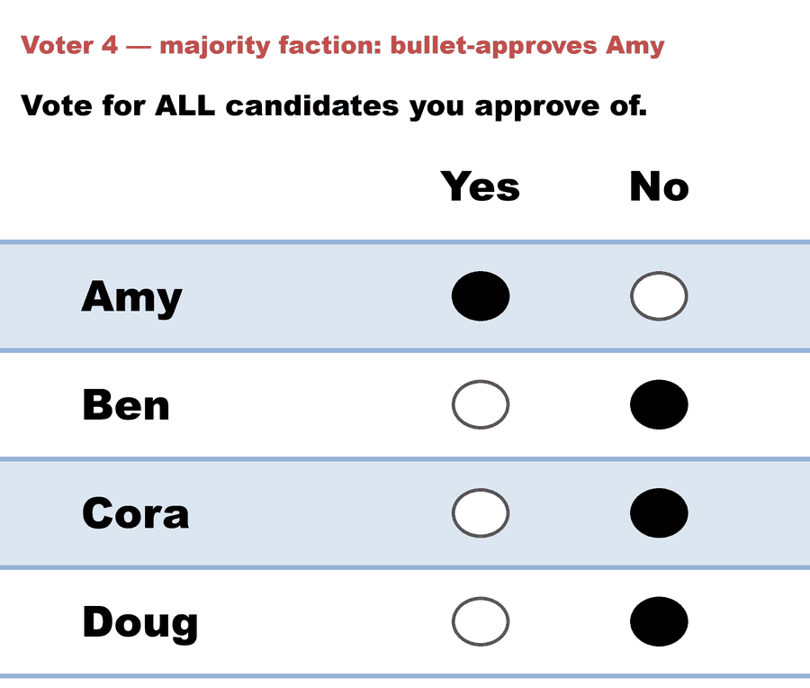
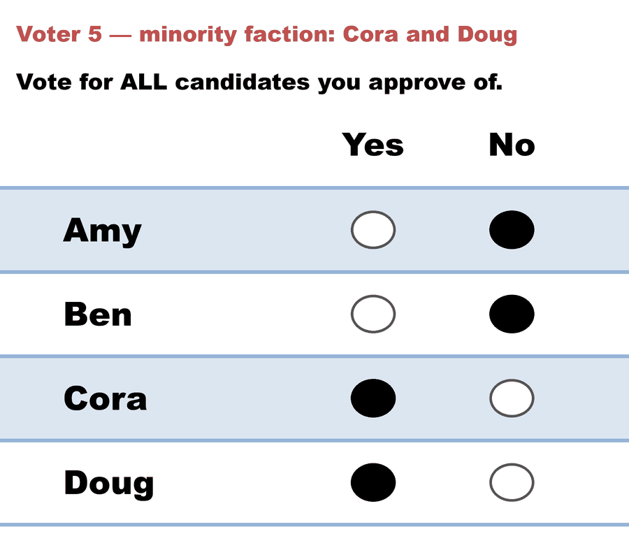
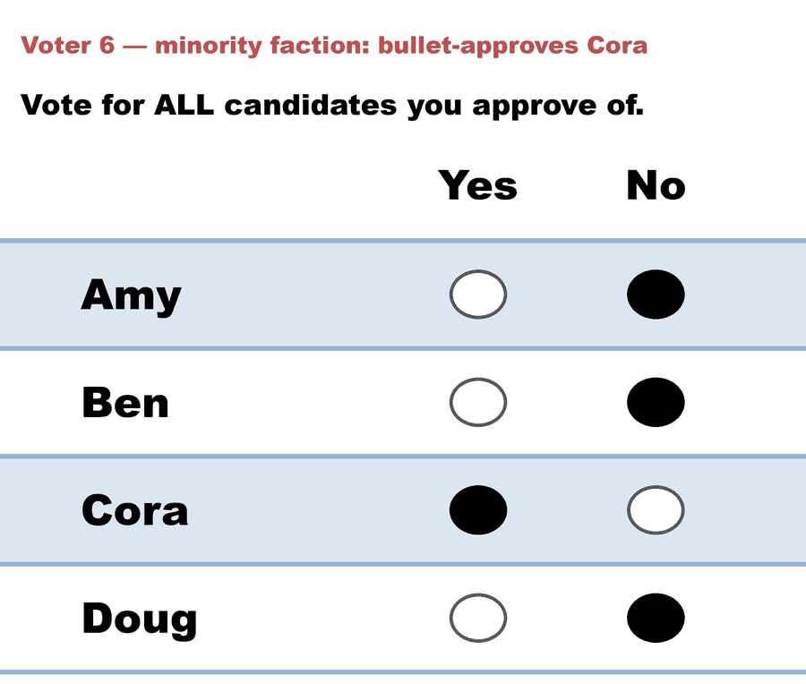

# 04_Approval / multiwinner — Bloc Approval

Multi-winner Approval with the same 0/1 ballot: the `num_winners` most-approved candidates win (bloc / at-large counting). Declared as `voting_method: Approval_Multi_Winner` with `num_winners: ≥ 2`. Ballot mockup: [3-seat council ballot](../../01_Learn/img/approval_ballot_multiwinner_3seats.png).

Five cases, in teaching order — the last two swap the counting rule instead of the ballot, and are the runnable half of [Satisfaction Approval Voting](../../01_Learn/Multiwinner_Approval/satisfaction_approval_voting.md):

1. [`approval_bloc_3seats_c6_b5.yaml`](cases/approval_bloc_3seats_c6_b5.yaml) — the plain mechanics: 3-seat council, six candidates, five voters; sum the columns, top three win (Adams, Brown, Clark). Matches the ballot mockup.
2. [`approval_bloc_2seats_c4_b6.yaml`](cases/approval_bloc_2seats_c4_b6.yaml) — the majority sweep + priority tie-break (below).
3. [`approval_bloc_4seats_c7_b12_lackner_skowron.yaml`](cases/approval_bloc_4seats_c7_b12_lackner_skowron.yaml) — the running example from Lackner & Skowron's *Multi-Winner Voting with Approval Preferences* ([open access](https://doi.org/10.1007/978-3-031-09016-5)): AV ties {A,B,C,D} with {A,B,C,F}; PAV elects {A,B,C,F} outright — the committee that leaves fewer voters wholly unrepresented. **Its "shadow STAR" companion** runs the same profile through the STAR family (Bloc STAR / Allocated Score / SSS all seat D; only **RRV** recovers F, matching PAV): [Lackner & Skowron — approval and its shadow STAR](lackner_skowron_shadow_star.md). **Live on BetterVoting (BV27):** [`jt6r76` results ↗](https://bettervoting.com/jt6r76/results) — BV's Approval engine seats **A,B,C,F** (its random draw broke the D/F tie for F, and it *correctly flags* `tieBreakType: random`): [BV27 two-view case](bv27_jt6r76_lackner_approval_committee.md).

4. [SAV vs AV — disjoint committees](bv2271_4hfwqd_sav_disjoint.md) ([`.yaml`](cases/approval_sav_disjoint_c4_b10_brams_kilgour.yaml)) — Brams & Kilgour's own example (Proposition 2): ten voters, four candidates, two seats. **AV** elects `{Ada, Ben}`, **SAV** elects `{Cleo, Dev}` — *no candidate in common*, from identical ballots. The four slate voters' marks were worth a whole vote each to AV and half a vote each to SAV. PAV splits the difference (one seat from each side, four-way tied), which is the proportional answer for a 40% bloc holding two seats. **Live on BetterVoting (BV2271):** [`4hfwqd` results ↗](https://bettervoting.com/4hfwqd/results) — Approval, STAR and Ranked Robin races on the same ten voters, and all three elect Ada and Ben.
5. [SAV covers everyone AV leaves out](bv2272_dr6fmg_sav_coverage.md) ([`.yaml`](cases/approval_sav_covers_everyone_c3_b17_brams_kilgour.yaml)) — the same paper's Proposition 5: seventeen voters, three candidates, two seats. AV seats the two most-approved and strands the three Cole-only voters; **SAV seats the smallest pair that represents all seventeen**. The most-approved candidate of all wins no seat — every one of their supporters already has a second choice in the committee. Here **PAV agrees with SAV** but *sequential* PAV does not. **Live on BetterVoting (BV2272):** [`dr6fmg` results ↗](https://bettervoting.com/dr6fmg/results) — again Approval, STAR and Ranked Robin, and again all three land on Ash and Bree.

The flagship case, [`approval_bloc_2seats_c4_b6.yaml`](cases/approval_bloc_2seats_c4_b6.yaml), teaches the one thing that matters about bloc counting: it is **majoritarian**. Six voters, four candidates, two seats — a 4-voter majority (all approve Amy, two also Ben) takes **both** seats; the 2-voter minority behind Cora and Doug gets nothing. Bonus lesson: Ben and Cora tie 2–2 for the last seat, and the engine's tie note shows candidate priority order breaking it for Ben:

The six ballots, as marked and as counted — note that the same Yes/No paper fills two seats as easily as one; only the count changes:

<!-- ballots:approval_bloc_2seats_c4_b6 -->
The ballots as marked — a filled **Yes** is a `1` in that candidate's column, a filled **No** a `0`:

| Ballot as marked | Amy | Ben | Cora | Doug |
|:--|:--:|:--:|:--:|:--:|
|  | 1 | 0 | 0 | 0 |
|  | 1 | 1 | 0 | 0 |
|  | 1 | 1 | 0 | 0 |
|  | 1 | 0 | 0 | 0 |
|  | 0 | 0 | 1 | 1 |
|  | 0 | 0 | 1 | 0 |
<!-- /ballots -->

<!-- report:approval_bloc_2seats_c4_b6 -->
```text
--- Approval Voting (2 winners) ---
 Tabulating 6 ballots (any non-zero score = approval).

Ballots:
   columns = Amy, Ben, Cora, Doug      (1 = approve; 0 / blank / marker = not approved)
     2 × 1,0,0,0
     2 × 1,1,0,0
     1 × 0,0,1,1
     1 × 0,0,1,0

   Amy  -- 4 (67%) -- Elected
   Ben  -- 2 (33%) -- Elected
   Cora -- 2 (33%)
   Doug -- 1 (17%)
  Note: Ben, Cora each have 2 approvals and tie for the last 1 seat.
        Candidate priority order (Ben > Cora) broke the tie: Ben elected, Cora not elected.

[Approval Distribution] (how many candidates each ballot approved)
   9 approvals across 6 ballots — average 1.5 of 4 (range 1–2).
     approved 1: 3 ballots
     approved 2: 3 ballots

[Co-Approval Matrix]
 Of the voters who approved the ROW candidate, the % who ALSO approved the COLUMN candidate.
         |  Amy   |  Ben   |  Cora  |  Doug  |
   -------------------------------------------
   Amy   |   --   |  50%   |   0%   |   0%   |
   Ben   |  100%  |   --   |   0%   |   0%   |
   Cora  |   0%   |   0%   |   --   |  50%   |
   Doug  |   0%   |   0%   |  100%  |   --   |

Winners — Approval Voting (2 winners)
  Amy, Ben
```
<!-- /report -->
Run it yourself:

```bash
python STARVote_LH_tabulation_engine/starvote_larry_hastings.py 04_Approval/02_Examples/multiwinner/cases/approval_bloc_2seats_c4_b6.yaml
```

The **proportional** Approval rules (SPAV, PAV, seq-Phragmén) run on the same file via the [`abcvoting` engine](../../../06_Other/abcvoting_tabulation_engine/) — all of them break the sweep and give the minority its seat (Amy + Cora):

```bash
pip install abcvoting   # once
python 06_Other/abcvoting_tabulation_engine/abc_tabulation.py 04_Approval/02_Examples/multiwinner/cases/approval_bloc_2seats_c4_b6.yaml
```

Same trade-off, score-ballot edition: Bloc STAR sweeps too ([Bloc STAR](../../../02_STAR_Bloc/)); the proportional STAR methods fix it ([proportional STAR](../../../03_STAR_PR/)). Concepts: [Approval — Multi-Winner](../../01_Learn/Multiwinner_Approval/approval_multiwinner.md).

# file: README.md
