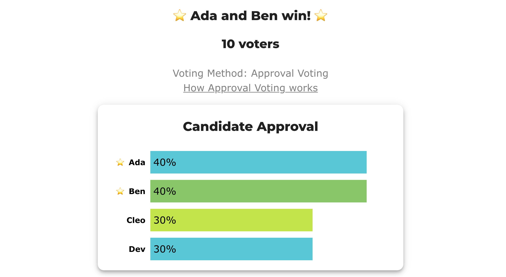

# BV2271 — SAV and Approval elect committees with nothing in common

**Level: 301 · deep dive**

*Brams & Kilgour's own worked example ([Satisfaction Approval Voting](https://mpra.ub.uni-muenchen.de/22709/), MPRA 22709, §2 — the proof of their **Proposition 2**), run live. Ten voters, four candidates, **two seats**. Bloc Approval seats **Ada and Ben**; **SAV** seats **Cleo and Dev** — not one candidate in common, from identical ballots. The live election carries the three methods BetterVoting can tabulate, and the question it settles is whether they agree with each other.*

**▶ Live on BetterVoting:** [vote](https://bettervoting.com/4hfwqd) · **[results ↗](https://bettervoting.com/4hfwqd/results)** (election `4hfwqd`).

Reference files: LH case [`approval_sav_disjoint_c4_b10_brams_kilgour.yaml`](cases/approval_sav_disjoint_c4_b10_brams_kilgour.yaml) · [full generated report](cases/cases_pages/approval_sav_disjoint_c4_b10_brams_kilgour.md) · frozen export [`…_bv_export.json`](cases/approval_sav_disjoint_c4_b10_brams_kilgour_bv_export.json). Concept page: [Satisfaction Approval Voting](../../01_Learn/Multiwinner_Approval/satisfaction_approval_voting.md). Created via [`create_bv_test_election.py`](../../../STARVote_LH_tabulation_engine/tools_adam/create_bv_test_election.py).

## The election

Ten voters, two seats. Four approve a two-person slate; six bullet-vote:

| voters | approve |
|---:|---|
| 4 | Ada, Ben |
| 3 | Cleo |
| 3 | Dev |

The one thing that changes between the two counts is **what a mark is worth**:

| | Ada | Ben | Cleo | Dev | elects |
|---|:--:|:--:|:--:|:--:|---|
| **Approval (AV)** — one vote *per mark* | **4** | **4** | 3 | 3 | **Ada, Ben** |
| **SAV** — one vote *per ballot*, split | 4×½ = 2 | 4×½ = 2 | 3×1 = **3** | 3×1 = **3** | **Cleo, Dev** |

The four slate voters marked two names each. Under AV that is two whole votes; under SAV it is one vote in halves — and a half was not enough to beat a bullet vote.

## View 1 — BetterVoting, three methods

BetterVoting has no SAV tabulator, so the live election runs the three methods that **do** read this electorate, all bloc at two seats. The STAR and ranked ballots add a within-slate preference the approval ballot cannot express (3 of the 4 slate voters prefer Ada); the approval sets are exactly the paper's.



| Race | Method | Elected | BV's `tieBreakType` |
|---|---|---|---|
| 1 | Approval (bloc, 2 seats) | **Ada, Ben** | `none` |
| 2 | STAR (bloc, 2 seats) | **Ada, Ben** | `random` — see below |
| 3 | Ranked Robin (bloc, 2 seats) | **Ada, Ben** | `none` |

**All three agree.** That is the finding worth having: the disagreement is not "bloc Approval versus everything else," it is **SAV versus everything else**. Whatever SAV is doing here, no method in ordinary use does it.

The `random` flag on race 2 is honest and harmless. In the second STAR round Cleo and Dev tie at 15 points for the *second finalist slot*, so BetterVoting draws for it — but Ben beats **either** finalist in the runoff, 4–3. The winner set is independent of the draw, which is why this case is publishable rather than lot-dependent.

## View 2 — the LH engine

<!-- report:approval_sav_disjoint_c4_b10_brams_kilgour -->
```text
--- Approval Voting (2 winners) ---
 Tabulating 10 ballots (any non-zero score = approval).

Ballots:
   columns = Ada, Ben, Cleo, Dev      (1 = approve; 0 / blank / marker = not approved)
     4 × 1,1,0,0
     3 × 0,0,1,0
     3 × 0,0,0,1

   Ada  -- 4 (40%) -- Elected
   Ben  -- 4 (40%) -- Elected
   Cleo -- 3 (30%)
   Dev  -- 3 (30%)

[Approval Distribution] (how many candidates each ballot approved)
   14 approvals across 10 ballots — average 1.4 of 4 (range 1–2).
     approved 1: 6 ballots
     approved 2: 4 ballots

[Co-Approval Matrix]
 Of the voters who approved the ROW candidate, the % who ALSO approved the COLUMN candidate.
         |  Ada   |  Ben   |  Cleo  |  Dev   |
   -------------------------------------------
   Ada   |   --   |  100%  |   0%   |   0%   |
   Ben   |  100%  |   --   |   0%   |   0%   |
   Cleo  |   0%   |   0%   |   --   |   0%   |
   Dev   |   0%   |   0%   |   0%   |   --   |

Winners — Approval Voting (2 winners)
  Ada, Ben
```
<!-- /report -->

## View 3 — SAV, off-platform

SAV is one of Lackner's [`abcvoting`](https://github.com/martinlackner/abcvoting) rules, so the same file counts under it directly:

```bash
python 06_Other/abcvoting_tabulation_engine/abc_tabulation.py \
  04_Approval/02_Examples/multiwinner/cases/approval_sav_disjoint_c4_b10_brams_kilgour.yaml \
  --rules av,sav,pav,seqpav,cc,seqphragmen
```

```text title="Abridged for the lesson — the rule column only"
   av           Approval Voting (AV)                 ->  Ada, Ben
   sav          Satisfaction Approval Voting (SAV)   ->  Cleo, Dev
   pav          Proportional Approval Voting (PAV)   ->  Ada, Cleo | Ada, Dev | Ben, Cleo | Ben, Dev   [4 tied]
   seqpav       Sequential PAV (seq-PAV)             ->  Ada, Cleo
   cc           Approval Chamberlin-Courant (CC)     ->  Ada, Cleo | Ada, Dev | Ben, Cleo | Ben, Dev   [4 tied]
   seqphragmen  Phragmén's Sequential Rule           ->  Ada, Cleo
```

## The finding

Three answers from one set of ballots, and each is right about something different:

- **Ada + Ben** (Approval, STAR, Ranked Robin) — the two candidates the most voters can live with. Represents **4 of 10** voters.
- **Cleo + Dev** (SAV) — represents **6 of 10**. This is the paper's argument: bloc Approval "can fail to reflect the diversity of interests in the electorate," and here it demonstrably does.
- **One from each side** (PAV, seq-Phragmén, CC) — the *proportional* answer. A 40% bloc holding 2 seats is entitled to about 0.8 of them, so one seat is the honest share. Neither AV's two nor SAV's zero is proportional; they miss in opposite directions.

The seat the slate voters were owed is one. AV gave them two, SAV gave them none, and only the proportional rules gave them one — which is the cleanest statement of what "semi-proportional" costs.

## See also

- [Satisfaction Approval Voting (301)](../../01_Learn/Multiwinner_Approval/satisfaction_approval_voting.md) — the method, the authors' own counter-examples, the clone inversion, and a claim-check of the widely-copied Wikipedia retelling of *this* example.
- [BV2272 — the coverage case](bv2272_dr6fmg_sav_coverage.md), the same paper's Proposition 5, where SAV seats the only pair that represents everybody.
- [ABC rules & the utilitarian–egalitarian spectrum (301)](../../01_Learn/Multiwinner_Approval/abc_rules_spectrum.md) · [Approval — multi-winner](../../01_Learn/Multiwinner_Approval/approval_multiwinner.md).
