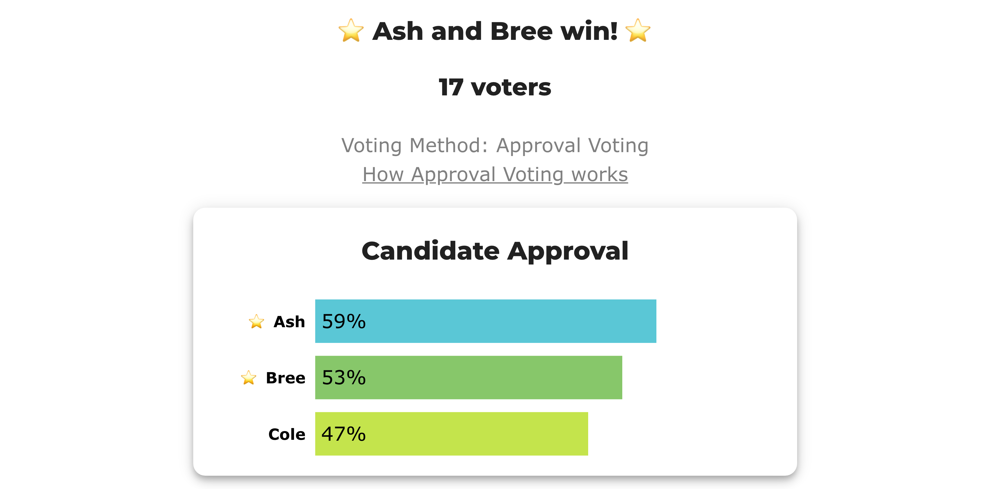

# BV2272 — the most-approved candidate that no coverage rule seats

**Level: 301 · deep dive**

*Brams & Kilgour, [Satisfaction Approval Voting](https://mpra.ub.uni-muenchen.de/22709/) (MPRA 22709), **Proposition 5**: SAV can find a minimal representative set where bloc Approval cannot. Seventeen voters, three candidates, **two seats**. Bloc Approval seats **Ash and Bree** and leaves three voters with nobody; **SAV** seats **Bree and Cole**, the smallest pair that represents all seventeen. Ash — the most-approved candidate in the field — wins no seat under the rule that counts coverage.*

**▶ Live on BetterVoting:** [vote](https://bettervoting.com/dr6fmg) · **[results ↗](https://bettervoting.com/dr6fmg/results)** (election `dr6fmg`).

Reference files: LH case [`approval_sav_covers_everyone_c3_b17_brams_kilgour.yaml`](cases/approval_sav_covers_everyone_c3_b17_brams_kilgour.yaml) · [full generated report](cases/cases_pages/approval_sav_covers_everyone_c3_b17_brams_kilgour.md) · frozen export [`…_bv_export.json`](cases/approval_sav_covers_everyone_c3_b17_brams_kilgour_bv_export.json). Concept page: [Satisfaction Approval Voting](../../01_Learn/Multiwinner_Approval/satisfaction_approval_voting.md).

## The election

| voters | approve |
|---:|---|
| 5 | Ash, Bree |
| 5 | Ash, Cole |
| 4 | Bree |
| 3 | Cole |

| | Ash | Bree | Cole | elects | voters represented |
|---|:--:|:--:|:--:|---|:--:|
| **Approval (AV)** | **10** | **9** | 8 | **Ash, Bree** | 14 of 17 |
| **SAV** | 5×½ + 5×½ = 5 | 5×½ + 4×1 = **6½** | 5×½ + 3×1 = **5½** | **Bree, Cole** | **17 of 17** |

Watch what the split does. Ash is approved by all ten slate voters and nobody else — and every one of those ten marked a second name, so Ash collects ten *halves*. Bree and Cole each combine half-votes from the slate with the **whole** votes of bullet voters, and the bullet voters decide it.

The result is that the field's most-approved candidate wins no seat, and the reason is not that Ash is unpopular. It is that Ash is *redundant*: every Ash supporter already has a second choice seated, so adding Ash to the committee buys no voter their first representative.

## View 1 — BetterVoting, three methods



| Race | Method | Elected | BV's `tieBreakType` |
|---|---|---|---|
| 1 | Approval (bloc, 2 seats) | **Ash, Bree** | `none` |
| 2 | STAR (bloc, 2 seats) | **Ash, Bree** | `none` |
| 3 | Ranked Robin (bloc, 2 seats) | **Ash, Bree** | `none` |

All three agree, with no tie anywhere in the election — and **none of them notices the three stranded voters**. That is not a bug in any of them: none of these methods is *trying* to maximise coverage, and a seat-count rule that ignored margins in order to chase coverage would fail other things people care about. But it does mean that "Approval, STAR and Ranked Robin all agree" is not by itself evidence that a committee represents everyone.

The STAR race is the closest of the three: seat 1 runs Ash 50 / Bree 40 / Cole 35 in the scoring round and Ash wins the runoff 10–4; seat 2 comes down to **Bree 9 – Cole 8**. One voter the other way and STAR would have landed on SAV's committee.

## View 2 — the LH engine

<!-- report:approval_sav_covers_everyone_c3_b17_brams_kilgour -->
```text
--- Approval Voting (2 winners) ---
 Tabulating 17 ballots (any non-zero score = approval).

Ballots:
   columns = Ash, Bree, Cole      (1 = approve; 0 / blank / marker = not approved)
     5 × 1,1,0
     5 × 1,0,1
     4 × 0,1,0
     3 × 0,0,1

   Ash  -- 10 (59%) -- Elected
   Bree -- 9 (53%) -- Elected
   Cole -- 8 (47%)

[Approval Distribution] (how many candidates each ballot approved)
   27 approvals across 17 ballots — average 1.6 of 3 (range 1–2).
     approved 1: 7 ballots
     approved 2: 10 ballots

[Co-Approval Matrix]
 Of the voters who approved the ROW candidate, the % who ALSO approved the COLUMN candidate.
         |  Ash   |  Bree  |  Cole  |
   ----------------------------------
   Ash   |   --   |  50%   |  50%   |
   Bree  |  56%   |   --   |   0%   |
   Cole  |  62%   |   0%   |   --   |

Winners — Approval Voting (2 winners)
  Ash, Bree
```
<!-- /report -->

## View 3 — SAV and the proportional rules, off-platform

```bash
python 06_Other/abcvoting_tabulation_engine/abc_tabulation.py \
  04_Approval/02_Examples/multiwinner/cases/approval_sav_covers_everyone_c3_b17_brams_kilgour.yaml \
  --rules av,sav,pav,seqpav,cc,seqphragmen
```

```text title="Abridged for the lesson — the rule column only"
   av           Approval Voting (AV)                 ->  Ash, Bree
   sav          Satisfaction Approval Voting (SAV)   ->  Bree, Cole
   pav          Proportional Approval Voting (PAV)   ->  Bree, Cole
   seqpav       Sequential PAV (seq-PAV)             ->  Ash, Bree
   cc           Approval Chamberlin-Courant (CC)     ->  Bree, Cole
   seqphragmen  Phragmén's Sequential Rule           ->  Ash, Bree
```

Two things fall out of that column. **Exact PAV agrees with SAV here** — unlike [the disjointness case](bv2271_4hfwqd_sav_disjoint.md), where PAV split the seats one per side. And **seq-PAV disagrees with exact PAV**: the greedy algorithm seats Ash first because Ash leads the first round outright, and never recovers. The practical, hand-countable version of a rule is not always the rule.

## The finding

Six rules, two answers, and the split is not majoritarian-versus-proportional — it is **coverage-versus-margin**. `{Bree, Cole}` is the only committee that gives all seventeen voters a representative, and the three rules that reach it (SAV, exact PAV, CC) are the three whose objective functions notice unrepresented voters at all. The other three (AV, seq-PAV, seq-Phragmén) seat the most-approved candidate and stop.

The honest counterweight, from the same paper: SAV does **not** guarantee this. Its Propositions 3, 4 and 6 give profiles where AV covers more voters than SAV, where a third committee beats both, and where SAV, AV and the greedy heuristic all miss the minimal set together. Maximising total satisfaction is a *proxy* for coverage, and this election is a case where the proxy happens to be exact.

## See also

- [Satisfaction Approval Voting (301)](../../01_Learn/Multiwinner_Approval/satisfaction_approval_voting.md) — the rule, its own counter-examples, and the clone/spoiler inversion.
- [BV2271 — disjoint committees](bv2271_4hfwqd_sav_disjoint.md), the same paper's Proposition 2.
- [ABC rules & the utilitarian–egalitarian spectrum (301)](../../01_Learn/Multiwinner_Approval/abc_rules_spectrum.md) · [Approval — multi-winner](../../01_Learn/Multiwinner_Approval/approval_multiwinner.md).
