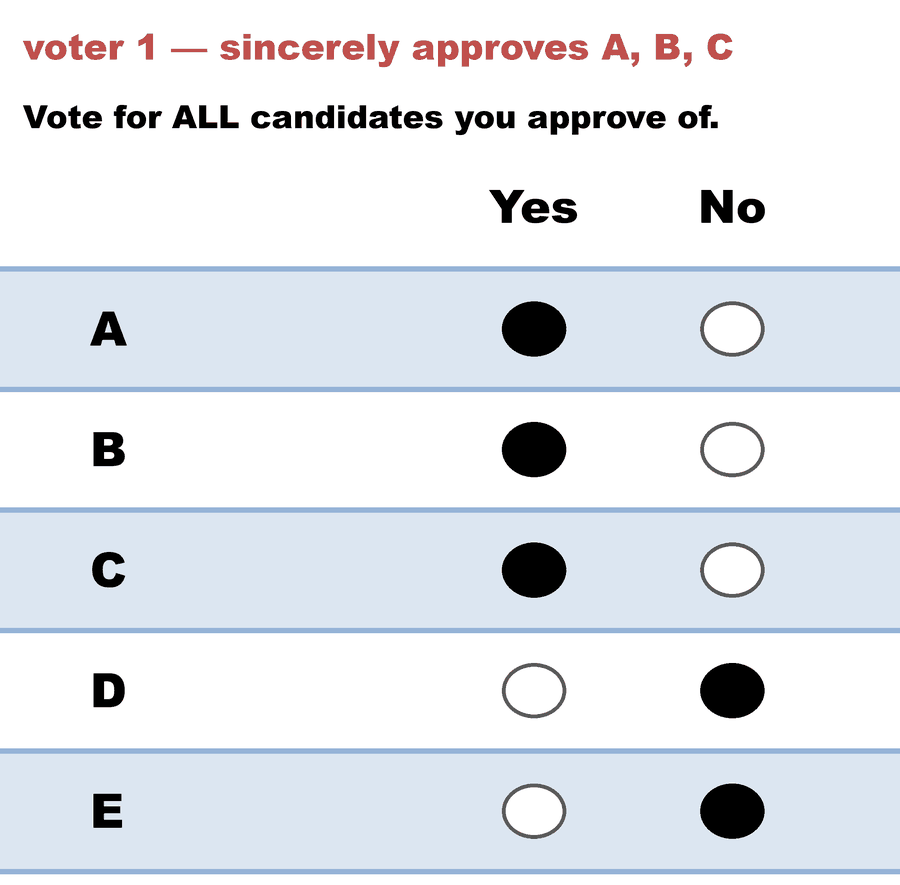
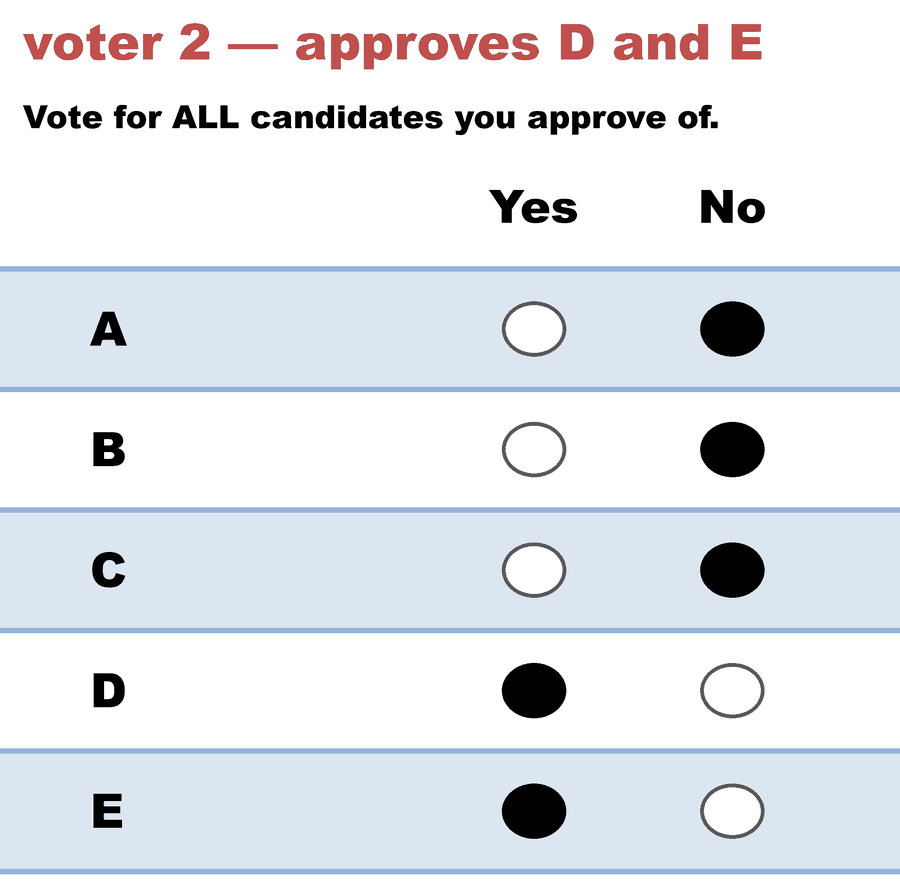

---
search:
  exclude: true
---

# SAV rewards a bullet vote — the two-voter manipulation

*Generated from [`sav_strategy_bullet_vote_c5_b2.yaml`](../sav_strategy_bullet_vote_c5_b2.yaml) — do not edit by hand. Regenerate: `python STARVote_LH_tabulation_engine/tools_adam/scripts/build_yaml_pages.py`.*

**Method:** [Approval Voting](../../../01_Learn/README.md) · **1 seat** · **Expected winner:** A

## Scenario

The smallest strategy counterexample in Lackner & Skowron (Proposition A.4).
Two voters, five candidates, ONE seat. Voter 1 sincerely approves A, B and C;
voter 2 approves D and E.

Satisfaction Approval Voting gives each BALLOT one vote and splits it evenly
among that ballot's marks. So voter 1's three marks are worth 1/3 each, while
voter 2's two marks are worth 1/2 each. SAV therefore scores D and E at 1/2
against A, B and C at 1/3 - and the single seat goes to D (E ties; the book
breaks it lexicographically).

Voter 1 got nothing she approved. Now let her lie: submit {A} alone. Her one
vote lands undivided on A, worth 1.0, and A takes the seat. She has moved
from a committee containing none of her approved candidates to one containing
A, purely by NARROWING her honest ballot. That is a violation of
inclusion-strategyproofness (Definition 3.7), and it is why SAV carries a ✗
in that column of Table 3.1 despite passing Pareto efficiency, committee
monotonicity, support monotonicity and consistency - the only rule besides AV
to pass all four.

Approval Voting - the count in this file - is the control, and its answer is
a five-way tie: every candidate has exactly one approval, so AV cannot
separate them at all. That contrast IS the mechanism. SAV's power to
distinguish these ballots comes from dividing by ballot length, and that same
division is what makes shortening a ballot pay.

Reproduce it: python 06_Other/abcvoting_tabulation_engine/abc_axiom_check.py

Source: Lackner, M. & Skowron, P. (2023), "Multi-Winner Voting with Approval
Preferences", SpringerBriefs, doi:10.1007/978-3-031-09016-5, Proposition A.4.

## Ballots

The ballots as marked — a filled **Yes** is a `1` in that candidate's column, a filled **No** a `0`:

| # | Ballot as marked | A | B | C | D | E |
|:--:|:--|:--:|:--:|:--:|:--:|:--:|
| 1 |  | 1 | 1 | 1 | 0 | 0 |
| 2 |  | 0 | 0 | 0 | 1 | 1 |

The same ballots as the file records them:

Row 1 = candidate names; each later row is one voter's approvals (`1` = approve, `0`/blank = not approved).

```text
A,B,C,D,E
1,1,1,0,0   # voter 1 — sincerely approves A, B, C
0,0,0,1,1   # voter 2 — approves D and E
```

## What the engine says

Full report from the [`_tabulated` mirror](../cases_tabulated/sav_strategy_bullet_vote_c5_b2_tabulated.txt) (regenerated on every run; every analysis forced on):

<!-- --8<-- [start:report] -->
```text
--- Approval Voting (single winner) ---
 Tabulating 2 ballots (any non-zero score = approval).

Ballots:
   columns = A, B, C, D, E      (1 = approve; 0 = not approved)
     1 × 1,1,1,0,0
     1 × 0,0,0,1,1

   A -- 1 (50%) -- Elected
   B -- 1 (50%)
   C -- 1 (50%)
   D -- 1 (50%)
   E -- 1 (50%)
  Note: A, B, C, D, E each have 1 approval and tie for the last 1 seat.
        Candidate priority order (A > B > C > D > E) broke the tie: A elected, B, C, D, E not elected.

[Approval Distribution] (how many candidates each ballot approved)
   5 approvals across 2 ballots — average 2.5 of 5 (range 2–3).
     approved 2: 1 ballot
     approved 3: 1 ballot

[Co-Approval Matrix]
 Of the voters who approved the ROW candidate, the % who ALSO approved the COLUMN candidate.
      |   A    |   B    |   C    |   D    |   E    |
   -------------------------------------------------
   A  |   --   |  100%  |  100%  |   0%   |   0%   |
   B  |  100%  |   --   |  100%  |   0%   |   0%   |
   C  |  100%  |  100%  |   --   |   0%   |   0%   |
   D  |   0%   |   0%   |   0%   |   --   |  100%  |
   E  |   0%   |   0%   |   0%   |  100%  |   --   |

Winner — Approval Voting (single winner)
  A
```
<!-- --8<-- [end:report] -->

Run it yourself:

```bash
python STARVote_LH_tabulation_engine/starvote_larry_hastings.py 04_Approval/03_Criteria/cases/sav_strategy_bullet_vote_c5_b2.yaml
```

## See also

- [Monotonicity (topic hub)](../../../../07_Concepts/topics/monotonicity/README.md)
- [Ties & tie-breaking (topic hub)](../../../../07_Concepts/topics/ties/README.md)
- [Vote splitting (worked set)](../../../../method_comparisons/split_voting/README.md)
- [Glossary](../../../../07_Concepts/GLOSSARY.md) · [all cases by method](../../../../07_Concepts/YAML_test_case_index/README.md)

More cases in this set: [abc_committee_monotonicity_1seat_c3_b10](abc_committee_monotonicity_1seat_c3_b10.md) · [abc_committee_monotonicity_2seats_c3_b10](abc_committee_monotonicity_2seats_c3_b10.md) · [cc_pareto_dominated_c4_b2](cc_pareto_dominated_c4_b2.md) · [monroe_pareto_dominated_c4_b24](monroe_pareto_dominated_c4_b24.md)
