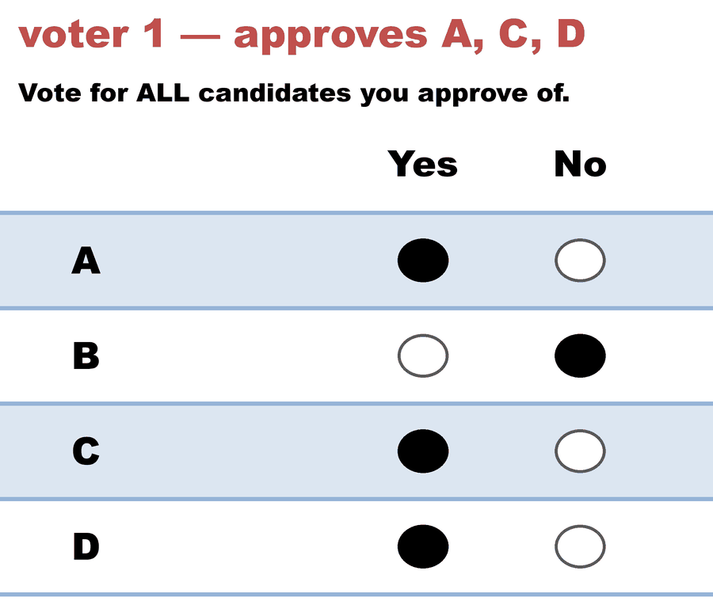
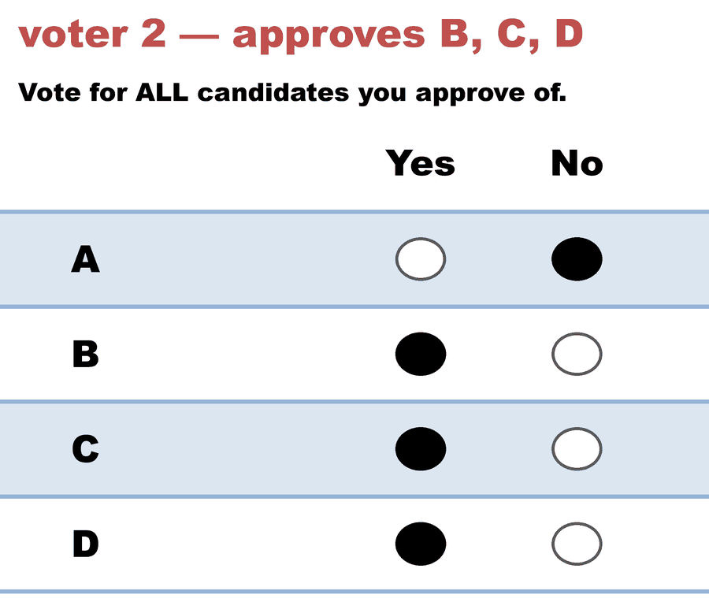

---
tags:
  - criteria
  - multi-winner
---

# Pareto efficiency — can a rule elect a committee everybody would trade away?

**Level: 301 · deep dive**

**One line:** a committee is *dominated* when some other committee of the same size gives every voter at least as many approved winners and somebody strictly more — and a surprising number of respected approval rules will elect one anyway.

## The definition

The single-winner version of Pareto is familiar and weak: don't elect someone every voter ranks below somebody else. See [social welfare function](../../07_Concepts/topics/social_welfare_function.md) for how it behaves there — and note the warning on that page that the single-winner row is a **type error** on a multi-winner rule. This is the multi-winner replacement.

Comparing *committees* needs a rule for turning "which candidates do I approve" into "which committee do I prefer". Lackner & Skowron use the obvious one — **count your approved winners**:

> **Definition 3.1.** A committee `W₁` **dominates** `W₂` if (1) every voter has at least as many approved candidates in `W₁` as in `W₂`, and (2) at least one voter has strictly more. A committee dominated by no other committee of the same size is **Pareto optimal**.

Two strengths follow, and Table 3.1 distinguishes them:

- **Strong Pareto efficiency** — the rule *never* outputs a dominated committee.
- **Weak Pareto efficiency** — if a dominated committee wins, every committee dominating it also wins. (The rule may return the dominated committee, but never *only* it.)

The set extension is a choice, and the book says so explicitly: these verdicts hold for "count your approved winners" and need not survive a different reading of what a voter wants from a committee.

## The smallest failure: Chamberlin–Courant, two voters

<!-- ballots:cc_pareto_dominated_c4_b2 -->
The ballots as marked — a filled **Yes** is a `1` in that candidate's column, a filled **No** a `0`:

| # | Ballot as marked | A | B | C | D |
|:--:|:--|:--:|:--:|:--:|:--:|
| 1 |  | 1 | 0 | 1 | 1 |
| 2 |  | 0 | 1 | 1 | 1 |
<!-- /ballots -->

Two seats. Committee `{C,D}` gives **both** voters two approved winners; `{A,B}` gives both exactly one. So `{C,D}` dominates `{A,B}` outright.

[Chamberlin–Courant](../01_Learn/Multiwinner_Approval/abc_rules_spectrum.md) asks only whether a voter has **at least one** approved winner. Both voters are covered by `{A,B}`; both are covered by `{C,D}`. CC scores them equally — in fact it scores *all six* two-seat committees equally, at 2 — and returns the lot, dominated committees included:

```text
CC       {a,b} | {a,c} | {a,d} | {b,c} | {b,d} | {c,d}
AV       {c,d}
PAV      {c,d}
SAV      {c,d}
```

That is why CC is marked **weak** and not `✗`: it does return `{C,D}` as well, so the dominating committee is never excluded — it is just not preferred. And it is why AV is marked **strong**: coverage saturates at one, but counting doesn't.

The repo's own Approval count on this file elects `{C,D}` and is a fair control:

<!-- report:cc_pareto_dominated_c4_b2 -->
```text
--- Approval Voting (2 winners) ---
 Tabulating 2 ballots (any non-zero score = approval).

Ballots:
   columns = A, B, C, D      (1 = approve; 0 = not approved)
     1 × 1,0,1,1
     1 × 0,1,1,1

   C -- 2 (100%) -- Elected
   D -- 2 (100%) -- Elected
   A -- 1 (50%)
   B -- 1 (50%)

[Approval Distribution] (how many candidates each ballot approved)
   6 approvals across 2 ballots — average 3.0 of 4 (range 3–3).
     approved 3: 2 ballots

[Co-Approval Matrix]
 Of the voters who approved the ROW candidate, the % who ALSO approved the COLUMN candidate.
      |   C    |   D    |   A    |   B    |
   ----------------------------------------
   C  |   --   |  100%  |  50%   |  50%   |
   D  |  100%  |   --   |  50%   |  50%   |
   A  |  100%  |  100%  |   --   |   0%   |
   B  |  100%  |  100%  |   0%   |   --   |

Winners — Approval Voting (2 winners)
  C, D
```
<!-- /report -->

## The instructive failure: Monroe, and why it fails

CC's failure is a tie. Monroe's is a **strict preference for the dominated committee**, which is a different and more serious thing.

<!-- ballots:monroe_pareto_dominated_c4_b24 -->
*(No ballot art for `monroe_pareto_dominated_c4_b24` — draw it with `build_style_ballot_images.py --from-yaml 04_Approval/03_Criteria/cases/monroe_pareto_dominated_c4_b24.yaml`.)*

Row 1 = candidate names; each later row is one voter's approvals (`1` = approve, `0`/blank = not approved).

```text
A,B,C,D
1,0,0,0   # 2 voters — approve A only
1,0,0,0
1,0,1,0   # 1 voter — approves A and C
1,0,0,1   # 1 voter — approves A and D
0,1,1,0   # 10 voters — approve B and C
0,1,1,0
0,1,1,0
0,1,1,0
0,1,1,0
0,1,1,0
0,1,1,0
0,1,1,0
0,1,1,0
0,1,1,0
0,1,0,1   # 10 voters — approve B and D
0,1,0,1
0,1,0,1
0,1,0,1
0,1,0,1
0,1,0,1
0,1,0,1
0,1,0,1
0,1,0,1
0,1,0,1
```
<!-- /ballots -->

Two seats, 24 voters. Monroe assigns each winner an equal-sized constituency — here twelve voters each — and elects `{C,D}` with a Monroe-score of 22. But:

| Committee | voters with an approved winner |
|---|:--:|
| `{A,B}` | **24** |
| `{C,D}` | 22 |

Nobody is worse off under `{A,B}`, and the two voters who approve only A go from *no representative at all* to one. Every voter weakly prefers `{A,B}`; Monroe elects `{C,D}` regardless. Replayed:

```text
Monroe            {c,d}          <- dominated
AV                {b,c} | {b,d}
PAV               {b,c} | {b,d}
CC                {a,b}
MAV               {a,b}
Method of Eq. Shares  {b,c} | {b,d}
```

**Why it fails is the whole lesson.** Equal-sized constituencies are a *constraint*, and a constrained optimum can be worse for everyone than an unconstrained one. Monroe is not carelessly built; it is doing exactly what it promises, and Pareto efficiency is what that promise costs. The book puts it plainly: Pareto efficiency "clashes with Monroe's goal to assign representatives to groups of similar size."

## MAV's failure, which is a tie in disguise

Minimax Approval Voting minimises the **worst** voter's Hamming distance to the committee. On `1×{a,c}`, `1×{b,c}`, `1×{d,e}` with one seat, every single-candidate committee leaves some voter at distance 3 — so MAV ties all of them, including `{a}`, which `{c}` dominates. Same shape as CC: an objective that saturates cannot see improvements past the saturation point.

## Why you cannot just patch it

The obvious repair — "if the winner is dominated, output the committees that dominate it instead" — fails twice over:

1. **It breaks other things.** Pareto efficiency and *perfect representation* (Chapter 4) are incompatible, so the patch trades one axiom for another.
2. **It isn't computable.** Aziz & Monnot (2020) proved that deciding whether a given committee is Pareto optimal is **coNP-complete** (Theorem 3.1). You cannot even *check* the repair cheaply, let alone apply it.

Note the asymmetry that saves the day for the simple rules: *finding* a Pareto optimal committee is easy — AV and SAV do it in polynomial time. It is *verifying* an arbitrary one that is hard. See [computational complexity](computational_complexity.md).

## What this means for the methods this repo teaches

- **Bloc Approval — the LH engine's `Approval_Multi_Winner` — is AV**, so it inherits strong Pareto efficiency. On a committee-sized question this is the strongest thing that can be said for it, and it is worth saying because bloc Approval gets criticised (fairly) on proportionality grounds.
- **Approval's single-winner Pareto failure is a different animal.** [Felsenthal Example 6](../../method_comparisons/felsenthal_paradoxes/felsenthal_ex6_pareto.md) shows Approval electing a Pareto-dominated *candidate* — but that is dominance measured against voters' underlying **rankings**, which an approval ballot doesn't record. Here dominance is measured in the approvals themselves. Both results are correct and they are not in tension; they are answers to different questions, and conflating them is an easy way to overclaim in either direction.
- **STAR has no rule on this grid**, because these are approval rules. The nearest bridge is the [shadow-STAR page](../02_Examples/multiwinner/lackner_skowron_shadow_star.md), which reads the same approval ballots as 0/5 STAR ballots.

## Reproduce it

```bash
.venv/bin/python 06_Other/abcvoting_tabulation_engine/abc_axiom_check.py --verbose
```

The Pareto section replays Example 3.1 (Monroe) and both halves of Proposition A.1 (CC, MAV). `--search 400` additionally hunts for a violation by AV, PAV and SAV — a hit would refute the table.

---

**Related:** [the table](README.md) · [committee monotonicity](committee_monotonicity.md) — the next column · [the ABC rules themselves](../01_Learn/Multiwinner_Approval/abc_rules_spectrum.md) · Pareto in the single-winner setting → [social welfare function](../../07_Concepts/topics/social_welfare_function.md).
