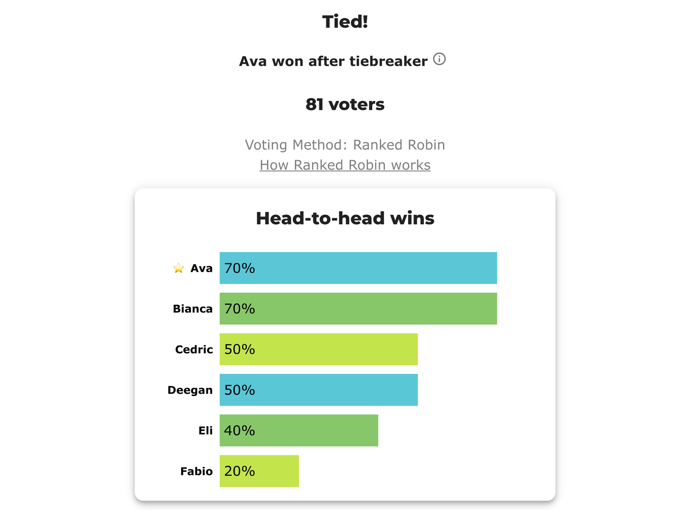

# BV2141 — a Copeland tie that needs all four Equal-Vote tiebreak degrees

<!-- case-meta:start — managed by build_yaml_pages.py; edit the YAML, not these lines -->
**Method:** [Ranked Robin (RCV-RR / Copeland)](../../01_Learn) · **1 seat** · **Expected winner:** Ava · [full count →](cases/cases_pages/bv2141_3r3yf7_four_degree_tie.md)
<!-- case-meta:end -->

**▶ Live on BetterVoting:** [vote](https://bettervoting.com/3r3yf7) · **[results ↗](https://bettervoting.com/3r3yf7/results)** (election `3r3yf7`).

The [electowiki Ranked Robin "all four tie-breaking degrees" example](https://electowiki.org/wiki/Ranked_Robin) — the hardest tie the method defines a rule for. **Ava and Bianca tie so thoroughly** that the first three degrees of the Equal Vote Coalition's tiebreak protocol all fail to separate them; only the 4th-degree beatpath does. It's the perfect stress test of *what each engine actually does when Ranked Robin ties*, and the answer is: **they disagree, and BetterVoting admits it isn't finished.**

## Three engines, three tiebreaks, potentially three winners

Ava and Bianca each win **3** of 5 matchups (Copeland **3.5**), each with total margin **+55**, each with **149** votes against. Everything a simple tiebreak looks at is equal. What each engine does next:

| Engine | Tiebreak ladder | Winner here |
|--------|-----------------|-------------|
| **Equal Vote 4-degree protocol** (electowiki) | wins → margin-over-finalists → margin-over-all → least-polarizing → **beatpath** | **Bianca** (beatpath 14 vs 7) |
| **BetterVoting** `RankedRobin.ts` | wins → 2-way head-to-head → **random** | **random** — this draw: **Ava** |
| **LH** `run_ranked_robin` | wins → total margin → **lot** (pre-published) | **Ava** (lot pinned to BV's draw) |

The tie runs so deep that BetterVoting gives up and rolls dice. Its own results log says so verbatim:

> **"Ava picked in random tie-breaker, more robust tiebreaker not yet implemented."**

So BetterVoting **does not implement** the Equal Vote 4-degree protocol this example was written to demonstrate — it detects the Copeland tie (`tieBreakType: random`) and picks at random. This run landed on Ava; a re-tally could elect Bianca. That non-determinism is exactly why a tie-deciding Ranked Robin result **can't be frozen** as a stable BV outcome — see [rr_tiebreak_lh_vs_bv.md](../../01_Learn/rr_tiebreak_lh_vs_bv.md).

## The ballots

81 voters, six candidates. `=` ties a rank level; `>` separates levels; unranked candidates are tied for last.

```
10:Eli>Deegan>Ava=Cedric>Fabio
 9:Bianca=Deegan>Eli>Cedric
 8:Deegan>Eli>Ava=Bianca=Cedric
 8:Bianca>Ava>Fabio>Cedric
 8:Fabio>Cedric>Ava>Deegan>Bianca
 7:Ava>Eli>Bianca>Fabio
 6:Fabio>Bianca=Cedric>Ava
 6:Cedric>Deegan=Eli>Ava=Bianca>Fabio
 5:Deegan>Ava=Bianca>Eli>Cedric
 4:Cedric>Bianca>Ava
 4:Ava>Bianca=Fabio
 4:Ava=Bianca>Fabio
 2:Bianca=Fabio>Ava=Eli
```

## View 1 — BetterVoting

BetterVoting's [results](https://bettervoting.com/3r3yf7/results) confirm the tie and break it at random:

- `tied: [Ava, Bianca]` — both `copelandScore: 3.5`
- `tieBreakType: random`
- `elected: [Ava]` (this draw); log: *"Ava picked in random tie-breaker, more robust tiebreaker not yet implemented."*



The frozen export ([`bv2141_3r3yf7_four_degree_tie_bv_export.json`](cases/bv2141_3r3yf7_four_degree_tie_bv_export.json)) records BV's random `perm` order `[Fabio, Eli, Cedric, Deegan, Ava, Bianca]` — Ava precedes Bianca, so Ava won this draw.

## View 2 — the LH tabulation engine

LH agrees on every Copeland score (Ava/Bianca 3.5, Cedric/Deegan 2.5, Eli 2, Fabio 1) and, with `lot_numbers` pinned to BV's `perm`, reproduces BV's frozen instance (Ava) — but deterministically, via its wins → margin → lot ladder:

--8<-- "05_Ranked_Robin/03_Criteria/rr_tiebreaks/cases/cases_pages/bv2141_3r3yf7_four_degree_tie.md:report"
Full detail: [`bv2141_3r3yf7_four_degree_tie_tabulated.txt`](cases/cases_tabulated/bv2141_3r3yf7_four_degree_tie_tabulated.txt).

## The Ava–Bianca head-to-head is itself a tie

The matrix shows why no simple rule works: **Ava vs Bianca is 29 – 29** (with 23 Equal Support). So BetterVoting's "break a 2-way tie by head-to-head" rung is *also* tied, and it falls through to random. LH's "break by total margin" rung is tied too (+55 = +55), so LH falls through to lot. Only the Equal Vote beatpath (4th degree) separates them — and it favors **Bianca** (14 vs 7), the answer neither engine here computes.

## A note on electowiki's published matrix

electowiki's *outcome* is correct (Ava/Bianca tie → Bianca by 4th degree), and its **row totals** (204/204/167/175/169/150) match this tabulation exactly. But its printed **cell values** for Ava-over and Bianca-over {Cedric, Deegan, Eli} are each **4 too low** — those rows' cells sum to 192, not the 204 total electowiki itself prints. A display slip; it changes none of the records, margins, or the winner.

## Cross-checks

- **LH native** `run_ranked_robin` — Ava/Bianca tie 3.5; lot (pinned to BV perm) → Ava.
- **BetterVoting** `RankedRobin.ts` — Ava/Bianca tie 3.5; `tieBreakType: random` → Ava (this draw); records identical to LH.
- **Equal Vote 4-degree protocol** (electowiki) — → Bianca (beatpath 14 vs 7); implemented by neither engine.
