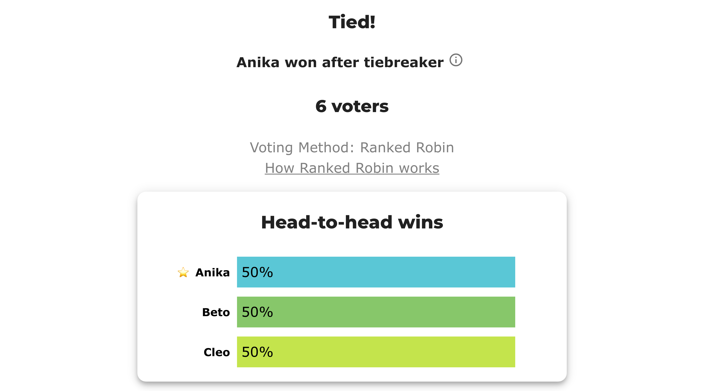

# BV2261 — the "random" tiebreak is recorded, not lost

*When a Ranked Robin count ties all the way down, BetterVoting says the winner was picked "in random tie-breaker." That sounds like information thrown away. It isn't. This case was built to settle the question on a live election: **the results export publishes the complete tiebreak order — winner and runners-up — and it is stable on re-tally.** Two races, two different routes to the same dead end, both replayed exactly in the LH engine.*

**▶ Live on BetterVoting:** [vote](https://bettervoting.com/y2fbpc) · **[results ↗](https://bettervoting.com/y2fbpc/results)** (election `y2fbpc`).



The results page is honest that a tiebreak happened — and in words it names only the winner. Everything below is about what the **export** states explicitly that the page does not.

## The question

Given a Ranked Robin result whose `tieBreakType` is `"random"`, does the JSON export tell you the tie-breaking **sequence**, or only who came out on top?

**Answer: the whole sequence.** Four fields carry it, and they agree with each other:

| Field | What it holds |
|---|---|
| `perm` | the shuffled candidate **ids, in tiebreak order** — the draw itself |
| `tieBreakOrder` (per candidate) | that candidate's **index** in `perm` — 0 wins |
| `tied[]` | every candidate on the top Copeland score, **sorted by `tieBreakOrder`** |
| `other[]` | the ones who lost the tiebreak, **in the same order** — the runner-up sequence |
| `tieBreakType` | `random` (also repeated per round in `roundResults[]`) |
| `roundResults[].logs` | the human-readable line: *"… picked in random tie-breaker, more robust tiebreaker not yet implemented."* |

So a reader of the export can reconstruct not just "Anika won" but "Anika, then Cleo, then Beto" — the full ranking the tiebreak imposed.

## "Random" here does not mean re-rolled

The word is misleading. BetterVoting's tiebreak is **deterministic by construction**, and the source says so in as many words — `shuffleCandidatesForRandomTiebreak.ts` opens by noting the protocol is written to be deterministic so the tabulator gives the same result however many times it is re-run. The mechanism:

```
seed = (rawVoteCount + hashStringToInt(raceId)) >>> 0
getTinyRand(0, seed).shuffle(candidates)
candidates.forEach((c, i) => c.tieBreakOrder = i)
```

Two terms, each doing a job:

- **`rawVoteCount`** — the draw is re-rolled *whenever a new ballot arrives*, so an early leader can't sit on a lucky order while voting is still open. In a **closed** election the count is fixed, so the order is fixed.
- **`hash(raceId)`** — each race gets its own offset, so a multi-method poll with the same candidates doesn't hand every race the identical tiebreak order.

[TinyRand](https://github.com/tim-one/tinyrand/tree/main) is deliberately small and language-agnostic, so the draw is reproducible outside JavaScript.

**Verified on this election:** re-fetching `y2fbpc` through the API returned byte-identical `perm` and `tieBreakOrder` for both races. Same on Adam's earlier throwaway probe `7k2j6g` (a 3-way tie from a single all-equal ballot), re-fetched hours later — same `perm`, same winner.

**And you can recompute the draw yourself.** [`bv_replay_tiebreak.py`](../../../STARVote_LH_tabulation_engine/tools_adam/bv_replay_tiebreak.py) is a Python port of TinyRand + the BV shuffle; point it at a frozen export and it reproduces each race's `perm` from `(rawVoteCount, raceId)` alone — the ballots' *content* is never an input:

```bash
python3 STARVote_LH_tabulation_engine/tools_adam/bv_replay_tiebreak.py 05_Ranked_Robin/03_Criteria/rr_tiebreaks/cases/bv2261_y2fbpc_tiebreak_recorded_bv_export.json
```

```
race 5833e6ce-…   seed = (6 + hash(raceId)) >>> 0 = 3807750202
  recomputed  : ['Anika', 'Beto', 'Cleo']
  BV recorded : ['Anika', 'Beto', 'Cleo']      MATCH: yes ✓
race acfc2475-…   seed = (6 + hash(raceId)) >>> 0 = 629628747
  recomputed  : ['Anika', 'Cleo', 'Beto']
  BV recorded : ['Anika', 'Cleo', 'Beto']      MATCH: yes ✓
```

**Scale check:** the same confirmation at **nine** candidates, with a shuffle that really scrambles the field, is [BV2262](bv2262_2gvwr9_nine_way_dead_heat.md).

## The two races

Both are engineered so that **every deterministic rung ties** — Copeland score, then total margin — forcing the count onto the rung of last resort. They get there by opposite routes.

### Race 1 — a perfectly balanced electorate (every pair draws)

All six possible rankings of three candidates, one voter each. Every head-to-head is 3–3.

→ page: [`bv2261_y2fbpc_tiebreak_recorded_draws.md`](cases/cases_pages/bv2261_y2fbpc_tiebreak_recorded_draws.md) · src: [`.yaml`](cases/bv2261_y2fbpc_tiebreak_recorded_draws.yaml)

```
Round-Robin — every pair, head-to-head (For – Against):
   Anika  ties  Beto    3 – 3
   Anika  ties  Cleo    3 – 3
   Beto   ties  Cleo    3 – 3

Win–loss record — Copeland score = wins + ½·ties (highest score wins; ties broken by total margin, then lot order):
    #  Candidate  W–L–T  Copeland  Margin  Beats
    1  Anika      0–0–2         1      +0  —
    2  Beto       0–0–2         1      +0  —
    3  Cleo       0–0–2         1      +0  —

Winner — Ranked Robin (RCV-RR): Anika
   *** 3 candidates tie on the highest Copeland score (1): Anika, Beto, Cleo — a dead heat (they draw head-to-head, not a cycle). Resolved by total margin, then lot order.
```

BV recorded **`perm` = [Anika, Beto, Cleo]**. The YAML pins `lot_numbers` to exactly that, and LH's own lot rung lands on the same winner *and* the same runner-up order.

### Race 2 — a Condorcet cycle (every pair has a winner)

Same six voters, same three candidates, rearranged: Anika beats Beto, Beto beats Cleo, Cleo beats Anika — all 4–2. Nothing draws, and it still ties.

→ page: [`bv2261_y2fbpc_tiebreak_recorded_cycle.md`](cases/cases_pages/bv2261_y2fbpc_tiebreak_recorded_cycle.md) · src: [`.yaml`](cases/bv2261_y2fbpc_tiebreak_recorded_cycle.yaml)

```
Round-Robin — every pair, head-to-head (For – Against):
   Anika  beats Beto    4 – 2
   Cleo   beats Anika   4 – 2
   Beto   beats Cleo    4 – 2

Win–loss record — Copeland score = wins + ½·ties (highest score wins; ties broken by total margin, then lot order):
    #  Candidate  W–L–T  Copeland  Margin  Beats
    1  Anika      1–1–0         1      +0  Beto
    2  Cleo       1–1–0         1      +0  Anika
    3  Beto       1–1–0         1      +0  Cleo

Winner — Ranked Robin (RCV-RR): Anika
   *** 3 candidates tie for the most wins (Anika, Beto, Cleo) — a Condorcet cycle (no candidate beats all others). Resolved by total margin, then lot order. (This is where Minimax / Ranked Pairs / Schulze differ — see 05_Ranked_Robin/01_Learn/cycle_resolution.md.)
```

BV recorded **`perm` = [Anika, Cleo, Beto]** — **a different order from race 1**, from the same candidates and the same six voters. That is the `hash(raceId)` term working as designed. Note the LH win–loss table above is printed in that same order, because the lot decided the ranking, not just the winner.

## The confirmation

| | Race 1 (draws) | Race 2 (cycle) |
|---|---|---|
| BV `tieBreakType` | `random` | `random` |
| BV `perm` | Anika, Beto, Cleo | Anika, **Cleo, Beto** |
| BV winner | Anika | Anika |
| BV on re-fetch | identical ✓ | identical ✓ |
| LH with `lot_numbers` = `perm` | Anika, Beto, Cleo ✓ | Anika, Cleo, Beto ✓ |
| `pref_voting` (Copeland) | leader set {Anika, Beto, Cleo} — declines to choose | same — CONSISTENT ✓ |

All three engines agree on the arithmetic (three-way tie, Copeland 1, margin +0). LH reproduces BetterVoting's tiebreak **exactly**, winner and full order, once its lot is pinned to BV's recorded `perm`. `pref_voting` does the third thing a rule can do here: it returns the whole tied leader set and refuses to pick — see [Ties Are Forced](../../../07_Concepts/topics/ties/ties_are_forced.md) for why some rule must reach outside the ballots on profiles like these.

## What this does *not* give you

Being precise about the limits, because the distinction is easy to blur:

1. **Recorded ≠ derivable.** `perm` is a function of the ballot **count** and the race id — not of the ballots' **content**. An independent engine reading only the ballots cannot predict it; it can only replay it after reading the export. That is the real reason a tie-deciding case can't be cross-verified from first principles, and it is a weaker claim than "the result can't be frozen."
2. **The seed is not in the export.** You get `perm`, not the seed or the PRNG state. Reproducing the shuffle *from scratch* means re-implementing TinyRand with the same `(rawVoteCount + hash(raceId))`.
3. **An open election's order moves.** `rawVoteCount` is in the seed, so every new ballot re-rolls the draw. A `perm` frozen mid-election describes that moment only. These two races are frozen at 6 ballots.
4. **The results *page* never labels the order.** "Anika won after tiebreaker" is all the UI states in words. The bar chart is in fact sorted by `tieBreakOrder` — visibly so once there are more candidates, as in [BV2262](bv2262_2gvwr9_nine_way_dead_heat.md) — but nothing on the page tells a reader that the row order *is* the tiebreak, so only the JSON says it explicitly.
5. **Neither engine is more correct.** LH's fixed lot buys determinism and pays in neutrality (rename the candidates and the winner can move); BV's seeded shuffle is the randomized answer to the same forced choice. See [LH vs BetterVoting](../../01_Learn/rr_tiebreak_lh_vs_bv.md).

## Related

- **The ladder and where the engines part ways:** [Ranked Robin tiebreaks — LH vs BetterVoting](../../01_Learn/rr_tiebreak_lh_vs_bv.md)
- **The other cases in this set:** [dead heat → lot order](dead_heat_lot_tiebreak.md) · [BV2141, all four Equal-Vote degrees](bv2141_3r3yf7_four_degree_tie.md) — BV2141 pins `lot_numbers` to a recorded `perm` the same way this case does
- **Why a cycle has no right answer:** [cycle resolution](../../01_Learn/cycle_resolution.md) · [the method itself](../../01_Learn/ranked_robin.md)
- **Engine internals:** [BetterVoting tabulation engine](../../../07_Concepts/tabulation_engines/BV/tabulation_engine/README.md) — the "Deterministic *random* tie-breaks" section
- **Frozen export:** [`bv2261_y2fbpc_tiebreak_recorded_bv_export.json`](cases/bv2261_y2fbpc_tiebreak_recorded_bv_export.json) (Election + Ballots + Results for both races)

# file: bv2261_y2fbpc_tiebreak_recorded.md
