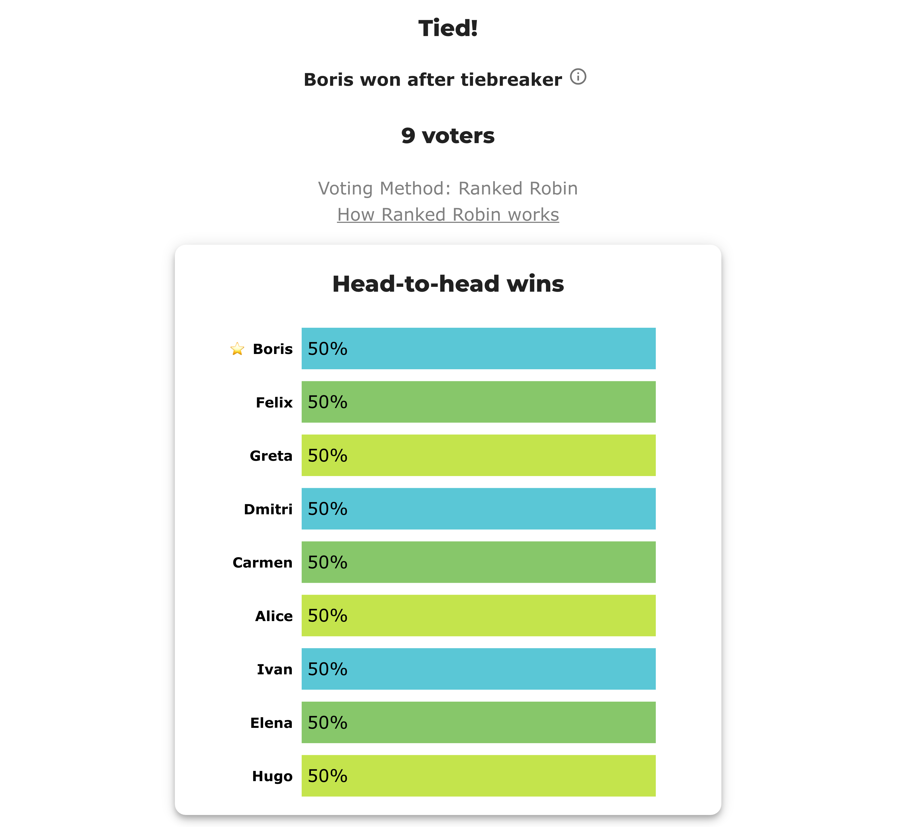

# BV2262 — nine candidates, a nine-way dead heat

*[BV2261](bv2261_y2fbpc_tiebreak_recorded.md) showed that BetterVoting's "random" tiebreak is recorded in full and replayable, on three candidates. This is the scale check: **nine** candidates, a nine-way deadlock where nothing in the ballots separates anybody, and a shuffle that genuinely scrambles the field. Same result — the export pins the winner, and four independent checks agree.*

**▶ Live on BetterVoting:** [vote](https://bettervoting.com/2gvwr9) · **[results ↗](https://bettervoting.com/2gvwr9/results)** (election `2gvwr9`).

## The round table

Nine club members sit around a table, and all nine are candidates for chair. Each member ranks **themselves first, then continues clockwise** — so the nine ballots are nine rotations of one order:

```
Alice>Boris>Carmen>Dmitri>Elena>Felix>Greta>Hugo>Ivan
Boris>Carmen>Dmitri>Elena>Felix>Greta>Hugo>Ivan>Alice
Carmen>Dmitri>Elena>Felix>Greta>Hugo>Ivan>Alice>Boris
… and so on, one rotation per member
```

That construction makes the deadlock **exact rather than fiddled**. For two candidates at cyclic distance *d* around the table, exactly `9 − d` voters prefer the earlier one — so every member beats the four who follow them and loses to the four who precede them:

- all nine finish **4–4–0**, Copeland **4**
- each one's margins are **+7, +5, +3, +1** against **−7, −5, −3, −1** — a net of **+0**, for all nine

So the Copeland rung ties, the margin rung ties, and BetterVoting's head-to-head rung **cannot even apply** — it is 2-way only, and nine are tied. Both engines are forced onto their rung of last resort. This is a nine-way Condorcet cycle, note, not a set of drawn matchups: every pairwise result has a clear winner.

## What BetterVoting recorded



```
tieBreakType : random
perm         : Boris, Felix, Greta, Dmitri, Carmen, Alice, Ivan, Elena, Hugo
elected      : Boris   (tieBreakOrder 0, copelandScore 4)
tied  (n=9)  : Boris 0, Felix 1, Greta 2, Dmitri 3, Carmen 4, Alice 5, Ivan 6, Elena 7, Hugo 8
other (n=8)  : Felix 1, Greta 2, Dmitri 3, Carmen 4, Alice 5, Ivan 6, Elena 7, Hugo 8
logs         : "Boris picked in random tie-breaker, more robust tiebreaker not yet implemented."
```

**A nine-deep order, not a winner.** `tied[]` carries all nine with `tieBreakOrder` 0–8, and `other[]` lists the eight losers in that same sequence.

And this shuffle is emphatically **not a no-op** — Boris is 2nd in the candidate list and 1st in the draw; Alice falls from 1st to 6th. At three candidates the winner happened to be first in list order either way, so matching it proved less. Here it proves the thing.

Worth noticing in the screenshot: the bar chart lists the candidates **in `perm` order**, because everything else about them is equal. The tiebreak sequence is on screen — the page just never says that's what it is.

## The LH side

The YAML pins `lot_numbers` to BV's recorded `perm`, and LH's lot rung lands in the same place:

→ page: [`bv2262_2gvwr9_nine_way_dead_heat.md`](cases/cases_pages/bv2262_2gvwr9_nine_way_dead_heat.md) · src: [`.yaml`](cases/bv2262_2gvwr9_nine_way_dead_heat.yaml)

```
Win–loss record — Copeland score = wins + ½·ties (highest score wins; ties broken by total margin, then lot order):
    #  Candidate  W–L–T  Copeland  Margin  Beats
    1  Boris      4–4–0         4      +0  Felix, Dmitri, Carmen, Elena
    2  Felix      4–4–0         4      +0  Greta, Alice, Ivan, Hugo
    3  Greta      4–4–0         4      +0  Boris, Alice, Ivan, Hugo
    4  Dmitri     4–4–0         4      +0  Felix, Greta, Elena, Hugo
    5  Carmen     4–4–0         4      +0  Felix, Greta, Dmitri, Elena
    6  Alice      4–4–0         4      +0  Boris, Dmitri, Carmen, Elena
    7  Ivan       4–4–0         4      +0  Boris, Dmitri, Carmen, Alice
    8  Elena      4–4–0         4      +0  Felix, Greta, Ivan, Hugo
    9  Hugo       4–4–0         4      +0  Boris, Carmen, Alice, Ivan

Winner — Ranked Robin (RCV-RR): Boris
   *** 9 candidates tie for the most wins (Alice, Boris, Carmen, Dmitri, Elena, Felix, Greta, Hugo, Ivan) — a Condorcet cycle (no candidate beats all others). Resolved by total margin, then lot order.
```

Not just the winner — **all nine rows are in BV's `perm` order**, because the lot decided the whole ranking.

## Four checks, all passing

| # | Check | Result |
|---|---|---|
| 1 | **BV → LH.** LH with `lot_numbers` = BV's `perm` | **Boris**, and all nine positions match ✓ |
| 2 | **Re-tally stability.** Re-fetch `2gvwr9` from the API | `perm`, `tieBreakOrder` and winner byte-identical ✓ |
| 3 | **Independent replay.** [`bv_replay_tiebreak.py`](../../../STARVote_LH_tabulation_engine/tools_adam/bv_replay_tiebreak.py) recomputes the shuffle from `(9 ballots + raceId)` — **no ballot content** | seed `2105118061` → the same nine-deep order ✓ |
| 4 | **Third-party tabulation.** `pref_voting`'s Copeland via [`ranked_robin_report.py`](../../../STARVote_LH_tabulation_engine/tools_adam/pref_voting_tabulation_engine/ranked_robin_report.py) | nine-way leader set, declines to choose — CONSISTENT ✓ |

Run checks 3 and 4 yourself:

```bash
python3 STARVote_LH_tabulation_engine/tools_adam/bv_replay_tiebreak.py 05_Ranked_Robin/03_Criteria/rr_tiebreaks/cases/bv2262_2gvwr9_nine_way_dead_heat_bv_export.json
```

```bash
uv run STARVote_LH_tabulation_engine/tools_adam/pref_voting_tabulation_engine/ranked_robin_report.py 05_Ranked_Robin/03_Criteria/rr_tiebreaks/cases/bv2262_2gvwr9_nine_way_dead_heat.yaml
```

Check 3 is the one that matters most, and it is worth being precise about what it shows. The replay is fed **the ballot count and the race id, and nothing else** — not a single ranking. It still reproduces the exact order BetterVoting drew. That is the whole claim in one command: the tiebreak is a function of `(9, "27a17c0c-5ba6-4778-a417-be2943723589")`, never of how anyone voted.

## So: recorded, and still not derivable

Nine candidates changes nothing about the two properties, and the scale makes both sharper:

- **Recorded** — the export publishes the complete nine-deep order and reproduces it on demand. Anyone holding the JSON can audit exactly what happened, and any engine can replay it.
- **Not derivable** — rewrite all nine ballots however you like (keep nine of them, keep the race tied) and Boris still wins. The draw is blind to the votes.

Which is why this election is honest to publish while a *tie-deciding teaching case* still isn't: BV2262's subject is the recording mechanism, and it says outright to ignore who won. A page arguing that some candidate *deserved* to win on these ballots would be resting on a database UUID. LH's `lot_numbers` is the alternative — a lot published **in the file**, before the count, that a reader can check end to end.

## Related

- **The three-candidate original:** [BV2261 — the random tiebreak is recorded, not lost](bv2261_y2fbpc_tiebreak_recorded.md)
- **The ladder, and where LH and BV part ways:** [Ranked Robin tiebreaks — LH vs BetterVoting](../../01_Learn/rr_tiebreak_lh_vs_bv.md)
- **Other cases here:** [dead heat → lot order](dead_heat_lot_tiebreak.md) · [BV2141, all four Equal-Vote degrees](bv2141_3r3yf7_four_degree_tie.md)
- **Why a cycle has no right answer:** [cycle resolution](../../01_Learn/cycle_resolution.md) · **why some tie is unavoidable:** [Ties Are Forced](../../../07_Concepts/topics/ties/ties_are_forced.md)
- **Engine internals:** [BetterVoting tabulation engine](../../../07_Concepts/tabulation_engines/BV/tabulation_engine/README.md) — the "Deterministic *random* tie-breaks" section
- **Frozen export:** [`bv2262_2gvwr9_nine_way_dead_heat_bv_export.json`](cases/bv2262_2gvwr9_nine_way_dead_heat_bv_export.json)

# file: bv2262_2gvwr9_nine_way_dead_heat.md
