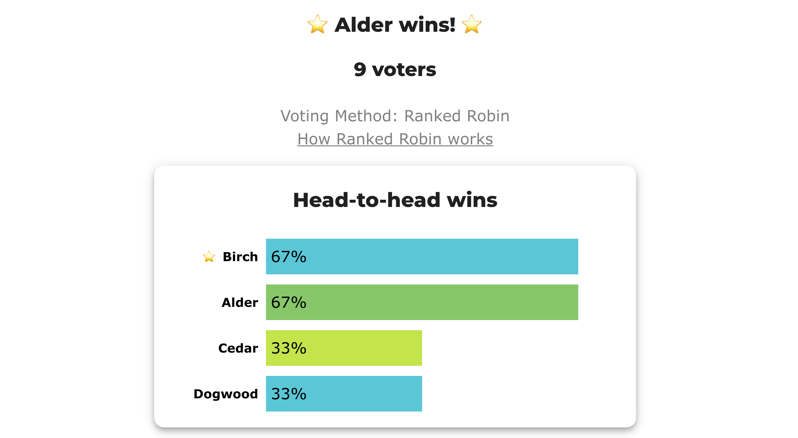

# BV2270 — the rung where the two engines elect different people

<!-- case-meta:start — managed by build_yaml_pages.py; edit the YAML, not these lines -->
**Method:** [Ranked Robin (RCV-RR / Copeland)](../../01_Learn) · **1 seat** · **Expected winner:** Birch · [full count →](cases/cases_pages/bv2270_8h4bvh_head_to_head_vs_margin.md)
<!-- case-meta:end -->

**Level: 301 · deep dive**

*Every other case in this folder ties all the way to the bottom of the ladder, where LH draws a published lot and BetterVoting draws a seeded shuffle. This one stops on the **middle** rung — and that is where the two engines stop agreeing. Nine ballots, a two-way Copeland tie, no lot on either side, and **two different winners**: LH elects Birch on total margin, BetterVoting elects Alder head-to-head. Both answers are derivable from the ballots. They are simply not the same answer.*

**▶ Live on BetterVoting:** [vote](https://bettervoting.com/8h4bvh) · **[results ↗](https://bettervoting.com/8h4bvh/results)** (election `8h4bvh`).

## The election

Nine voters rank four trees for a street-planting commission.

```
4 × Alder   > Birch   > Cedar   > Dogwood
3 × Dogwood > Cedar   > Birch   > Alder
1 × Birch   > Cedar   > Dogwood > Alder
1 × Dogwood > Alder   > Birch   > Cedar
```

Six matchups, every one of them decisive:

| Match | Result |
|---|---|
| Alder v Birch | **Alder** 5 – 4 |
| Alder v Cedar | **Alder** 5 – 4 |
| Alder v Dogwood | **Dogwood** 5 – 4 |
| Birch v Cedar | **Birch** 6 – 3 |
| Birch v Dogwood | **Birch** 5 – 4 |
| Cedar v Dogwood | **Cedar** 5 – 4 |

| | W–L | Copeland | Margin | Beats |
|---|:---:|:---:|:---:|---|
| **Birch** | 2–1 | **2** | **+3** | Cedar, Dogwood |
| **Alder** | 2–1 | **2** | **+1** | Birch, Cedar |
| Dogwood | 1–2 | 1 | −1 | Alder |
| Cedar | 1–2 | 1 | −3 | Dogwood |

Alder and Birch tie at the top on two wins each. Nothing in the Copeland column separates them, so both engines go to their next rung — and their next rungs are different questions.

## Two rungs, two winners

| | Rung 2 asks | Answer here | Winner |
|---|---|---|---|
| **LH** `run_ranked_robin` | *Who won by more, across all their matches?* | Birch **+3** vs Alder **+1** | **Birch** |
| **BetterVoting** `RankedRobin.ts` | *Who won when these two played each other?* | Alder beat Birch **5 – 4** | **Alder** |

Both are reasonable readings of "strongest". Total margin asks how a candidate did against the **whole field**; head-to-head asks the narrower question of what happened in the one match that is actually between the two of them. Birch's +3 is built on a 6–3 thrashing of Cedar — a win Alder never had the chance to match — while Alder's claim is that when the two tied candidates met, Alder won.

This is a sharper divergence than [the dead-heat case](dead_heat_lot_tiebreak.md), where the ladders differ but both engines still fall through to a rung of last resort. Here **neither engine reaches for a lot**. Both stop on rung 2 with a computed answer, and the answers differ.

That also makes the case unusual for this folder in a second way: it is BV-backed *and* divergent. The dead-heat case stays LH-only precisely because its winner turns on a draw that can't be derived from the ballots. Nothing here turns on a draw.

## What the neutral third engine says

The repo's rule for Ranked Robin is to check every case three ways, and the third leg is the one nobody here wrote — [`pref_voting`](../../../STARVote_LH_tabulation_engine/tools_adam/pref_voting_tabulation_engine/ranked_robin_report.py)'s independent Copeland:

```
 pref_voting Copeland leader(s): Alder, Birch
 cross-check vs Ranked Robin winner (Birch): CONSISTENT ✓  (LH tie-broke within pref_voting's 2-way Copeland-leader set)
```

It reproduces the tally exactly, reports the **whole leader set**, and declines to pick. That is the honest position, and it is the point of the case: the two engines do not disagree about the count. They agree on all six matchups, on both Copeland scores and on every margin. They disagree about **the rule for what to do next** — and no amount of re-counting will settle that.

## Nobody actually wins here

Worth saying plainly, because the win–loss table hides it: this field is a **[Condorcet cycle](../../01_Learn/cycle_resolution.md)**. Alder beats Birch, Birch beats Dogwood, Dogwood beats Alder. There is no [Condorcet winner](../../../07_Concepts/topics/condorcet/README.md), and the [Smith set](../../../07_Concepts/topics/smith_set.md) is **all four candidates** — even Cedar, sitting last on the Copeland table, belongs to the smallest group that beats everyone outside it, because there is no outside.

So the top two rows of the record understate the contention. Ranked Robin is Smith-efficient, so whichever of Alder or Birch is picked is inside the set and the method has done its job; but "who *should* win a cycle" is exactly the question [Minimax, Ranked Pairs and Schulze answer differently](../../01_Learn/cycle_resolution.md), and rung 2 of a Copeland ladder is a very thin place to be answering it.

## Why this election exists — and a warning about its results page

BV2270 was minted to demonstrate a **display** defect in BetterVoting, reported as [bettervoting#1480](https://github.com/Equal-Vote/bettervoting/issues/1480). The results page highlights winners by **row position**, but the winner comes from the ladder — and here those disagree:




**Do not read the star as BetterVoting's answer.** BV's answer is **Alder** — stated in the heading and in the export's `elected` — and the star on Birch is the bug. The candidate rows are sorted by Copeland score and then by BV's `tieBreakOrder`, a shuffle seeded from the ballot count and the race id ([BV2261](bv2261_y2fbpc_tiebreak_recorded.md) is the case that pins down how that works). Here it drew `Cedar 0, Birch 1, Dogwood 2, Alder 3`, so Birch landed in row 0 and collected a decoration meant for the winner.

That the shuffle appears at all is worth being careful about: `tieBreakType` in this export is **`none`**. No random rung fired. The shuffle is only ever deciding *display order* in this election — it has no bearing on who won under either engine.

Two things fall out of that, both useful:

- The three `Dogwood>Cedar>Birch>Alder` ballots are **mirror images** of three of the `Alder>Birch>Cedar>Dogwood` ballots. They were cast on the live election to re-roll the display shuffle, which re-seeds on every vote by design. A ranking and its exact reverse cancel on all six matchups, so the tally you see above is identical to the three-ballot original — every margin, every Copeland score and both engines' winners unchanged. It is a clean way to re-roll a 50/50 draw without touching the election.
- The sibling defect — the Ranked Robin results page starring only **one** winner in a multi-winner race — is [bettervoting#1166](https://github.com/Equal-Vote/bettervoting/issues/1166), fixed in [PR #1479](https://github.com/Equal-Vote/bettervoting/pull/1479).

## The full count

--8<-- "05_Ranked_Robin/03_Criteria/rr_tiebreaks/cases/cases_pages/bv2270_8h4bvh_head_to_head_vs_margin.md:report"

→ page: [`bv2270_8h4bvh_head_to_head_vs_margin.md`](cases/cases_pages/bv2270_8h4bvh_head_to_head_vs_margin.md) · src: [`.yaml`](cases/bv2270_8h4bvh_head_to_head_vs_margin.yaml) · frozen: [`_bv_export.json`](cases/bv2270_8h4bvh_head_to_head_vs_margin_bv_export.json)

**See also:** [Ranked Robin tie-breaks — LH vs BetterVoting](../../01_Learn/rr_tiebreak_lh_vs_bv.md) · [the folder index](README.md) · [BV2261 — the tiebreak is recorded](bv2261_y2fbpc_tiebreak_recorded.md)

# file: bv2270_8h4bvh_head_to_head_vs_margin.md
