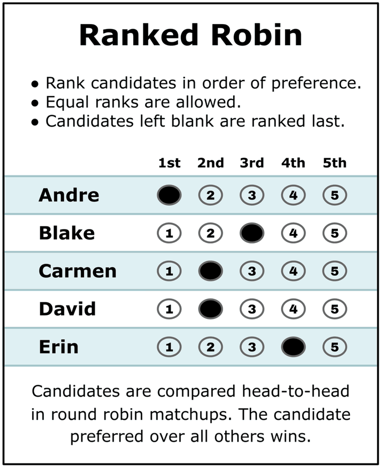

# 05_Ranked_Robin — Ranked Robin (RCV-RR / Copeland)

*Rank the candidates. Compare every pair head-to-head. Whoever beats the most rivals wins.*



*The ballot ([Equal Vote](https://www.equal.vote/ranked_robin)) — note Carmen and David share 2nd place: unlike RCV-IRV, Ranked Robin lets you rank candidates equally.*

**Ranked Robin is a brand name, not a new method.** Peel it apart and only one layer is actually new:

| Layer | What it really is | Since | New? |
|---|---|---|:--:|
| Compare every pair head-to-head; whoever wins the most matchups wins | **Copeland's method** — the whole core of it | first described **1299** (Ramon Llull), rediscovered by Condorcet in the 1780s, formalised by Copeland in 1951 | no |
| Ties broken by summing win margins | **Copeland//Borda** — a standard, long-known construction | — | no |
| The words *"Ranked Robin"* | **Equal Vote's branding**, coined by Sara Wolk | **2021** | **yes — the name is the only new part** |

So the honest one-liner is *Copeland with a specified tiebreak, under a friendlier name.* We say `≈` rather than `=` only because plain Copeland leaves the cycle tiebreak unspecified and Ranked Robin pins one down.

**Equal Vote says so too, now.** Their current page opens by calling it "a modern name for one of the oldest voting methods out there. First described in the literature in 1299" — wording their [previous version](https://www.equal.vote/ranked_robin_old) did not have; that page never mentioned Copeland or 1299 at all. And on electowiki's talk page in 2025 Sara Wolk, who coined the term, wrote that she "always intended the name Ranked Robin to be a rebrand of Condorcet," with the first takeaway: *"Ranked Robin is a synonym for Condorcet on a ranked ballot."* The Copeland-plus-margins procedure is Equal Vote's *default recommendation*, not the whole meaning of the name — and she notes it is under review. That same talk page opens with Markus Schulze objecting in 2021 that the title is misleading, since "round robin" has long covered Condorcet methods generally.

What it *does* is take the same **ranked** ballot RCV-IRV uses and count it a completely different way. Instead of eliminating candidates round by round, it runs a **round robin**: every candidate against every other, like a sports league. Because every ballot is read in *every* matchup, nothing is ever discarded — and whenever some candidate beats all rivals head-to-head (a [Condorcet winner](../07_Concepts/topics/condorcet/README.md)), Ranked Robin elects them.

*Sources: [Ranked Robin (electowiki)](https://electowiki.org/wiki/Ranked_Robin) — the canonical definition of the name — and [its talk page](https://electowiki.org/wiki/Talk:Ranked_Robin) for the exchange above. Both are a community wiki and Equal-Vote-adjacent: good for definitions, weak for verdicts. The same method also travels as **Consensus Voting**, has a sibling brand in **Consensus Choice**, and sits in the **Condorcet** / round-robin family. Which word means what → [the naming decoder](concepts/condorcet_naming_decoder.md); which one we ought to lead with, argued both ways → [What should we call this method?](concepts/what_to_call_this_method.md).*

This page is the folder's front door: the method, one worked election, and the index of runnable examples below. The full concept treatment lives next door — **[Ranked Robin — the method](concepts/ranked_robin.md)** (mechanics, names, family), **[Why Ranked Robin](concepts/why_ranked_robin.md)** (the positive case), **[honest limits](concepts/RCV_RR_honest_limits.md)** (where it struggles), and the [full concept index](concepts/README.md).

---

## How it counts — a worked election

Thirteen voters, four candidates on a left→right line: **Ada** (left), **Ben** (center-left), **Cara** (center-right), **Dan** (right). Each row is a bloc of identical ballots.

```text
4 : Ada > Ben > Cara > Dan
4 : Dan > Cara > Ben > Ada
3 : Ben > Cara > Ada > Dan
2 : Cara > Ben > Dan > Ada
```

Count **first choices** and Ada and Dan lead with 4 each; Ben has only 3. Under Choose-One plurality, one of the two poles wins. Now compare every pair head-to-head instead:

```text
Round-Robin — every pair, head-to-head (For – Against):
   Ben   beats Ada    9 – 4
   Cara  beats Ada    9 – 4
   Ada   beats Dan    7 – 6
   Ben   beats Cara   7 – 6
   Ben   beats Dan    9 – 4
   Cara  beats Dan    9 – 4

Win–loss record — Copeland score = wins + ½·ties (highest score wins; ties broken by total margin, then lot order):
    #  Candidate  W–L–T  Copeland  Margin  Beats
    1  Ben        3–0–0         3     +11  Cara, Ada, Dan
    2  Cara       2–1–0         2      +9  Ada, Dan
    3  Ada        1–2–0         1      -9  Dan
    4  Dan        0–3–0         0     -11  —

Winner — Ranked Robin (RCV-RR): Ben
   beats every opponent head-to-head — the Condorcet winner.
```

**Ben wins 3–0.** A majority prefers him to each rival, one on one — so he's the Condorcet winner, and Ranked Robin elects him. The lesson: RR elects the **consensus** candidate, not the largest faction's favorite. Nobody had to be eliminated, and no ballot went uncounted.

*(Honest footnote: RCV-IRV elects Ben here too — Cara is eliminated first and her ballots flow to Ben. This election separates Ranked Robin from **plurality**, not from IRV. For the case where RR and IRV genuinely part ways, see the Tennessee [center squeeze](../06_Other/RCV_IRV/concepts/RCV_IRV_center_squeeze.md) in the examples below.)*

Want the whole count — the pairwise matrix, the [Smith set](../07_Concepts/topics/smith_set.md), the audit trail? → the full report: [`ranked_robin_consensus_center.md`](_main/cases/cases_pages/ranked_robin_consensus_center.md) · run it yourself: [`.yaml`](_main/cases/ranked_robin_consensus_center.yaml)

## How it differs from RCV-IRV

Same ranked ballot, opposite counting philosophy — read the whole ballot against everyone, or eliminate until someone has a majority of what's left:

| | **RCV-IRV (Hare)** | **Ranked Robin (RCV-RR)** |
|---|---|---|
| Ballot | Rank, **no equal ranks** | Rank, **[equal ranks](../07_Concepts/scores_and_ranks/strict_vs_weak_ranks.md) allowed** |
| How it counts | Eliminate fewest-first-choices, transfer, repeat | Compare **every pair**; most head-to-head wins |
| Uses your lower ranks? | Only after higher ones are eliminated | **Always** — every ranking counts against every opponent |
| Elects the Condorcet winner? | Not always (can center-squeeze) | ✅ Yes, when one exists |
| Monotonic? | ❌ No | ✅ Yes |
| [Precinct-summable](../07_Concepts/topics/summability/README.md)? | ❌ No | ✅ Yes (add pairwise matrices) |
| [Exhausted ballots](../06_Other/RCV_IRV/concepts/RCV_IRV_exhausted_ballots.md)? | Possible | **No** — every ballot is read in every pairwise contest |

*(The canonical, fuller version of this table — plus the cycle question, the naming family, and the sourcing — is on the [method page](concepts/ranked_robin.md).)*

---

## The worked examples

Runnable elections, each isolating one idea. Tabulate any of them yourself.

| Where | What |
|---|---|
| [The worked intro — the consensus center wins](_main/) | the election above: Ben beats every rival head-to-head and wins 3–0, though Ada and Dan each hold more first choices |
| [Condorcet vs. Ranked Robin — worked examples](condorcet_vs_ranked_robin/) | a clean Condorcet winner, a genuine cycle (rock/paper/scissors) and how RR resolves it, and a real 0-wins record |
| [RR vs. IRV vs. plurality — same ballots](rr_vs_irv_plurality/) | one ranked ballot set, three winners — the Tennessee center-squeeze (BV-backed, triple-checked: LH / BetterVoting / pref_voting) |
| [Tiebreaks — dead heat → lot](rr_tiebreaks/) | the Equal Support column, the ½-Copeland credit, and the full ladder to lot order — and where the LH & BetterVoting tiebreaks [diverge](concepts/rr_tiebreak_lh_vs_bv.md) |
| [**The Copeland score — a draw is worth half a win**](copeland_score/) | why "most head-to-head wins" is a shorthand and not the rule: a single ½-credit elects a candidate who ties on raw wins *and lost a matchup* — and puts Copeland alone against every other Condorcet method, which is the C1/C2 divide made visible |
| [**Most matchups won ≠ Condorcet winner**](most_wins_vs_condorcet/) | the claim-check companion: 18 voters, no drawn matchups at all, and the candidate with strictly the most wins still loses a head-to-head. Every margin is 12–6, so Minimax / Ranked Pairs / Schulze / Split Cycle all tie five ways and only Copeland decides — the mirror image of the case above |
| [**Burial — RR's signature wart, worked**](burial/) | the sincere/buried pair (BV2208/BV2209): fifteen voters rank the Condorcet winner last, manufacture a cycle, and win the record tie — triple-checked, deterministic on both engines |
| [STAR vs RR — 30 divergence samples](star_vs_rr_divergence/) | an auto-generated dump of 30 elections where STAR and RR elect different winners, spread across candidate field (3/5/7/10), electorate size, and grouped-vs-random structure — each YAML states its own cause (cycle vs dark horse), with RCV-IRV / Approval / Plurality on the same ballots (they scatter — no clean alignment). Empirical companion to the [simulation](../06_Other/simulations/README.md#star-vs-ranked-robin-divergence-simulation) |

Same ballot, different count: RCV-IRV (elimination rounds) lives in [other methods](../06_Other/) and inside the comparison sets.

**Conversation scripts:** the Larry ↔ Adam series (STAR + RCV-IRV) is indexed in [Conversation scripts — index](../07_Concepts/about_this_repo/conversation_scripts.md).

# file: README.md
