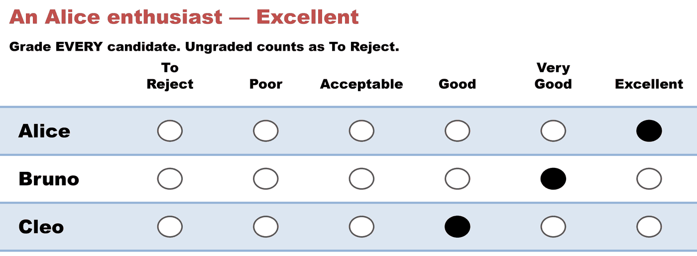
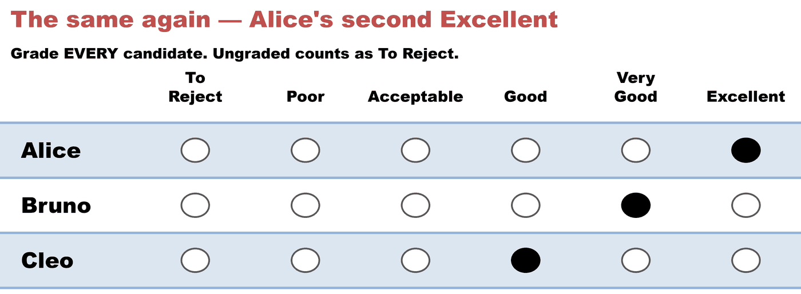
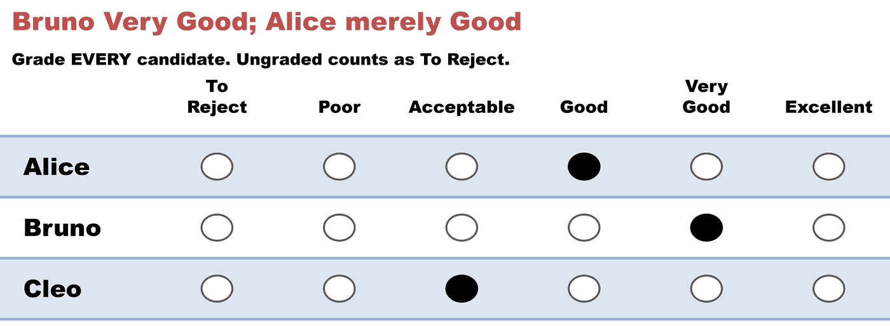
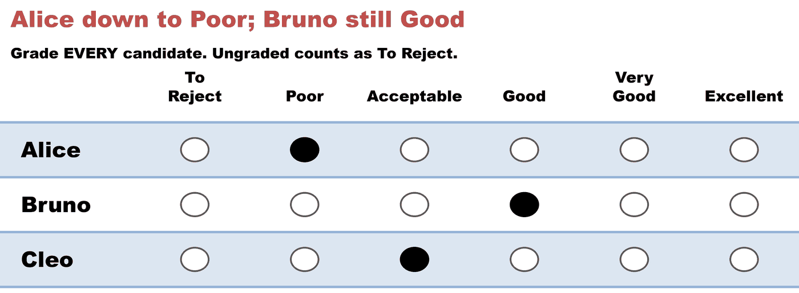
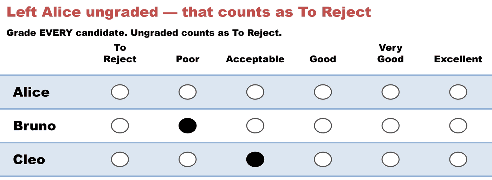
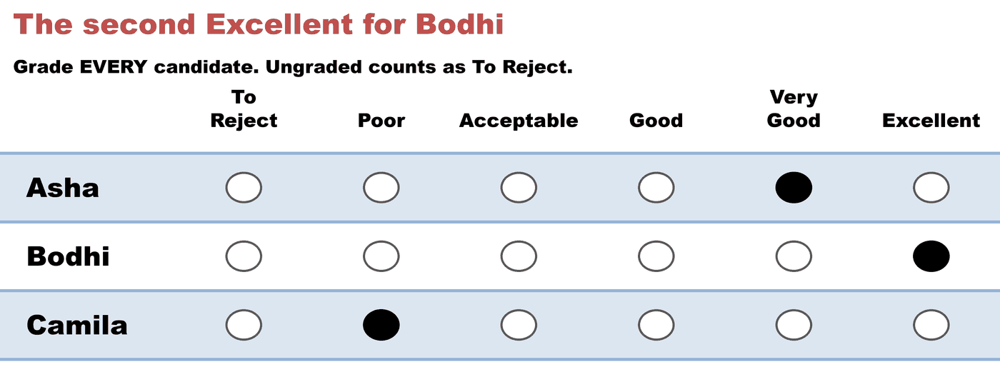
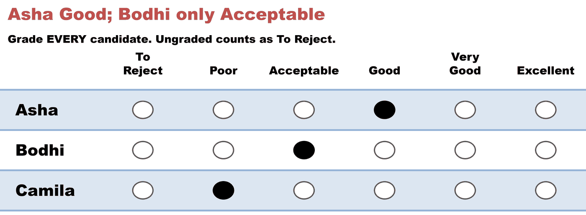
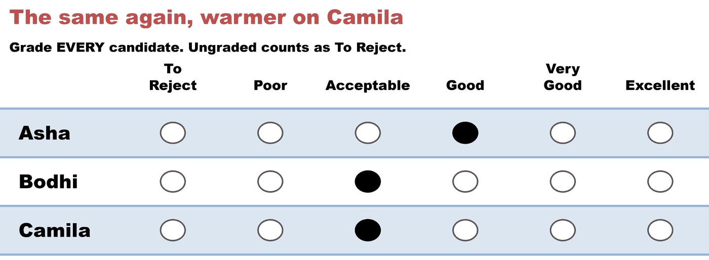
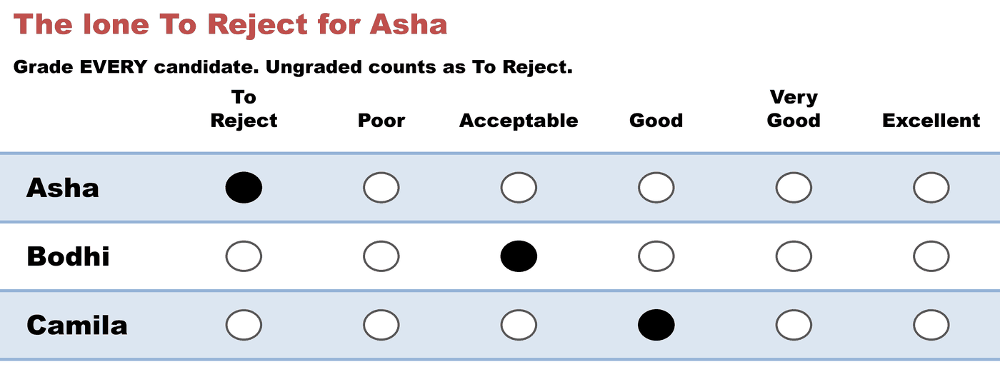

# Majority Judgment

*Every voter **grades each candidate** in a shared language of words — To Reject, Poor, Acceptable, Good, Very Good, Excellent — and the candidate with the highest **median** grade wins. Not the total, not the average: line each candidate's grades up in order and take the middle one. Michel Balinski and Rida Laraki proposed it in 2011 as a replacement for the whole ranked model, not just for one counting rule.*

→ **Run it:** the 101 case [`mj_101_c3_b5.yaml`](../cases/mj_101_c3_b5.yaml) · Counted by [`grade_methods_report.py`](../../../STARVote_LH_tabulation_engine/tools_adam/pref_voting_tabulation_engine/README.md) (`pref_voting` cross-checked). · The argument: [Grading as a rival primitive](../../../07_Concepts/scores_and_ranks/grading_as_a_rival_primitive.md). · The case against: [Majority Judgment's paradoxes](../../../07_Concepts/voting_paradoxes/majority_judgment.md). · Family: [Approval](../../../04_Approval/01_Learn/approval_voting.md) · [Range / Score](../../Range/concepts/range_voting.md) · [STAR](../../../01_STAR/01_Learn/README.md).

> **Non-EVC method.** MJ is a rival to STAR from *inside* the cardinal camp — it argues against summing scores, which is what STAR's Scoring Round does. This library teaches *about* it rather than promoting it, so it lives in [other methods](../../README.md). The honest comparison is the point, and quoting Balinski and Laraki as allies for "score ballots are better" while their book argues against the aggregation rule would not be honest.

---

## How it works

The ballot is a **grade grid** — one column per grade, and the columns are *words*, not numbers. That is not decoration. Balinski and Laraki's central claim is that a shared vocabulary — the same *Excellent* you and I both learned from school reports, wine judging and figure skating — carries meaning that a bare 7-out-of-10 does not, and that this common language is what makes one voter's grade comparable to another's.

Here are the five ballots of the [101 case](../cases/mj_101_c3_b5.yaml) exactly as those voters marked them, each with the grades the file records underneath:

<!-- ballots:mj_101_c3_b5 -->
The ballots as marked — the filled bubble is the grade given, and the grade is the word in its column. The grades the file records are repeated under each ballot:



Alice **Excellent** · Bruno **Very Good** · Cleo **Good**



Alice **Excellent** · Bruno **Very Good** · Cleo **Good**



Alice **Good** · Bruno **Very Good** · Cleo **Acceptable**



Alice **Poor** · Bruno **Good** · Cleo **Acceptable**



Alice **—** · Bruno **Poor** · Cleo **Acceptable**
<!-- /ballots -->

Note Voter 5's ballot: they left Alice's row **untouched**. Under this procedure an ungraded candidate takes the bottom of the scale, so that blank counts as *To Reject*. The rule looks like bookkeeping and is not — it is the entire mechanism of MJ's truncation paradox, where a voter does better by saying *less*.

## The count — the middle grade, not the average

Take each candidate's five grades, put them in order, and read off the one in the middle:

| Candidate | Grades in order | **Median** | (mean, for contrast) |
|---|---|:--:|:--:|
| Alice | To Reject · Poor · **Good** · Excellent · Excellent | **Good** | 2.8 |
| **Bruno** | Poor · Good · **Very Good** · Very Good · Very Good | **Very Good** | 3.2 |
| Cleo | Acceptable · Acceptable · **Acceptable** · Good · Good | **Acceptable** | 2.4 |

**Bruno wins** on a median of *Very Good*.

The candidate to watch is **Alice**. She collects the two loudest grades on the whole ballot — two *Excellent*s, more enthusiasm than anyone else gets — and still finishes second, because her median is only *Good*. That is the median doing precisely the job it was chosen for: **nobody can lift a candidate by grading them harder**, only by being one more voter who puts them at or above that middle grade. Where [Range](../../Range/concepts/range_voting.md) lets one enthusiast's 10 outweigh three quiet majorities, the median cannot be dragged that way.

## When medians tie — the Balinski–Laraki iteration

Two candidates sharing a median is common on a six-word scale, and MJ's answer is its most distinctive machinery: **remove one instance of the shared median from each tied candidate and take the medians again**, repeating until they separate. The candidate who runs out of support at that grade first loses.

It works, and it is opaque. A voter can follow "highest median wins"; almost nobody can follow four iterations of grade-stripping, and the iteration is exactly what makes MJ's [reinforcement failure](../../../07_Concepts/voting_paradoxes/majority_judgment.md) — three regions that each elect y, merging into an electorate that elects x — so hard to see coming. The 101 case above is deliberately built to avoid a tie, so the lesson is the median and not the machinery.

## How it differs from Score — the same ballots, two winners

The comparison that matters most is with [Range / Score](../../Range/concepts/range_voting.md), because MJ and Score hand the voter **the same piece of paper**. Both ask for a grade on every candidate. They part company at exactly one step: Score adds the column up and takes the **mean**, MJ lines it up and takes the **median**. On the 101 case above that difference is invisible — Bruno wins under both, which is the honest picture most of the time. Here is a five-voter election where it isn't:

<!-- ballots:mj_vs_score_c3_b5 -->
The ballots as marked — the filled bubble is the grade given, and the grade is the word in its column. The grades the file records are repeated under each ballot:


Asha **Very Good** · Bodhi **Excellent** · Camila **Poor**



Asha **Very Good** · Bodhi **Excellent** · Camila **Poor**



Asha **Good** · Bodhi **Acceptable** · Camila **Poor**



Asha **Good** · Bodhi **Acceptable** · Camila **Acceptable**



Asha **To Reject** · Bodhi **Acceptable** · Camila **Good**
<!-- /ballots -->

| Candidate | Grades in order | **Median** → MJ | **Mean** → Score |
|---|---|:--:|:--:|
| **Asha** | To Reject · Good · **Good** · Very Good · Very Good | **Good** ✔ | 2.8 |
| **Bodhi** | Acceptable · Acceptable · **Acceptable** · Excellent · Excellent | Acceptable | **3.2** ✔ |
| Camila | Poor · Poor · **Poor** · Acceptable · Good | Poor | 1.6 |

**Score elects Bodhi. Majority Judgment elects Asha.** Nobody changed their mind between the two counts, and no ballot was marked differently — the only thing that changed is what the count does with the column.

```bash
uv run STARVote_LH_tabulation_engine/tools_adam/pref_voting_tabulation_engine/grade_methods_report.py 06_Other/Majority_Judgment/cases/mj_vs_score_c3_b5.yaml
```

```text title="grade_methods_report.py — both winners, from the same file"
Grades:
                     V1          V2          V3          V4          V5     mean      median
   Asha       Very Good   Very Good        Good        Good   To Reject   (2.80)        Good
   Bodhi      Excellent   Excellent  Acceptable  Acceptable  Acceptable   (3.20)  Acceptable
   Camila          Poor        Poor        Poor  Acceptable        Good   (1.60)        Poor

Winner — Range Voting (highest mean): Bodhi
   (grades scored by position on the scale, To Reject=0)

Winner — Majority Judgment (highest median): Asha
   medians: Asha Good, Bodhi Acceptable, Camila Poor

 pref_voting Range (mean): Bodhi   vs this report (Bodhi): AGREE ✓
 pref_voting Majority Judgment: Asha   vs this report (Asha): AGREE ✓
```

The split is legible on the paper. Bodhi holds the two loudest grades in the election — two *Excellent*s — and three voters who say only *Acceptable*. Asha holds no *Excellent* at all: two *Very Good*s, two *Good*s, and one *To Reject*.

- **The mean asks *how much*.** An *Excellent* is worth five and an *Acceptable* two, so Bodhi's two enthusiasts outweigh Asha's four warm-but-not-loud grades. Intensity is information, and Score is the method that counts it.
- **The median asks *where the middle voter stands*.** Four of five voters put Asha at *Good* or better; only two of five put Bodhi above *Acceptable*. How strongly those two feel never enters the count — under MJ, a candidate is lifted by **one more voter reaching the grade**, never by one voter reaching harder.

### The lone *To Reject* is pivotal — under Score only

V5 is the one voter who rejects Asha outright. Had V5 given her the *Good* that V3 and V4 did, her mean would be **3.4** and **Score would elect Asha too** — the divergence exists only because of that single grade. Her median does not move an inch: *Good* with the *To Reject*, *Good* without it.

That one cell is the argument, in both directions at once. Balinski and Laraki designed the median precisely so that a voter cannot sink a candidate by grading them at the floor — the strategy their book is most worried about, and MJ genuinely blocks it. Score advocates answer that V5's *To Reject* is not noise to be filtered out but a voter telling you something real, and a method that shrugs at it has thrown away the evidence it asked for. This election does not settle that; it shows you the exact cell where the two philosophies disagree, and it is one cell.

**The rule of thumb:** the mean moves *smoothly* — change one grade and the total shifts a little. The median moves in *jumps* — change one grade and either nothing happens at all, or the winner changes, depending only on whether you crossed the middle. That is the same sensitivity, seen from the good side here and from the bad side in the [truncation paradox](../../../07_Concepts/voting_paradoxes/majority_judgment.md), where one blank drops a candidate four grades.

## Where it sits in the graded family

- **[Approval](../../../04_Approval/01_Learn/approval_voting.md)** is the same idea at **two grades** — approve or don't.
- **[Range / Score](../../Range/concepts/range_voting.md)** grades on the same kind of paper and counts it by the **mean**. MJ and Range are the *same ballot, different average.*
- **[STAR](../../../01_STAR/01_Learn/README.md)** sums the scores and then holds an automatic runoff between the top two — a majority check bolted onto a sum.
- **MJ** takes the **median** and adds no runoff, because on its own account a majority's *ordering* should not be allowed to overrule the electorate's *evaluations*.

So all four read a grade of some resolution; they differ in what they do with the column afterwards. See the [fidelity ladder](../../../07_Concepts/scores_and_ranks/fidelity_ladder.md).

## Pros and cons

| Pros | Cons |
|---|---|
| ✅ **Robust to exaggeration.** One voter's *Excellent* cannot drag the median the way it drags a mean — the strongest argument for the method, and it is a real one. | ⚠️ **Fails the majority criterion — by design.** A candidate an absolute majority grades above another can lose. Balinski and Laraki defend this; most voters would call it a bug. |
| ✅ **A common language of words** rather than bare numbers, which is what the method offers as an answer to "your 7 isn't my 7". | ⚠️ **The premise is now contested experimentally.** [Delemazure, Brunetti, Baujard & Bouveret (2026)](https://hal.science/hal-05114129v1) found grade distributions shift with the scale offered — evidence *against* grades carrying absolute meaning. |
| ✅ **Strategy-proof in grading** — Balinski & Laraki prove median-type rules are the ones a voter cannot push in their preferred direction by misreporting a grade. | ⚠️ **Fails the Condorcet criterion**, also by design, and carries the longest paradox list in Felsenthal's appendix: [worked here](../../../07_Concepts/voting_paradoxes/majority_judgment.md). |
| ✅ **Independence of irrelevant alternatives holds trivially** — a candidate's median depends only on that candidate's own grades, so Arrow's theorem doesn't bind. | ⚠️ **The tie-break is opaque.** Medians tie often, and "iterate until they separate" is not something a voter can check by eye. |
| ✅ **Field-tested on real voters** — the Orsay 2007 experiment ran MJ alongside the French presidential first round, with ~1.08% invalid ballots. | ⚠️ **A median discards magnitude entirely.** Two *Excellent*s and two *To Reject*s read the same as four *Acceptable*s if the middle grade matches. |

**The one-line summary:** MJ fixes the mean's intensity problem by refusing to average at all — and inherits a different disease, in which one well-placed middle grade can overrule an absolute majority. Whether that trade is worth it is the whole debate, and the paradoxes page is where it gets argued.

## Ballot examples

- [`06_Other/Majority_Judgment/cases/mj_101_c3_b5.yaml`](../cases/mj_101_c3_b5.yaml) — the intro above (three candidates, five voters, the six-word scale, one ungraded cell).
- [`06_Other/Majority_Judgment/cases/mj_vs_score_c3_b5.yaml`](../cases/mj_vs_score_c3_b5.yaml) — the mean-versus-median split above: the same five ballots elect Bodhi under Score and Asha under MJ.
- Felsenthal's four §A9 examples — the case against — live in [Felsenthal's paradox review, worked](../../../method_comparisons/felsenthal_paradoxes/README.md) and are worked on [Majority Judgment's paradoxes](../../../07_Concepts/voting_paradoxes/majority_judgment.md).

## Links

- **[Majority Judgment: Measuring, Ranking, and Electing](https://mitpress.mit.edu/9780262545716/majority-judgment/)** — Balinski & Laraki (MIT Press, 2011), the method's own case. *(The authors advocating their own method — the strongest rival case within the cardinal camp, and one that cuts against score-summing.)*
- [Balinski & Laraki, *Election by Majority Judgment: Experimental Evidence*](https://www.rangevoting.org/ElectionByMajorityJudgmentExptEvidenceFinal.pdf) — the Orsay 2007 write-up. *(Hosted on rangevoting.org, which advocates score voting and is critical of MJ; the paper is the authors' own, the host is not neutral.)*
- [Majority judgment — Wikipedia](https://en.wikipedia.org/wiki/Majority_judgment) — the neutral summary, with the criteria table.
- Glossary: [Glossary — voting methods & criteria](../../../07_Concepts/GLOSSARY.md) · reading list: [Rated & score methods](../../../07_Concepts/books/rated_and_score_methods.md).

## Tabulation (the details)

MJ exists in neither the LH engine nor BetterVoting — its ballot holds words and its tie-break is unique to it — so files here carry a `grades:` block instead of `ballots:` and are counted by [`grade_methods_report.py`](../../../STARVote_LH_tabulation_engine/tools_adam/pref_voting_tabulation_engine/README.md), which computes the median and the Balinski–Laraki iteration from scratch and cross-checks both against `pref_voting` on every run:

```bash
uv run STARVote_LH_tabulation_engine/tools_adam/pref_voting_tabulation_engine/grade_methods_report.py 06_Other/Majority_Judgment/cases/mj_101_c3_b5.yaml
```

```text title="grade_methods_report.py — the full count for mj_101_c3_b5.yaml"
=== Range Voting (mean) and Majority Judgment (median) ===
 5 voters, 3 candidates, grades To Reject–Excellent.

Grades:
                    V1          V2          V3          V4          V5     mean      median
   Alice     Excellent   Excellent        Good        Poor   To Reject   (2.80)        Good
   Bruno     Very Good   Very Good   Very Good        Good        Poor   (3.20)   Very Good
   Cleo           Good        Good  Acceptable  Acceptable  Acceptable   (2.40)  Acceptable

 1 ungraded cell(s) took the scale floor (To Reject): Alice/V5.
 That convention — ungraded equals lowest — is what makes truncation profitable under both rules.

Winner — Range Voting (highest mean): Bruno
   (grades scored by position on the scale, To Reject=0)

Winner — Majority Judgment (highest median): Bruno
   medians: Alice Good, Bruno Very Good, Cleo Acceptable

 pref_voting Range (mean): Bruno   vs this report (Bruno): AGREE ✓
 pref_voting Majority Judgment: Bruno   vs this report (Bruno): AGREE ✓
```

**One caveat worth stating before you quote an MJ number.** The tie-break has **two published readings**, and they are not interchangeable. This repo's tool implements the *iterative* one — strip a shared median, recompute, repeat. `pref_voting` implements the **majority gauge**: compare the share of voters above the median against the share below. On a profile where two candidates share a median and both have more detractors than supporters at it, the gauge as implemented compares only the losing shares and can return a **tie** where the iteration separates the candidates cleanly. Both descend from Balinski and Laraki; say which one a number came from. The 101 case above sidesteps the question by having no tie at all, which is why its two cross-checks agree.

The same tool counts [Range / Score](../../Range/concepts/range_voting.md) on the same files — that is why every report prints both winners. Reading the mean and the median side by side is the fastest way to see what choosing one over the other actually costs.
