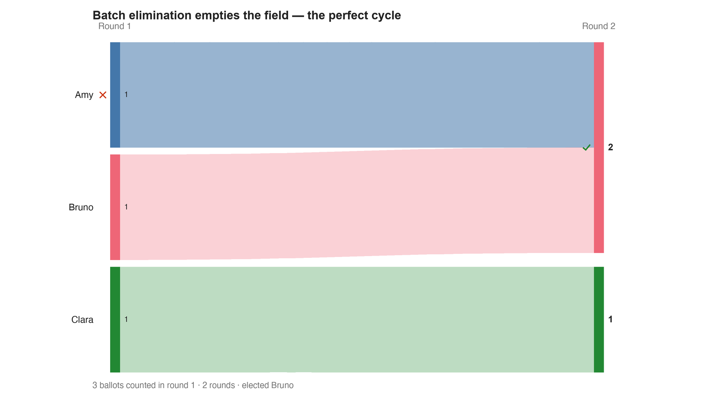

---
search:
  exclude: true
---

# Batch elimination empties the field — the perfect cycle

*Generated from [`batch_all_out_cycle_c3_b3.yaml`](../batch_all_out_cycle_c3_b3.yaml) — do not edit by hand. Regenerate: `python STARVote_LH_tabulation_engine/tools_adam/scripts/build_yaml_pages.py`.*

**Method:** [RCV-IRV (Instant Runoff)](../../concepts/README.md) · **1 seat** · **Expected winner:** Amy

## Scenario

Three voters, three candidates, and the smallest profile in which an
instant-runoff count has nobody left to elect. Amy, Bruno and Clara each hold
exactly one first choice, and the three ballots rotate: Amy>Bruno>Clara,
Bruno>Clara>Amy, Clara>Amy>Bruno. Nobody has a majority (2 of 3), so somebody
must be eliminated — and every candidate is tied for fewest first choices.
Under the BATCH convention, which the Stanford Encyclopedia entry and
pref_voting both use, you remove ALL candidates tied for last in one step. Here
that is the whole field. The count stops with an empty ballot, and the stated
answer is that all three candidates TIE for the win.
That is not a bug in the convention, it is the convention working. This profile
is perfectly symmetric: rotate the candidate names and you get the same three
ballots back in a different order. So an ANONYMOUS and NEUTRAL rule — one that
ignores who cast which ballot and shows no favouritism between names — has
nothing left to separate Amy from Bruno from Clara, and a three-way tie is the
only answer it can give. See 07_Concepts/topics/ties/ties_are_forced.md for the
theorem.
This engine does not do that. The vendored pyrankvote cuts one candidate,
transfers, and names a single winner — and WHICH one depends on the order the
ballots happen to be listed in. All six row orderings of these same three
ballots were run: the winner is always the first row's first choice. Amy in two
orderings, Bruno in two, Clara in two. That is an anonymity failure, not a
neutrality failure, and it is undisclosed. The expected_winners below records
what this engine prints for THIS row order; it is not the method's answer.
Lesson: 07_Concepts/topics/ties/batch_elimination.md

## Ballots

Each row is one voter's ranking, most-preferred first (`N:` prefix = N identical ballots).

```text
Amy>Bruno>Clara
Bruno>Clara>Amy
Clara>Amy>Bruno
```

## What the engine says



*Where the votes went. Band thickness is votes; a band leaving an eliminated candidate lands on whoever that ballot ranked next, or on **inactive** if it ranked nobody who was left.*

The count, step by step — the rounds and how the winner is reached:

<!-- --8<-- [start:report] -->
```text
--- RCV / Instant-Runoff Voting (single winner) ---
  Batch elimination empties the field — the perfect cycle
 Tabulating 3 ballots (ranked ballots).

ROUND 1
Candidate      Votes  Status
-----------  -------  --------
Amy                1  Hopeful
Bruno              1  Hopeful
Clara              1  Rejected

FINAL RESULT
Candidate      Votes  Status
-----------  -------  --------
Amy                2  Elected
Bruno              1  Rejected
Clara              0  Rejected


Winner(s) — RCV / Instant-Runoff Voting (single winner)
  Amy

--- Transfers and inactive ballots (what the round tables leave out) ---
The tables above give each candidate's round total but not where a
transferred vote came FROM, nor how many ballots stopped counting.
Both are recomputed from the ballots, using the eliminations the
count above actually made.

ROUND 1 — 3 of 3 ballots still active; majority = 2
   Clara eliminated with 1:
      → Amy                       1

FINAL ROUND — 3 of 3 ballots still active; majority = 2
   Amy                       2  (66.7% of the still-active)  ← elected
   Bruno                     1  (33.3% of the still-active)
   Never exhausted, never transferred:
      1 ballot held by Bruno carried a lower ranking that was never read
      (the count stopped here, so those preferences did nothing).

Inactive ballots at the final round: 0 of 3 (0.0%).
   Amy's 2 is a majority of the 3 still active AND of all 3 cast (66.7%).
```
<!-- --8<-- [end:report] -->

### Full audit — preference matrix, Condorcet, and score distribution

```text
--- Smith Set (the generalized Condorcet winner) ---
The smallest group whose every member beats every candidate outside it —
the honest answer to "who is even in contention?".
   Smith set (3 of 3): Amy, Bruno, Clara
   Outside (0):        —
   More than one member ⇒ NO Condorcet winner: the top of the tournament is a
   cycle, so the strongest "candidate" is a set, not a person. Which member of
   the set should win is exactly what Minimax / Ranked Pairs / Schulze disagree
   about — see 05_Ranked_Robin/01_Learn/cycle_resolution.md.
   RCV-IRV winner Amy is INSIDE the Smith set. ✓
      Not guaranteed — RCV-IRV is not Smith-efficient — but it holds here.
   More: 07_Concepts/topics/smith_set.md
```

Everything in one file: the [`_tabulated` mirror](../cases_tabulated/batch_all_out_cycle_c3_b3_tabulated.txt) (regenerated on every run; every analysis forced on).

Run it yourself:

```bash
python STARVote_LH_tabulation_engine/starvote_larry_hastings.py 06_Other/RCV_IRV/cases/batch_all_out_cycle_c3_b3.yaml
```

## See also

- [Condorcet efficiency (topic hub)](../../../../07_Concepts/topics/condorcet/README.md)
- [Ties & tie-breaking (topic hub)](../../../../07_Concepts/topics/ties/README.md)
- [Runoff reversal (worked set)](../../../../01_STAR/02_Examples/runoff_overturns_leader/README.md)
- [Glossary](../../../../07_Concepts/GLOSSARY.md) · [all cases by method](../../../../07_Concepts/YAML_test_case_index/README.md)

More cases in this set: [RCV_ballot_example](RCV_ballot_example.md) · [batch_all_out_condorcet_c3_b3](batch_all_out_condorcet_c3_b3.md) · [batch_all_out_round2_c4_b6](batch_all_out_round2_c4_b6.md) · [put_two_universes_c3_b4](put_two_universes_c3_b4.md) · [street_trees_five_rounds_c6_b100](street_trees_five_rounds_c6_b100.md)
