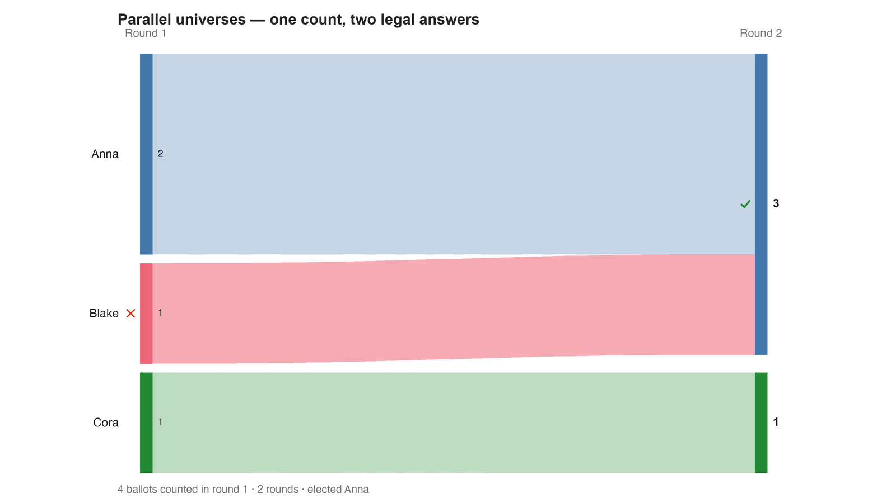

---
search:
  exclude: true
---

# Parallel universes — one count, two legal answers

*Generated from [`put_two_universes_c3_b4.yaml`](../put_two_universes_c3_b4.yaml) — do not edit by hand. Regenerate: `python STARVote_LH_tabulation_engine/tools_adam/scripts/build_yaml_pages.py`.*

**Method:** [RCV-IRV (Instant Runoff)](../../concepts/README.md) · **1 seat** · **Expected winner:** Anna

## Scenario

Four voters, three candidates, and an elimination tie in the very first round.
Anna leads with 2 first choices; Blake and Cora have 1 each and are tied for
last, so the rule must decide who goes — and that decision decides the election.
Cut Blake, and his ballot (Blake>Anna>Cora) transfers to Anna: 3 of 4, elected
outright. Cut Cora, and her ballot (Cora>Blake>Anna) transfers to Blake: Anna 2,
Blake 2, no majority and nothing left to separate them — Blake shares the win.
Both are legal executions of the same rules on the same ballots. This engine
reports Anna, and it reports her cleanly: pyrankvote removes BOTH tied
candidates in one step and elects Anna in a single round, with Blake and Cora
listed side by side as Rejected. Nothing in the output says a tie was ever
resolved. That batch step is justified by the observation that Blake and Cora
hold only 2 votes between them, which cannot exceed Anna's 2 — but that
reasoning quietly treats a 2-2 tie as a loss for Blake, which is exactly the
question at issue. Parallel Universe Tiebreaking (PUT) refuses to assume it: it
runs every legal elimination order and elects the union, reporting
{Anna, Blake}. Cross-checked against pref_voting, an engine nobody here wrote:
instant_runoff = {Anna}, instant_runoff_put = {Anna, Blake}, coombs_put =
{Anna, Blake}. Worth noting what this case is NOT: the winner here does not turn
on a coin flip. The engine seeds its RNG (random.seed(0)) because pyrankvote can
break ties with random.choice, but this result is seed-independent — verified at
seeds 0, 1, 2, 7, 42 and 99, all Anna. The single winner is perfectly
reproducible and still incomplete, which is the whole lesson: reproducibility is
not the same thing as correctness.
Lesson: 07_Concepts/topics/ties/parallel_universe_tiebreaking.md

## Ballots

Each row is one voter's ranking, most-preferred first (`N:` prefix = N identical ballots).

```text
Anna>Blake>Cora
Anna>Blake>Cora
Blake>Anna>Cora
Cora>Blake>Anna
```

## What the engine says



*Where the votes went. Band thickness is votes; a band leaving an eliminated candidate lands on whoever that ballot ranked next, or on **inactive** if it ranked nobody who was left.*

The count, step by step — the rounds and how the winner is reached:

<!-- --8<-- [start:report] -->
```text
--- RCV / Instant-Runoff Voting (single winner) ---
  Parallel universes — one count, two legal answers
 Tabulating 4 ballots (ranked ballots).

FINAL RESULT
Candidate      Votes  Status
-----------  -------  --------
Anna               2  Elected
Blake              1  Rejected
Cora               1  Rejected


Winner(s) — RCV / Instant-Runoff Voting (single winner)
  Anna
```
<!-- --8<-- [end:report] -->

### Full audit — preference matrix, Condorcet, and score distribution

```text
--- Smith Set (the generalized Condorcet winner) ---
The smallest group whose every member beats every candidate outside it —
the honest answer to "who is even in contention?".
   Smith set (2 of 3): Anna, Blake
   Outside (1):        Cora
   More than one member ⇒ NO Condorcet winner: the top of the tournament is a
   dead heat (its members DRAW each other head-to-head), so the strongest
   "candidate" is a set, not a person. No member beats another, so there is no
   loop for Minimax / Ranked Pairs / Schulze to disagree about — which member
   wins is left to the tiebreak, not to a cycle rule. See
   05_Ranked_Robin/01_Learn/rr_tiebreak_lh_vs_bv.md.
   RCV-IRV winner Anna is INSIDE the Smith set. ✓
      Not guaranteed — RCV-IRV is not Smith-efficient — but it holds here.
   Fine print: this set contains a pairwise DRAW, and a draw is enough to keep a
   candidate in the Smith set but not in the tighter Schwartz set — so Schwartz
   may be smaller here.
   More: 07_Concepts/topics/smith_set.md
```

Everything in one file: the [`_tabulated` mirror](../cases_tabulated/put_two_universes_c3_b4_tabulated.txt) (regenerated on every run; every analysis forced on).

Run it yourself:

```bash
python STARVote_LH_tabulation_engine/starvote_larry_hastings.py 06_Other/RCV_IRV/cases/put_two_universes_c3_b4.yaml
```

## See also

- [Ties & tie-breaking (topic hub)](../../../../07_Concepts/topics/ties/README.md)
- [The tie-breaking ladder (full chain)](../../../../01_STAR/01_Learn/Tie_Breaking_STAR/tie_breaking.md)
- [Runoff reversal (worked set)](../../../../01_STAR/02_Examples/runoff_overturns_leader/README.md)
- [Glossary](../../../../07_Concepts/GLOSSARY.md) · [all cases by method](../../../../07_Concepts/YAML_test_case_index/README.md)

More cases in this set: [RCV_ballot_example](RCV_ballot_example.md) · [batch_all_out_condorcet_c3_b3](batch_all_out_condorcet_c3_b3.md) · [batch_all_out_cycle_c3_b3](batch_all_out_cycle_c3_b3.md) · [batch_all_out_round2_c4_b6](batch_all_out_round2_c4_b6.md) · [street_trees_five_rounds_c6_b100](street_trees_five_rounds_c6_b100.md)
