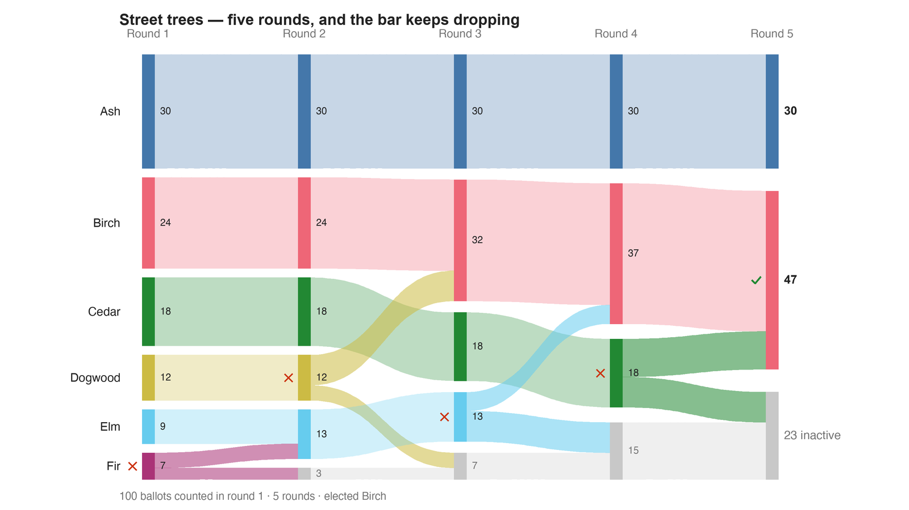

---
search:
  exclude: true
---

# Street trees — five rounds, and the bar keeps dropping

*Generated from [`street_trees_five_rounds_c6_b100.yaml`](../street_trees_five_rounds_c6_b100.yaml) — do not edit by hand. Regenerate: `python STARVote_LH_tabulation_engine/tools_adam/scripts/build_yaml_pages.py`.*

**Method:** [RCV-IRV (Instant Runoff)](../../concepts/README.md) · **1 seat** · **Expected winner:** Birch

## Scenario

A town picks ONE species for its main street. Six on the ballot, 100 voters,
and most people rank only the one or two they actually care about — which is
what real voters do in a crowded field, and is the whole reason this count
gets hard to follow.

Built to demonstrate three things the small teaching examples cannot, because
a three-candidate election finishes in one elimination:

1. FIVE ROUNDS. Fir, then Dogwood, then Elm, then Cedar are eliminated before
   anyone clears the bar.
2. THE LEAD CHANGES HANDS. Ash leads rounds 1 and 2 on 30 first choices.
   Birch passes Ash in round 3 (32 to 30) and is never headed again. Reporting
   this election from its first-choice totals would have named the loser.
3. THE MAJORITY BAR MOVES. Every ballot whose ranked species are all out stops
   counting (the report calls these "Blank Votes"), so the pile of active
   ballots shrinks 100 -> 97 -> 93 -> 85 -> 77 and the majority needed falls
   51 -> 49 -> 47 -> 43 -> 39. Birch wins on 47 — SIX FEWER than the 51 the
   election opened needing. It is a majority of the ballots still active
   (47 of 77 = 61%), not of the people who voted (47%).

Deliberately NOT a pathology case. Birch is the Condorcet winner, beating
every rival head-to-head, so RCV-IRV lands on the same species STAR or Ranked
Robin would. The lesson is the COST OF FOLLOWING THE COUNT, not a wrong
winner — which is why it is safe to hand to someone who likes RCV.

Companion to RCV_IRV_is_simple.md, which argues that the ballot is the simple
half and the count is not. This file is that argument's evidence.

## Ballots

Each row is one voter's ranking, most-preferred first (`N:` prefix = N identical ballots).

```text
20:Ash>Birch>Cedar
10:Ash
24:Birch>Dogwood
10:Cedar>Birch
8:Cedar
8:Dogwood>Birch
4:Dogwood
5:Elm>Birch
4:Elm
4:Fir>Elm
3:Fir
```

## What the engine says



*Where the votes went. Band thickness is votes; a band leaving an eliminated candidate lands on whoever that ballot ranked next, or on **inactive** if it ranked nobody who was left.*

The count, step by step — the rounds and how the winner is reached:

<!-- --8<-- [start:report] -->
```text
--- RCV / Instant-Runoff Voting (single winner) ---
  Street trees — five rounds, and the bar keeps dropping
 Tabulating 100 ballots (ranked ballots).

ROUND 1
Candidate      Votes  Status
-----------  -------  --------
Ash               30  Hopeful
Birch             24  Hopeful
Cedar             18  Hopeful
Dogwood           12  Hopeful
Elm                9  Hopeful
Fir                7  Rejected

ROUND 2
Candidate      Votes  Status
-----------  -------  --------
Ash               30  Hopeful
Birch             24  Hopeful
Cedar             18  Hopeful
Elm               13  Hopeful
Dogwood           12  Rejected
Fir                0  Rejected
Blank Votes        3  Rejected

ROUND 3
Candidate      Votes  Status
-----------  -------  --------
Birch             32  Hopeful
Ash               30  Hopeful
Cedar             18  Hopeful
Elm               13  Rejected
Dogwood            0  Rejected
Fir                0  Rejected
Blank Votes        7  Rejected

ROUND 4
Candidate      Votes  Status
-----------  -------  --------
Birch             37  Hopeful
Ash               30  Hopeful
Cedar             18  Rejected
Elm                0  Rejected
Dogwood            0  Rejected
Fir                0  Rejected
Blank Votes       15  Rejected

FINAL RESULT
Candidate      Votes  Status
-----------  -------  --------
Birch             47  Elected
Ash               30  Rejected
Cedar              0  Rejected
Elm                0  Rejected
Dogwood            0  Rejected
Fir                0  Rejected
Blank Votes       23  Rejected


Winner(s) — RCV / Instant-Runoff Voting (single winner)
  Birch
```
<!-- --8<-- [end:report] -->

### Full audit — preference matrix, Condorcet, and score distribution

```text
--- Smith Set (the generalized Condorcet winner) ---
The smallest group whose every member beats every candidate outside it —
the honest answer to "who is even in contention?".
   Smith set (1 of 6): Birch
   Outside (5):        Ash, Cedar, Dogwood, Elm, Fir
   One member ⇒ Birch is the Condorcet winner, beating every rival head-to-head.
   RCV-IRV winner Birch is INSIDE the Smith set. ✓
      Not guaranteed — RCV-IRV is not Smith-efficient — but it holds here.
   More: 07_Concepts/topics/smith_set.md
```

Everything in one file: the [`_tabulated` mirror](../cases_tabulated/street_trees_five_rounds_c6_b100_tabulated.txt) (regenerated on every run; every analysis forced on).

Run it yourself:

```bash
python STARVote_LH_tabulation_engine/starvote_larry_hastings.py 06_Other/RCV_IRV/cases/street_trees_five_rounds_c6_b100.yaml
```

## See also

- [Condorcet efficiency (topic hub)](../../../../07_Concepts/topics/condorcet/README.md)
- [Ballot & terminology basics](../../../../07_Concepts/topics/ballot_and_terminology_basics.md)
- [Glossary](../../../../07_Concepts/GLOSSARY.md) · [all cases by method](../../../../07_Concepts/YAML_test_case_index/README.md)

More cases in this set: [RCV_ballot_example](RCV_ballot_example.md) · [batch_all_out_condorcet_c3_b3](batch_all_out_condorcet_c3_b3.md) · [batch_all_out_cycle_c3_b3](batch_all_out_cycle_c3_b3.md) · [batch_all_out_round2_c4_b6](batch_all_out_round2_c4_b6.md) · [put_two_universes_c3_b4](put_two_universes_c3_b4.md)
