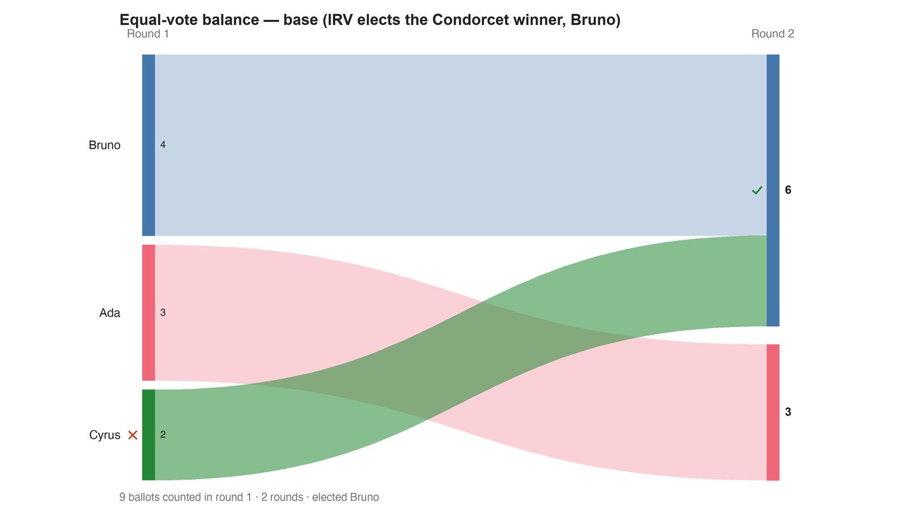

---
search:
  exclude: true
---

# Equal-vote balance — base (IRV elects the Condorcet winner, Bruno)

*Generated from [`balance_base_irv_c3_b9.yaml`](../balance_base_irv_c3_b9.yaml) — do not edit by hand. Regenerate: `python STARVote_LH_tabulation_engine/tools_adam/scripts/build_yaml_pages.py`.*

**Method:** [RCV-IRV (Instant Runoff)](../../../concepts/README.md) · **1 seat** · **Expected winner:** Bruno

## Scenario

Three candidates on a line — Ada (left), Bruno (center), Cyrus (right). Bruno is
the Condorcet winner (beats Ada 6-3, Cyrus 7-2) and RCV-IRV elects him too:
Cyrus has the fewest first-choices and is eliminated, his ballots flow to Bruno,
who wins 6-3. The twin file adds three EXACT-OPPOSITE ballot pairs; they cancel
under Condorcet / Ranked Robin / STAR (Bruno stays the winner) but under RCV-IRV
they squeeze Bruno out and elect Ada — so RCV-IRV fails the Equal Vote / Test of
Balance. Lesson: 06_Other/RCV_IRV/concepts/RCV_IRV_equal_vote.md

## Ballots

Each row is one voter's ranking, most-preferred first (`N:` prefix = N identical ballots).

```text
4:Bruno>Ada>Cyrus
3:Ada>Bruno>Cyrus
2:Cyrus>Bruno>Ada
```

## What the engine says



*Where the votes went. Band thickness is votes; a band leaving an eliminated candidate lands on whoever that ballot ranked next, or on **inactive** if it ranked nobody who was left.*

The count, step by step — the rounds and how the winner is reached:

<!-- --8<-- [start:report] -->
```text
--- RCV / Instant-Runoff Voting (single winner) ---
  Equal-vote balance — base (IRV elects the Condorcet winner, Bruno)
 Tabulating 9 ballots (ranked ballots).

ROUND 1
Candidate      Votes  Status
-----------  -------  --------
Bruno              4  Hopeful
Ada                3  Hopeful
Cyrus              2  Rejected

FINAL RESULT
Candidate      Votes  Status
-----------  -------  --------
Bruno              6  Elected
Ada                3  Rejected
Cyrus              0  Rejected


Winner(s) — RCV / Instant-Runoff Voting (single winner)
  Bruno

--- Transfers and inactive ballots (what the round tables leave out) ---
The tables above give each candidate's round total but not where a
transferred vote came FROM, nor how many ballots stopped counting.
Both are recomputed from the ballots, using the eliminations the
count above actually made.

ROUND 1 — 9 of 9 ballots still active; majority = 5
   Cyrus eliminated with 2:
      → Bruno                     2

FINAL ROUND — 9 of 9 ballots still active; majority = 5
   Bruno                     6  (66.7% of the still-active)  ← elected
   Ada                       3  (33.3% of the still-active)
   Never exhausted, never transferred:
      3 ballots held by Ada carried a lower ranking that was never read
      (the count stopped here, so those preferences did nothing).

Inactive ballots at the final round: 0 of 9 (0.0%).
   Bruno's 6 is a majority of the 9 still active AND of all 9 cast (66.7%).
```
<!-- --8<-- [end:report] -->

### Full audit — preference matrix, Condorcet, and score distribution

```text
--- Smith Set (the generalized Condorcet winner) ---
The smallest group whose every member beats every candidate outside it —
the honest answer to "who is even in contention?".
   Smith set (1 of 3): Bruno
   Outside (2):        Ada, Cyrus
   One member ⇒ Bruno is the Condorcet winner, beating every rival head-to-head.
   RCV-IRV winner Bruno is INSIDE the Smith set. ✓
      Not guaranteed — RCV-IRV is not Smith-efficient — but it holds here.
   More: 07_Concepts/topics/smith_set.md
```

Everything in one file: the [`_tabulated` mirror](../cases_tabulated/balance_base_irv_c3_b9_tabulated.txt) (regenerated on every run; every analysis forced on).

Run it yourself:

```bash
python STARVote_LH_tabulation_engine/starvote_larry_hastings.py 06_Other/RCV_IRV/equal_vote_balance/cases/balance_base_irv_c3_b9.yaml
```

## See also

- [Condorcet efficiency (topic hub)](../../../../../07_Concepts/topics/condorcet/README.md)
- [Glossary](../../../../../07_Concepts/GLOSSARY.md) · [all cases by method](../../../../../07_Concepts/YAML_test_case_index/README.md)

More cases in this set: [balance_plus_opposite_c3_b15](balance_plus_opposite_c3_b15.md)
