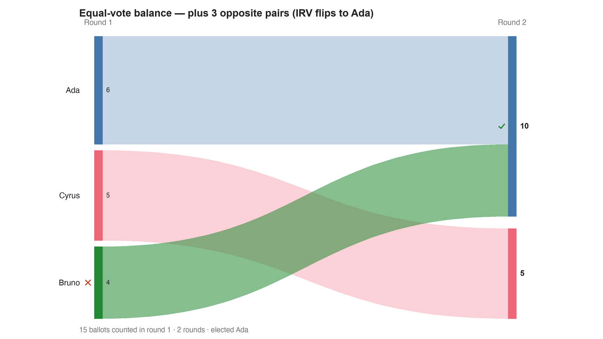

---
search:
  exclude: true
---

# Equal-vote balance — plus 3 opposite pairs (IRV flips to Ada)

*Generated from [`balance_plus_opposite_c3_b15.yaml`](../balance_plus_opposite_c3_b15.yaml) — do not edit by hand. Regenerate: `python STARVote_LH_tabulation_engine/tools_adam/scripts/build_yaml_pages.py`.*

**Method:** [RCV-IRV (Instant Runoff)](../../../concepts/README.md) · **1 seat** · **Expected winner:** Ada

## Scenario

The base election plus three exact-opposite ballot pairs (each Ada>Bruno>Cyrus
matched by its reverse Cyrus>Bruno>Ada). The pairs are perfectly balanced — under
Condorcet / Ranked Robin / STAR they cancel and Bruno stays the winner (margins
just grow to 9-6 and 10-5). But RCV-IRV counts only first-choices, so the six new
ballots pile onto the extremes (Ada +3, Cyrus +3) and none onto the center
(Bruno +0): Bruno now has the fewest first-choices, is eliminated first, and Ada
wins 10-5. Balanced ballots that should cancel instead flip the winner — RCV-IRV
fails the Test of Balance, by the center-squeeze mechanism. Lesson:
06_Other/RCV_IRV/concepts/RCV_IRV_equal_vote.md

## Ballots

Each row is one voter's ranking, most-preferred first (`N:` prefix = N identical ballots).

```text
4:Bruno>Ada>Cyrus
6:Ada>Bruno>Cyrus
5:Cyrus>Bruno>Ada
```

## What the engine says



*Where the votes went. Band thickness is votes; a band leaving an eliminated candidate lands on whoever that ballot ranked next, or on **inactive** if it ranked nobody who was left.*

The count, step by step — the rounds and how the winner is reached:

<!-- --8<-- [start:report] -->
```text
--- RCV / Instant-Runoff Voting (single winner) ---
  Equal-vote balance — plus 3 opposite pairs (IRV flips to Ada)
 Tabulating 15 ballots (ranked ballots).

ROUND 1
Candidate      Votes  Status
-----------  -------  --------
Ada                6  Hopeful
Cyrus              5  Hopeful
Bruno              4  Rejected

FINAL RESULT
Candidate      Votes  Status
-----------  -------  --------
Ada               10  Elected
Cyrus              5  Rejected
Bruno              0  Rejected


Winner(s) — RCV / Instant-Runoff Voting (single winner)
  Ada

--- Transfers and inactive ballots (what the round tables leave out) ---
The tables above give each candidate's round total but not where a
transferred vote came FROM, nor how many ballots stopped counting.
Both are recomputed from the ballots, using the eliminations the
count above actually made.

ROUND 1 — 15 of 15 ballots still active; majority = 8
   Bruno eliminated with 4:
      → Ada                       4

FINAL ROUND — 15 of 15 ballots still active; majority = 8
   Ada                      10  (66.7% of the still-active)  ← elected
   Cyrus                     5  (33.3% of the still-active)
   Never exhausted, never transferred:
      5 ballots held by Cyrus carried a lower ranking that was never read
      (the count stopped here, so those preferences did nothing).

Inactive ballots at the final round: 0 of 15 (0.0%).
   Ada's 10 is a majority of the 15 still active AND of all 15 cast (66.7%).
```
<!-- --8<-- [end:report] -->

### Full audit — preference matrix, Condorcet, and score distribution

```text
--- Smith Set (the generalized Condorcet winner) ---
The smallest group whose every member beats every candidate outside it —
the honest answer to "who is even in contention?".
   Smith set (1 of 3): Bruno
   Outside (2):        Ada, Cyrus
   One member ⇒ Bruno is the Condorcet winner, beating every rival head-to-head.
   RCV-IRV winner Ada is OUTSIDE the Smith set. ✗
      Every member of the set (Bruno) beats Ada head-to-head, yet
      RCV-IRV elected Ada anyway. RCV-IRV is not Smith-efficient (nor
      Condorcet-efficient) — this is the shape a center squeeze leaves behind.
   More: 07_Concepts/topics/smith_set.md
```

Everything in one file: the [`_tabulated` mirror](../cases_tabulated/balance_plus_opposite_c3_b15_tabulated.txt) (regenerated on every run; every analysis forced on).

Run it yourself:

```bash
python STARVote_LH_tabulation_engine/starvote_larry_hastings.py 06_Other/RCV_IRV/equal_vote_balance/cases/balance_plus_opposite_c3_b15.yaml
```

## See also

- [Center squeeze (topic hub)](../../../../../07_Concepts/topics/center_squeeze/README.md)
- [Condorcet efficiency (topic hub)](../../../../../07_Concepts/topics/condorcet/README.md)
- [Glossary](../../../../../07_Concepts/GLOSSARY.md) · [all cases by method](../../../../../07_Concepts/YAML_test_case_index/README.md)

More cases in this set: [balance_base_irv_c3_b9](balance_base_irv_c3_b9.md)
