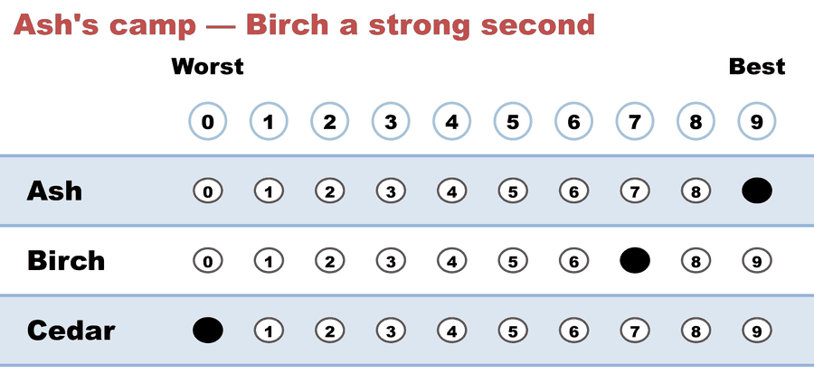
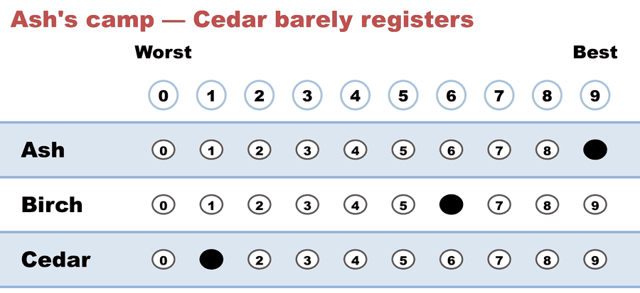
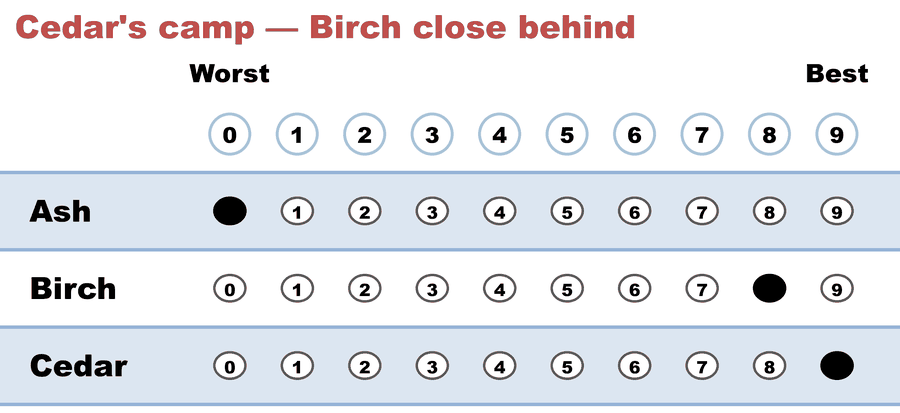
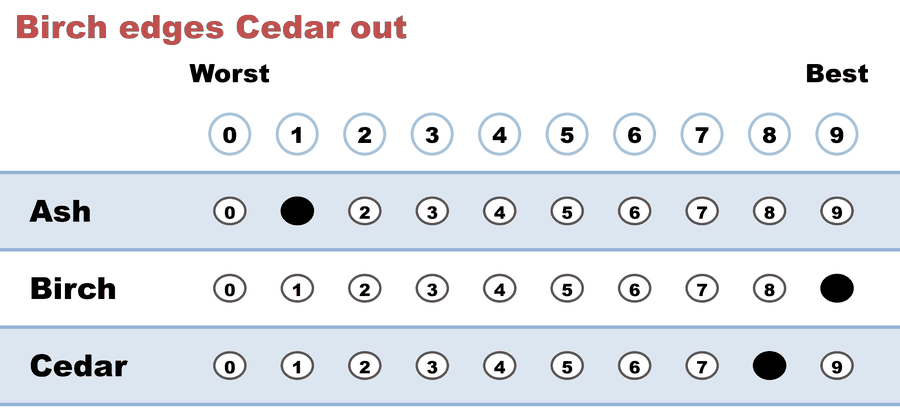
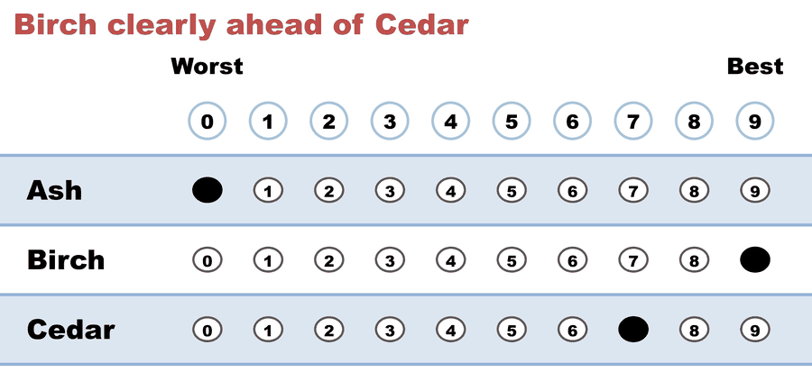

---
search:
  exclude: true
---

# Range / Score Voting on its own scale — 0–9, the canonical ballot

*Generated from [`range_101_0to9_c3_b5.yaml`](../range_101_0to9_c3_b5.yaml) — do not edit by hand. Regenerate: `python STARVote_LH_tabulation_engine/tools_adam/scripts/build_yaml_pages.py`.*

**Method:** [range](../../../../07_Concepts/README.md) · **1 seat** · **Expected winner:** Birch

## Scenario

The same simple score election as the 101 case, run on the scale Range voting
actually uses. Five neighbours pick a tree for Main Street, grading each one
from 0 (worst) to 9 (best); Range just SUMS the grades — highest total wins,
no runoff and no elimination. Birch is nobody's absolute favourite and wins
anyway on broad, strong support (39), ahead of Cedar (25) and Ash (19).

The teaching value is the BALLOT, not the outcome. A STAR ballot is 0–5 and
prints its rungs as stars, because the stars are STAR Voting's own house
style. Canonical Range is 0–9 with plain circled digits — that is the sample
ballot Wikipedia's score-voting article shows ("0 is worst; 9 is best") and
the form rangevoting.org prints. Seeing the two side by side is the fastest
way to learn that the star glyphs are branding rather than part of the count,
and that a score ballot's resolution is a choice the election makes.

Its twin on the 0–5 scale is range_101_c3_b5.yaml, kept deliberately so the
same election can be read on STAR's scale and on Range's. Tabulated by the
range engine (pref_voting score_voting, cross-checked against a hand sum),
which reads the scale off the ballots themselves.

## Ballots

The ballots as marked — the filled bubble is the score given, and the score is the number in its column:

| # | Ballot as marked | Ash | Birch | Cedar |
|:--:|:--|:--:|:--:|:--:|
| 1 |  | 9 | 7 | 0 |
| 2 |  | 9 | 6 | 1 |
| 3 |  | 0 | 8 | 9 |
| 4 |  | 1 | 9 | 8 |
| 5 |  | 0 | 9 | 7 |

The same ballots as the file records them:

Row 1 = candidate names; each later row is one voter's scores on this election's scale, 0 = worst (a `N ×` prefix = N identical ballots).

```text
Ash,Birch,Cedar
9,7,0   # Ash's camp — Birch a strong second
9,6,1   # Ash's camp — Cedar barely registers
0,8,9   # Cedar's camp — Birch close behind
1,9,8   # Birch edges Cedar out
0,9,7   # Birch clearly ahead of Cedar
```

## What the engine says

Full report from the [`_tabulated` mirror](../cases_tabulated/range_101_0to9_c3_b5_RANGE_tabulated.txt) (regenerated on every run; every analysis forced on):

<!-- --8<-- [start:report] -->
```text
--- Range / Score Voting (single winner) ---
  Range / Score Voting on its own scale — 0–9, the canonical ballot
 Tabulating 5 ballots on a 0–9 scale (range/score: highest total wins, no runoff).

[Scenario]
  The same simple score election as the 101 case, run on the scale Range voting
  actually uses. Five neighbours pick a tree for Main Street, grading each one
  from 0 (worst) to 9 (best); Range just SUMS the grades — highest total wins,
  no runoff and no elimination. Birch is nobody's absolute favourite and wins
  anyway on broad, strong support (39), ahead of Cedar (25) and Ash (19).
  
  The teaching value is the BALLOT, not the outcome. A STAR ballot is 0–5 and
  prints its rungs as stars, because the stars are STAR Voting's own house
  style. Canonical Range is 0–9 with plain circled digits — that is the sample
  ballot Wikipedia's score-voting article shows ("0 is worst; 9 is best") and
  the form rangevoting.org prints. Seeing the two side by side is the fastest
  way to learn that the star glyphs are branding rather than part of the count,
  and that a score ballot's resolution is a choice the election makes.
  
  Its twin on the 0–5 scale is range_101_c3_b5.yaml, kept deliberately so the
  same election can be read on STAR's scale and on Range's. Tabulated by the
  range engine (pref_voting score_voting, cross-checked against a hand sum),
  which reads the scale off the ballots themselves.

Ballots:
  Ash, Birch, Cedar
  9, 7, 0
  9, 6, 1
  0, 8, 9
  1, 9, 8
  0, 9, 7

Total score (sum of all grades):
  Birch          39  ← winner
  Cedar          25
  Ash            19

Cross-check — pref_voting score_voting: Birch  (✓ agrees with the hand count)

Winner — Range / Score Voting (single winner)
  Birch
```
<!-- --8<-- [end:report] -->

Run it yourself:

```bash
python STARVote_LH_tabulation_engine/starvote_larry_hastings.py 06_Other/Range/cases/range_101_0to9_c3_b5.yaml
```

## See also

- [Runoff reversal (worked set)](../../../../01_STAR/02_Examples/runoff_overturns_leader/README.md)
- [Glossary](../../../../07_Concepts/GLOSSARY.md) · [all cases by method](../../../../07_Concepts/YAML_test_case_index/README.md)

More cases in this set: [range_101_c3_b5](range_101_c3_b5.md) · [range_sullivan_score_c4_b10](range_sullivan_score_c4_b10.md)
