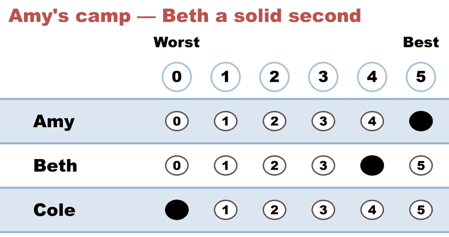
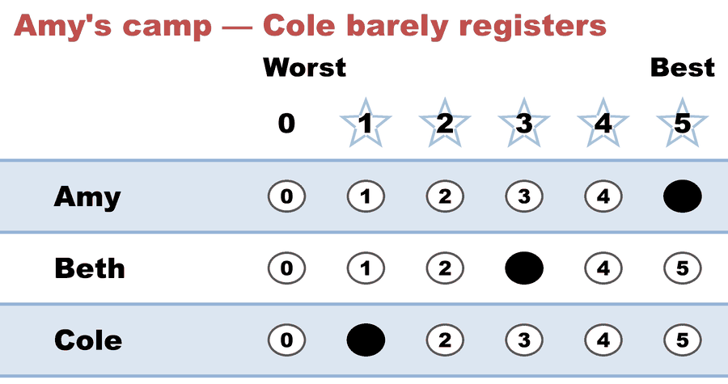
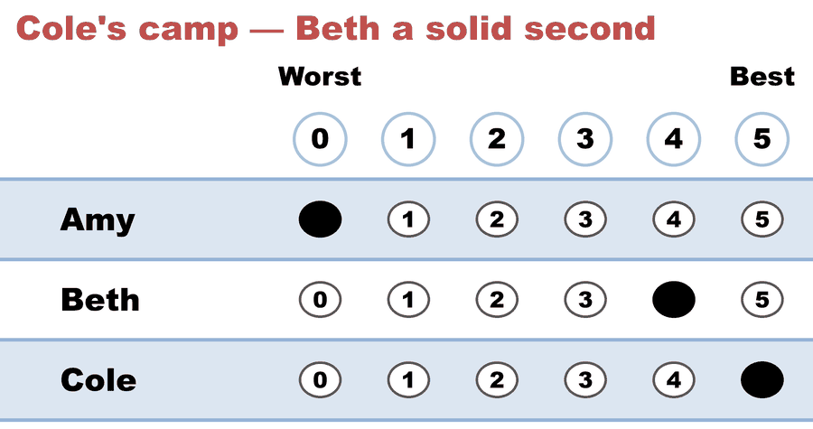
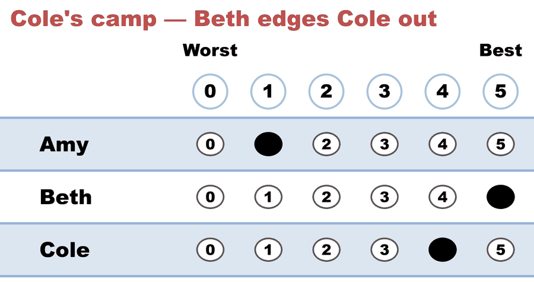
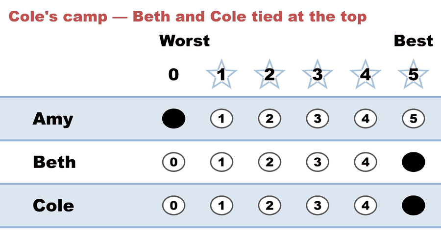

---
search:
  exclude: true
---

# Range / Score Voting 101 — highest total score wins

*Generated from [`range_101_c3_b5.yaml`](../range_101_c3_b5.yaml) — do not edit by hand. Regenerate: `python STARVote_LH_tabulation_engine/tools_adam/scripts/build_yaml_pages.py`.*

**Method:** [range](../../../../07_Concepts/README.md) · **1 seat** · **Expected winner:** Beth

## Scenario

The simplest score election. Three candidates, five voters grading 0–5.
Range (Score) voting just SUMS the grades — highest total wins, no runoff and
no elimination. Beth has broad, strong support across both camps and wins on
total score (21), ahead of Cole (15) and Amy (11). Tabulated by the range
engine (pref_voting score_voting, cross-checked against a hand sum).

## Ballots

The ballots as marked — the filled bubble is the score given, and the score is the number in its column:

| # | Ballot as marked | Amy | Beth | Cole |
|:--:|:--|:--:|:--:|:--:|
| 1 |  | 5 | 4 | 0 |
| 2 |  | 5 | 3 | 1 |
| 3 |  | 0 | 4 | 5 |
| 4 |  | 1 | 5 | 4 |
| 5 |  | 0 | 5 | 5 |

The same ballots as the file records them:

Row 1 = candidate names; each later row is one voter's scores on this election's scale, 0 = worst (a `N ×` prefix = N identical ballots).

```text
Amy,Beth,Cole
5,4,0   # Amy's camp — Beth a solid second
5,3,1   # Amy's camp — Cole barely registers
0,4,5   # Cole's camp — Beth a solid second
1,5,4   # Cole's camp — Beth edges Cole out
0,5,5   # Cole's camp — Beth and Cole tied at the top
```

## What the engine says

Full report from the [`_tabulated` mirror](../cases_tabulated/range_101_c3_b5_RANGE_tabulated.txt) (regenerated on every run; every analysis forced on):

<!-- --8<-- [start:report] -->
```text
--- Range / Score Voting (single winner) ---
  Range / Score Voting 101 — highest total score wins
 Tabulating 5 ballots on a 0–5 scale (range/score: highest total wins, no runoff).

[Scenario]
  The simplest score election. Three candidates, five voters grading 0–5.
  Range (Score) voting just SUMS the grades — highest total wins, no runoff and
  no elimination. Beth has broad, strong support across both camps and wins on
  total score (21), ahead of Cole (15) and Amy (11). Tabulated by the range
  engine (pref_voting score_voting, cross-checked against a hand sum).

Ballots:
  Amy, Beth, Cole
  5, 4, 0
  5, 3, 1
  0, 4, 5
  1, 5, 4
  0, 5, 5

Total score (sum of all grades):
  Beth           21  ← winner
  Cole           15
  Amy            11

Cross-check — pref_voting score_voting: Beth  (✓ agrees with the hand count)

Winner — Range / Score Voting (single winner)
  Beth
```
<!-- --8<-- [end:report] -->

Run it yourself:

```bash
python STARVote_LH_tabulation_engine/starvote_larry_hastings.py 06_Other/Range/cases/range_101_c3_b5.yaml
```

## See also

- [Runoff reversal (worked set)](../../../../01_STAR/02_Examples/runoff_overturns_leader/README.md)
- [Glossary](../../../../07_Concepts/GLOSSARY.md) · [all cases by method](../../../../07_Concepts/YAML_test_case_index/README.md)

More cases in this set: [range_101_0to9_c3_b5](range_101_0to9_c3_b5.md) · [range_sullivan_score_c4_b10](range_sullivan_score_c4_b10.md)
