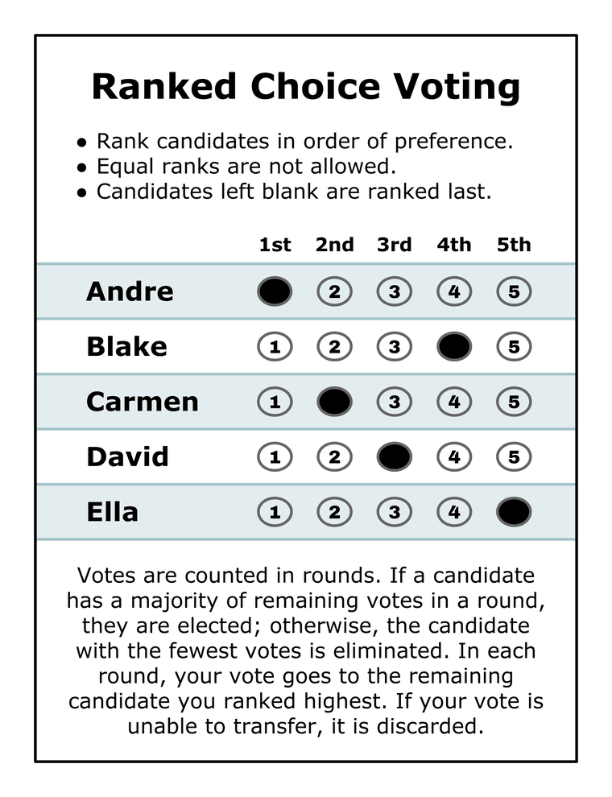

# 06_Other/STV — STV: the ranked ballot, counted proportionally

*Rank the candidates. A candidate who reaches a **quota** wins a seat. Every vote **above** that quota, and every vote stuck on a candidate who cannot win, **transfers** to the next name on that ballot — until every seat is filled.*



*The paper is the ordinary [ranked ballot](../../07_Concepts/scores_and_ranks/ranked_ballot.md) — literally the same one [RCV-IRV](../RCV_IRV/README.md) uses, shown here with the same five candidates as the [STAR](../../01_STAR/README.md), [Approval](../../04_Approval/README.md) and [Ranked Robin](../../05_Ranked_Robin/README.md) ballots so all of them read side by side. Nothing about the marking changes. What changes is that the election has **several seats**, and the count fills them against a quota instead of hunting for one majority winner.*

**Level: 201 → 301 · for voters**

**If you have been avoiding STV because it sounds hard, read only the next two sections.** [The one idea](#the-one-idea-nobodys-vote-gets-stranded) and [the nine-voter count](#how-it-counts-a-book-club-you-can-check-in-your-head) are the whole method, and the second one you can check in your head. [Where it genuinely gets complicated](#where-it-genuinely-gets-complicated) is a real section — but it is about *which rulebook*, not about the idea. Nobody is hiding a hard concept from you; they are hiding a pile of bookkeeping, which is a different complaint.

---

## The one idea: nobody's vote gets stranded

Start with the number everyone already knows. In a **one-seat** election, "enough votes to be safe" means **more than half** — because only one candidate can hold more than half.

Now ask the same question for **three** seats. What is the smallest share that still guarantees you a seat? Answer: **just over a quarter.** Four candidates each holding a quarter would use up the entire electorate, so at most *three* can be strictly above it. Nobody can stop you.

That is the whole quota idea, and it generalizes in one line:

> **quota ≈ total votes ÷ (seats + 1)** — the smallest pile that only `seats`-many candidates can possibly hold at once.

| Seats | Quota is just over | Because… |
|:--:|:--:|---|
| 1 | **50%** | two candidates can't both exceed half |
| 2 | **33%** | three can't all exceed a third |
| 3 | **25%** | four can't all exceed a quarter |
| 9 | **10%** | ten can't all exceed a tenth |

This is the **Droop quota**, and reaching it is a *mathematical guarantee* of a seat — not a prediction, not a rule of thumb.

Then the second half of the idea, which is where the name comes from. A vote should not sit on a candidate who **doesn't need it** or **can't use it**, so it gets **transferred** to the next name on that same ballot:

- **Surplus transfer.** Your favorite is elected with more than a quota. She didn't need your vote to win, so the extra flows on down your ranking.
- **Elimination transfer.** Your favorite finishes last and cannot win. Your ballot moves to whoever you ranked next.

Put those together and you have STV: seats are handed out **one quota of voters at a time**, and — this is the part that makes it *proportional* — the factions are **discovered by the ballots** rather than declared in advance. There are no parties in the arithmetic. A group that votes as a bloc gets treated as a bloc because it *voted* like one.

## How it counts — a book club you can check in your head

Nine people in a book club, buying **two** novels by ranked ballot. Five adore Austen, one champions Brontë, three want Camus, and nobody's first choice is Dickens.

```text
×5  Austen > Brontë > Camus > Dickens
×1  Brontë > Camus
×3  Camus > Dickens
```

**The quota.** Two seats, nine voters: a third of nine is three, so **four** votes makes a seat safe (three candidates cannot each hold 4 of 9). Hand-counters write this as ⌊9 ÷ (2+1)⌋ + 1 = **4**, and that is the count worked below — the one you can do in your head. Software usually applies the *exact* form instead, 9 ÷ 3 = **3.00**; it seats the same two novels here but moves different numbers along the way, which is [fork 1](#where-it-genuinely-gets-complicated).

**Round 1 — count first choices.** Austen 5, Camus 3, Brontë 1, Dickens 0. Austen is at or over quota: **seated**, with the first seat, holding **one vote more than she needed**.

**Transfer the surplus.** That extra 1 vote isn't Austen's to keep. Rather than argue about *which* of her five voters was the lucky one, the standard fix moves **all five ballots at one-fifth weight each** to their next choice — 5 × 0.2 = **1.00 vote to Brontë**. Standing now: Camus 3, **Brontë 2**, Dickens 0.

**Eliminate from the bottom.** Nobody has 4. Dickens (0) goes first with nothing to move. Then Brontë (2) — and *both* pieces of her pile travel to each ballot's next standing name, which is Camus every time: her own whole ballot, plus the five one-fifths that came from Austen. Camus: 3 + 1 + 1 = **5 ≥ 4 — seated.**

**Seats: Austen and Camus.**

Now follow **one** of those five Austen ballots the whole way. Four-fifths of it paid toward electing Austen; the remaining fifth went to Brontë, and when Brontë was eliminated that same fifth carried on to Camus and helped elect *him*. Final ledger for that one voter: **0.8 to a winner, 0.2 to a winner, 0.0 wasted.** That is the "transferable" in Single Transferable Vote — a ballot behaves like a **ranked to-do list with a budget**, spent top-down until it runs out.

And check the proportionality: 5 Austen voters took one seat, 3 Camus voters took the other — roughly one seat per quota of people. A **majoritarian** count on these same ballots ([Bloc](../../02_STAR_Bloc/README.md)) would have handed the 5-voter majority **both** novels and left the Camus three with nothing.

Here is what the engine says:

<!-- report:ex14_two_novels -->
```text
--- STV / Single Transferable Vote (multi-winner — 2 seats) ---
  Exercise 14 — The transfer machine: a book club buys two novels (STV)
 Tabulating 9 ballots (ranked ballots).
 2 seats; quota = 3.00 (exact Droop, votes/(seats+1)) — 33.3% of 9.
 Elected at >= quota, and every surplus is measured from it.
 (Hand-count Droop, floor(9/3)+1 = 4, is a different but equally standard rule.)

ROUND 1
Candidate      Votes  Status
-----------  -------  --------
Austen             5  Elected
Camus              3  Hopeful
Bronte             1  Hopeful
Dickens            0  Hopeful

FINAL RESULT
Candidate      Votes  Status
-----------  -------  --------
Austen          3.00  Elected
Camus           3.00  Elected
Bronte          3.00  Rejected
Dickens         0.00  Rejected


Winner(s) — STV / Single Transferable Vote (multi-winner — 2 seats)
  Austen
  Camus
```
<!-- /report -->

**That is the same election, counted to a different quota — read the header.** The engine applies the **exact** Droop quota, 9 ÷ 3 = **3.00**, not the 4 we just used by hand, and the whole count changes shape: Austen's surplus is 5 − 3 = **2.00** rather than 1, so the five ballots move at 0.4 each and Brontë lands on 1 + 2 = **3.00** — level with Camus. There is no elimination round at all. Brontë is *rejected* holding the same 3.00 that seats Camus because only one seat was left and the two finished tied; pyrankvote breaks that tie deterministically (most second choices, then deeper). Different quota, different intermediate numbers, **same two novels** — which is exactly [fork 1](#where-it-genuinely-gets-complicated), and is why the header now prints both formulas.

**Want to work it yourself instead of reading it?** The same election is a graded exercise with the arithmetic hidden behind spoilers: [Exercise 14 — the transfer machine](../../01_STAR/05_Practice/ex14_transfer_machine.md), which also asks you to follow one ballot's journey and to check the proportionality claim by hand.

## Where it genuinely gets complicated

The idea above is a paragraph. What is genuinely hard is that **STV is a family of rulebooks, not one algorithm** — and reasonable, published, currently-in-use rulebooks can seat different people from identical ballots. Three forks matter.

**Fork 1 — which quota?** "The Droop quota" names two different formulas in print, one vote apart:

| Formula | Value on our book club (9 voters, 2 seats) | Who writes it this way |
|---|:--:|---|
| `v ÷ (s+1)` — the *exact* Droop quota | **3.0** | the theory literature: Woodall states it exactly this way |
| `⌊v ÷ (s+1)⌋ + 1` — the *integer* quota | **4** | Irish and Scottish hand counts, and this repo's teaching pages |
| `v ÷ s` — the **Hare** quota | 4.5 | a higher bar; it is friendlier to small groups and is used in some Hare-Clark-descended rules |

**Which one does this repo run?** The exact quota. The vendored `pyrankvote` elects at `≥ v/(s+1)` and measures every surplus from that line, which is why the winners' final figures sit on it. Until August 2026 the LH wrapper *printed* the integer quota instead — a header naming a number the count never used, so anyone hand-checking with quota 4 found intermediate figures that would not reconcile. **The header now names the applied quota and prints the hand-count one beside it**, so both readings are on the page:

```text
 2 seats; quota = 3.00 (exact Droop, votes/(seats+1)) — 33.3% of 9.
 Elected at >= quota, and every surplus is measured from it.
 (Hand-count Droop, floor(9/3)+1 = 4, is a different but equally standard rule.)
```

The distinction is real but narrow in its effect: it moves the **intermediate** numbers — surpluses, transfer weights, sometimes whether an elimination round happens at all — and it can decide a seat in principle. It does not decide one here. **All ten STV cases in this library seat identical winners under either quota**, checked by re-running each of them against a patched counter, so every result published on these pages is robust to the choice.

**Fork 2 — how do you actually move a surplus?** Austen has 5 votes and needed 4 of them (3 under the exact quota, per fork 1). *Which* of the extras moves? Every answer below is in real-world use:

- **Whole-vote, randomly drawn** — physically pull ballots from the winner's pile. Ireland and Malta do this. Cheap to hand-count, and reproducible only if the draw is recorded.
- **Gregory (fractional)** — every one of the winner's ballots moves at a fraction, which is what the book club above did. No luck involved.
- **Inclusive / Weighted Inclusive Gregory (WIGM)** — these differ over whether a ballot that *already* arrived at fractional weight keeps that weight when it moves on. Scotland and Minneapolis use WIGM; it stays hand-countable.
- **Meek's method** — recompute the whole count iteratively; elected candidates keep receiving votes and keep passing surplus onward, so the *order* of eliminations stops affecting the result. The most accurate of the family, and it effectively requires a computer.

**Fork 3 — what happens when a ballot runs out of names?** If every candidate you ranked is elected or eliminated, your ballot [exhausts](../RCV_IRV/concepts/RCV_IRV_exhausted_ballots.md) and the remainder of its budget goes nowhere. Our book club was built so this never happens; real elections with rank limits are not so tidy, and "no vote is wasted" is a slogan that quietly assumes it away.

**And one cost that is not a fork but is the real administrative price.** STV is **not [precinct-summable](../../07_Concepts/topics/summability/README.md)**. You cannot publish a total per precinct and add them up, because a transfer depends on the whole electorate's state at that moment — every ballot must reach one central tabulator. That is inherited straight from IRV, and it is a bigger practical objection than any of the arithmetic above.

## What STV actually guarantees — and what it gives up

The proportionality claim is not vibes; it has a precise name and a precise statement. Douglas Woodall calls it the **Droop proportionality criterion** and identifies it as *the* defining feature of the method:

> **DPC.** If some set of voters larger than *k* Droop quotas is **solidly committed** to a set *X* of candidates — meaning each of them ranks every candidate in *X* above every candidate outside it — then at least *k* candidates from *X* must be elected.

STV satisfies it. So "a third of the voters get about a third of the seats" is a theorem about *any* group that votes cohesively, whether or not it calls itself a party. Two more properties come free: STV passes **later-no-harm** and **later-no-help** — adding a lower preference can neither hurt nor help the candidates you already ranked, so you are never punished for filling in the rest of the ballot.

Now the honest other side, and this repo is a STAR-voting repo, so read the next paragraph knowing we have a side.

- **DPC and Condorcet are mutually incompatible** in multi-seat elections — Woodall proves it, and it is worth sitting with, because it means STV's failure to elect [Condorcet](../../07_Concepts/topics/condorcet/README.md) winners is a *principled trade*, not sloppiness. You cannot have proportional seats and pairwise-best seats at once. Anyone who attacks STV for both at the same time is asking for something that provably does not exist.
- **Monotonicity fails.** Ranking a candidate *higher* can cost them their seat. This is real, and it is measurable rather than hypothetical: McCune and Graham-Squire scanned **1,079** Scottish local government STV elections and found some kind of monotonicity anomaly in **62** of them — about **5.7%**. Keep that in proportion: it is a genuine defect, it is not rare enough to dismiss, and it is nowhere near common enough to justify "STV usually goes wrong." (Background: [monotonicity](../../07_Concepts/topics/monotonicity/README.md).)
- **With one seat, STV *is* IRV** — so a single-winner STV race inherits [center squeeze](../RCV_IRV/concepts/RCV_IRV_center_squeeze.md) exactly. Two cases in the table below are precisely that, and they are filed here as STV only because the `voting_method:` says so.

## Where it is actually used

STV is not a proposal. It has been counting real seats for over a century.

| Where | What it elects | Since |
|---|---|---|
| **Ireland** | Dáil Éireann and local councils | 1921 |
| **Malta** | House of Representatives | 1921 |
| **Australia** | the federal **Senate**; Tasmania and the ACT use the Hare-Clark variant for their lower houses | Senate since 1949 |
| **Northern Ireland** | Assembly, local councils, European seats | 1973 |
| **Scotland** | every local council | 2007 |
| **New Zealand** | some local authorities and all district health boards | 2004 |
| **Cambridge, Massachusetts** | City Council and School Committee — for decades the only US jurisdiction still using it | 1941 |
| **Portland, Oregon** | a 12-member council, three from each of four districts | 2024 |
| **New York City** *(historical)* | City Council, before repeal | 1937–1947 |

Portland's 2024 election is the notable recent one: other than Cambridge, it was the first use of a proportional ranked count in a major US city since the early 1960s.

## STV is not IRV — and "RCV" is neither

**"RCV" names a ballot; "IRV" and "STV" name two different ways of counting it.** IRV fills one seat by elimination. STV fills several against a quota. Ranked Robin counts the same paper by pairwise comparison. Calling all of them "RCV" is the single most common confusion in this whole subject — sorted out at [Terminology](../../07_Concepts/tips/TIPS_terminology.md), with the wider map of what else can be done to a ranked ballot at [the ranked-ballot zoo](../../07_Concepts/topics/ranked_ballot_methods_zoo.md).

**The sibling that gets mistaken for STV** is [block preferential voting](../RCV_IRV/concepts/variants/RCV-IRV-block-preferential.md) — the *other* multi-seat count for ranked ballots, which runs a full IRV count per seat and strikes each winner from every ballot. Nothing is spent against a quota, so a cohesive majority takes every seat. It ran the Australian Senate from 1919 until STV replaced it in 1948, and on [one twelve-voter election](../../method_comparisons/block_preferential/README.md) it returns 2–0 where STV returns 1–1. If someone says "multi-winner RCV," ask which of the two they mean.

**And the question that comes before all of this:** whether you want a proportional body at all, rather than a majoritarian one that picks "the N best" — [Electing more than one, simply](../../07_Concepts/topics/electing_more_than_one.md). The score-ballot answer to the same question is [STAR-PR](../../03_STAR_PR/README.md), worked against STV on [one shared electorate](../../method_comparisons/stv_vs_star_pr/README.md) where both land on the identical slate.

---

## The worked examples

Every STV election in the library, wherever it physically lives. Tabulate any of them yourself.

| Case | What it shows | Page | YAML |
|---|---|---|---|
| **The book club — two novels, nine voters** | the count above: one surplus, one meaningful elimination, every moving part firing exactly once. The gentlest STV in the repo, and the one with a [graded exercise](../../01_STAR/05_Practice/ex14_transfer_machine.md) | [page](../../01_STAR/05_Practice/cases/cases_pages/ex14_two_novels.md) | [`.yaml`](../../01_STAR/05_Practice/cases/ex14_two_novels.yaml) |
| …the same nine voters, **fully ranked** | the twin built to acquit truncation as the cause of the BetterVoting crash below — same seats, no unranked tails | [page](../../01_STAR/05_Practice/cases/cases_pages/ex14_two_novels_fullranks.md) | [`.yaml`](../../01_STAR/05_Practice/cases/ex14_two_novels_fullranks.yaml) |
| **STV — 3 seats, 7 candidates** | proportionality at scale: a 58/42 split takes 2 seats and 1. Watch **Schools win a seat on 15 first choices while BigBiz loses with 17** — breadth beats raw first-place count once seats are shared | [page](cases/cases_pages/03a_stv_3seats.md) | [`03a_stv_3seats.yaml`](cases/03a_stv_3seats.yaml) |
| **Food-Truck Row — one seat per side** | the sharpest same-ballots comparison in the library: a 57-voter majority split across three trucks. SNTV gives it **zero** seats, Bloc gives it **both**, STV and STAR-PR give it **one** | [page](../../method_comparisons/food_truck_row/cases/cases_pages/bv2210_fvg8y8_stv_share.md) | [`.yaml`](../../method_comparisons/food_truck_row/cases/bv2210_fvg8y8_stv_share.yaml) · [lesson](../../method_comparisons/food_truck_row/README.md) |
| **Pets Governance — delegates by STV** | 22 voters, 3 seats, a 13/9 split: two quotas to the majority, one to the minority. Live on BetterVoting and confirmed against it | [page](../../method_comparisons/pets_governance/cases/cases_pages/pets_gov_stv.md) | [`.yaml`](../../method_comparisons/pets_governance/cases/pets_gov_stv.yaml) · [lesson](../../method_comparisons/pets_governance/README.md) |
| **Center squeeze — STV at 1 seat** | one seat, so STV *is* IRV: the Condorcet winner holds the fewest first choices, is eliminated first, and loses | [page](../../method_comparisons/center_squeeze_bv2137/cases/cases_pages/bv2137_ywckmg_stv.md) | [`.yaml`](../../method_comparisons/center_squeeze_bv2137/cases/bv2137_ywckmg_stv.yaml) · [lesson](../../method_comparisons/center_squeeze_bv2137/README.md) |
| **No Condorcet winner — STV at 1 seat** | LeGrand's 921-voter example where ~15 methods split the win five ways; single-seat STV picks Dave | [page](../../method_comparisons/no_condorcet_bv2138/cases/cases_pages/bv2138_cxrf8v_stv.md) | [`.yaml`](../../method_comparisons/no_condorcet_bv2138/cases/bv2138_cxrf8v_stv.yaml) · [lesson](../../method_comparisons/no_condorcet_bv2138/README.md) |
| **The sole-survivor STV crash** | a live BetterVoting bug, bisected with five public elections and diagnosed in BV's own `IRV.ts` — `[].reduce()` on an empty candidate list when the last hopeful reaches quota (BV2203–BV2205) | [lab notebook](bv_stv_sole_survivor_crash/README.md) | [flag probe](bv_stv_sole_survivor_crash/cases/bv2203_gvtg2h_flag_probe.yaml) · [control](bv_stv_sole_survivor_crash/cases/bv2204_39py93_control_standing_hopefuls.yaml) · [minimal](bv_stv_sole_survivor_crash/cases/bv2205_8xwx43_minimal_sole_survivor.yaml) |

→ Curriculum: **[301.2 — STV](../../07_Concepts/curriculum/CURRICULUM_301.md)**, its own rung; the score-ballot proportional family is the rung before it. Full audit mirrors sit beside each case in `cases_tabulated/`.

## Engine notes

STV runs on the vendored `pyrankvote` (`single_transferable_vote`), reached through the RCV-IRV wrapper whenever `voting_method: STV` and `num_winners: k`. Fractional (Gregory) surplus transfer, exact Droop quota applied — and, since August 2026, printed: the report header names `votes/(seats+1)` as the quota the count uses and gives the hand-count integer quota beside it ([fork 1](#where-it-genuinely-gets-complicated)).

**Every STV case here is cross-checked against [RCTab](../../07_Concepts/tabulation_engines/rctab.md)** — the federally-tested, state-certified tabulator US jurisdictions run on election night — and **all ten agree on the seated set**. That matters more for STV than for any other method in this library, because the usual second opinion is missing: BetterVoting *crashes* on any count ending with a sole hopeful at quota, which is precisely the shape of the book club above. Until RCTab was wired in, those cases rested on one engine alone.

```bash
export RCTAB_HOME=/path/to/RCTab.app        # or an unpacked release
.venv/bin/python STARVote_LH_tabulation_engine/tools_adam/rctab_tabulation_engine/rctab_crosscheck.py 06_Other/STV/cases/03a_stv_3seats.yaml
```

The cross-check is only meaningful because the quota is pinned on both sides: it sets RCTab's `nonIntegerWinningThreshold: true`, whose documented formula `V/(S+1) + 10⁻ᵈ` is the same exact-Droop bar `pyrankvote` applies. Pass `--hand-count-quota` to count the same ballots under `⌊V/(S+1)⌋+1` instead and watch fork 1 move real numbers. Tool and findings: [`rctab_tabulation_engine/`](../../STARVote_LH_tabulation_engine/tools_adam/rctab_tabulation_engine/README.md).

**What that exercise actually taught is worth its own page** — why agreement between two tabulators is a weaker claim than it sounds, and how counting one book club three ways separated two forks this library had been treating as one: **[Three engines, one election](three_engines_one_election.md)** (301).

```bash
.venv/bin/python STARVote_LH_tabulation_engine/starvote_larry_hastings.py 06_Other/STV/cases/03a_stv_3seats.yaml
```

## Sources

Definitions and mechanics from [Wikipedia — Single transferable vote](https://en.wikipedia.org/wiki/Single_transferable_vote) (neutral family term and jurisdictions) and [OpaVote's rules comparison](https://opavote.com/methods/single-transferable-vote) (a vendor, so read its Meek advocacy as advocacy). The criteria and the DPC statement are from **Douglas R. Woodall, "Monotonicity of single-seat preferential election rules," *Discrete Applied Mathematics* 77 (1997), 81–98** ([PDF](https://www.rangevoting.org/Woodall97.pdf) — hosted by rangevoting.org, which is score-voting advocacy, but the paper is the peer-reviewed original). The Scottish monotonicity figures are from **McCune & Graham-Squire, "Monotonicity Anomalies in Scottish Local Government Elections," 2023** ([arXiv:2305.17741](https://arxiv.org/abs/2305.17741)). Adoption dates cross-checked against [the Electoral Reform Society](https://electoral-reform.org.uk/voting-systems/types-of-voting-system/single-transferable-vote/) and [FairVote](https://fairvote.org/spotlight_cambridge/) — **both are pro-STV campaign organizations**, used here for dates and adoption facts only, never for verdicts.

# file: README.md
