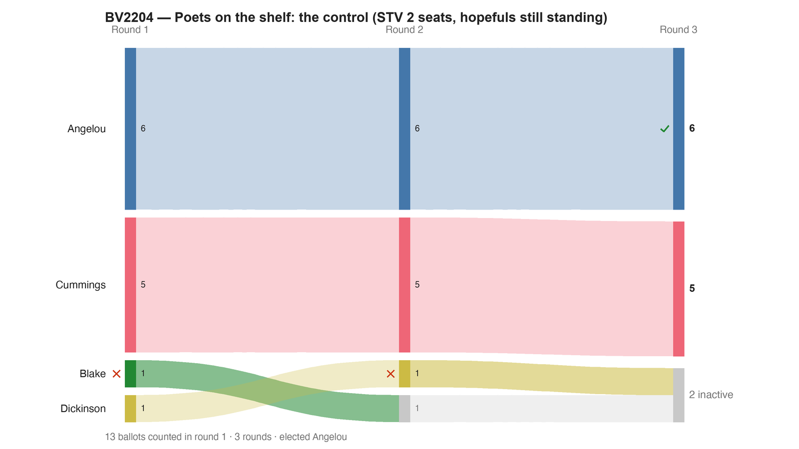

---
search:
  exclude: true
---

# BV2204 — Poets on the shelf: the control (STV 2 seats, hopefuls still standing)

*Generated from [`bv2204_39py93_control_standing_hopefuls.yaml`](../bv2204_39py93_control_standing_hopefuls.yaml) — do not edit by hand. Regenerate: `python STARVote_LH_tabulation_engine/tools_adam/scripts/build_yaml_pages.py`.*

**Method:** [STV (proportional, ranked ballots)](../../../../../03_STAR_PR/01_Learn/README.md) · **2 seats** · **Expected winners:** Angelou, Cummings

**▶ Live on BetterVoting:** [vote](https://bettervoting.com/39py93) · **[results ↗](https://bettervoting.com/39py93/results)** (election `39py93` · test `BV2204`).

## Scenario

Bisection probe #2 (the CONTROL) for the BetterVoting STV sole-survivor
crash: config identical to the crashing exercise-14 election tk776t —
STV, 2 seats, 4 candidates, write-ins off — but ballots whose count
ends with two hopefuls STILL STANDING, so no candidate is ever
eliminated. 13 voters: Angelou (6 first choices) and Cummings (5) both
clear quota outright, so both are elected and any surplus of Angelou's
transfers to Blake — both seats filled with Blake and Dickinson never
eliminated. How many rounds that takes, and how much surplus moves,
depends on which of the two published Droop quotas the count applies;
the report below names the one it uses. The probe's point — an endgame
that leaves hopefuls still standing — holds either way. PREDICTION:
computes. RESULT: computes — BetterVoting
returns Angelou + Cummings, agreeing with the LH engine. Together with
probe #1 (gvtg2h: same crashing count, flag removed, still errors)
this convicts the ENDGAME — electing the last remaining hopeful at
quota — and acquits the shape and every config key. Full lab notebook:
README.md in this folder.
Live on BetterVoting (Test ID BV2204): https://bettervoting.com/39py93

## Ballots

Each row is one voter's ranking, most-preferred first (`N:` prefix = N identical ballots).

```text
6:Angelou>Blake
5:Cummings>Blake
1:Blake
1:Dickinson
```

## What the engine says



*Where the votes went. Band thickness is votes; a band leaving an eliminated candidate lands on whoever that ballot ranked next, or on **inactive** if it ranked nobody who was left.*

The count, step by step — the rounds and how the winner is reached:

<!-- --8<-- [start:report] -->
```text
--- STV / Single Transferable Vote (multi-winner — 2 seats) ---
  BV2204 — Poets on the shelf: the control (STV 2 seats, hopefuls still standing)
 Tabulating 13 ballots (ranked ballots).
 2 seats; quota = 4.33 (exact Droop, votes/(seats+1)) — 33.3% of 13.
 Elected at >= quota, and every surplus is measured from it.
 (Hand-count Droop, floor(13/3)+1 = 5, is a different but equally standard rule.)

FINAL RESULT
Candidate      Votes  Status
-----------  -------  --------
Angelou            6  Elected
Cummings           5  Elected
Blake              1  Rejected
Dickinson          1  Rejected


Winner(s) — STV / Single Transferable Vote (multi-winner — 2 seats)
  Angelou
  Cummings
```
<!-- --8<-- [end:report] -->

### Full audit — preference matrix, Condorcet, and score distribution

```text
--- Smith Set (the generalized Condorcet winner) ---
The smallest group whose every member beats every candidate outside it —
the honest answer to "who is even in contention?".
   Smith set (2 of 4): Angelou, Blake
   Outside (2):        Cummings, Dickinson
   More than one member ⇒ NO Condorcet winner: the top of the tournament is a
   cycle, so the strongest "candidate" is a set, not a person. Which member of
   the set should win is exactly what Minimax / Ranked Pairs / Schulze disagree
   about — see 05_Ranked_Robin/01_Learn/cycle_resolution.md.
   Fine print: this set contains a pairwise DRAW, and a draw is enough to keep a
   candidate in the Smith set but not in the tighter Schwartz set — so Schwartz
   may be smaller here.
   More: 07_Concepts/topics/smith_set.md
```

Everything in one file: the [`_tabulated` mirror](../cases_tabulated/bv2204_39py93_control_standing_hopefuls_tabulated.txt) (regenerated on every run; every analysis forced on).

Run it yourself:

```bash
python STARVote_LH_tabulation_engine/starvote_larry_hastings.py 06_Other/STV/bv_stv_sole_survivor_crash/cases/bv2204_39py93_control_standing_hopefuls.yaml
```

## See also

- [Glossary](../../../../../07_Concepts/GLOSSARY.md) · [all cases by method](../../../../../07_Concepts/YAML_test_case_index/README.md)

More cases in this set: [bv2203_gvtg2h_flag_probe](bv2203_gvtg2h_flag_probe.md) · [bv2205_8xwx43_minimal_sole_survivor](bv2205_8xwx43_minimal_sole_survivor.md)
