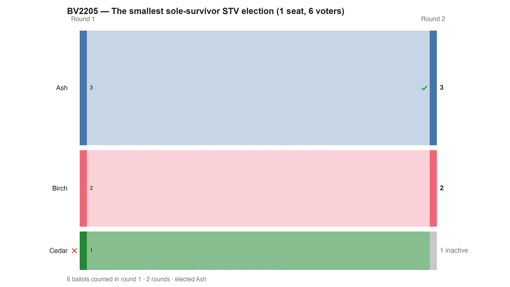

---
search:
  exclude: true
---

# BV2205 — The smallest sole-survivor STV election (1 seat, 6 voters)

*Generated from [`bv2205_8xwx43_minimal_sole_survivor.yaml`](../bv2205_8xwx43_minimal_sole_survivor.yaml) — do not edit by hand. Regenerate: `python STARVote_LH_tabulation_engine/tools_adam/scripts/build_yaml_pages.py`.*

**Method:** [STV (proportional, ranked ballots)](../../../../../03_STAR_PR/01_Learn/README.md) · **1 seat** · **Expected winner:** Ash

**▶ Live on BetterVoting:** [vote](https://bettervoting.com/8xwx43) · **[results ↗](https://bettervoting.com/8xwx43/results)** (election `8xwx43` · test `BV2205`).

## Scenario

Bisection probe #3 (the MINIMAL crasher) for the BetterVoting STV
sole-survivor crash: 1 seat, 3 candidates, 6 fully deterministic
ballots — no tie at any step. BetterVoting's count runs: Round 1, Ash
3 / Birch 2 / Cedar 1 — nobody at quota; Cedar eliminated, his ballot
exhausts. Round 2: Birch eliminated, both Birch ballots transfer to
Ash. Round 3: Ash — now the ONLY remaining candidate — is over quota,
and BetterVoting's elect-branch removes him and tries to
redistribute his surplus over an EMPTY candidate list: IRV.ts
distributeVotes reduces over the empty array with no initial value and
throws. PREDICTION: errors. RESULT: errors (13617b56). Proves the
crash needs neither multi-seat, nor truncation, nor any config quirk —
single-seat STV with six ballots is enough. Any working STV engine
elects Ash (the LH count below). Full lab notebook: README.md in this
folder.
Live on BetterVoting (Test ID BV2205): https://bettervoting.com/8xwx43
— results page errors by design of the probe.

## Ballots

Each row is one voter's ranking, most-preferred first (`N:` prefix = N identical ballots).

```text
3:Ash
2:Birch>Ash
1:Cedar
```

## What the engine says



*Where the votes went. Band thickness is votes; a band leaving an eliminated candidate lands on whoever that ballot ranked next, or on **inactive** if it ranked nobody who was left.*

The count, step by step — the rounds and how the winner is reached:

<!-- --8<-- [start:report] -->
```text
--- RCV / Instant-Runoff Voting (single winner) ---
  BV2205 — The smallest sole-survivor STV election (1 seat, 6 voters)
 Tabulating 6 ballots (ranked ballots).

FINAL RESULT
Candidate      Votes  Status
-----------  -------  --------
Ash                3  Elected
Birch              2  Rejected
Cedar              1  Rejected


Winner(s) — RCV / Instant-Runoff Voting (single winner)
  Ash
```
<!-- --8<-- [end:report] -->

### Full audit — preference matrix, Condorcet, and score distribution

```text
--- Smith Set (the generalized Condorcet winner) ---
The smallest group whose every member beats every candidate outside it —
the honest answer to "who is even in contention?".
   Smith set (1 of 3): Ash
   Outside (2):        Birch, Cedar
   One member ⇒ Ash is the Condorcet winner, beating every rival head-to-head.
   RCV-IRV winner Ash is INSIDE the Smith set. ✓
      Not guaranteed — RCV-IRV is not Smith-efficient — but it holds here.
   More: 07_Concepts/topics/smith_set.md
```

Everything in one file: the [`_tabulated` mirror](../cases_tabulated/bv2205_8xwx43_minimal_sole_survivor_tabulated.txt) (regenerated on every run; every analysis forced on).

Run it yourself:

```bash
python STARVote_LH_tabulation_engine/starvote_larry_hastings.py 06_Other/STV/bv_stv_sole_survivor_crash/cases/bv2205_8xwx43_minimal_sole_survivor.yaml
```

## See also

- [Ties & tie-breaking (topic hub)](../../../../../07_Concepts/topics/ties/README.md)
- [Exhausted ballots (conversation)](../../../../RCV_IRV/concepts/exhausted_ballots_301.md)
- [Glossary](../../../../../07_Concepts/GLOSSARY.md) · [all cases by method](../../../../../07_Concepts/YAML_test_case_index/README.md)

More cases in this set: [bv2203_gvtg2h_flag_probe](bv2203_gvtg2h_flag_probe.md) · [bv2204_39py93_control_standing_hopefuls](bv2204_39py93_control_standing_hopefuls.md)
