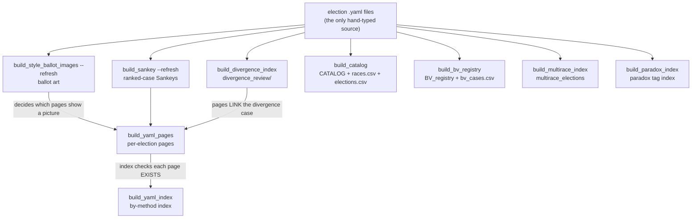
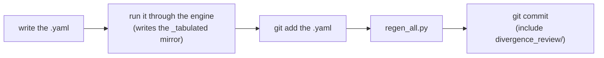

# Regenerating the derived files

**Level: reference · deep dive**

Most of what this repo publishes is **generated** — the per-election pages, the by-method index, the catalog, the BV registry, the divergence ledger, the paradox index, the `_tabulated` mirrors, the ballot art. Only the `.yaml` election files and the hand-authored teaching Markdown are typed by a person.

That means "I changed a case, what do I rebuild?" has a real answer, and getting it wrong fails **silently** — the generators don't error, they just write something slightly wrong that nobody notices until CI, or until a reader clicks a dead link. This page is the answer, plus the four traps that have actually bitten.

The one-command version:

```bash
.venv/bin/python STARVote_LH_tabulation_engine/tools_adam/scripts/regen_all.py
```

Read the first word of that command before you read the rest of this page. It is the trap that cost the most.

---

## What runs, and in what order

[`regen_all.py`](../../STARVote_LH_tabulation_engine/tools_adam/scripts/regen_all.py) runs nine generators. The order is load-bearing for the first five — each consumes an earlier one's output — and free for the rest, which only read the `.yaml` sources.



The four on the right only read the sources, so their relative order doesn't matter; they run last so anything they link already exists.

| Generator | Writes |
|---|---|
| `build_style_ballot_images.py --refresh` | ballot art, **only for cases that already have some** |
| `build_sankey.py --refresh` | round-by-round Sankeys, same refresh-only rule |
| `build_divergence_index.py` | [`method_comparisons/divergence_review/`](../../method_comparisons/divergence_review/INDEX.md) — INDEX, csv, per-case pages |
| `build_yaml_pages.py` | `<set>/cases/cases_pages/*.md` |
| `build_yaml_index.py` | [the by-method index](../YAML_test_case_index/README.md) |
| `build_catalog.py` | [`CATALOG.md`](../YAML_test_case_index/CATALOG.md) + `races.csv` + `elections.csv` |
| `build_bv_registry.py` | [`BV_registry.md`](../YAML_test_case_index/BV_registry.md) + `bv_cases.csv` |
| `build_multirace_index.py` | [`multirace_elections.md`](../YAML_test_case_index/multirace_elections.md) |
| `build_paradox_index.py` | [`PARADOX_index.md`](../YAML_test_case_index/PARADOX_index.md) + `paradox_cases.csv` |

**Three things `regen_all.py` deliberately does not do:** it does not rebuild the `_tabulated` engine mirrors (those come from re-running each YAML through its engine), it does not stage anything, and it does not commit. Add `--check` to run the read-only checkers afterwards.

---

## Trap 1 — use `.venv/bin/python`, never bare `python3`

The generators and engines degrade gracefully when an optional dependency is missing. That is good behaviour at runtime and a disaster during a regeneration, because the degraded output **looks fine**.

Observed 2026-08-16, ten files:

```diff
-Cross-check — pref_voting score_voting: Beth  (✓ agrees with the hand count)
+Cross-check — pref_voting not installed; hand count only (install `pref_voting` to enable the independent check).
```

The venv had `pref_voting` 1.18.1 the whole time. Someone regenerated with the system interpreter, and every affected mirror and page quietly dropped the **third-party** verification — the leg that makes a Range or CAV result trustworthy rather than self-confirming. Committing that would have made the repo claim *less* verification than it actually has, on exactly the pages whose job is to show the count is right.

The same failure mode hits PyYAML (mirrors regenerate with a degraded YAML echo) and `abcvoting`. There is no warning line and no non-zero exit — that is the whole problem.

**Rule: every regeneration command in this repo starts `.venv/bin/python`.** If you use `uv run`, that is equivalent.

## Trap 2 — `git add` a new case before building the divergence ledger

[`build_divergence_index.py`](../../STARVote_LH_tabulation_engine/tools_adam/scripts/build_divergence_index.py) discovers cases through `git ls-files`, which lists **tracked and staged** paths. A brand-new `.yaml` that has not been `git add`ed is invisible to it, so the case gets no divergence entry — and then [`build_yaml_pages.py`](../../STARVote_LH_tabulation_engine/tools_adam/scripts/build_yaml_pages.py) finds no divergence case to link, and the page ships without it. No error at any step.

So landing a new case has an order, and `git add` is inside it rather than at the end:



The reverse also matters: `divergence_review/` is generated but **not** staged for you unless the pre-commit hook rewrote it, so include it in the commit yourself.

## Trap 3 — a scratch file in a case folder poisons the whole set

Every generated page carries a *"More cases in this set"* line listing its siblings. That list is built from whatever `.yaml` files are sitting in the folder — tracked or not.

Observed the same day: an untracked probe file named `_yaml_type_probe.yaml`, sitting in the `02_Examples` case folder, left over from testing a hygiene check. A single `build_yaml_pages.py` run gave it a page and inserted a link to it into the sibling line of **all 31 pages in that set**. Committing that would have published 31 links to a file that does not exist in the repository — precisely the failure `check_untracked_link_targets` exists to catch, and the one that reddens the docs deploy for everyone.

**Rule: delete scratch and probe files before regenerating.** [CLAUDE.md](../../CLAUDE.md) already says never to commit them; this is the second reason. A quick check before a big rebuild:

```bash
git status --porcelain --untracked-files=all | grep -E '/_|/trash_delete'
```

## Trap 4 — the pre-commit hook covers four surfaces, not nine

The [pre-commit hook](../../STARVote_LH_tabulation_engine/tools_adam/scripts/git-hooks/pre-commit) refreshes and stages four generated surfaces — the divergence ledger, the multirace index, the by-method index, and the catalog — then runs a pytest subset. It is a safety net, not the regeneration.

What it does **not** touch: the per-election pages, the BV registry, the paradox index, the ballot art, the Sankeys, and every `_tabulated` mirror. And its pytest subset includes `test_yaml_index_current`, `test_catalog_current` and `test_divergence_index_current` but **not** `test_yaml_pages_current` — so stale generated pages are caught only by CI on master, not by your commit.

Two more things about the hook worth knowing before you read a surprising `git show --stat`:

- Each refresh block is **non-blocking**. A generator that dies leaves a stale file and says so in a line that scrolls past.
- It stages **only the paths its own run changed** (hashed before and after), specifically so a concurrent session's unrelated edits in the same directory are not adopted. That mechanism exists because a pathspec commit builds a temporary index, so anything the hook stages lands in your commit even when you scoped it.

---

## Quick reference

| I changed… | Run |
|---|---|
| a case's `ballots:` or options | the engine on that file, then `regen_all.py` |
| added a **new** case | engine → **`git add` the yaml** → `regen_all.py` |
| a `bv_*` field | `regen_all.py` (registry + catalog) |
| a case's ballot-row `#` comments | the engine on that file (the mirror echoes the YAML) |
| a generator itself | `regen_all.py --check`, then read the diff before staging |

Related: [Repository & Engine Guide](repository_guide.md) · [How the website is built](website_build.md) · [the test suite](../../STARVote_LH_tabulation_engine/tests/README.md)
