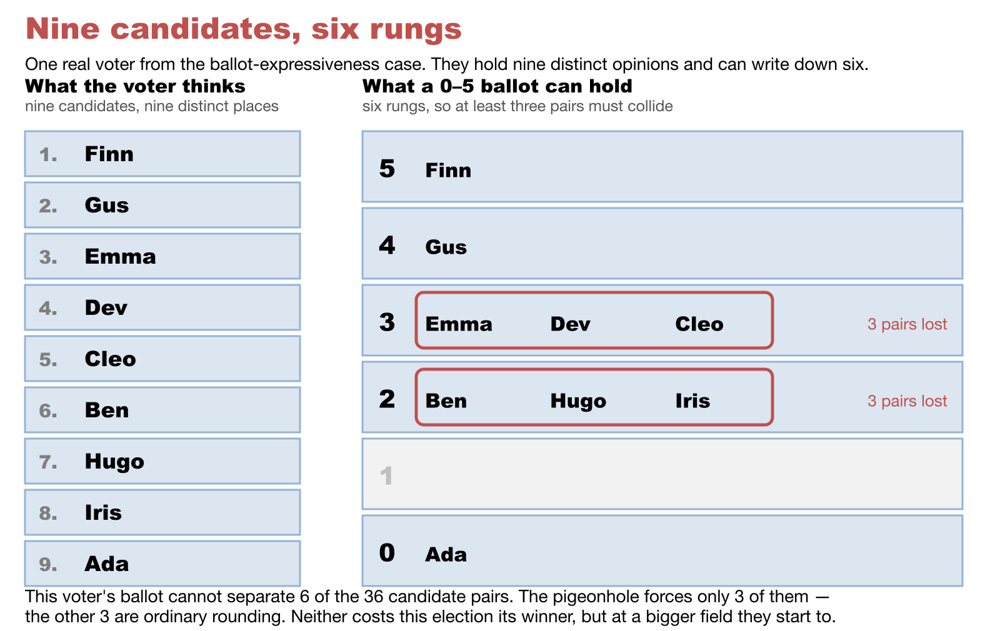

# What the ballot can and cannot say — expressiveness, measured

→ Companions: [scores vs ranks](scores_vs_ranks.md) · [strict vs weak ranks](strict_vs_weak_ranks.md) · [the fidelity ladder](fidelity_ladder.md) · [scale granularity can flip the winner](scale_granularity_flips_the_winner.md) · the rates this corrects: [Condorcet efficiency, measured](../topics/condorcet/condorcet_efficiency_measured.md) · the worked election: [ballot expressiveness](../../method_comparisons/ballot_expressiveness/README.md) · **Level: 301 · deep dive**

[Condorcet efficiency, measured](../topics/condorcet/condorcet_efficiency_measured.md) carries this caveat, and calls it the biggest one on the page:

> **Ballot resolution is not held constant across methods** — ranked methods get full-resolution preferences, score methods get six rungs. Realistic (a 0–5 ballot genuinely cannot rank seven candidates), but it means part of the STAR-vs-RR gap at large fields measures **ballot expressiveness rather than tabulation rule**.

That is a real problem with the measurement, and stating it is not the same as fixing it. This page fixes it — by counting what each ballot can actually record, and then by re-running the simulation with the **ballot** and the **rule** varied independently, so "what the paper could not carry" and "what the count got wrong" stop being one number.

**The short answer, in three parts.** At seven or more candidates the caveat is not just correct, it is *most of the gap*: about 80% of STAR's shortfall against Ranked Robin on a single-issue spectrum is the six-rung ballot, not the automatic runoff — STAR's rule at full resolution scores **98–100%**. Second, the direction people expect is wrong once you use a **real** ranked ballot: capped at five names, as New York City and Maine cap theirs, the ranked ballot is far *less* expressive than the 0–5 score ballot and loses answers the score ballot keeps. Third — and this is why the caveat does not rescue RCV-IRV — **IRV barely notices ballot resolution at all**, because it never reads the part of the ballot that resolution lives in.

---

## 1. Cardinal and ordinal are not more and less — they are different

A **cardinal** (score) ballot records order *and* intensity, at limited resolution. An **ordinal** (ranked) ballot records order alone, at full resolution. Neither contains the other. Each throws away exactly what the other keeps:

- A ranked ballot cannot say *"my first choice is barely ahead of my second, and both are miles ahead of the rest."* Every gap is one step.
- A 0–5 ballot cannot say *"these nine candidates are in this strict order,"* because six rungs hold six distinct places.

The second limit is a **pigeonhole**, not a tendency: from seven candidates onward *every* voter must give at least two candidates the same score, whatever they think. Here it is happening to one real voter — the one standing at +0.20 in [the worked election](../../method_comparisons/ballot_expressiveness/README.md), who holds nine distinct opinions and gets to write down six:



Six of that voter's 36 pairwise opinions do not make it onto the paper. Note the second line of the caption, because it is the part usually skipped: **the pigeonhole forces only three of those six.** The other three are ordinary rounding, and rounding is doing at least as much work as the hard limit. The first thing worth doing, then, is counting properly.

## 2. Count what each paper can record

Pure arithmetic — no sampling, no model, nothing to disagree with:

```bash
uv run 06_Other/simulations/condorcet_efficiency_simulation.py --ballot-counts --candidates 3 5 7 9 11 13 14
```

```text
  C |         strict rank          0-5 ballot       0-5 as orders               weak rank    top-5 rank | strict rankable?
--------------------------------------------------------------------------------------------------------------------------
  3 |                   6                 216                  13                      13            16 | all
  5 |                 120               7,776                 541                     541           326 | all
  7 |               5,040             279,936              42,253                  47,293         3,620 | NONE
  9 |             362,880          10,077,696           2,944,381               7,087,261        18,730 | NONE
 11 |          39,916,800         362,797,056         162,509,293           1,622,632,573        64,472 | NONE
 13 |       6,227,020,800      13,060,694,016       7,674,723,421         526,858,348,381       173,486 | NONE
 14 |      87,178,291,200      78,364,164,096      50,737,344,843      10,641,342,970,443       266,645 | NONE
```

`0-5 as orders` collapses together the score ballots that say the same thing about *order* — so it is the fair like-for-like against a ranking. `weak rank` is the ranked ballot that permits equal ranks, which is what [Ranked Robin](../../05_Ranked_Robin/01_Learn/ranked_robin.md) actually accepts.

Three things fall out, and the first two are the opposite of the folk claim:

**A 0–5 ballot records more distinct opinions than a strict ranking, all the way up to fourteen candidates.** At seven candidates it is 279,936 against 5,040 — fifty-five times as many. The crossover where the ranking finally overtakes it is C = 14.

**Past six candidates the two ballots express *disjoint* sets of orderings.** Every strict ranking of seven candidates uses seven distinct places; a 0–5 ballot has six. So the score ballot expresses 42,253 orderings, the strict ballot expresses 5,040, and **not one is in both sets**. Neither is a subset of the other, which is why "more expressive" is the wrong axis. Only the weak-ranked ballot (47,293) is a superset of both.

**The real ranked ballot is by far the smallest.** No large-field jurisdiction issues a full-resolution ranking: NYC and Maine cap at five, San Francisco used three for years. At nine candidates that cap records **18,730** opinions against the score ballot's **10,077,696** — three orders of magnitude fewer, because it says nothing whatever about four of the nine candidates.

## 3. The yardstick is the reason the caveat exists

Here is the part that explains *why* the confound is there at all, and it is not an accident of the harness.

**Condorcet efficiency grades on order.** The Condorcet winner is defined entirely by pairwise order, so a ballot that records order completely is being graded on exactly what it records, and a ballot that spends half its capacity on intensity is not. The order-complete ballot wins **by construction**. A yardstick built on *intensity* instead — utility efficiency, VSE — would tilt the other way just as structurally, and for the same reason.

So the caveat is really this: **Condorcet efficiency is not a neutral referee between cardinal and ordinal ballots.** It is a fair referee between *rules*, which is what the next section measures, and a loaded one between *papers*. That does not make the numbers wrong — a real STAR election really is counted on six rungs, so the cost really does land on STAR — but it does mean the comparison must be read as "how often does this method find the *order* winner", never as "which ballot is better".

## 4. The controlled experiment: vary the ballot, hold the rule

Cross the papers with the rules and the confound comes apart. Copeland on the 0–5 ballot isolates the **paper** (same rule, coarser ink). STAR's rule at full resolution isolates the **count** (same paper as the control, different rule).

```bash
uv run 06_Other/simulations/condorcet_efficiency_simulation.py --expressiveness --trials 4000 --voters 501 --candidates 3 5 7 9 11
```

```text
model       C    V |  RR full   RR 0-5  RR top5  RR top3 | STAR full  STAR 0-5 | IRV full  IRV 0-5  IRV top5  IRV top3 |  tied% forced%
---------------------------------------------------------------------------------------------------------------------------------------
noise       3  501 |   100.0%    88.6%   100.0%   100.0% |     96.2%     88.8% |    95.9%    82.8%     95.9%     95.9% |   6.7%    0.0%
noise       5  501 |   100.0%    83.2%   100.0%    85.8% |     94.6%     83.8% |    90.2%    71.3%     90.2%     81.0% |  11.4%    0.0%
noise       7  501 |   100.0%    81.9%    90.4%    73.3% |     93.1%     81.1% |    84.4%    64.7%     79.1%     68.2% |  13.3%    4.8%
noise       9  501 |   100.0%    81.5%    81.0%    64.1% |     94.3%     81.9% |    82.0%    62.6%     71.3%     61.5% |  14.4%    8.3%
noise      11  501 |   100.0%    81.8%    74.0%    55.2% |     94.3%     79.7% |    76.9%    60.2%     65.1%     52.3% |  15.1%    9.1%

spatial1d   3  501 |   100.0%    97.3%   100.0%   100.0% |    100.0%     97.2% |    87.6%    86.1%     87.6%     87.6% |   6.2%    0.0%
spatial1d   5  501 |   100.0%    90.6%   100.0%    86.5% |     99.6%     86.3% |    60.1%    59.1%     60.1%     56.9% |  11.3%    0.0%
spatial1d   7  501 |   100.0%    83.4%    96.4%    37.1% |     99.4%     79.5% |    45.5%    45.8%     44.8%     34.1% |  13.9%    4.8%
spatial1d   9  501 |   100.0%    77.2%    65.7%    17.9% |     98.9%     72.3% |    35.7%    33.8%     32.5%     23.0% |  15.5%    8.3%
spatial1d  11  501 |   100.0%    71.8%    25.0%    14.0% |     98.8%     68.2% |    30.8%    29.5%     24.1%     18.1% |  16.8%    9.1%

spatial2d   3  501 |   100.0%    98.4%   100.0%   100.0% |    100.0%     98.4% |    96.8%    95.5%     96.8%     96.8% |   5.9%    0.0%
spatial2d   5  501 |   100.0%    96.2%   100.0%    97.2% |    100.0%     95.4% |    85.2%    84.1%     85.2%     83.8% |  10.9%    0.0%
spatial2d   7  501 |   100.0%    93.7%    99.5%    80.6% |     99.7%     92.3% |    71.0%    72.7%     70.9%     64.8% |  13.5%    4.8%
spatial2d   9  501 |   100.0%    92.8%    94.8%    63.7% |     99.7%     91.4% |    60.2%    63.5%     59.2%     50.6% |  15.1%    8.3%
spatial2d  11  501 |   100.0%    91.0%    83.6%    47.8% |     99.8%     89.7% |    49.4%    55.0%     47.0%     38.2% |  16.3%    9.1%

faction2d   3  501 |   100.0%    98.9%   100.0%   100.0% |     99.3%     98.8% |    95.3%    94.7%     95.3%     95.3% |   5.9%    0.0%
faction2d   5  501 |   100.0%    96.8%   100.0%    96.6% |     98.4%     94.9% |    84.3%    83.8%     84.3%     83.9% |  10.8%    0.0%
faction2d   7  501 |   100.0%    94.7%    98.9%    86.5% |     97.6%     91.9% |    76.2%    76.1%     76.1%     74.2% |  13.4%    4.8%
faction2d   9  501 |   100.0%    93.4%    93.2%    73.8% |     97.3%     89.4% |    70.6%    70.4%     70.1%     66.4% |  15.1%    8.3%
faction2d  11  501 |   100.0%    91.1%    82.5%    65.2% |     97.2%     87.7% |    64.5%    64.8%     63.0%     59.4% |  16.4%    9.1%
```

`RR full` is the control and must read 100.0%; `tied%` is the share of candidate pairs an average 0–5 ballot cannot separate, and `forced%` is the pigeonhole floor for comparison.

### The decomposition

Take `spatial1d` at seven candidates, the cell the original caveat is really about. STAR measures **79.5%** against the control's 100%, a gap of 20.5 points. Split it:

| | |
|---|---:|
| **The ballot** — Copeland's own score, run on a 0–5 ballot instead of a ranking | **−16.6 pts** |
| **The rule** — STAR's rule, run on the full-resolution ballot the control gets | **−0.6 pts** |
| interaction (the two together are slightly worse than the sum) | −3.3 pts |
| **observed STAR gap at 0–5** | **−20.5 pts** |

**About 80% of the gap is the paper.** At eleven candidates it is 89% (28.2 of 31.8). And the number that carries the point on its own: **STAR's rule, given a fine enough ballot, is 98–100% Condorcet-efficient in every structured model.** Score-then-automatic-runoff is very nearly a Condorcet method; what costs it the remaining few points at a big field is six rungs, not the runoff.

Read that in both directions, as the source page insists. It is **not** a defence that clears STAR — a real STAR election really is counted on a 0–5 ballot, so the loss is real and it lands on STAR. But it is **not a property of the automatic runoff**, it is inherited by every score-ballot method, and anyone attributing it to the top-two rule is attributing it to the wrong half of the method.

### And the reversal, once the ranked ballot is realistic

Look along the `RR` block at `spatial1d`, eleven candidates. **Same Copeland rule throughout — only the paper changes:**

```text
Ranked Robin (Copeland), spatial1d, 11 candidates, 501 voters
                                        Condorcet efficiency
ranks all eleven   ████████████████████  100.0%   an idealization; no jurisdiction issues this
0–5 score ballot   ██████████████······   71.8%   six rungs, but says something about everyone
ranks five         █████···············   25.0%   NYC, Maine
ranks three        ███·················   14.0%   San Francisco, historically
```

**The 0–5 ballot beats the real capped ranked ballot by 47 points.** Six rungs say something about every candidate; five ranks out of eleven say nothing about six of them, and a candidate nobody's ballot mentions wins no head-to-head. So the caveat, applied to ballots that actually exist rather than to the idealized one in the harness, points the *other* way at large fields — and the crossover is not exotic. It has already happened by seven candidates under a top-3 cap (96.4% → 37.1%).

## 5. RCV-IRV: the cross-reference that changes the story

IRV deserves its own reading here, because the caveat is usually deployed as though *any* ranked method benefits from it. Two findings, and they pull in opposite directions from what you would guess.

**IRV gets the most expressive paper in the table and still finishes last.** At `spatial1d` with seven candidates, IRV reading a **complete nine-name ranking** scores 45.5% — while STAR, reading six rungs, scores 79.5%. Handed the ballot the caveat says is richer, instant runoff elects the head-to-head winner *less than half the time*. Whatever the expressiveness gap is doing, it is not what separates STAR from IRV; [center squeeze](../topics/center_squeeze/README.md) is.

**IRV barely notices resolution at all.** Compare `IRV full` with `IRV 0-5` down any structured block — 45.5 vs 45.8 at `spatial1d`/7, 76.2 vs 76.1 at `faction2d`/7, 71.0 vs 72.7 at `spatial2d`/7. Essentially no difference, and occasionally *better* on the coarse ballot. The reason is mechanical and already documented here: [IRV only ever counts each ballot's top surviving choice](strict_vs_weak_ranks.md), discarding the down-ballot detail until a higher choice is eliminated. Resolution lives in exactly the detail IRV throws away, so a finer ballot buys it almost nothing — and a coarser one costs it almost nothing.

Put those together and the fair statement is sharper than either camp usually makes it. **The ballot-expressiveness confound is a genuine confound for STAR and Ranked Robin, and essentially not one for RCV-IRV.** Correcting for it moves STAR up to 98–100% and moves IRV nowhere.

**The symmetric caution, stated in the same breath** ([house rule](../../method_comparisons/README.md)): under impartial `noise` IRV *does* beat STAR at every field size, on any paper — and the `IRV 0-5` column there is the one genuinely hostile number in the table, because forcing a tie-laden score ballot into strict ranks means inventing preferences the voter does not hold. That column falls to 60.2% at eleven candidates. It is a real effect and it is exactly what the LH engine warns about when it converts scores to ranks, but it is a fact about **score→rank conversion**, not about IRV's own ballot.

## 6. Watch it happen: one electorate, five papers

Rates over thousands of elections are evidence; a single election you can read is understanding. **[Ballot expressiveness — one electorate, five papers](../../method_comparisons/ballot_expressiveness/README.md)** freezes 25 voters and 9 candidates on one spectrum, where **Finn beats all eight rivals head-to-head**, and changes only what the voter may write down.

| Ballot | Count | Winner | |
|---|---|:--:|---|
| 0–5 scores | STAR | **Finn** | ✅ |
| ranks all nine | Ranked Robin | **Finn** | ✅ the control |
| ranks only five | Ranked Robin | **Gus** | ❌ the *paper* changed |
| ranks all nine | RCV-IRV | **Ben** | ❌ the *count* changed |
| ranks only five | RCV-IRV | **Ben** | ❌ unchanged — already lost |

Rows 2 and 3 differ **only in the paper**; rows 2 and 4 differ **only in the count**. That is the whole distinction this page is about, in one election. On the capped paper Finn's record falls from 8–0 to 5–1–2t — not because anyone changed their mind, but because only 16 of the 25 voters can fit Finn into five names.

Every ballot is derived from frozen positions by a stated rule, and **no count in that folder is settled by a tie-break** — that was a search constraint, after an earlier candidate electorate was discarded for having an 8–8 IRV elimination tie whose winner flipped between lot rules.

## 7. Caveats

- **The unstated pairs on a truncated ballot are a convention.** Here an unranked candidate is beaten by everyone the voter ranked and tied with everyone else left off; other treatments split that pair half-and-half. The `top-k` columns move if you change it, and the choice belongs with any quotation of them.
- **The rank caps are real but not universal.** Five is NYC and Maine; three was San Francisco; some jurisdictions do allow a full ranking. The point is not that every ranked election is capped, it is that the *idealized uncapped* ballot in the harness is the unusual one at a large field.
- **Min-max normalization is doing work.** Voters here scale their own utilities onto 0–5 and round. Real voters do not normalize perfectly, and this rule is what sets the `tied%` column — the most consequential modelling assumption on both this page and its parent.
- **`forced%` is a floor, not the effect.** The pigeonhole compels ties only from seven candidates, and only 4.8% of pairs there — while voters actually tie 13.9%. Most flattening is ordinary rounding. Do not blame the pigeonhole for work that rounding did.
- **Condorcet efficiency is the only yardstick used here**, and §3 explains why that is not neutral between cardinal and ordinal ballots. A utility-based measure would rank these papers differently. Neither measure is the truth.
- **Four models is not the world**, and every number above is sincere-ballot only.

---

## Where this lands

The caveat on [Condorcet efficiency, measured](../topics/condorcet/condorcet_efficiency_measured.md) was right, and understated: at large fields the ballot is *most* of the STAR-vs-RR gap, and STAR's rule at full resolution is very nearly Condorcet-efficient. But the fix does not hand the argument to ranked ballots, for two reasons this page measures rather than asserts — **real ranked ballots are capped**, which costs far more than six rungs do, and **RCV-IRV cannot spend the expressiveness it is given**, because it never reads the part of the ballot that holds it.

The design lesson is the one the counting table already implies: **the question is not which ballot is more expressive, it is which dimension you want expressed.** Order, or intensity. Cardinal and ordinal each answer one of those completely and the other not at all, and [what makes a good winner](../topics/what_makes_a_good_winner.md) is where this repo argues about which one an election should be asking for.

---

**See also:** [scores vs ranks](scores_vs_ranks.md) · [strict vs weak ranks](strict_vs_weak_ranks.md) · [the fidelity ladder](fidelity_ladder.md) · [scale granularity can flip the winner](scale_granularity_flips_the_winner.md) · [the worked election](../../method_comparisons/ballot_expressiveness/README.md) · [Condorcet efficiency, measured](../topics/condorcet/condorcet_efficiency_measured.md) · [why more candidates make every method miss](../topics/condorcet/why_more_candidates_miss.md) · [the crowded field](../../method_comparisons/crowded_field/README.md) · [exhausted ballots](../../06_Other/RCV_IRV/concepts/RCV_IRV_exhausted_ballots.md) · [simulations folder](../../06_Other/simulations/README.md)
