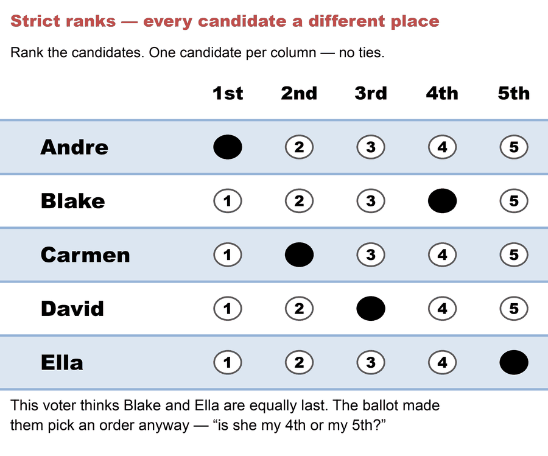
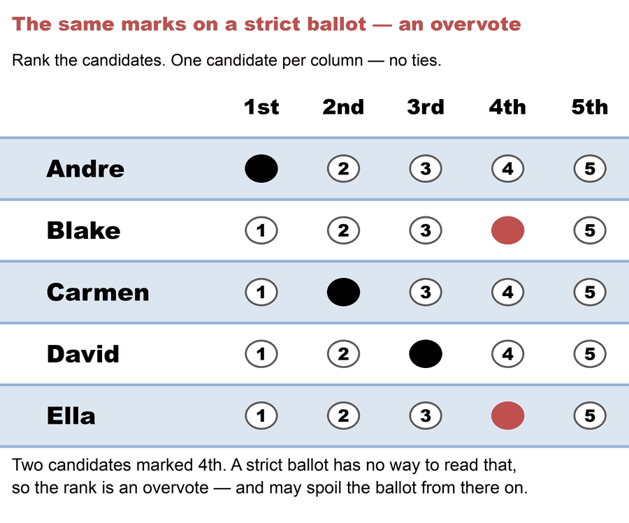

# Strict ranks — every candidate a different place

*A **strict** ranking forbids ties: every candidate must get a distinct position — 1st, 2nd, 3rd, and so on, no two the same. It's the ballot rule **RCV-IRV (Hare)** and **STV** use.*

→ The full contrast: [strict vs. weak ranks](strict_vs_weak_ranks.md) · the other kind: [weak ranks](weak_ranks.md)

---

## What it means

On a strict ballot you may not mark two candidates **equal**. If you honestly feel two candidates are about the same, the ballot forces you to invent an order anyway — "is she my 4th or my 5th?"

Look at the bottom two rows. This voter thinks Blake and Ella are *equally* their last choice — but the grid has one bubble per column, so somebody had to be 4th and somebody 5th. The order between them is an artifact of the paper, not an opinion.

Marking them the same is treated as an **overvote** and can spoil that rank:

Formally, a strict ranking is a *total order* over the candidates you rank. In the PrefLib data taxonomy these are the **SOC / SOI** types (Strict Order, Complete or Incomplete).

## Why it matters

- **Forced distinctions add noise.** Making voters rank near-equal candidates in a fixed order records preferences they don't actually feel; studies suggest this raises ballot-spoilage rates (real but contested evidence).
- **It can't express indifference.** "These two are equally good" is unsayable on a strict ballot — a real loss of expressive power.
- **It's the RCV-IRV rule.** Because US "RCV" is RCV-IRV (Hare), the ballot most people meet is strict — which surprises voters who assume they can mark ties.

The alternative — letting voters mark candidates equal — is a [weak rank](weak_ranks.md), which Ranked Robin and the other Condorcet methods allow: the *same* marks that spoil a rank above are a valid vote on that paper. Scores go further still, carrying order *and* strength: [scores vs. ranks](scores_vs_ranks.md).

## Related

- [Strict vs. weak ranks](strict_vs_weak_ranks.md) — the head-to-head, with the method table
- [Weak ranks](weak_ranks.md) · [Scores vs. ranks](scores_vs_ranks.md)
- [RCV-IRV (Hare)](../../06_Other/RCV_IRV/concepts/RCV-IRV-Hare.md) — the strict-rank, non-pairwise method on US ballots

# file: strict_ranks.md
