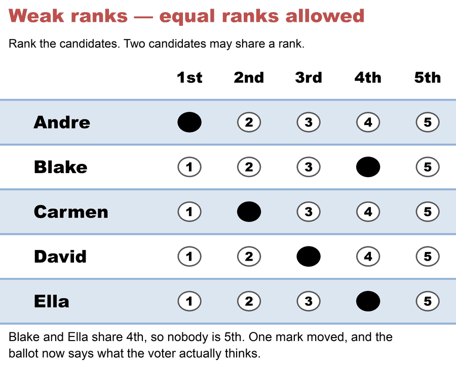

# Weak ranks — equal ranks allowed

*A **weak** ranking lets you mark two candidates **equal** — "I like these two the same." (Formally: a weak order, or "order with ties.") Ranked Robin and the other Condorcet methods allow it; **RCV-IRV (Hare) does not.***

→ The full contrast: [strict vs. weak ranks](strict_vs_weak_ranks.md) · the other kind: [strict ranks](strict_ranks.md)

---

## What it means

On a weak-ranked ballot you may give two (or more) candidates the **same** rank. You're never forced to invent a preference you don't feel — if two candidates are equally good to you, you say so.

That's the same voter as on the [strict ballot](strict_ranks.md), with exactly one mark moved: Ella slides from 5th up to 4th, joining Blake. Two filled bubbles in one column is the whole difference — and the 5th column empties out, because once two candidates share 4th there is no 5th place to give.

In the PrefLib data taxonomy these are the **TOC / TOI** types (Ties allowed, Complete or Incomplete).

Which ranked methods allow it? Condorcet methods — [Ranked Robin](../../05_Ranked_Robin/01_Learn/ranked_robin.md), Schulze, Ranked Pairs, Minimax — allow equal ranks and compare candidates head-to-head. Borda and Bucklin usually allow ties too. **RCV-IRV (Hare) and STV do not** — on those a tie is an overvote.

That last line is a fact about every jurisdiction that runs instant runoff, but it is a **design choice, not a mathematical necessity**. IRV *can* be extended to weak orders, in two natural ways, and a 2024 result proves they are not equally good — the one that keeps independence of clones is not the one organizations actually deploy. See [RCV-IRV with equal ranks](../../06_Other/RCV_IRV/concepts/variants/RCV-IRV-equal-rank.md), with [six runnable cases](../../method_comparisons/equal_rank_irv/README.md).

## Why it matters

- **Honest indifference.** A voter can express "no preference" between two candidates instead of guessing an order.
- **More expressive, less noise.** Forcing a strict order records distinctions voters don't actually feel; equal ranks remove that pressure.
- **It's what people wrongly assume RCV allows.** Marking ties is a feature of *other* ranked methods, not the RCV-IRV that's on US ballots — a common surprise.

Weak ranks still only capture *order*, not *strength* — a second choice "could be as good as your favorite or almost as bad as your last choice," and even a weak ballot can't tell the difference. Scores can: [scores vs. ranks](scores_vs_ranks.md).

## Related

- [Strict vs. weak ranks](strict_vs_weak_ranks.md) — the head-to-head, with the method table
- [Strict ranks](strict_ranks.md) · [Scores vs. ranks](scores_vs_ranks.md)
- [Ranked Robin](../../05_Ranked_Robin/01_Learn/ranked_robin.md) — the Condorcet method that allows equal ranks and compares pairwise

# file: weak_ranks.md
