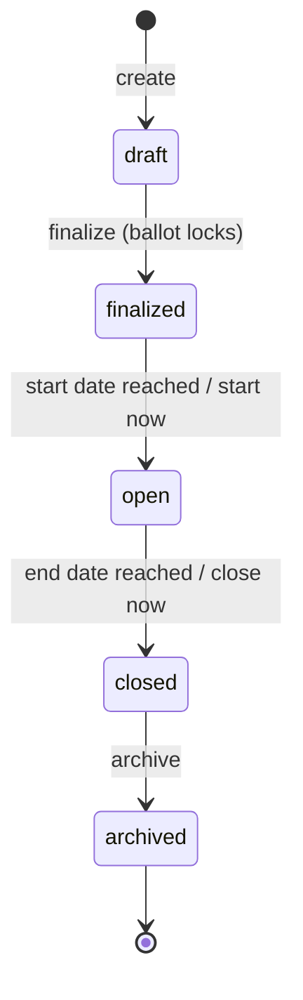

# Organizing docs.bettervoting.com — an IA proposal

Notes toward restructuring [docs.bettervoting.com](https://docs.bettervoting.com), written 2026-08-08 after comparing it against four competitor help sites, reading BetterVoting's own routes and state machine, and going through the existing Google-Docs help corpus.

**The short version, in one line: the content already exists — it is in Google Docs, and the published site has about a tenth of it.**

That reframes the whole problem. The first draft of these notes said BV's docs were thin. They aren't thin; they're **unpublished**. The FAQ corpus alone runs to sixty-odd documents covering registration, ballot secrecy, quorum, proxy voting, receipts, VPNs, export formats, quick polls, demo mode, election checklists, a glossary, and all five election states. Nearly none of it is on docs.bettervoting.com, so none of it is searchable, linkable from the app, or reachable by a user who doesn't already have the Drive folder.

So the job is not "write the docs." It's **publish, dedupe, and shelve** — plus a spine to shelve them on. Three things follow, and they're the whole proposal:

1. **A pipeline problem first.** Every document that lives only in Drive is invisible. The single highest-leverage change is a route from Google Doc → published page, and it doesn't need to be clever — copy-paste into Markdown, once, per page.
2. **A deduplication problem second.** The corpus has at least three separate documents on Poll-vs-Election, two on election states, two on election checklists (one marked "old"), and several marked `clean-up required`, `non-approved content`, `must be updated!`, and `missing document`. Publishing all of it as-is would ship the contradictions too.
3. **A shelving problem third** — which is the IA below.

The rest of these notes assume that reframe. The structural diagnosis still holds, and gets sharper: **the published site is a contributor site with a help section bolted on, and the help section is the advanced topics.** The ordinary path is missing from the *site* even where it exists in *Drive*.

## What's there today

Twenty-four pages, in three top-level sections:

| Section | Pages | Audience |
|---|---|---|
| BetterVoting Documentation | 7 — Paper Ballots, Hand Count, Ties, Security Options, Preliminary Results, FAQ, Beta Features | users |
| Other Tools | 3 — STAR Fit, Google Forms, Google Sheets | users |
| Contribution Guide | 14 — Developers ×7, DevOps ×4, Writers ×4, Issue Lifecycle, UX Scenarios | contributors |

Five structural problems, in the order they cost the most:

**1. Two of the three top-level sections are for people building BV, not using it.** Fourteen of twenty-four pages are the Contribution Guide. Every comparator below is 100% user-facing; contributor docs live in the code repo where contributors already are. A first-time election admin landing on docs.bettervoting.com sees "💻 Developers" as a peer of "Paper Ballots."

**2. The seven help pages are the *advanced* topics.** Paper ballots, hand counts, tie protocols, security modes, preliminary-results caveats. These are good pages — `preliminary_results.md` in particular is exactly the kind of "here's the trap" writing a help site needs. But there is **no page for the ordinary path**: create an election → build a ballot → add voters → open it → read the results. Simply Voting leads with *Setting Up an Election: In A Nutshell*. BV has no equivalent, so the most common journey is the least documented one.

**3. Nothing is organized by where the user is standing.** ElectionBuddy organizes by *screen* — Details Page, Ballot Page, Notice Page, Voters Page, Review and Payment — which maps one-to-one onto its setup wizard. BV has exactly the same shape available and doesn't use it. From `Admin.tsx`, the admin surface is already five screens plus two public ones:

| Screen | URL |
|---|---|
| Admin Home — title, description, start/end, Duplicate, Archive | `/<id>/admin` |
| Build Ballot | `/<id>/admin/build_ballot` |
| Manage Voters | `/<id>/admin/voters` |
| Settings | `/<id>/admin/settings` |
| Publish & Share | `/<id>/admin/publish` |
| Ballot (Preview / Live) | `/<id>` |
| Results (Preview / Live) | `/<id>/results` |

That table is a table of contents somebody already wrote. It just isn't the docs' table of contents. (The full map, including which screens the API-creation gate blocks, is in [the API creation notes](bv_api_election_creation_notes.md).)

**4. There is no voter-facing section at all.** Voters are the overwhelming majority of humans who touch BetterVoting, and they arrive at a **ballot they have never seen before**. VotingApp's entire published guide is voter-only. ElectionBuddy has eight articles under *Voting with ElectionBuddy*. BV has zero — and needs them more than either, because a 0–5 star ballot is genuinely unfamiliar in a way a choose-one ballot is not.

**5. The single highest-value page is missing: how to read your results.** More on this below — it's the recommendation.

## What the four comparators do

| | Organizing principle | Landing page | Article titles | Voter section |
|---|---|---|---|---|
| **ElectionBuddy** | product **screen** + lifecycle stage — 15 topic cards, article counts on each | topic cards w/ 7 articles previewed + "See all" | task-shaped, mixed | ✅ *Voting with ElectionBuddy* (8) |
| **Simply Voting** | **election lifecycle** — Draft → Waiting & Active → Finished, then Users / Settings / Nominations / Advanced / FAQ | curated lists: Most Viewed, Recently Modified, Recently Created + an `llms.txt` index | task-shaped, chronological | ⚠️ one FAQ article (*The Voting Experience*) |
| **Election Runner** | flat **noun** categories — Account, Ballot, Billing, Election, Election Settings, Results, Voters | big search box + *New Support Ticket* CTA + Popular Articles | strictly `How to …` | ❌ |
| **VotingApp** | **single-page numbered walkthrough**, install → onboard → vote → submit | quick-links anchor menu | numbered sections | ✅ entirely (voter-only) |

What's worth stealing, and what isn't:

- **Steal the lifecycle spine (Simply Voting).** It's the best of the four, because almost every support question is secretly a state question — *can I still add voters? can I change the dates? why can't I see results yet?* — and answering it starts with "which state is your election in?"
- **Steal task-shaped titles (Election Runner).** *How to Extend an Election* is what someone types. *Election State Management — Finalized* is not. This is the single cheapest improvement and it's independent of everything else.
- **Steal the screen-mapped grouping (ElectionBuddy)** for the setup half, since BV's admin sidebar already provides it.
- **Steal search + a visible support path (Election Runner).** just-the-docs ships search already; BV surfaces no "how do I get help from a human" route at all.
- **Don't steal the single-page guide (VotingApp)** for admin docs — it doesn't scale and it can't be deep-linked from the app. *Do* consider it for the voter half, where the content is small, linear, and the reader is on a phone.
- **Don't steal article counts** ("36 articles in this Topic"). They advertise volume, and BV's honest numbers would read as thin.

## The proposal: two audiences × the lifecycle, with task titles

BV's election state machine is real and already exactly right — from `ElectionStates.ts`, verbatim:

```ts
export const validElectionStates = ['draft', 'finalized', 'open', 'closed', 'archived'] as const;
```

Five states. That's the spine. (Note for the use-case sheet: **there is no `test` state** — the row that guesses "Same as Open?" is right to have a question mark, and the honest answer is that "test mode" is a *practice* built out of settings, not a state the record can be in. Same shape as the demo-election finding in [the voter-authentication modes](bv_voter_authentication_modes.md): what looks like a flag is really a derived condition.)

Proposed top-level nav — six sections, replacing the current three:

**1. Start here**
- What is BetterVoting?
- Run your first election in 10 minutes *(the missing quickstart)*
- Which voting method should I choose? *(the missing decision page)*
- Your election's five states *(the lifecycle diagram — one page, one picture)*

**2. For voters**
- How to fill out a STAR ballot
- What the star ratings mean (and what a tie between two candidates does)
- After you vote — receipts, changing your vote, verifying your ballot
- I didn't get my ballot link

**3. Setting up your election** — in admin-sidebar order, so the docs walk the same path the app does
- Admin Home: title, description, dates
- Build Ballot: races, candidates, write-ins
- Manage Voters: the two questions that set your security mode
- Settings
- Publish & Share

**4. Running and finishing** — the `open` → `closed` half
- Monitoring turnout while voting is open
- Preliminary results *(exists)*
- Closing early, extending, and changing dates
- **Reading your results page** *(the recommendation — see below)*
- Ties *(exists)*
- Downloading your data: CSV, JSON, CVR
- Archiving

**5. Beyond the app**
- Paper ballots *(exists)* · Hand count *(exists)* · Google Forms *(exists)* · Google Sheets *(exists)* · STAR Fit *(exists)*

**6. Reference**
- The voting methods, one page each
- Security options *(exists)* · FAQ *(exists)* · Beta features *(exists)* · Glossary · API

And **move the Contribution Guide out of the primary nav** — to the bottom, behind a divider, or off to the code repo entirely. It is fourteen of the twenty-four pages and none of them are for the audience the site is for.

Note that this is mostly **re-shelving, not writing**. Ten of the pages above already exist; the spine is what's new.

## On BPML — you're right, and the sheet is still worth keeping

Two separate questions, and they have opposite answers.

**Should the docs adopt BPML?** No, and not only for taste reasons: **BPML is a dead standard.** Business Process Modeling Language was a BPMI spec from 2001; BPMI folded into OMG and BPML was withdrawn in favour of BPMN around 2008. Adopting it by name in 2026 means adopting a notation with no current tooling and no readership. BPMN is the live descendant, but it's a notation for analysts modelling *executable* processes — gateways, swimlanes, intermediate events — and none of that survives contact with someone trying to work out why their voters didn't get an email.

**Should the use-case sheet exist?** Absolutely yes — it's just not documentation, it's the **coverage matrix**, and that's a different artifact with a different reader (you, not the user). The sheet is already doing its real job in the cells that say `missing`, `missing document`, `missing functionality`: it's the only thing in the project that knows what *isn't* written. That's worth a lot, and nothing in the proposal above replaces it.

The failure mode to avoid is **publishing the sheet's shape as the site's shape**. Three concrete reasons:

1. **The L3 names aren't queries.** "Election State Management → Election State / Status - Finalized" versus what the user types, which is *"why can't I edit my ballot anymore?"*. All four comparators title by task; none titles by process node.
2. **The decomposition is by system function, so one user question scatters across many rows.** *"Can I still add voters after it started?"* currently lives in Election State Management, in Electors (Voters) - Maintain, and in Audit Reports (which is where the answer actually is — the audit-log row). A reader can't reassemble that; a writer can.
3. **It's a build inventory, and it shows.** Rows like "GUI - Web browsers - Safari" and "co to" are correct as tracking entries and would be baffling as navigation.

So: **keep the sheet as the backlog, don't ship its hierarchy.** One change would make it much stronger — add a column for **published doc URL**, so every row is either linked or visibly blank. That turns the sheet into a coverage dashboard you can sort by "unwritten," which is the thing you actually want from it.

The join has since been run: [**BPML ↔ library reconciliation**](bpml/RECONCILIATION.md). The short version is that the sheet's *own* coverage column being 84% empty is the honest half — the surprise is the other direction, where 99% of the library's BV-backed cases are referenced by no BPML row at all. The sheet and the library are two inventories, not two views of one.

**The one process diagram worth drawing** is the state machine, on the *Your election's five states* page — because it answers the "can I still…?" family all at once. One picture, not a notation:



just-the-docs renders Mermaid natively; enabling it is one key in `_config.yml` (`mermaid:` with a version), no new dependency and no plugin. That's the whole cost — and it's the cheapest possible answer to "should we model the process," because it models the only part of the process the reader is standing in.

## Two constraints specific to BV

**1. Some doc URLs are load-bearing and can't move without a redirect.** The app hard-links into the docs from eight places, including two deep anchors. From `App.tsx`, `Header.tsx`, `Results.tsx`, `en.yaml`, and even a backend error message:

| Linked URL | From |
|---|---|
| `/help/paper_ballots.html` | `App.tsx` route `/paper_ballots`, `Header.tsx` menu |
| `/help/hand_count.html` | `App.tsx` route `/hand_count` |
| `/help/ties.html` | `App.tsx` route `/ties` |
| `/help/ties.html#random-tie-breakers` | `en.yaml` — shown in results when a tie is broken |
| `/help/faq.html#write-in-scores-not-counted` | `Results.tsx` — "Learn more" on the results page |
| `/help/preliminary_results.html` | `en.yaml` `learn_link` |
| `/other_tools/google_forms.html`, `/other_tools/google_sheets.html` | `en.yaml` |
| `/contributions/0_contribution_guide.html` | `App.tsx` route `/volunteer` |
| `/contributions/1_local_setup.html` | backend `AccountService.ts` error text |

Any reorganization has to either keep those paths or ship redirects **and** a frontend PR — and the two anchor links mean the *heading text* on those two pages is load-bearing too. Worth an explicit redirect map, the same way this repo keeps permanent ones. (Note `/contributions/1_local_setup.html` in the backend error is already wrong — the file is at `contributions/developers/1_local_setup.md`. That link is broken today.)

**2. `use_directory_urls` and the `.html` suffix.** Every one of those hardcoded links ends in `.html`, so whatever URL scheme the reorganization picks has to keep producing `.html` paths, or all eight break at once.

## The first question: Election or Poll?

The very first thing BetterVoting asks a new user is *"Which term best describes your situation? ○ Election ○ Poll"* — and it's a good candidate for the first page to publish, because it's the first place a user can get stuck and there is **no published answer at all**.

There are at least three Drive documents on it. All three answer in political-science terms — *"a poll is a survey or sampling of opinions, attitudes, or preferences within a specific population at a given point in time… polls can be conducted on a smaller scale… not necessarily tied to specific election cycles."* That is a fine encyclopedia entry and **it is not what the radio button does**.

BetterVoting's own answer is much smaller, and checkable. The setting is `settings.term_type`, and every single use of it in the codebase feeds `useSubstitutedTranslation(...)`, which merges a keyword set into the i18n substitutions. There is no feature gate, no different tabulation, no different settings, no different voter flow anywhere. **It changes the vocabulary the app uses for your thing, and nothing else.** From `en.yaml`, in full:

| You'll see, if you pick Election | …and if you pick Poll |
|---|---|
| election / elections | poll / polls |
| candidate / candidates | choice / choices |
| race / races | question / questions |
| elected office title | question title |
| ballot | response |
| vote / votes | response / responses |

That's the whole difference. It also rides into the invitation emails (`EmailTemplates.ts` interpolates the same word) and the share text.

So the honest help page is about four sentences and a table: *pick whichever vocabulary fits what you're running — "candidates in a race" or "choices in a question." It doesn't change how voting works, who can vote, or how ballots are counted, and you can change it later on the Settings screen.* That last clause matters, because the question is asked **first**, before the user knows anything, and the fear that it locks something in is the actual reason they get stuck.

This is the same failure mode across the corpus, and it's worth naming as an editorial rule: **the Drive drafts answer the general question when the user asked the product question.** The user staring at that radio button does not want to know what political scientists mean by "poll." They want to know what happens if they click the left one. Answer that, then add the general note if it helps.

## The election states — the page Adam picked, and what to fix in it

The *FAQ — what do the election "states" mean?* draft reads as close to publishable, and it's a strong choice: it retires six BPML rows at once and answers the "can I still…?" family that sits behind most support questions. The five states are exactly right — `validElectionStates` is `['draft', 'finalized', 'open', 'closed', 'archived']`, no more, no fewer.

Four fixes before it ships, all of them cases where the draft hedges and the code is definite:

**1. "The election is not yet live or accessible to voters" (Draft) is wrong.** Voters *can* be invited during draft and *can* cast ballots — that is precisely what BetterVoting calls test mode. This is the follow-up the Draft doc leaves for itself (*"All votes cast during this state will be counted as test votes. Follow up: create a document explaining what it means."*), and it's now answered from source in [What "test votes" means in draft state](bv_draft_state_test_votes.md). The headline for the states page: **a draft test does not exercise your security settings** — authentication, the voter roll, one-person-one-vote, and editable ballots are all skipped while in draft.

**2. "How is Finalized different from Open?" — the doc's own unanswered question.** The answer: both are locked; the difference is only whether the voting window has opened. And the mechanism is worth one sentence because it produces a real gotcha. From `updateElectionStateIfNeeded`, transitions are **lazy and read-triggered** — there is no scheduler; the state is recomputed and written whenever the election is fetched:

- `finalized` → `open` when the current time passes `start_time` — **or immediately, if no start time was ever set**;
- `open` → `closed` when the current time passes `end_time` — and if no end time was set, **never**, which is exactly the open feature request the Open draft cites ([star-server#442](https://github.com/Equal-Vote/star-server/issues/442)).

The gotcha to put in bold: **if you don't set a start time, finalizing opens your election immediately.** There is no pause to check your work. That is why the screenshot's *"Election without Start and End time"* row shows `open` while *"Test Future Date"* (2027 start) sits at `finalized`.

**3. The lifecycle flowchart draws the ballot deletion as a step of its own, before Finalized.** It isn't an admin action — `finalizeElectionController` sets the state and then calls `innerDeleteAllBallotsForElectionID` in the same request. Merging that box into "Finalized" makes the diagram match the product and removes a step the reader would otherwise go looking for. (Finalize is also **one-way and once-only**: it rejects anything not in draft with *"Election already finalized."*)

**4. "The archived data is usually read-only" — drop the "usually."** Same for *"Typically, changes are no longer permitted"* and *"The system may be locked down."* These hedges are the tell that the draft was written from general knowledge rather than from the product. A help page can afford to be definite, and being definite is most of its value.

## And then: how to read your results page

Once the states page lands, **"How to read your results page"** is the biggest remaining hole and the most BV-specific thing on the site.

Why this one, over the quickstart or the method-chooser:

- **Nothing on the site covers it.** `ties.md` mentions the scoring round and the runoff in passing, and `google_forms.md` explains a preference matrix — for *Google Forms*. There is no page about the screen BetterVoting itself shows you at the end of every election.
- **It's where BV is least like anything the reader has seen.** Everyone can read a plurality bar chart. Nobody arrives knowing what an automatic runoff is, why the runoff denominator differs from the scoring one, or what "Equal Support" means — and that last one sends people to Google, which has nothing.
- **Your own sheet flags it twice, both unwritten**: *"Create report 'Distribution of Equal Support' votes / equal support vs equal preference - terminology"* and *"Preference Matrix - STAR Voting."* Plus "Stats for Nerds — Range of Scores."
- **It's a credibility page, not a support page.** The results screen is the moment a skeptical reader decides whether STAR is trustworthy or is doing something to them. A page that walks it panel by panel, naming each denominator out loud, is worth more than any number of *How to Duplicate an Election* articles.
- **It's cheap to wire in.** `Results.tsx` already links out to the docs for one narrow thing (write-in scores). A "How to read this page" link by the results header is a one-line change.

**And it's already written.** [How to Read a BetterVoting Results Page](reading_a_bv_results_page.md) — 4,000 words, deck by deck: the headline, the two round charts, Race Details, and all of Stats for Nerds including Head-to-Head Matchups, Distribution of Equal Support, Average Supporter Profile, and Range of Scores. It covers every one of the sheet's three unwritten rows, plus a section on what to do when two decks disagree. It would need a trim, a de-repo-ing of the internal links, and BV's own screenshots — but the hard part is done, and donating it upstream is a much smaller job than writing it.

After that: **"Which voting method should I choose?"** BV offers six-plus methods and the builder gives no guidance; the BPML sheet has roughly eleven rows across single- and multi-winner that all reduce to this one page.

## A publishing order, since the corpus is the bottleneck

Given the reframe at the top, the useful unit of work is **one Drive doc → one published page**, in an order where each one retires the most Drive documents and the most sheet rows:

| # | Page | Retires | Status |
|---|---|---|---|
| 1 | What do the election states mean? | 5 state docs + overview + ~6 sheet rows | drafted; four fixes above |
| 2 | Election or Poll? | 3 Drive docs | needs rewriting around `term_type` |
| 3 | What "test votes" means (draft/test mode) | the Draft doc's own follow-up + the sheet's `Test` row + demo-vs-test-mode doc | [written](bv_draft_state_test_votes.md) |
| 4 | How to read your results page | 3 sheet rows (Equal Support, Preference Matrix, Range of Scores) | [written](reading_a_bv_results_page.md), needs trimming |
| 5 | Which voting method should I choose? | ~11 sheet rows | not written |

One process note: the *Election State Management — Overview* doc is already headed **"Draft document before moving it to 'Official User Documentation'"** and links to docs.bettervoting.com. So the Drive → site pipeline is the *intended* workflow, already written down. It just hasn't run. Nothing here proposes a new process; it proposes running the existing one.

**Two broken links found while checking, worth fixing whatever else happens:**

- That same overview doc points at `https://docs.bettervoting.com/help/1_faq.html`, which 404s — the published page is `/help/faq.html`.
- The backend's Keycloak error message sends contributors to `/contributions/1_local_setup.html`; the file is at `contributions/developers/1_local_setup.md`, so that URL 404s too.

## Previewing the docs locally (verified 2026-08-08)

Worth writing down because **BetterVoting's contributor guide has no local-preview section at all** — [`4_adding_documentation.md`](https://github.com/Equal-Vote/bettervoting/blob/main/docs/contributions/writers/4_adding_documentation.md) tells writers to edit the files "using the steps described in GitHub 101," i.e. edit in the web UI and wait for Pages to rebuild. That is a poor loop for one page and an unusable one for sixty.

**The app's `docker-compose.yml` does not build the docs.** Its five services are `web`, `proxy`, `my-db`, `keycloak`, `playwright`. There is no `Gemfile` in `docs/` and no docs workflow in `.github/workflows/`, so the site is built by GitHub Pages' own Jekyll straight from the folder. Local preview therefore needs its own Jekyll, and one `docker run` is enough.

Add a `docs/Gemfile`:

```ruby
source "https://rubygems.org"
# Matches what GitHub Pages runs, so local preview == production.
gem "github-pages", group: :jekyll_plugins
# ffi >= 1.17 needs Ruby >= 3.0; github-pages pins Jekyll 3.9, happiest on 2.7.
gem "ffi", "< 1.17"
```

Then, from `docs/`:

```bash
docker run --rm -v "$PWD":/site -w /site -p 4000:4000 -e PAGES_REPO_NWO=Equal-Vote/bettervoting ruby:2.7 sh -c "bundle install && bundle exec jekyll serve --host 0.0.0.0 --port 4000"
```

Serves the whole site at `http://localhost:4000` — theme, logo, custom colour scheme, search, and nav all render, and every existing page returns 200. Three things that cost time on the way there, all worth knowing before someone else hits them:

- **`jekyll/jekyll:3.9` does not exist.** Those images are unmaintained; the tag pull fails outright. Use a `ruby:` base and the `github-pages` gem, which is what Pages itself runs.
- **`ffi` must be pinned.** Unpinned, bundler resolves `ffi >= 1.17`, which requires Ruby >= 3.0 and hard-fails against the Ruby 2.7 that `github-pages`' Jekyll 3.9 wants.
- **`PAGES_REPO_NWO` is required unless you run from the real checkout.** `jekyll-github-metadata` refuses to build without a repo identity: *"No repo name found. Specify using PAGES_REPO_NWO environment variables, 'repository' in your configuration, or set up an 'origin' git remote."* Running from a clone with `origin` set to the GitHub repo satisfies it; running from a copied-out `docs/` folder does not.

First run installs the gem set and takes a few minutes; add `-v bvdocs-gems:/usr/local/bundle` to cache it across runs.

**This is a good first PR on its own** — the `Gemfile` plus a preview section in `4_adding_documentation.md`. It is small, uncontroversial, helps every future writer, and proves the contribution loop works before landing any content.

## Related

- [BV — BetterVoting (the live web app)](README.md)
- [How to Read a BetterVoting Results Page](reading_a_bv_results_page.md) — the proposed page, already drafted
- [Creating BetterVoting elections via the API](bv_api_election_creation_notes.md) — the admin URL map, and the markdown-rendering note
- [BetterVoting's six voter-authentication modes](bv_voter_authentication_modes.md) — the "there is no demo flag" precedent for the "there is no test state" finding
- [BV website TO-DO](BV_website_TODO.md) — the hands-on testing backlog
