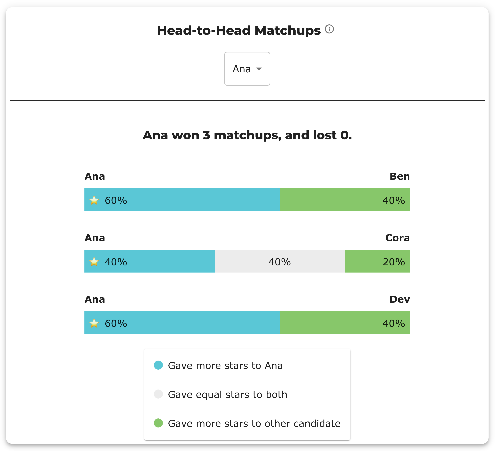
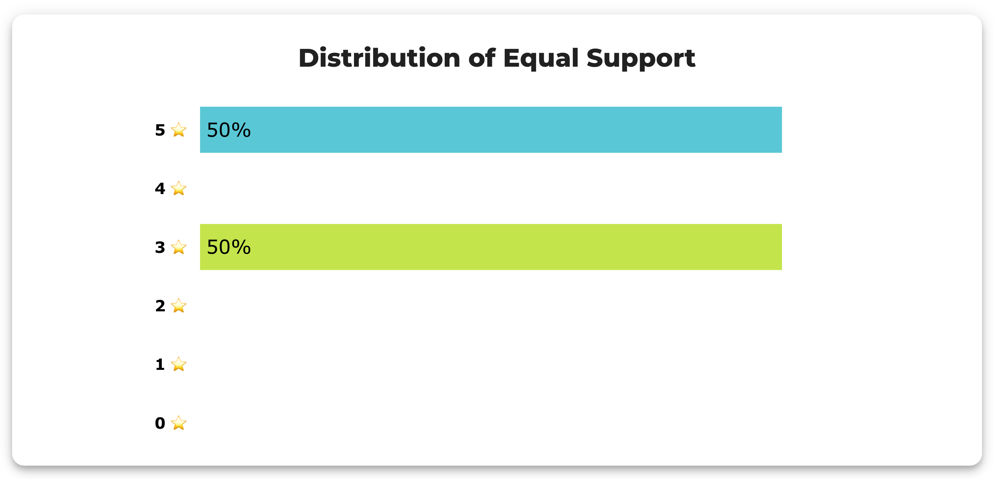
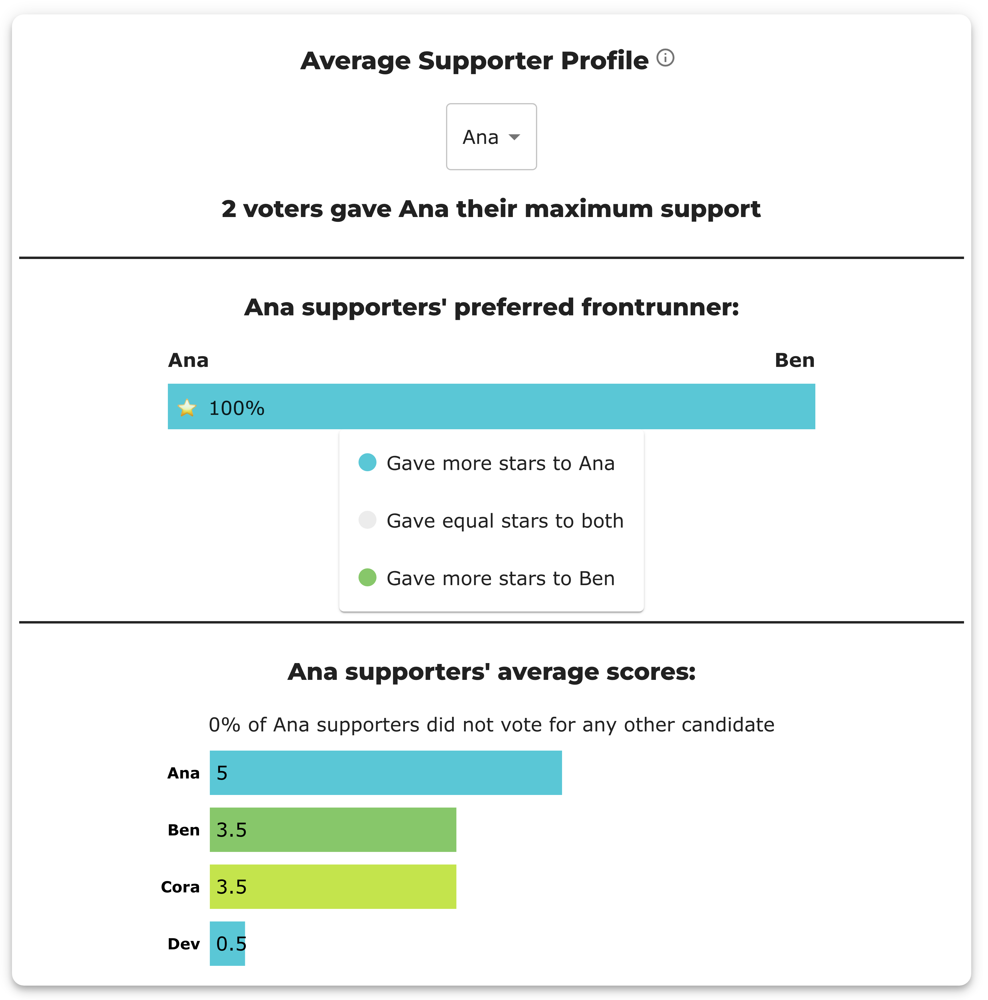
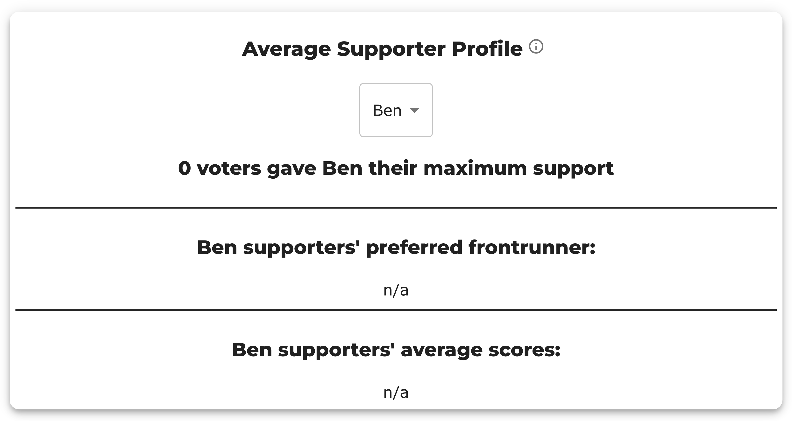

# How to Read a BetterVoting Results Page (201)

**One line:** a BetterVoting result is **four stacked decks** — the headline, the two round charts, the *Race Details* tables, and the *Stats for Nerds* panels — and each deck answers a *different* question about the same ballots. Read in order they tell one story; read out of order they look like four reports that disagree. This page walks all four on an election small enough that every number can be checked by hand.

→ The engine's text half of the same job: [How to read a STAR report](../LH_starvote/reading_a_star_report.md). Why one election has two reports: [BetterVoting and the LH engine](../bettervoting_and_the_engine.md). The short overview this page expands: [How BetterVoting reports a STAR result](../../../01_STAR/01_Learn/reporting/reporting_BV/README.md). The percentages, in full: [Runoff percentages](../../../01_STAR/01_Learn/the_count/runoff_percentages.md).

**Level: 201 · deep dive**

---

## The election on screen

Every screenshot below is [`qhjyr2`](https://bettervoting.com/qhjyr2/results) — five voters, four candidates, scored 0–5. The whole input is this:

```
Ana, Ben, Cora, Dev
5,   3,   5,    0
3,   1,   3,    0
5,   4,   2,    1
1,   4,   0,    5
1,   2,   4,    5
```

Nothing else goes in. Every bar, table cell and percentage on the results page is computed from those twenty numbers — which is the point of using a five-voter election to learn the page: when a panel looks strange, the ballots are right there to check it against. (The full lesson for this election is [Tied for the second finalist](../../../01_STAR/03_Criteria/tie_break_ladder/bv2276_qhjyr2_second_finalist_tie.md); source: [`bv2276_qhjyr2_second_finalist_tie.yaml`](../../../01_STAR/03_Criteria/tie_break_ladder/cases/bv2276_qhjyr2_second_finalist_tie.yaml).)

## The four decks

| Deck | Where it is | The question it answers | Who needs it |
|---|---|---|---|
| **1. Headline** | top of page | *Who won, and out of how many voters?* | everyone |
| **2. Round charts** | *Scoring Round* + *Automatic Runoff Round* | *How was the winner found?* | everyone |
| **3. Race Details** | first expander | *What are the exact numbers?* | officials, auditors |
| **4. Stats for Nerds** | second expander, with a dropdown | *What else do the ballots say?* | analysts, debaters |

Decks 1–2 are the result. Deck 3 is the same result written as numbers. **Deck 4 is not the result at all** — it is a set of side analyses of the ballot data, each with its own definition and its own denominator. Nearly every "wait, that can't be right" moment on a BetterVoting page happens in deck 4, because a deck-4 panel gets read as though it were still answering the deck-1 question.

## In one sentence each

| Panel | In one sentence | The denominator |
|---|---|---|
| **Scoring Round** | Add every star on every ballot; the top two totals become the finalists. | — (totals) |
| **Automatic Runoff Round** | Each ballot now counts as one whole vote for whichever finalist it scored higher. | all voters |
| **Scores Table** | The Scoring Round bars, as numbers. | — (totals) |
| **Runoff Table** | The same runoff votes twice: as a share of everyone, and as a share of the people who had a preference. | both — see below |
| **Tabulation Steps** | The count narrated round by round, including any tiebreak it had to run. | — |
| **Head-to-Head Matchups** | Every pair of candidates counted separately, one-on-one, ignoring everyone else. | all voters |
| **Distribution of Equal Support** | Of the voters who scored the two finalists the *same* — *at what star level* did they tie them? | equal-support voters only |
| **Average Supporter Profile** | Take only the ballots that gave this candidate **five stars**, and average them. | that candidate's 5-star voters |
| **Range of Scores** | Per ballot: highest score minus lowest — how much of the 0–5 scale that voter used. | all ballots |

The right-hand column is the whole trick. Four different denominators appear on one page, none of them labelled loudly, and a panel is only confusing until its denominator is named.

---

## Deck 1 — the headline

> **PRELIMINARY RESULTS** · Election Name: BV2276 — … · ⭐ **Ana wins!** ⭐ · **5 voters** · Voting Method: STAR Voting

Three things to notice:

- **"PRELIMINARY"** is about the *election*, not about confidence in the count. BetterVoting labels results preliminary until the election is closed and finalized; the arithmetic below it is already final for the ballots cast so far.
- **"5 voters"** is the **tally** count, not always the number of people who submitted something. BetterVoting drops a ballot from the tally when it is **flat** — every candidate scored the same, including an engaged all-5s ballot — and calls that an abstention. The LH engine counts every cast ballot and files flat ones under Equal Support instead, so the two reports can print different voter counts for the same election without either being wrong. ([Where the two reports differ](../../../01_STAR/01_Learn/reporting/reporting_diff_BV_LH.md).)
- **The method is named**, which matters more than it looks: the panels in deck 4 differ by method, and a Ranked Robin or RCV page has a different set.

## Deck 2 — the two round charts


**Scoring Round** — the star totals: Ana 15, Ben 14, Cora 14, Dev 11. The two highest advance. (Here they can't: Ben and Cora are level at 14, so a tiebreak picks the second finalist — [the ladder](../../../01_STAR/01_Learn/Tie_Breaking_STAR/tie_breaking.md) settles it on its first rung, head-to-head, and **Cora** advances. That is why the runoff chart shows Ana vs Cora rather than Ana vs Ben.)

**Automatic Runoff Round** — the two finalists only. Every ballot goes whole to whichever of them it scored higher; ballots that scored them equally land in **Equal Support**. Ana 40%, Cora 20%, Equal Support 40% — i.e. 2, 1 and 2 of the five voters.

The dashed line is the **majority threshold**, and its label is the important part: *½ of voters **with preference***. Not half of everyone. Three voters expressed a preference between Ana and Cora, so the bar to clear is 2 — which is 40% on this all-voters scale. That single line is why a STAR winner can show 40% and still hold a genuine majority. The two denominators get a page of their own: [Runoff percentages](../../../01_STAR/01_Learn/the_count/runoff_percentages.md).

Two controls live on this card: a **bar ↔ pie** toggle (the pie drops Equal Support and shows just the two finalists), and a **percent ↔ raw counts** flip. On a five-voter election the counts view reads better than the percentages — "Ana 2, Cora 1" is the story in its own units.

## Deck 3 — Race Details


The **Scores Table** is deck 2's left chart as numbers, with the finalists highlighted. The **Runoff Table** is the right chart as numbers, with the same votes shown under **two percent columns**:

- **% Runoff Votes** — out of *all* voters. Includes Equal Support; the column sums to 100%. Its job is to show how large the no-preference group was.
- **% Between Finalists** — out of only the voters *with* a preference. Equal Support has no entry here, because it is the group that was removed to build the denominator. **This is the column that decides the race.**

A useful reflex: **when Equal Support is 0, the two columns are identical** — there is nothing to remove, so both divide by the same number. Whenever the two columns read the same, that is a claim that *no voter scored the two finalists equally*, and it is checkable. On this page that reflex earns its keep, because the claim is false — see below.

## Deck 4 — Stats for Nerds

One expander, one dropdown, and a different analysis behind each entry. These read the anonymized ballots directly rather than the tabulated result, so **each panel is its own count with its own definition**.

**The dropdown is short, and it changes under you.** As of 2026-08-06 it offers exactly four — *Tabulation Steps*, *Distribution of Equal Support*, *Head-to-Head Matchups*, *Average Supporter Profile* — and the same four on every STAR election checked. Older notes in this library describe panels that are **not in the dropdown today**: *Range of Scores*, *Column Distribution*, *Voter Error Stats*, and a feature-flagged *Name Recognition*. Some of those were real observations that BetterVoting has since moved or retired, so a page describing a panel is not a promise the panel is still there. The first move on an unfamiliar results page is to open the dropdown and read what's actually in it:

```bash
uv run STARVote_LH_tabulation_engine/tools_adam/bv_result_screenshot.py <bvid> --list-panels
```

*Tabulation Steps* is the odd one out and the easiest to recommend: it is not an analysis but the count itself, narrated round by round — including any tiebreak the engine had to run, which is the only place some of those get named. The other three account for most of the confusion.

### Head-to-Head Matchups

Pick a candidate; get one bar per opponent — that candidate against each rival, one-on-one, with everyone else ignored.



Each bar has **three bands**: blue = voters who gave more stars to the selected candidate, **grey = voters who scored the two the same**, green = voters who gave more stars to the opponent. The three add to 100% of all voters, and the star marks the side that won the pair.

For `qhjyr2`, Ana's panel reads *"Ana won 3 matchups, and lost 0"*:

| Ana vs | more stars to Ana | equal | more stars to opponent | pair |
|---|---:|---:|---:|---|
| Ben | 60% | — | 40% | Ana |
| **Cora** | **40%** | **40%** | **20%** | **Ana** |
| Dev | 60% | — | 40% | Ana |

**The trap is the middle row.** Ana "wins" that matchup with **40%** — a number that looks like a loss until you notice the grey band. Two of the five voters scored Ana and Cora identically and so are in neither camp; of the three who did express a preference, Ana took two. A head-to-head win is *more voters preferring one than the other*, not a majority of everybody.

The other thing this panel does is answer the Condorcet question without naming it. Ana beats all three rivals, so Ana is the [Condorcet winner](../../topics/condorcet/README.md); Dev loses all three and is the Condorcet loser. Here the whole field orders cleanly — Ana 3 wins, Cora 2, Ben 1, Dev 0 — and note **Cora out-records Ben (2–1 vs 1–2) despite tying Ben on stars**, which is exactly the fact the scoring-round tiebreak used to advance her. Cycles show up here too, as a set of candidates who each beat the next with no one on top.

The LH engine prints this same information as a single N×N grid rather than one candidate at a time: [preference matrix](../../../01_STAR/01_Learn/reporting/reporting_LH/matrix.md).

### Distribution of Equal Support

The title reads like a count — *how much* equal support was there? — and that is the wrong question. The count is already in deck 2's chart and deck 3's table. This panel takes the voters who scored the two finalists **equally** and asks **at what star level** they tied them.

On `qhjyr2`: **5★ 50%, 3★ 50%**. Two voters saw no difference between Ana and Cora; one of them scored both **5**, the other scored both **3**.



That distinction has no effect on the runoff — an equal ballot is equal — but it is the only place on the page where the *character* of the no-preference group shows. Everyone tying at 5★ means "I'd be happy with either"; everyone tying at 0★ means "neither of these"; both count identically in the tally, and they are politically opposite. On a large election this panel is the answer to "were those Equal Support voters enthusiastic or disgusted?"

This panel also has history worth knowing when a number looks impossible: it once compared **raw** scores, so ballots that skipped both finalists (`null == null`) or mixed a skip with an explicit `0` were silently dropped, and the CA Governor election `gvdy42` showed a chart built from 5 ballots against a runoff that had counted 124 equal-support voters. Fixed in [#1390](https://github.com/Equal-Vote/bettervoting/issues/1390) / [PR #1431](https://github.com/Equal-Vote/bettervoting/pull/1431) by coercing skipped scores to `0` to match the tabulator. The tabulator was always right; only the chart was wrong.

### Average Supporter Profile

The most misread panel on the page, because of one word. **"Supporters" means ballots that gave that candidate five stars** — the maximum on the scale. Not "voters who like them", not "voters who ranked them first", not "voters who scored them above average".



Ana's panel: *"2 voters gave Ana their maximum support"* — the two ballots with `Ana 5`. Average those two ballots and you get the profile: **Ana 5, Ben 3.5, Cora 3.5, Dev 0.5**. Above it, *"Ana supporters' preferred frontrunner"* splits the same two ballots by which frontrunner they scored higher (100% Ana). Below it, a line in an awkward double negative — *"0% of Ana supporters did not vote for any other candidate"* — is the **bullet-voting share**: neither of Ana's two five-star voters left everyone else blank.

Then Ben's panel:



Ben finished **second in the scoring round** on 14 stars, one behind the winner, and his profile is empty. Nothing is broken. Ben's best score on any ballot is a 4; four different voters rated him 4, 4, 3 and 2, and *nobody gave him a 5*. A candidate can be broadly liked and have zero "supporters" by this panel's definition — which is, in miniature, the difference between a consensus candidate and a candidate with a base.

Two things follow, both worth saying out loud whenever this panel is on screen:

- **The sample is self-selected and often tiny.** Cora's profile here averages exactly **one** ballot. It is not an electorate-wide statistic and shouldn't be quoted as one.
- **An empty profile is information, not an error.** It says this candidate has no maximum-intensity support — a real and interesting fact about the ballots.

*("Maximum support" means the top of the scale, not the top of that voter's own ballot — which this election happens to prove. Voter 2 scored `3, 1, 3, 0`, so Ana got that voter's personal maximum; had the panel used per-ballot maxima, Ana's count would read 3 rather than 2. It reads 2.)*

### Range of Scores (not currently in the dropdown)

Worth knowing anyway, for two reasons: it is the panel most often mistaken for something it isn't, and this library documents a real finding on it. **Range of Scores** is per *ballot*: the highest score that voter gave minus the lowest, i.e. how much of the 0–5 scale they actually used. It looks like the LH engine's `[Score Distribution]` and is not a substitute for it — the two collapse the same ballot grid in opposite directions, LH down a **column** (one candidate, every voter) and BetterVoting across a **row** (one voter, every candidate). Neither is derivable from the other, and each report has exactly one of them: [Two views of the same scores](../../../01_STAR/01_Learn/reporting/score_matrix_two_views.md).

One denominator warning specific to this panel, and a good illustration of the deck-4 rule in general: the nerd-stats charts drop only a *truly blank* ballot, which is **LH's** abstention rule, not BetterVoting's. On an election with flat ballots the Range of Scores chart and the page headline therefore divide by different numbers, and only one of them is printed — on [`hckrf7`](../../../01_STAR/04_Real_Elections/abstain_bugs/bhckrf7_range_of_scores.md) the chart read 33% / 67% of **3** ballots directly beneath the words *"1 voters"*. Nothing was miscounted; the denominator was just invisible. Filed as [Equal-Vote/bettervoting#1487](https://github.com/Equal-Vote/bettervoting/issues/1487). Past tense because the panel is no longer in `hckrf7`'s dropdown either — which is the caveat above in action, and a reason to re-check a panel before quoting an old page about it.

Which is the discipline for the whole deck: **find the denominator before quoting the number.**

---

## When two decks disagree

On this page they do, and it is the best possible exercise in reading each deck on its own terms. Six places on one results page describe the same runoff, and they do not all name the same pair of finalists:

| Where on the page | Runoff opponent | Runoff | Equal Support |
|---|---|---|:--:|
| Automatic Runoff chart | **Cora** ✓ | 40% / 20% | **40%** (= 2 voters) |
| Tabulation Steps | **Cora** ✓ | 2 to 1 | **2** |
| Distribution of Equal Support | — | — | **2 ballots** (one at 5★, one at 3★) |
| Average Supporter Profile — "preferred frontrunner" | **Ben** ✗ | — | — |
| Scores Table (highlight) | **Ben** ✗ | — | — |
| Runoff Table | **Ben** ✗ | 3 / 2 | **0** |

Both halves are arithmetically correct *for their own pair*: Ana vs Cora really is 2–1 with 2 equal, and Ana vs Ben really is 3–2 with 0 equal. The tables are pairing Ana with the **second-highest scorer** (Ben) instead of the candidate the tiebreak actually advanced (**Cora**), so the runoff is recomputed against the wrong opponent and Equal Support collapses to zero. That is [BetterVoting issue #1484](https://github.com/Equal-Vote/bettervoting/issues/1484), and this election is its regression fixture. **The winner is unaffected** — Ana wins either way, and the tabulation itself is correct; it is a reporting defect.

Two of the deck-4 panels turn out to be useful witnesses here, which is a good argument for knowing what they mean:

- The **Distribution of Equal Support** panel finds **two** equal-support ballots, one at 5★ and one at 3★. Those are the Ana/Cora ties on voters 1 and 2. Whatever pair it is reading, its two ballots directly contradict the Runoff Table's `Equal Support 0`.
- The **Average Supporter Profile** names its two frontrunners on screen as **Ana and Ben** — so this panel sits on the same side of the split as the tables, and its "preferred frontrunner" bars answer a question about a pair that never ran.

And the reflex from deck 3 pays off: the Runoff Table's two percent columns read **60/60 and 40/40**, identical, which asserts that no voter scored the two finalists equally. Two voters did.

## The cross-check — the same election in the other report

The LH engine counts the same five ballots as text, and it does not go through BetterVoting's display layer, so it is the cheapest way to settle any of the above:

<!-- report:bv2276_qhjyr2_second_finalist_tie -->
```text
--- STAR Voting Method (single winner) ---

[STAR Voting]
 Tabulating 5 ballots.
Ana,Ben,Cora,Dev
  5,  3,   5,  0
  3,  1,   3,  0
  5,  4,   2,  1
  1,  4,   0,  5
  1,  2,   4,  5

[STAR Voting: Scoring Round]
 The two highest-scoring candidates advance to the next round.
   Ana           -- 15 -- First place
   Ben           -- 14 -- Tied for second place
   Cora          -- 14 -- Tied for second place
   Dev           -- 11
 Ana advances, but there's a two-way tie for second.

[STAR Voting: Scoring Round: First tiebreaker]
 The candidate preferred in the most head-to-head matchups advances.
   Cora          -- 3 -- Second place
   Ben           -- 2
   Equal Support -- 0
 Ana and Cora advance.

[STAR Voting: Automatic Runoff Round]
 The candidate preferred in the most head-to-head matchups wins.
   Ana           -- 2 -- First place
   Cora          -- 1
   Equal Support -- 2
 Ana wins.
   Runoff math:
     5  ballots cast
   − 2  Equal Support (no preference between the two finalists)
     ─
     3  voters with a preference  (majority = 2)
           Ana 2 (67%)  ·  Cora 1 (33%)

[STAR Voting: Winner — STAR Voting Method (single winner)]
 Ana
```
<!-- /report -->

Read straight down: the scoring round names the tie, the first tiebreaker advances **Cora**, and the runoff is **Ana 2, Cora 1, Equal Support 2** — the charts' numbers, not the tables'. The "Runoff math" funnel spells out the denominator the *% Between Finalists* column would have used: `5 − 2 = 3` voters with a preference, majority 2, Ana 67% to Cora 33%.

## Which deck for which reader

| Audience | Show |
|----------|------|
| **101** — first-time voter | Decks 1–2: the winner, the two charts, the dashed majority line |
| **201** — official / auditor | + Race Details, and specifically the *% Between Finalists* column |
| **301** — debater / analyst | + Stats for Nerds, denominators named out loud |

The same scaling as the LH engine's minimal on-screen report versus its always-full `_tabulated` mirror: the report is built so a reader can stop early, and the pieces below the fold are answers to questions a first-time voter hasn't asked yet.

## See also

- [How to read a STAR report](../LH_starvote/reading_a_star_report.md) — the same walk-through for the engine's text output
- [Runoff percentages — two denominators, one winner](../../../01_STAR/01_Learn/the_count/runoff_percentages.md) — the deck-2/deck-3 percentage in full
- [Where the two reports differ](../../../01_STAR/01_Learn/reporting/reporting_diff_BV_LH.md) — the abstention/flat-ballot bookkeeping that moves the voter count
- [Two views of the same scores](../../../01_STAR/01_Learn/reporting/score_matrix_two_views.md) — Range of Scores vs `[Score Distribution]`
- [Tied for the second finalist (BV2276, `qhjyr2`)](../../../01_STAR/03_Criteria/tie_break_ladder/bv2276_qhjyr2_second_finalist_tie.md) — the election used throughout, and the #1484 fixture
- [`GLOSSARY`](../../GLOSSARY.md) — Equal Support, finalist, Condorcet winner
