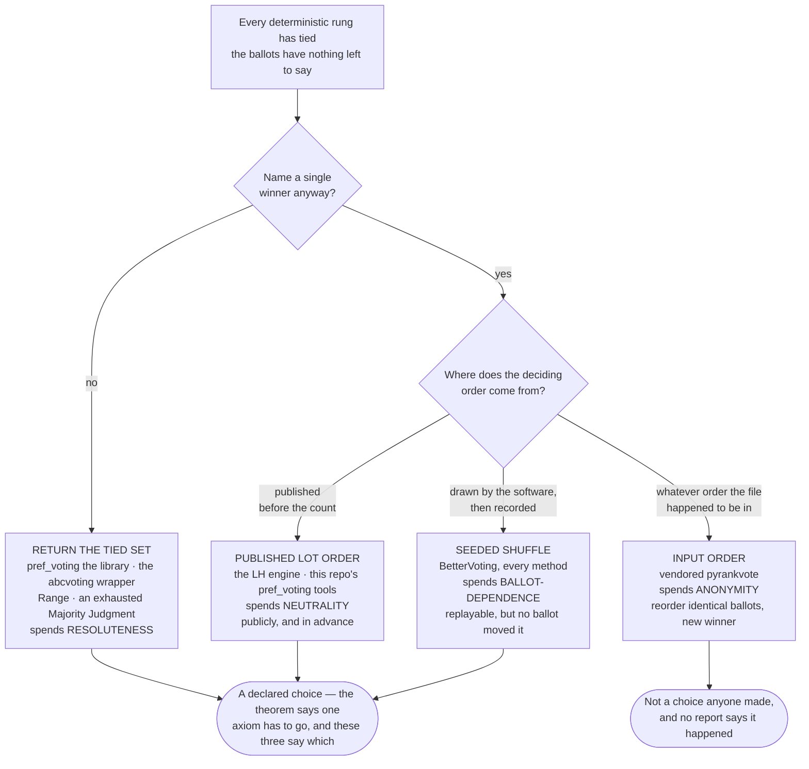

# Tiebreak ladders — every method, every engine

**Level: reference · deep dive**

**One line:** when a count ends in an exact tie, every engine walks a fixed ladder of fallback comparisons — and the ladders differ between *correct* implementations of the same method; this page states each one, rung by rung, with the pool each rung compares over, the floor each ladder ends on, and what (if anything) the report discloses.

Tie-break ladders are the single largest source of legitimate disagreement between correct implementations, and — as the [2026-08-19 Ranked Robin correction](../../05_Ranked_Robin/03_Criteria/rr_tiebreaks/degrees_of_ties.md) showed — the place a single implementation quietly stops matching the method it claims to count. Until this page, the ladders lived distributed across code, commit messages, and per-method write-ups. The per-method deep pages stay authoritative for their stories (linked throughout); this page is the one place that states all of them side by side, and it is the companion the [result contract](result_schema.md) assumes when it says a conformance run should compare the *tied set* and the *outcome* rather than rung names.

**Provenance.** Everything below was verified against source on 2026-08-20: the LH engine and vendored `starvote` 2.1.6, the vendored `pyrankvote` 2.0.5, the `pref_voting`-based report tools, `abcvoting` 2.19.2, and BetterVoting's shipped tabulators (byte-identical across the five local clones; the Ranked Robin ladder shown is the shipped one — the corrected ladder exists only on this repo's parked [#1469](https://github.com/Equal-Vote/bettervoting/issues/1469) fix branch). Two BetterVoting behaviors that follow from sort mechanics rather than explicit branches — the IRV previous-rounds rung and the STAR-PR reporting defect — were additionally confirmed by running the tabulators directly (jest, same date). RCTab and rcv-lab.org facts are from this repo's recorded runs, not fresh code reads.

---

## How to read a ladder

A **ladder** is the ordered sequence of comparisons an engine applies to an exact tie. Three things distinguish ladders that look alike:

- **The pool** — what set of candidates a rung compares over. Ranked Robin's 1st and 2nd Degrees are the canonical example: same arithmetic, different pool, [different winners](../../05_Ranked_Robin/03_Criteria/rr_tiebreaks/degrees_of_ties.md).
- **The floor** — what happens when the ballots run out. [Ties Are Forced](../topics/ties/ties_are_forced.md) proves something *must* sit there; the engines this library reaches picked four different answers:

| Floor | Who uses it | Reproducible from the ballots? | Disclosed? |
|---|---|---|---|
| **Published lot order** (`lot_numbers:`, else ballot-column order) | the LH engine, this repo's `pref_voting` report tools | **yes** — the order is an input | yes, printed |
| **Seeded shuffle** (`seed = (rawVoteCount + hash(raceId)) >>> 0`, recorded as `perm` / `tieBreakOrder`) | BetterVoting, all methods | recorded and replayable ([`bv_replay_tiebreak.py`](../../STARVote_LH_tabulation_engine/tools_adam/bv_replay_tiebreak.py)) but **never derivable from how anyone voted** | partially — `tieBreakType`, no rung narrative |
| **Input order** (a seeded coin whose landing is set by ballot-row / column order) | vendored `pyrankvote` | deterministic but an **anonymity failure** — reordering identical ballots changes the winner | **no** |
| **Return the tied set** and decline | `pref_voting` the library, the `abcvoting` wrapper (every rule forced irresolute), Range and an exhausted Majority Judgment in the grade tool | n/a — no choice is made | yes, by construction |

- **The disclosure** — whether the report *says* a tie was broken, and by which rung. This varies more than the ladders do. The LH engine prints every rung it runs and a `[Lot-decided tie — rare]` banner when the floor decides (STAR and single-winner Plurality loudest; Approval and the cut-line cases quieter); [RCTab](rctab.md) names every tiebreak in its audit log; BetterVoting records a single worst-rung `tieBreakType`; `pyrankvote` says nothing at all.

RCTab deserves its own sentence here, because it treats the whole question as configuration: `tiebreakMode` is a **required, named setting** — `random`, `stopCountingAndAsk`, `previousRoundCountsThenRandom`, `previousRoundCountsThenAsk`, `useCandidateOrder`, `generatePermutation` — which turns everything this page documents about the other engines into a declared choice. That is the posture of software that counts real elections.

### The four floors — what each one spends

The rungs above the floor are arguments about the ballots. The floor is where that runs out, and the engine has to spend something instead. [Ties Are Forced](../topics/ties/ties_are_forced.md) proves the bill is unavoidable — no anonymous, neutral, Paretian rule always names one winner — so the only real question is which axiom goes, and whether the engine says so.

Three readings the picture is for:

- **The split at the bottom is the whole point.** The published lot, the seeded shuffle and returning the tied set are three answers to a forced question, and an engine picking a different one is not a bug — it is [Zwicker's menu](../topics/ties/ties_are_forced.md#four-ways-out-and-what-each-one-costs), priced. Input order is not on that menu. Nobody chose to let data-entry order elect a candidate; it is what a seeded coin does when the seed pins the *sequence* of flips but not what each flip lands on. That is why the conformance rule below compares the tied set and the outcome rather than rung names — and why "our floors differ" and "one of us is broken" have to stay separable.
- **The costs are demonstrated here, not asserted.** The published lot really does spend neutrality: the [three-way dead-rung trio](../../01_STAR/03_Criteria/tie_break_dead_rung/three_way_dead_rung_tie/three_way_dead_rung_tie.md) is three files with identical ballots and three different `lot_numbers:`, electing three different winners. Input order's anonymity failure is pinned by [`test_rcv_irv_tie_order_sensitivity.py`](../../STARVote_LH_tabulation_engine/tests/test_rcv_irv_tie_order_sensitivity.py) on a plain two-candidate dead heat.
- **The same dependency sits on two different floors.** `pref_voting` the library declines and hands back the tied set; this repo's report tools built on it apply a lot order. The floor is a property of the *caller*, not of the algorithm — which is exactly the shape of the [silent tiebreak](../topics/ties/silent_tiebreak.md), where a wrapper inherited a per-rule default it never mentioned.

RCTab is the outlier that proves the point: it has no fixed floor, because `tiebreakMode` is a **required, named setting** — the choice this diagram maps is one an official has to make on the record before the count runs.

---

## STAR — two rounds, two ladders

The deep page is [STAR tie-breaking — the full chain](../../01_STAR/01_Learn/Tie_Breaking_STAR/tie_breaking.md); Larry's own working notes on reconciling Equal Vote's three published protocols (Simple / Official / Technical) are [clarifying_star_voting.md](../../STARVote_LH_tabulation_engine/docs/clarifying_star_voting.md). Both engines aim at the **Official** protocol — they diverge on one rung, and it is BetterVoting that leaves the spec (below); each round breaks its tie with the *other* round's yardstick, because the measure that tied cannot be the one that separates.

| Rung | LH scoring round | BV scoring round (`Star.ts`) | LH runoff | BV runoff |
|---|---|---|---|---|
| 0 | total score (two tied at the top **both advance** — not a tie) | same | head-to-head | same |
| 1 | head-to-head matchups won, **among the tied group, any size** | head-to-head — **only if exactly 2 are tied**; 3+ skips the rung | total score | total score |
| 2 | most five-star votes | same | most five-star votes | same |
| floor | published lot | seeded shuffle | published lot | seeded shuffle |

Both engines' five-star rung counts ballots at the **scale maximum only** (`score == 5`; BV's code is literally `=== 5`), which is why it can be a [dead rung](../../01_STAR/03_Criteria/tie_break_dead_rung/README.md) — no fives to count, the tie drops straight to the floor without ever consulting the 4s. The 3+-way skip on BV's rung 1 is deliberate, [confirmed on #1379](https://github.com/Equal-Vote/bettervoting/issues/1379) — but it is a departure from the **published** protocol, not a reading of it. Equal Vote's [Official Tiebreaker Protocol](https://www.starvoting.org/ties) states rung 1 for a tied group of *any* size: with only two tied it is the majority-preferred candidate, and with more than two the tied candidates are compared head to head, “eliminating the candidate(s) who lost the most match-ups”, **repeated as needed** until two can advance. That is LH's rung 1 exactly, so on a 3+-way scoring tie **LH follows the spec and BetterVoting does not** — and BV's own [help page](https://docs.bettervoting.com/help/ties.html) restates the protocol its code implements (3+ → straight to five-star), so the divergence is documented on both sides without being named as one. Note also that `starvoting.org/ties` now 301-redirects to a client-rendered `bettervoting.com/ties`; the wording above is from the [2025-09-12 capture](http://web.archive.org/web/20250912011025/https://www.starvoting.org/ties) (checked 2026-08-21). Equal Vote also publishes an optional **[Condorcet Tiebreaker](../../01_STAR/01_Learn/Tie_Breaking_STAR/condorcet_tiebreaker.md)** for hand counts (matches-won → preference votes → win margin → random) — a third ladder, implemented by neither engine here.

In the LH engine the ladder runs inside vendored `starvote`'s `_star_round`, with the fork's one substitution: Larry's terminal "randomly select" rung is replaced by [`LotNumberTiebreaker`](../../STARVote_LH_tabulation_engine/starvote_larry_hastings.py) — earliest position in `lot_numbers:` wins; with no `lot_numbers:` the fallback is ballot-column order, and the report says so. Wired and self-checked by [`test_lot_number_tiebreak.py`](../../STARVote_LH_tabulation_engine/tests/test_lot_number_tiebreak.py). Nothing on the LH side is ever random, and no "unbreakable tie" is reachable from a YAML file (upstream `starvote`'s `tiebreaker=None` mode, which raises instead, is not exposed — see [the every-rung Bloc case](../../02_STAR_Bloc/02_Examples/b484mbm_tie_every_rung.md)).

Pinning cases: [the happy-path ladder set](../../01_STAR/03_Criteria/tie_break_ladder/README.md) (BV2276 pairwise-only; BV2180 five-star then score; BV830 runoff score), the [dead-rung set](../../01_STAR/03_Criteria/tie_break_dead_rung/README.md), and [Flat scores 05](../../01_STAR/09_Parked/Flat_scores_ties/README.md#case-05) — every deterministic rung tied, LH's lot elects A, BetterVoting's shuffle picked C: the floor divergence, live.

**Bloc STAR** is N full single-winner rounds with the winner removed — in both engines (LH via `bloc_star_voting`, BV via its generic `runBlocTabulator`), so every seat gets the full two-ladder treatment, and a runoff tie seats **one** candidate, never both (Larry's notes defend that reading explicitly). Two reporting asymmetries: the LH report prints each seat's tiebreakers as they fire ([BV750](../../02_STAR_Bloc/02_Examples/bv750_tie_breaking_bloc.md) is the worked case), while BetterVoting's bloc driver **keeps only the final seat's `tieBreakType`** — a tie broken while filling seat 1 of 3 is invisible in the result object. That final-seat rule applies to every BV bloc method (STAR, Approval, Plurality, Ranked Robin) — filed 2026-08-20 as [bettervoting#1582](https://github.com/Equal-Vote/bettervoting/issues/1582) after confirming it on production for all four; observed live on three Bloc STAR elections, [BV130-r2](../../02_STAR_Bloc/02_Examples/bv130r2_dead_rung_bloc.md) (`9ff9jk`), [BV1525](../../02_STAR_Bloc/02_Examples/bv1525_condorcet_loser_bloc.md) (`dkj9dx`) and `484mbm`, each with a seat-1 `random` under a race-level `none` (no Ranked Robin bloc race in the corpus has an early-seat tie, so for RR it is by construction). The per-seat values survive in `roundResults`, which is why the fix is a summary rule — escalate to the worst rung across seats, as STAR already does within a race — and not a re-count.

---

## STAR-PR (Allocated Score), SSS, RRV — one rung, then the floor

The proportional family has the **shortest ladders in the library**: no head-to-head rung, no five-star rung, on either engine.

- **LH** (`allocated_score_voting` / `sequentially_spent_score` / `reweighted_range_voting` in vendored `starvote`): a tie on **weighted** total score in a selection round goes **straight to the lot** — and since 2026-08-21 the `[Lot-decided tie — rare]` banner says exactly that on this path (*"… has one deterministic rung per seat — the round's weighted score total — … a tie on the weighted total goes straight to the lot"*). Before that, the banner shared by every `starvote` path printed STAR's sentence ("the deterministic rungs (pairwise / score, then five-star) all came back equal") on a PR-family tie where no such rungs exist; [the Lackner–Skowron shadow case](../../03_STAR_PR/02_Examples/cases/cases_pages/lackner_skowron_shadow_star_pr_c7_b12.md) is where it was caught, and its mirror now carries the corrected wording.
- **BetterVoting** (`AllocatedScore.ts`): highest weighted score (exact `Fraction` equality) → shuffle order. **Plus a reporting defect, filed by this repo as [bettervoting#1507](https://github.com/Equal-Vote/bettervoting/issues/1507) on 2026-08-09 and re-confirmed by direct execution on 2026-08-20:** the round winner is unconditionally pushed into `tied[]`, and the final `tieBreakType` check compares elected against `tied` by object identity — so a STAR-PR race with **no tie anywhere** still reports `tieBreakType: "random"` with the winners listed as the tied set, and the results page heads every STAR-PR race "Tied!" (live on `bvhchj`, whose seven rounds each have a unique maximum). A fix is written and parked behind the PR freeze (`fix/1507-star-pr-tiebreaktype`, [write-up in bettervoting-qa](https://github.com/masiarek/bettervoting-qa/blob/master/issues/1507-star-pr-tiebreaktype-always-random.md)). Until it ships, treat BV's STAR-PR tie *reporting* as unreliable; the tally itself is fine.

---

## Approval — count, then the floor

- **LH** (`approval_tally`): approvals (any non-zero mark) → lot order, identical for one seat or many. Disclosure is the engine's quietest: a `Note:` naming the tied candidates and a "Candidate priority order … broke the tie" line, no banner. [BV27](../../04_Approval/02_Examples/multiwinner/bv27_jt6r76_lackner_approval_committee.md) shows the same committee tie through both engines.
- **BetterVoting** (`Approval.ts`): approvals → shuffle order, implemented as nothing but a pre-sort — and Approval is one of the methods where BV *does* populate `tied[]` correctly, with `tieBreakType: "random"` on the tie.
- **`abcvoting`** ([`abc_tabulation.py`](../../06_Other/abcvoting_tabulation_engine/abc_tabulation.py)): every rule is run **irresolute** — `resolute=False`, passed explicitly — so the full set of winning committees comes back and more than one prints `[N tied committees]`; the wrapper breaks no tie at all. The explicit flag is the fix for a split the library's defaults hide: `av` / `sav` / `pav` already default to irresolute, but `seqpav` and `seqphragmen` (and `equal-shares`) default to **resolute**, and their tie-break is *smallest candidate index* — which, the way this repo loads elections, means **left-to-right ballot-header column order** — applied silently, with the tie recorded only in a `detailed_info` structure nobody prints. The wrapper inherited those defaults until 2026-08-20, when its own docstring's promise ("all tied committees are reported") was found to hold for only three of its five rules. It was not hypothetical: [`approval_bloc_3seats_c6_b5`](../../04_Approval/02_Examples/multiwinner/cases/cases_pages/approval_bloc_3seats_c6_b5.md) — "no tie, no drama" under bloc `av` — is a **three-way tie** under both `seqpav` and `seqphragmen` (`Adams, Brown, Clark | Adams, Brown, Evans | Brown, Clark, Evans`), and the old wrapper printed the first of those with no marker. A `seqpav` / `seqphragmen` committee quoted from a run before that date may carry the same silent break; one rule with no irresolute form at all (`greedy-monroe`, defined by a tiebreaking order) still falls back to resolute, and its report line says so. The finding taught as a lesson — the seq-PAV fork traced out, the column-permutation probe that catches it in any engine, and why the committee it silently picked looked *more* corroborated than the truth — is [The silent tiebreak](../topics/ties/silent_tiebreak.md).

---

## Plurality — count, then the floor

- **LH single-winner** (`plurality_single_tally`): marks on single-mark ballots (an overvote counts for nobody) → lot order. This path no longer routes through the STAR machinery — it prints a choose-one report of its own, and its tie disclosure is the loudest in the engine: the tied set, "the ballots cannot break it", the lot order, a `[Lot-decided tie — rare]` banner, and "`, by lot`" appended to the winner line ([the dead-tie lunch case](../../06_Other/Plurality/cases/cases_pages/lunch_choose_one_dead_tie.md)).
- **LH multi-winner** (`plurality_multi_tally` — SNTV / Block / Limited by marks-per-voter): every mark counts, vote count → lot order. Disclosure fires only on a **cut-line** tie (the last seat); a tie wholly above the cut is ordered by lot silently.
- **BetterVoting** (`Plurality.ts`): vote count → shuffle order (overvoted ballots are dropped before tallying), `tied[]` populated.

---

## Ranked Robin — the degrees

The method publishes its own ladder and the full story is on two pages: [degrees of ties](../../05_Ranked_Robin/03_Criteria/rr_tiebreaks/degrees_of_ties.md) (the protocol, the two opposite bugs, the 11 changed cases) and [LH vs BetterVoting](../../05_Ranked_Robin/01_Learn/rr_tiebreak_lh_vs_bv.md) (the engine comparison and the recorded-shuffle mechanics). The ladder table, engine by engine:

| Rung | The protocol | LH `ranked_robin_tally` | BV `RankedRobin.ts` (shipped) | `pref_voting` (library) |
|---|---|---|---|---|
| 0 | Copeland score = wins + ½·draws | same | same | same |
| 1 | **1st Degree** — sum of win margins over the other finalists (for two finalists: their head-to-head) | same (since 2026-08-19) | head-to-head, **only if exactly 2 are tied** | — |
| 2 | **2nd Degree** — the same sum over the whole field | same | — | — |
| floor | lot or re-run (the 3rd/4th Degrees exist but are not recommended) | published lot | seeded shuffle | **returns the leader set** and declines |

Every implementation scores a drawn matchup as half a win even though the protocol's primary rule, read literally, counts wins alone — an open drafting question that can change who enters the ladder at all: [what counts as a win](../../05_Ranked_Robin/03_Criteria/rr_tiebreaks/degrees_of_ties.md#the-rung-below-the-ladder-what-counts-as-a-win). The LH report's **"vs finalists"** column, printed only when the lead is tied, *is* the 1st Degree number — the ladder made checkable by hand ([ex09](../../01_STAR/05_Practice/ex09_game_night_cycle.md) walks one). This repo's independent cross-check, [`ranked_robin_report.py`](../../STARVote_LH_tabulation_engine/tools_adam/pref_voting_tabulation_engine/ranked_robin_report.py), deliberately carries the identical ladder and then asks `pref_voting` whether the LH winner sits inside its Copeland leader set. BetterVoting's missing rungs are filed as [#1469](https://github.com/Equal-Vote/bettervoting/issues/1469) (fix written, parked behind the PR freeze), and its shipped code says so itself: the random-rung log reads "more robust tiebreaker not yet implemented".

**Bloc Ranked Robin (LH)** is the same ladder used as a *ranking*: the full order produced by Copeland → 1st Degree → 2nd Degree → lot, sliced to the top N. Note the printed seats list shows `margin` — the **2nd Degree**, the whole-field number — and the 1st-Degree column appears only when the lead itself is tied, so a Bloc page can have been decided by a rung whose inputs it does not print. A cut-line tie that reaches the lot gets a one-line `***` note. BetterVoting's multi-winner Ranked Robin re-runs its three-rung single-winner ladder per seat through the bloc driver, with the final-seat-only reporting caveat above.

Pinning cases: [BV2270](../../05_Ranked_Robin/03_Criteria/rr_tiebreaks/bv2270_8h4bvh_head_to_head_vs_margin.md) (the 1st-Degree rung, minimal), [BV2141](../../05_Ranked_Robin/03_Criteria/rr_tiebreaks/bv2141_3r3yf7_four_degree_tie.md) (ties every degree the protocol recommends — the regression case that still ends at the lot), [the dead heat](../../05_Ranked_Robin/03_Criteria/rr_tiebreaks/dead_heat_lot_tiebreak.md) (LH-only by design), and [BV2261](../../05_Ranked_Robin/03_Criteria/rr_tiebreaks/bv2261_y2fbpc_tiebreak_recorded.md) / [BV2262](../../05_Ranked_Robin/03_Criteria/rr_tiebreaks/bv2262_2gvwr9_nine_way_dead_heat.md) (BV's shuffle recorded and replayed, at 3 and at 9 candidates).

---

## RCV-IRV — the tie is mid-count, and every engine answers differently

An elimination tie is a different animal from everything above: it strikes **while the count is still running**, and whichever candidate is cut changes every round after it — the framing of [Parallel Universe Tiebreaking](../topics/ties/parallel_universe_tiebreaking.md). Five implementations, five different rungs:

| Engine | Elimination-tie ladder | Floor | Discloses? |
|---|---|---|---|
| **vendored `pyrankvote`** (this repo's count) | current votes (within **0.001**) → most **2nd choices** → 3rd → 4th → … (each counted over all ballots, among candidates still in the race) | seeded coin whose landing is set by **input order** | **no** |
| **BetterVoting** (`IRV.ts`) | current round → **previous rounds, newest first** | shuffle order | only for a final-two elimination tie or a tied winner |
| **RCTab** | whatever the declared `tiebreakMode` says — six named options, including previous-rounds-then-X and a published candidate order | per mode | **yes — every tiebreak named in the audit log** |
| **`pref_voting`** (`instant_runoff`) | none — **batch**: eliminate everyone tied for last (`instant_runoff_put` runs every branch and returns the union) | n/a | by construction |
| **rcv-lab.org** | undisclosed | undisclosed | no |

Notes per row. The `pyrankvote` ladder is real and ballot-based — [the six-orderings control](../topics/ties/batch_elimination.md) shows it electing the same winner from any row order while second choices still separate — but its floor is the library's [known limitation](../../06_Other/RCV_IRV/RCV_IRV_tabulation_engine/README.md#known-limitation-elimination-ties): [`rcv_irv_tabulation.py`](../../06_Other/RCV_IRV/RCV_IRV_tabulation_engine/rcv_irv_tabulation.py) seeds `random.seed(0)` (as does the LH engine's own IRV path, twice), but the seed pins the *sequence* of coin flips, not the candidate each flip lands on, so a dead ladder resolves by ballot-row order (ranked files) or header-column order (score files) — an anonymity failure, pinned by [`test_rcv_irv_tie_order_sensitivity.py`](../../STARVote_LH_tabulation_engine/tests/test_rcv_irv_tie_order_sensitivity.py) and reproducible on a plain two-candidate dead heat, not just a perfect cycle. It also batch-rejects candidates who "even with redistribution can't change the results", which quietly treats a tie as a loss — the hidden assumption [the PUT page](../topics/ties/parallel_universe_tiebreaking.md) dissects. The wrapper adds one pre-tiebreak of its own: equal non-zero *scores* on a score ballot become a ranking by column order (a documented simplification — equal-rank IRV is not represented).

The BetterVoting row is a finding of this page (2026-08-20): its elimination is a sort whose per-round score arrays are compared **newest round backwards** before falling to shuffle order, so BV-IRV has a genuine previous-rounds rung — confirmed by direct execution on a round-2 tie whose round-1 totals differed (the previous-rounds candidate was eliminated, against the shuffle order, and the race still reported `tieBreakType: "none"`) — reported upstream on 2026-08-20 as [a comment on bettervoting#1507](https://github.com/Equal-Vote/bettervoting/issues/1507#issuecomment-5369326181), with a second profile in which the shuffle rung itself picks the winner and the result still says `none`. No two of the five implementations share a rung, and only RCTab says out loud which one fired. [The load-bearing tiebreak](../topics/ties/load_bearing_tiebreak.md) runs one real election ([Felsenthal's District I](../../method_comparisons/felsenthal_paradoxes/cases/cases_pages/coombs_ex20_district1.md)) across three of them and gets two winners and one disclosure.

**STV** (multi-winner, same engines): `pyrankvote` uses the identical elimination ladder; a tie in *reaching* quota needs no ladder at all — every candidate at or above quota in a round is elected, both of an exactly-tied pair included — and surplus transfer order follows the sorted list (read as outcome-neutral, not test-pinned). BetterVoting's STV shares `IRV.ts` (Droop quota, fractional surplus floored at 5 decimal places) and therefore the same previous-rounds-then-shuffle sort; one static-read caveat is that its sort compares the `Fraction` scores as floats while its tie *detection* compares them exactly. RCTab's STV separates quota choice from tie handling — [the ex14 fork](rctab.md) is the worked example. The LH transfer block prints nothing for STV **by design** (fractional surpluses are not modelled; silence beats a plausible wrong number).

---

## The report-tool methods — Minimax, Coombs, agendas, grades

The [`pref_voting`-based report tools](cross_checking_with_pref_voting.md) each answer the tie question differently, and each says which answer it is giving:

- **Minimax** ([`minimax_report.py`](../../STARVote_LH_tabulation_engine/tools_adam/pref_voting_tabulation_engine/minimax_report.py)) — **declines**: a tie on the smallest worst loss is reported as the leader set with an "INDECISIVE here" warning, no invented rung. The three published readings of "worst loss" (winning votes / margins / pairwise opposition) are all computed every run; the headline is always Felsenthal's winning-votes reading, margins is always printed as the second opinion (with a CONVENTION SPLIT warning when they part), opposition appears in the table only — **no flag selects the reading**, and `--equal-prob` changes the truncation convention, not the tiebreak.
- **Coombs** ([`coombs_report.py`](../../STARVote_LH_tabulation_engine/tools_adam/pref_voting_tabulation_engine/coombs_report.py)) — a tie on most last places is cut by **lot order, one rung**, with the warning that "the result is NOT determinate"; equal-rank bottoms are counted fractionally.
- **Successive elimination** ([`successive_elimination_report.py`](../../STARVote_LH_tabulation_engine/tools_adam/pref_voting_tabulation_engine/successive_elimination_report.py)) — the only tool with a tiebreak *flag*, because the published examples disagree: `--tiebreak alpha` (default; earlier letter) or `--tiebreak agenda` (earlier on the agenda). When any round tied, it re-runs the whole agenda under the **other** convention and warns if the winner moves — "a fact about the tie-break rule, not about the electorate."
- **Majority Judgment** ([`grade_methods_report.py`](../../STARVote_LH_tabulation_engine/tools_adam/pref_voting_tabulation_engine/grade_methods_report.py)) — the **iterative** Balinski–Laraki rule: strip one shared median from each tied candidate, recompute, repeat; if the pools exhaust, it returns the tied set and says so. `pref_voting` implements the **majority gauge** instead — one non-iterative above-vs-below-the-median comparison — and on a profile where both tied candidates have more detractors than supporters at the median it can return a tie the iteration separates: an observed DISAGREE between two published readings, not a bug in either ([the caveat, in full](../../06_Other/Majority_Judgment/concepts/majority_judgment.md)). Both use the lower median, so that is not a divergence source.
- **Range / Score** (same tool) — highest mean, and **no tie-break at all**: a tied mean is reported as the tied set.

---

## Fine print that bites

Cross-cutting details that have each cost someone a wrong conclusion, collected:

- **Column order is the hidden floor in three places, disclosed in one.** The LH engine's no-`lot_numbers` fallback is ballot-column order *and the report says so*. The other two are silent: `pyrankvote`'s dead-ladder residual (row/column order) and the RCV wrapper's equal-score-to-ranking rule. There used to be a fourth — `abcvoting`'s resolute `seqpav` / `seqphragmen` (smallest index = header column) — until the wrapper started forcing every rule irresolute on 2026-08-20; it now returns the tied set. Only a direct `abcvoting` call that leaves `resolute` unset still has that default.
- **The two lot fallbacks differ.** With no `lot_numbers:`, the LH engine falls back to ballot-column order, but the `pref_voting` report tools fall back to **alphabetical** — the same case can lot-resolve differently between the engine and its own cross-check. Pin `lot_numbers:` in any case that reaches the floor.
- **A `lot_numbers:` list may legally omit candidates, and the omitted break differently by path.** A name that is not on the ballot is an error; a ballot candidate missing from the list is accepted and sorts last — where the `starvote` paths (STAR / Bloc / PR) order the omitted **alphabetically** and the native paths (Ranked Robin / Approval / Plurality) order them by **column**. List every candidate.
- **`pyrankvote` ties within 0.001**, not at exact equality (`CONSIDERED_EQUAL_MARGIN`) — invisible on integer counts, relevant the moment weights are fractional.
- **BetterVoting reports one `tieBreakType` per race, escalated to the worst rung reached** — and four method-specific gaps, confirmed 2026-08-20: STAR never populates `tied[]` at all (the information lives in `tieBreakType` and the logs); a bloc race keeps only the **final** seat's tiebreak (filed 2026-08-20 as [#1582](https://github.com/Equal-Vote/bettervoting/issues/1582)); STAR-PR reports `random` even with no tie (the defect above — filed 2026-08-09 as [#1507](https://github.com/Equal-Vote/bettervoting/issues/1507), fix parked); and an IRV elimination tie among three or more standing candidates is broken without being flagged, IRV never populating `tied[]` either ([posted on #1507 on 2026-08-20](https://github.com/Equal-Vote/bettervoting/issues/1507#issuecomment-5369326181) as the mirror image of the STAR-PR defect, and cross-referenced to the tie-break-transparency ask [#1432](https://github.com/Equal-Vote/bettervoting/issues/1432)). Of the four, only STAR's empty `tied[]` is not filed — the frontend already works around it from the logs, and it may be a contract choice rather than a defect. What this repo has filed, and where each report stands, is tracked in [`upstream_bug_reports.md`](../about_this_repo/upstream_bug_reports.md). Its floor, on the other hand, is better than its name: "random" is a seeded, recorded, replayable shuffle — see [the recorded-tiebreak page](../../05_Ranked_Robin/01_Learn/rr_tiebreak_lh_vs_bv.md) for why that is still weaker than a published lot.
- **The LH PR-family lot banner borrowed STAR's wording until 2026-08-21** — it named pairwise/five-star rungs that never ran on that path. **Fixed:** the banner now asks the path which ladder it ran (`options.method`, the method `starvote` is actually executing) and, on Allocated Score / SSS / RRV, says the one rung was the round's weighted score total and the tie went straight to the lot; the four committed mirrors that had fired the borrowed sentence were regenerated, and the per-path wording is locked by [`test_lot_number_tiebreak.py`](../../STARVote_LH_tabulation_engine/tests/test_lot_number_tiebreak.py). Why it bit: a sentence that names rungs was hard-coded in a tiebreaker shared by five methods, so it was true on the path it was written for and silently wrong on the rest — a reporting line that names rungs has to be told which rungs ran.

---

## For implementers — the conformance rule

The [result contract](result_schema.md) draws the operational conclusion from all of the above: `tiebreaks[].rung` is deliberately free text, because rung *names* legitimately differ between correct engines. A conformance run should compare (1) the tied set, (2) the outcome, and (3) whether a rung fired **at all** — an empty `tiebreaks: []` is a positive claim that the ballots alone decided, and an engine that reaches for a tiebreak where the reference did not has a bug even when it lands on the same winner. And date your fixtures twice over: any Ranked Robin result captured before 2026-08-19 predates the 1st-Degree rung, and any *score* result captured before 2026-08-21 predates the contract reporting the **lot** rung at all — on 23 cases here, `b484mbm_tie_every_rung` and `bv750_tie_breaking_bloc` among them, `tiebreaks: []` was being emitted for a seat the lot had bought. Both are stale rather than divergent; re-emit before reading a difference as a disagreement.

---

## Related

- [Ties & tie-breaking — the topic hub](../topics/ties/README.md) (the teaching side: where ties happen per method, and why they are forced)
- [Degrees of ties](../../05_Ranked_Robin/03_Criteria/rr_tiebreaks/degrees_of_ties.md) · [STAR tie-breaking — the full chain](../../01_STAR/01_Learn/Tie_Breaking_STAR/tie_breaking.md) · [Ranked Robin: LH vs BetterVoting](../../05_Ranked_Robin/01_Learn/rr_tiebreak_lh_vs_bv.md)
- [The result contract](result_schema.md) · [RCTab](rctab.md) · [BetterVoting's engine, documented](BV/tabulation_engine/README.md) · [the Rust-kernel scope note](rust_kernel_scope.md) this page closes an item of
- [Batch elimination](../topics/ties/batch_elimination.md) · [Parallel Universe Tiebreaking](../topics/ties/parallel_universe_tiebreaking.md) · [The load-bearing tiebreak](../topics/ties/load_bearing_tiebreak.md) · [Tie-breaking: STAR vs RCV-IRV](../topics/ties/tiebreaking_star_vs_irv.md)
- [Glossary](../GLOSSARY.md)
