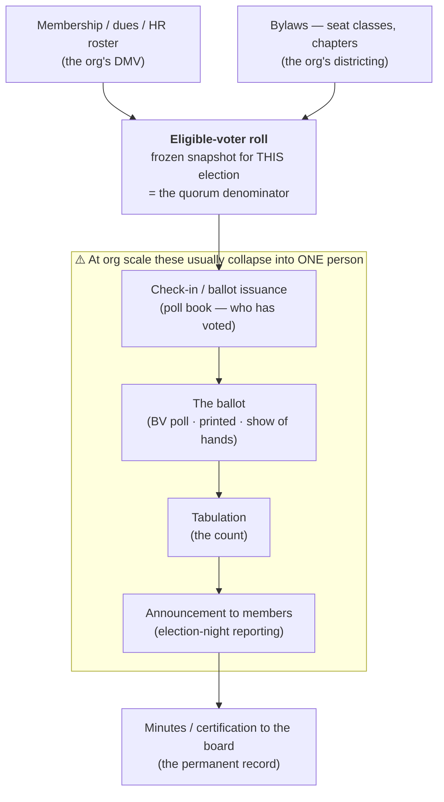

---
tags:
  - administration
  - theory
---

# Election systems at organization scale — the government architecture, shrunk

**Level: reference · for presenters** Companions: [central tabulation](central_tabulation.md) · [summability](summability/README.md) · [quorum](quorum.md) · [Run a paper-ballot STAR demo](../../01_STAR/01_Learn/hands_on/running_a_paper_ballot_demo.md). Glossary: [`election infrastructure`](../GLOSSARY.md).

**One line:** *a US government election is a dozen separate systems held apart on purpose, and when you shrink it to a club, a co-op board, or a union local, almost all of that separation collapses into one person with a laptop — so the safeguards that were **structural** have to be re-added **procedurally**.*

---

## The map this page is shrinking

The National Academies' consensus report [*Securing the Vote: Protecting American Democracy*](https://www.nationalacademies.org/projects/PGA-STL-16-02/publication/25120) (2018) opens its chapter on voting in the United States with a schematic of how election systems feed each other — Figure 3-2, p. 35, redrawn from Charles Stewart III's *Journal of Democracy* article and based on work by Merle King. It is not reproduced here (it's under a separate copyright), and it doesn't need to be: what matters is the **shape**.

The report's own scoping is the useful part. An *election system* is any technology-based system that collects, processes, or stores election data, and the family runs: **voter registration systems** and public election websites · **voting systems** (how a ballot is cast) · **vote tabulation systems** (how ballots are counted) · **election-night reporting systems** · **auditing systems**. Feeding them from outside are the DMV and the Postal Service; alongside sit redistricting and GIS.

Two annotations on the figure carry more weight than any of the boxes:

- **Solid lines are internet-connected; dashed lines are air-gapped.** The registration side is networked. The counting side, classically, is not.
- **A dark box marks what lives at the polling place; a light-gray box marks what is centralized in the local election office.** Those two boxes are a **separation-of-duties diagram in disguise** — different systems, different rooms, different staff, different custody.

## The same map, at organization scale

| Government component | The private-organization analogue | What changes |
|---|---|---|
| DMV, Postal Service | **Membership roster / HR system / dues database** | Your roster *is* your DMV. Usually one spreadsheet, usually owned by one officer. |
| Online voter-registration system | **Self-service "am I eligible?" portal** | Usually absent — members email the secretary instead. |
| Voter-registration system | **The eligible-voter roll for this election** — a frozen snapshot | This is what produces `eligible_voters`, the [quorum](quorum.md) denominator, which is why the engine takes it as an *external* number. |
| (Re)districting system | **Bylaws: seat classes, chapters, divisions, member classes** | Real and often intricate — co-op districts, union locals, board seat classes. |
| GIS data | — | Drops out entirely. |
| Poll books | **Check-in / ballot issuance — who has been sent a ballot, who has voted** | The glossary's **credentialing** entry covers this — and note the list is half of the **delta-analysis** secrecy leak. |
| Voting system | **The ballot** — a BetterVoting poll, a printed ballot at the AGM, a show of hands | |
| Vote tabulation system | **The count** — the LH engine, BetterVoting, or four people around a table | The one box this library is about. |
| Election-night reporting | **The announcement to members** | |
| Statewide election-night reporting | **Minutes / certification to the board** | The permanent record. |

Drawn out, with the collapse made visible:

## Three things that collapse — and what to add back

**1. The air gap disappears.** In the government diagram the count is deliberately off the network. An organization election is typically a web poll, a Google Form, or an emailed link: *every* line is solid. This is not a scandal at club scale — it is a statement of what your threat model actually is. Say it out loud rather than implying a rigor you don't have.

**2. The two boxes merge into one person.** The secretary holds the roster, freezes the roll, issues the ballots, runs the count, and announces the result. Government keeps those in different rooms structurally; you have to do it by **procedure**. The practical add-backs are the ones already in this repo's **chain of custody** glossary entry, and they are cheap: a second person who is not the secretary observes the count · a caller and a tallier rather than one person doing both · a representative of each candidate in the room · the ballots and the roll reconciled to the same number before anyone announces anything.

**3. The roll and the ballot stop being separate systems.** Most small-org platforms email a unique voting link to each member — which means the system *can* connect a ballot to a name, and secrecy becomes a policy promise rather than a structural fact. Pair that with a live running tally and you have the **delta-analysis** leak: a ballot cast in a quiet window *is* the movement in the totals. **Score ballots leak far more per delta than choose-one** — a 0–5 delta exposes the voter's rating of every candidate. If ballot secrecy matters to your organization, keep the tally hidden until voting closes.

## What the choice of voting method actually touches

**One box: tabulation.** That is worth stating plainly, because "is STAR harder/riskier to run?" is nearly always a question about registration, credentialing, or the platform — none of which the method changes at all.

What the method *does* change is the two boxes on either side of it:

- **Reporting.** A [summable](summability/README.md) count (STAR, Approval, Score, Ranked Robin) can publish per-group subtotals that anyone can re-add. RCV-IRV and STV cannot: no subtotal predicts the merged winner, so every ballot must reach one place first — the cost written up in [central tabulation](central_tabulation.md).
- **Auditing.** Re-adding published subtotals is an audit a member can do in their head. A non-summable count needs the whole ballot set again.

**The honest concession:** at 40 voters in one room, this barely matters. Summability is a property whose value scales with the number of places ballots would otherwise have to travel from, and a club has one. Argue it for a city; don't oversell it for a book group.

## Paper: the concept the report contributes, and the gap here

*Securing the Vote*'s Box 3-2 defines a **paper ballot** narrowly and usefully: an original record, produced by hand or by a ballot-marking device, **human-readable without any computer intermediary**, countable by hand or machine, and auditable by manual examination of that human-readable portion. From which follows the load-bearing idea — the **ballot of record**. The paper is the official record of the voter's expressed intention; a scanner's electronic version is **derivative and not voter-verifiable**. Audits and recounts rest on the paper, which is why a system with no paper record cannot be convincingly audited at all.

The report is also unsentimental about paper's costs: stray marks misread by scanners, accidentally skipped races, overvotes that invalidate a race, theft or substitution or box-stuffing or marks added after the fact — and hand counting that is tedious and error-prone in its own right (Goggin, Byrne & Gilbert, *Election Law Journal* 11(1), 2012). It notes that recounts and audits may reasonably lean on **limited software — a spreadsheet — to assist the counting**, which is a fair description of what the LH engine is for.

And the scale check, from the report's Table 3-1 (share of US counties, 2016): hand-counted paper **1.54%**, optical scan **62.78%**, electronic DRE or BMD **32.85%**, mixed **2.69%**. "Just hand count it" describes about one county in sixty-five.

**Where this library actually stands — paper is a teaching prop here, not evidence.** Worth being exact, because the repo has things that *look* like paper capability and aren't:

| We have | We do not have |
|---|---|
| **Ballot art** drawn from a case file — the 0–5 STAR grid, the Approval double bubble, the grade ballot ([`build_style_ballot_images.py`](../../STARVote_LH_tabulation_engine/tools_adam/scripts/build_style_ballot_images.py)) | **A ballot of record.** Every election in this library is born digital — a YAML file or a BetterVoting poll. |
| A full **printed-ballot demo procedure**: print from a BV export, vote on paper, hand-count, compare ([Run a paper-ballot STAR demo](../../01_STAR/01_Learn/hands_on/running_a_paper_ballot_demo.md)) | **A scan path.** Turning a photo of a marked ballot into scores is unbuilt — the OCR tool is a specification, not a program. |
| Marker vocabulary that records what was on the paper — `-` blank · `~` race abstention · `&` candidate abstention · `?` spoiled · `%` spoiled+reissued | **An automated transcription.** A human reads the marks and types them, which is one person's judgement standing where an audit trail should be. |
| [Count a STAR election by hand](../../01_STAR/01_Learn/hands_on/count_star_by_hand.md), and **OMR costing** in the glossary, from the Eugene/Gravic quote | **Any claim that a repo case is auditable back to paper.** None is. |

So for a private organization asking *"can we run this on paper?"* the answer today is: **yes for a demo, and yes for a real vote if you accept a human transcription step** — print ballots, mark them, hand-count them in front of witnesses, then type the ballots into a [YAML case file](../../YAML_library/README.md) or into BetterVoting and confirm the machine agrees with the room. The paper stays the record *for your organization* by procedure; nothing in this software enforces that.

## Sources

- National Academies of Sciences, Engineering, and Medicine, [*Securing the Vote: Protecting American Democracy*](https://www.nationalacademies.org/projects/PGA-STL-16-02/publication/25120) (2018) — Figure 3-2 (p. 35, after Stewart and Merle King), Box 3-2 "The Role of Paper in Elections" (pp. 42–44), Table 3-1 (p. 44). Free to read. Consensus study, not advocacy — a useful counterweight to the campaign sources this library otherwise leans on.
- Charles Stewart III, "The 2016 U.S. Election: Fears and Facts About Electoral Integrity," *Journal of Democracy* 28(2), April 2017 — the original of the figure.
- BetterVoting, [paper ballots & credentialing](https://docs.bettervoting.com/help/paper_ballots.html) — the procedure, with in-person / by-mail / remote variants (Equal-Vote-adjacent; a factual procedure doc).
